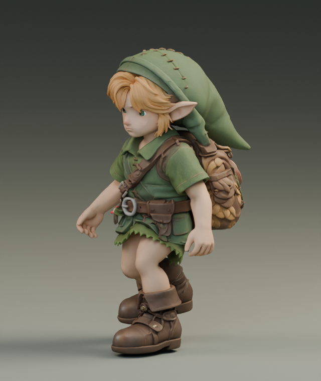
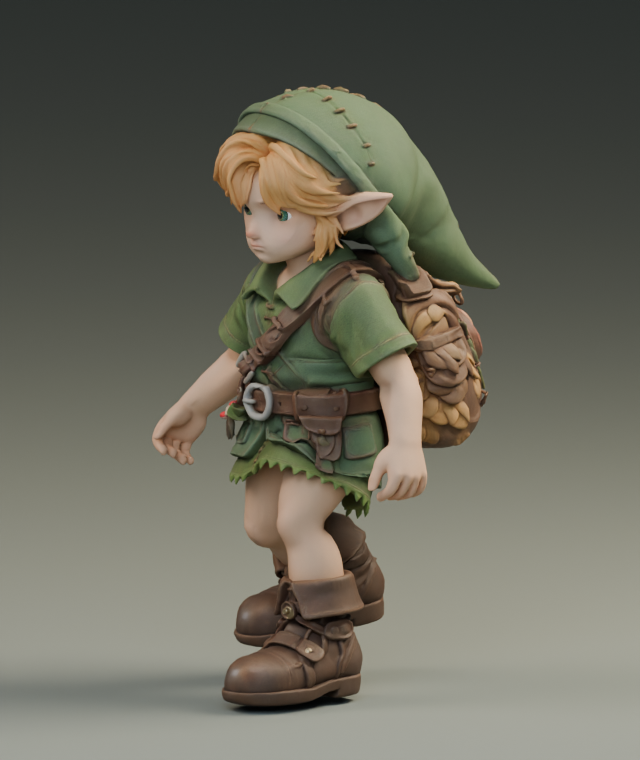
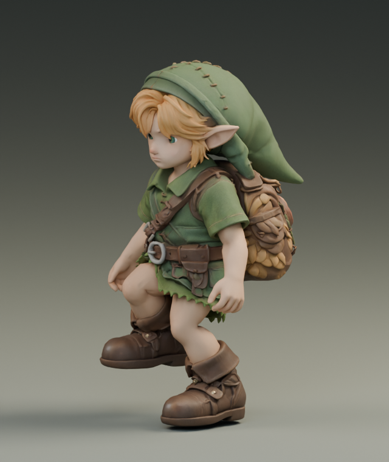
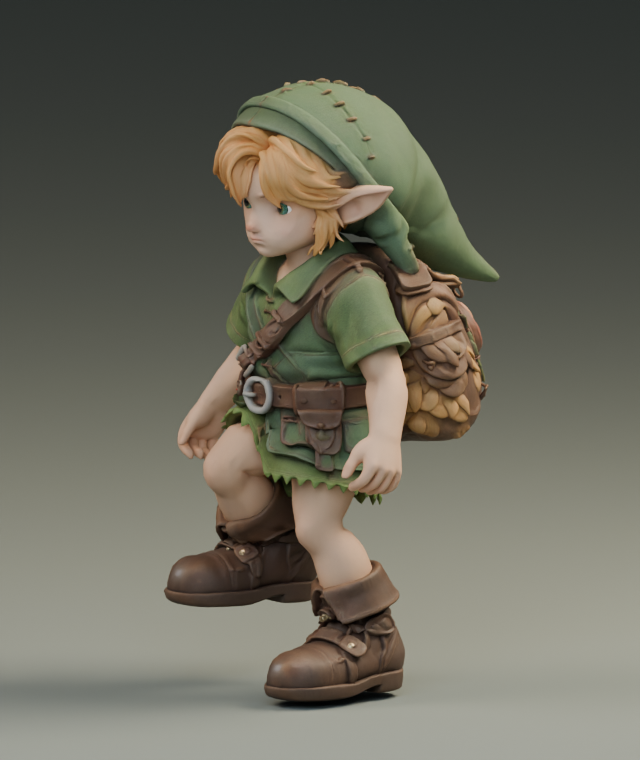
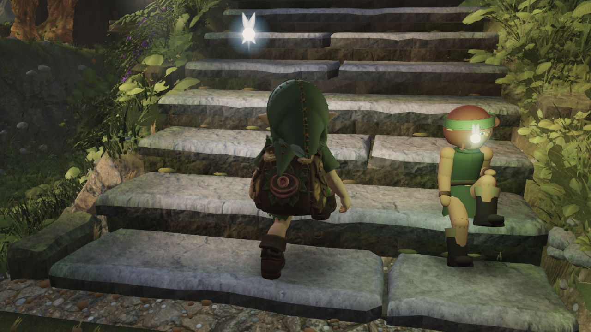
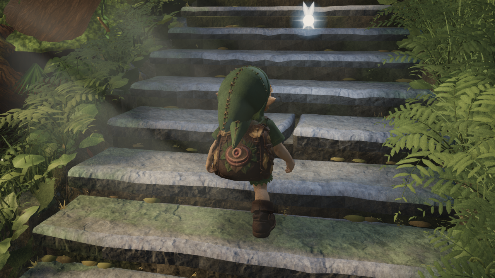
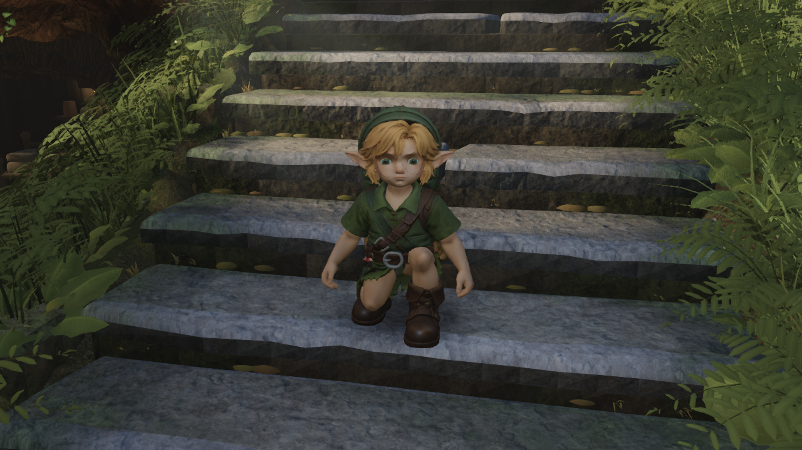

# Upright stair stance

Optional candidate **1e81bb6c** adds a Blender-authored stair posture change to
**382ec9ec** (the retained running arms, foot recovery and smaller boots). It changes
the stair clip's pelvis translation and six leg bones. The game solver, body mesh,
textures, rig, idle/walk/run clips and smaller boots are unchanged. Shared default245
is still retained for integration review.

The original pelvis dropped at mid-stance while the supporting leg bent beneath it.
This study adds `0.04 * sin(2*pi*phase)^2` metres to pelvis height and solves both
legs back onto their original ankle paths in Blender. The added height and its
velocity are zero at each half-cycle boundary. There is no runtime height clamp or
new filtering state. The extra clearance reduces the folded pose when the other
foot crosses a high tread; it does not completely solve stair locomotion.

## Matched comparisons

The first two pairs isolate the native posture with the original boots on both
sides. The game pairs use the same smaller boots on both sides, identical compiled
JavaScript, full-high render settings, cameras and player routes.

| View | Before | Upright candidate |
| --- | --- | --- |
| Native phase 12.5% |  |  |
| Native phase 25% |  |  |
| Ascent, frame30 |  |  |
| Ascent, frame360 |  |  |
| Descent, frame360 |  |  |

[Eight-second gameplay clip](game-video/stairs-up-down.mp4): four seconds ascending,
then a cut to a separate four-second descent. Recorded from the full-high game at
60 simulation steps/second, captured every second step and encoded at30fps;
240 decoded1280×720 frames verified by ffprobe. [Video manifest](game-video/manifest.json)
records the asset/build identity and480 simulation samples, with no page errors
or reach clamps. Selected ascent/descent frames were visually inspected; the full
1320-frame numerical comparison below is the separate long-route capture.

## Actual-player evidence

The production player traversed 660 ascent and 660 descent frames, with no page
errors or reach clamps. [Runnable comparison](compare.py) checks asset identity,
compiled bundles, character source, capture script, render profile and every
horizontal player position. The commit labels differ because documentation was
committed between captures; the compiled world is identical.

| Measurement | Ascent before → after | Descent before → after |
| --- | --- | --- |
| Maximum knee flexion | 162.35° → 149.83° | 155.34° → 147.47° |
| Maximum thigh flexion | 144.00° → 134.01° | 133.47° → 127.58° |
| Minimum sampled shoe gap | +2.260 → +2.260 mm | −13.320 → +1.434 mm |
| Maximum root step | 25.202 → 25.202 mm | 19.846 → 19.846 mm |
| Maximum pelvis step | 23.448 → 28.506 mm | 20.981 → 19.616 mm |
| Maximum pelvis second difference | 14.262 → 14.262 mm | 16.452 → 14.934 mm |
| Near-floor unplanted foot travel | 2.241 → 2.252 m | 3.389 → 3.112 m |

The ascent has more vertical pelvis travel and a slight increase in near-floor
unplanted travel. The second-difference maximum is unchanged, but that alone does
not prove perceptually smooth motion. Shoes were sampled at selected vertices
every ten frames: 510 valid ascent points on both sides, 487/486 descent points.
Positive sampled gaps are not a full-mesh collision guarantee. Knee flexion is
still excessive in some poses. See [complete results](comparison.json) and
[candidate trace](game-after/manifest.json).

## Native and isolated checks

- 177 native samples: ankle paths agree within **6.01e-8 m**; bone-length error
  **4.10e-8 m**; loop matrix error zero. Maximum native knee flexion falls
  **123.69° → 110.18°**. Four matched Cycles CPU renders use four threads.
- The animation-only GLB contains no character meshes or images. The patcher
  verifies the expected382 base hash, matching rest nodes, unchanged original
  binary prefix and all unselected animation channels. The existing3218 run
  candidate still reproduces with its exact original SHA after adding support for
  an explicit study base hash. A wrong-base negative control rejects245 for this
  study and leaves the combined candidate unchanged.
- Synthetic stairs with the same smaller boots: knee maxima165.30°→151.64° up,
  160.84°→152.76° down; no reach clamps, preserved ascent clearance, and root-step
  extrema differ by less than0.001mm. Synthetic descent still reports a79.47mm
  minimum-gap violation on its different analytic geometry. This is not claimed
  to be fixed by the actual-world result.
- The first isolated export54a655bb used original-sized boots. Its analytic
  ascent includes the same full-riser footprint violation already present in the
  original-boot baseline; it is not the combined candidate or the comparison above.

## Reproduce

First reproduce382 using the two commands in
[the running study](../2026-09-20-run-arms/README.md#reproduce). Then, from the repo root:

```sh
python art/characters/link/progress/2026-09-19-run-contact/export_candidate.py art/characters/link/progress/2026-09-20-run-arms/relaxed-run-boots.glb stairs-upright art/characters/link/progress/2026-09-20-stair-posture
python art/characters/link/progress/2026-09-20-stair-posture/compare.py art/characters/link/progress/2026-09-20-stair-posture/game-after/manifest.json
```

Expected result: `1e81bb6ca08c1c01008ad7fecad311d4419dbb691589c7ac5df95c8026c6ae37`.
Copy the candidate beside the runtime model and use `?link=stairs-upright-candidate.glb`.
The full model and packed Blender study stay local; the small animation carrier,
authoring script, checks and evidence are committed. `study.py` and
`review_native.py` require the existing native source workspace; use the current
delivery checkout's `export_native.py` with its `JOB.out` argument when exporting.
An initial invocation of the older primary-workspace helper ignored that argument
and wrote the carrier to its own folder; the corrected export used the delivery helper.
