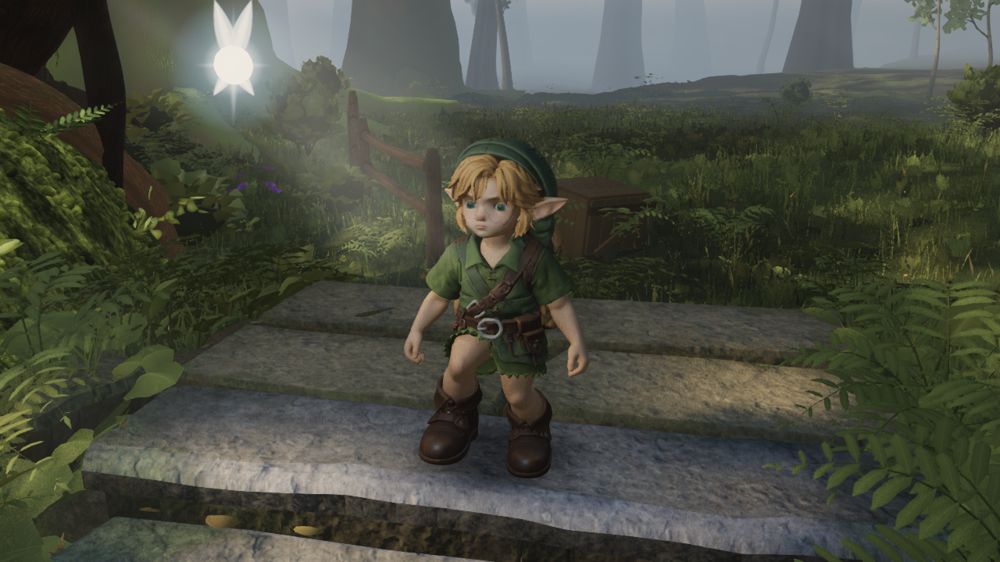
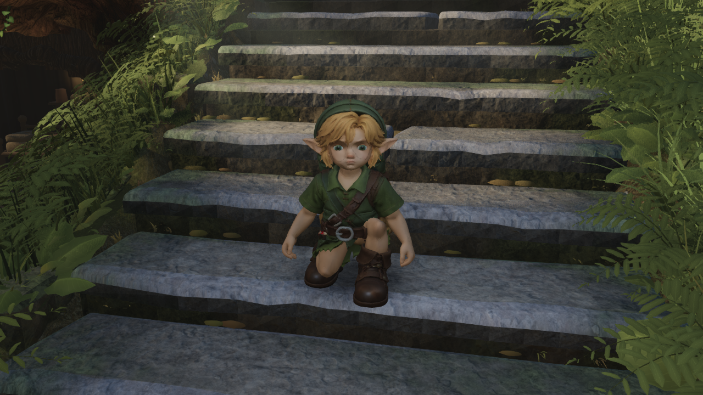
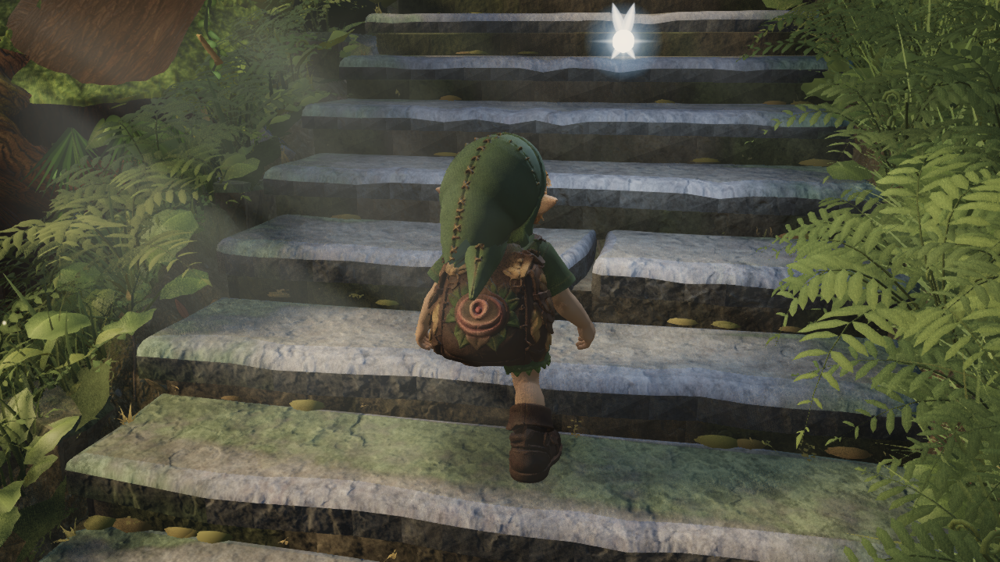

# Preserve the actual stair take-off support

The swing planner re-created a take-off position from the moving root and the animation clip. A foot pinned elsewhere by terrain correction could therefore begin its swing on a different tread from the one it had actually occupied. On analytic stairs using the production GLB, mixer and IK, this caused a 275 mm body pop in one frame.

The correction keeps each foot's last rendered stance-sole position through the swing and uses that location to sample its take-off support. A jump clears the saved positions. Fixed captures have no locomotion state and retain the previous rule. No model, clip, terrain or layout value changes.

## Direct production-rig check

Run `node art/characters/link/check_stair_grounding.mjs`. It loads the real model and production posing code through Vite, then tests600frames each on flat ground, ascending stairs and descending stairs. The stairs are analytic0.27m risers/0.54m treads. This is not the full forest/player system. The check asserts no unreachable targets, stable root height on zero-dt reposing, no single-frame stair body move over40mm, cleared take-off anchors during a jump and an unchanged airborne root. Restoring the old source fails the intended body-pop assertion: [negative control](negative-control.json).

| Maximum body height change per frame | Before | After |
| --- | ---: | ---: |
| Flat | 0.002 mm | 0.002 mm |
| Ascending | 275.04 mm | 25.89 mm |
| Descending | 19.73 mm | 19.73 mm |

The entire600frame flat result is byte-for-byte equal after JSON parsing. [Comparison](rig-comparison.json), [baseline trace](rig-before.json), [corrected trace](rig-after.json). Excessive knee flexion and footprint penetration remain; this fix does not solve those separate problems.

## Rejected alternatives

[Experiment summaries](experiments.json) retain the failed directions. A reactive pelvis lift reduced knee flexion but increased normal body steps to45.7mm up and42.6mm down. A phase-based lift still reached36.3mm. Restricting that lift to a held-low support lost most of the benefit. Neither is retained.

A native Blender study advances the foot's horizontal return earlier through swing, preserving its endpoints, cycle, hips and other clips. The time warp `t + 0.2*sin(pi*t)^2` is monotonic and retains endpoint velocity. Native exportc2261323 passes shoe/loop checks but the production-rig descent knee fold worsens to172.63degrees, so this candidate is also rejected. Its small action/carrier and authoring script are included for reproducibility; the full packed scene and full model remain local. Use JOB stem=stairs-early-forward, scene=Link | September20 early stair placement, lift_scale=1, forward_advance=0.2 in the original native workspace. The lower-swing study fromSeptember19 remains rejected as previously documented.

## Verification

Build/typecheck, existing gait-chain/blink/placement checks and the default-model run-grounding check pass. Full-world before/after verification completes1320frames at full high settings. This is not a final movement-quality or Phase1 acceptance claim.

The first actual-world attempt stored the requested stance pin. A reach-limited foot had already moved away from that requested position, so the release formula introduced a45.9mm dip during the initial descent turn. The retained implementation instead records the final posed sole position after IK; a repeated full-world trace checks that case. This distinction is why a flat analytical test alone was insufficient.

## Full-world regression result

The corrected sole-position version completes660frames up and660down with the actual player. [Comparison](game-comparison.json), [trace](game-after/manifest.json), [baseline](../2026-09-19-stair-contact/game-before/manifest.json). Source/assets between the captured world commits are identical; only the attached runtime patch changes behavior. The asset, capture script, profile and horizontal player path are identical.

| World maximum root change per frame | Before | After |
| --- | ---: | ---: |
| Up | 25.202 mm | 25.226 mm |
| Down | 20.159 mm | 20.159 mm |

No reach clamps; sampled shoe clearances and worst knee/thigh angles match baseline. The initial requested-pin descent regression is gone. This particular world path never exhibited the275mm pop, so it establishes preservation of existing movement rather than a large visible improvement on this path. The direct rig repro establishes the fixed discontinuity. Remaining descent shoe penetration and excessive folding are unchanged and still need work.

| World pose | Before | Corrected |
| --- | --- | --- |
| Initial descent after the turn |  |  |
| Middle descent |  |  |
| Middle ascent |  |  |
