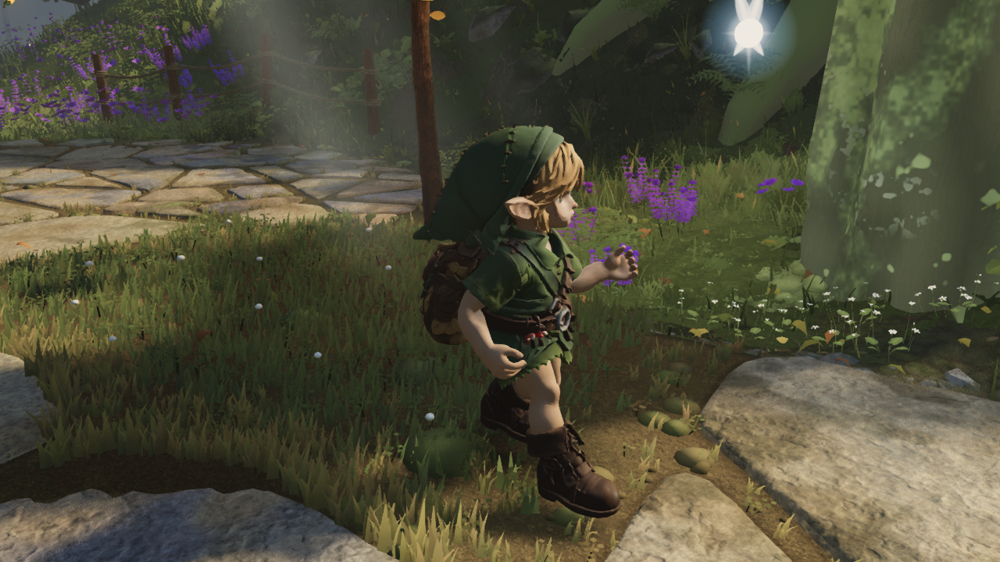
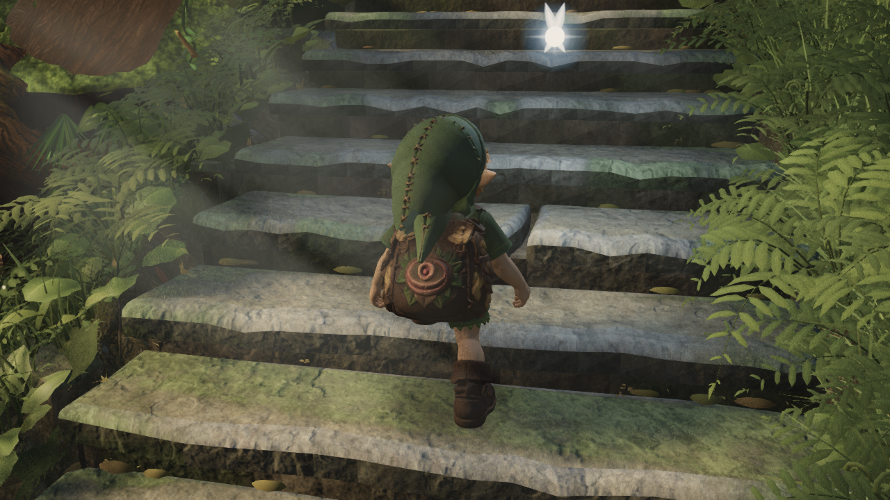

# Character integration with Fable's round49 world

Merged world `e54a74ed` into character branch `7bb9a975`. The optional character
remains `1e81bb6c`; Link's runtime grounding code is unchanged. The newer world
adds terrain, stair, vegetation, tree, prop and NPC work. Build `index-C8Futrc5.js`
contains 162 modules. Actual movement validation on this world is recorded separately
from the earlier-world character comparisons.

The only merge conflicts were the inbox and ledger. Both inbox blocks are retained.
The existing ledger union appended our older local take0120 after the canonical122
as0123. Its old score predates seven newly passing world items, so retaining its
old valid flag failed D2. `mergeLedgers` now reclassifies imported regressions before
sealing, preserving scores, images, capture identity and the original source hash.
It does not edit existing canonical entries or relax the gate. The local original
remains in git at7bb9a975; the imported entry is explicitly invalid relative to the
new baseline. [Merge report](ledger-merge.json).

Validation so far: typecheck/build, character gait/blink/placement tests, terrain
expansion checks, and ledger tests pass. Source anti-cheat passes89 checks with78
historical missing-claim warnings ([output](anti-cheat.txt)). The upstream
standing-stones file has a trailing blank-line warning; it was preserved.

The full-high actual-player test at `ab9b5309` completed all 1,620 frames with no
page errors or reach clamps: 300 walk/run/idle, 660 upstairs and 660 downstairs.
The horizontal player paths match the earlier evidence exactly. Upward knee
flexion remains 149.83 degrees; downward maximum is 147.34 (previously 147.47).
Sampled stair shoe clearance remains +2.260 mm up / +1.434 mm down. Flat transition
maximum root step changes from 9.622 to 9.149 mm; stair maxima remain 25.202 / 19.846 mm.
These are sampled contacts, not a full-mesh collision guarantee. The large knee
folding and the previously reported synthetic descent failure still need work.

Run `python art/characters/link/progress/2026-09-20-world-integration/check.py`
for the integration check. [Comparison](comparison.json), [full trace](game/manifest.json).
The world changed between these captures; this does not replace the strict,
same-build asset comparison in the stair-posture folder.

| Latest integrated run | Latest integrated stairs |
| --- | --- |
|  |  |
