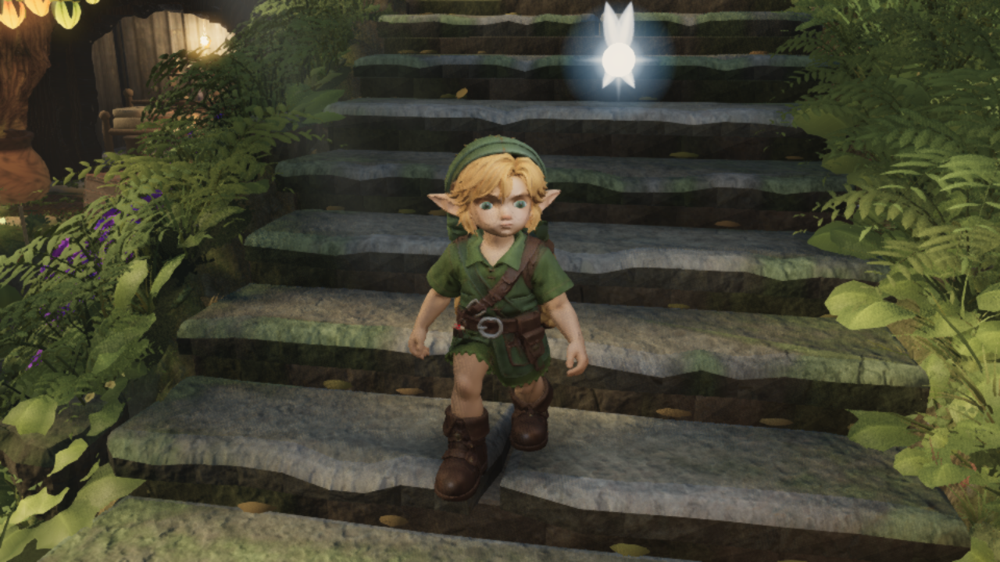
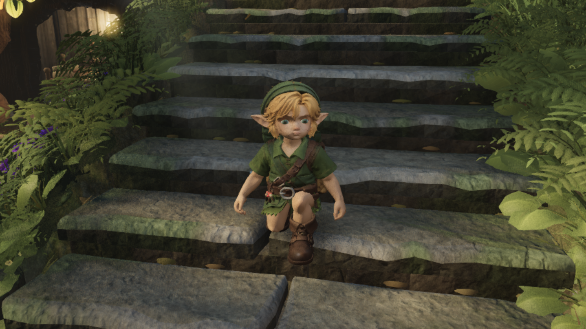

# Dense native stair-support review

Actual game, 660 frames up and 660 down, rendered from `0e41b57c` plus the recorded support/capture patch. The source and capture-script hashes in `manifest.json` identify the uncommitted code precisely. Bundle `index-Cfkbva13.js` SHA256 `142a27dc40927b4532777f765bcfd377be70e2d6e0ff445df27face6c0a4f6f5`; default asset `ea93932d…575f`. High geometry, 2048/8 shadows, render scale 0.75, shared capture slot. This is recorded evidence, not a runtime performance benchmark or gauntlet take.

| Measurement | Previous run | Support correction |
| --- | --- | --- |
| Down frame 477 root step | +60.37 mm | −5.95 mm |
| Maximum descent root step | 60.37 mm | 19.79 mm |
| Maximum ascent root step | 25.20 mm | unchanged |
| Peak knee flexion up / down | 162.35° / 155.03° | unchanged |

The previous run checked shoe rays every tenth frame. This run checks every frame: 5,010 ascending and 4,808 descending points hit the actual stair mesh. Minimum gaps are +2.65 mm up / −67.32 mm down; four descending marker samples are below −20 mm. Existing swinging-foot intersections at zero-based frames 274 and 449 remain. Their root poses are unchanged. CPU replay independently recovers the old transient contacts and verifies that the support fix introduces no new contact failures. See [the diagnosis and regression](../2026-09-20-natural-run-audit/STAIR_REPORT.md).

The capture completes without page errors, console warnings or reach clamps. One GLB request reports `ERR_ABORTED`; a successful HTTP 200 response, exact built asset bytes/hash and runtime GLB audit were separately verified. Background NPCs are hidden, and Link has one contact shadow. No fallback character was used.

PNG names count frames from one; manifest frame indices count from zero.





[Full raw manifest](manifest.json)

Reproduce from the matching source using the existing shared capture slot:

```powershell
$env:ZR_NATIVE_GPU='1'
$env:CAPSLOT_STALE_MIN='Infinity'
$env:LINK_REVIEW_ASSET='link-runtime.glb'
$env:CAPTURE_READY_TIMEOUT_MS='900000'
node E:/zeldaremake-my-fable/art/environment/owner-fable-canopy/tools/capslot.mjs astra-link-stair-support -- node art/characters/link/capture_play_motion.mjs --stairs-only --stair-detail --balanced-render
```
