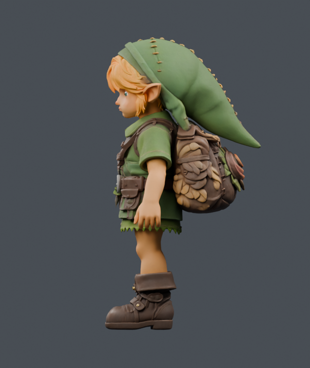
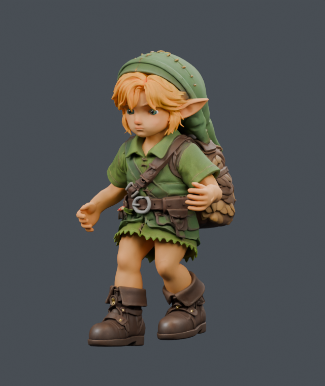

# Smaller distal boot tips — accepted incremental art

The boot tips retract by at most **11.39 mm**. The native side and three-quarter comparison was accepted, and the runtime asset is now `4dcf89c5`. Width, rest height, heel, ankle attachment, cuff, rig, weights, textures and animation clips are retained. Only the body's POSITION, NORMAL and TANGENT arrays change. This improves the boot silhouette; extreme stair poses remain unfinished.

The actual-player capture on the corrected ankle/toe support measures **537 low sole vertices over 1,320 frames: 708,840 hits, zero negative gaps, zero reach clamps and zero page errors**. Minimum clearance is **+1.187 mm uphill / +1.264 mm downhill**. Peak knee fold is 167.224° / 168.350°; maximum root steps remain 31.105 / 25.101 mm. The route includes walk/stairs transitions and actual terrain at its endpoints. These are finite-route results, not whole-game collision or animation acceptance.

Raw capture: `../2026-09-21T21-18-40-093Z-play-motion/manifest.json`, SHA256 `2d33d61813a4e5d1159d3cc9b9b5e47e36db59172e2be98bf1dfb45aac453447`. The large manifest remains local; [game-capture.json](game-capture.json) retains every frame's coverage, minima, pose, source and bundle provenance.

The earlier **hold** was correct for the old ankle-only support: its 327-point proxy omitted 210 low toe vertices, and this art edit changed root height by −272.74 mm. That historical failure remains in `contact-comparison.json`. After the support correction, the same frozen shape changes root height by at most −0.180 mm uphill / −2.090 mm downhill, improves the peak knees and preserves flat motion hashes and stance timing. See [the corrected paired comparison](FAMILY_CONTACT.md). Historical JSON status fields record their original decision time and are superseded by this accepted native capture.

The existing boots were already reduced in width and length on September 20. This edit changes only the part beyond 90 mm forward, fading out above 160 mm. The field affects 1,664 native vertices and shortens the low sole depth by about 4.1%. `preview.py` reuses the prior geometry exporter and transforms normals with the deformation's Jacobian.

Same camera, lighting, Cycles CPU settings and poses in each native pair:

| Pose | Before | Accepted shape |
| --- | --- | --- |
| Idle, side |  |  |
| Run 59/112, three-quarter |  |  |

[Export validation](EXPORT.md) proves the declared geometry change and preservation of protected data. [Portable checks and reproduction inputs](PORTABLE_CHECKS.md) explain how to verify the current asset without a second GLB, Blender or Git history. The native Blend, duplicate candidate GLB and large historical CPU traces remain local study artifacts.
