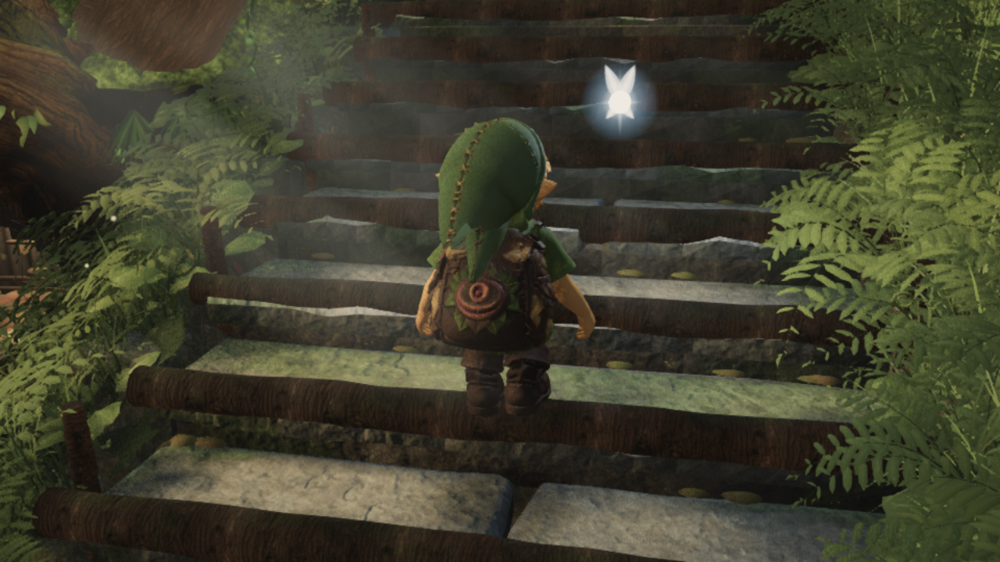

# Complete foot coverage: paired CPU result

## Integrated actual-player verification

The shared measurement is now integrated; only its comments differ from the frozen CPU candidate. Typecheck, build and the portable raw-source regression pass. A native GPU capture runs the actual player for660frames in each direction, including walk/stairs transitions. All537 low sole vertices hit rendered stair, timber or endpoint terrain in every frame: **708,840 queries, zero negative samples, zero reach clamps and zero page errors**. Minimum clearance is+1.187mmup/+1.267mmdown. Maximum root increments are31.105/25.101mm. [All per-frame minima, coverage counts, poses, source/bundle hashes and raw-manifest hash](game-capture.json).

This is a support correction. Native Blender reproduction confirms that the worst stair pose still drives the thigh through the tunic; knee extremes remain169.09/168.60degrees. The raw-source portable check and capture below establish contact behavior, not natural movement or collision freedom for every boot triangle.



## Frozen paired CPU comparison

The minimal family measurement fixes a real support omission. The previous footprint measured 327 ankle-dominant low vertices and omitted 210 equally low toe-dominant vertices. The 537-vertex ankle/toe selection finds deep intersections in the unchanged production pose. Including the family in `measureFootprint` removes those intersections in this fixed route. This is contact correctness, not acceptance of natural stair movement.

| Same asset, phase and route | Ankle-only production | Family measurement |
| --- | ---: | ---: |
| Ascent negative poses / 470 | 78 | 0 |
| Ascent minimum vertical clearance | −309.193 mm, frame 496 | +1.188 mm, frame 168 |
| Descent negative poses / 470 | 131 | 0 |
| Descent minimum vertical clearance | −46.443 mm, frame 531 | +2.092 mm, frame 191 |
| Ascent peak knee fold | 168.264° | 169.090°, frame 177 L |
| Descent peak knee fold | 166.702° | 168.604°, frame 375 R |
| Ascent maximum root step | 31.105 mm | 31.105 mm |
| Descent maximum root step | 23.890 mm | 25.101 mm |
| Ascent instrumented surface calls | 1,460,718 | 1,802,737 (+23.414%) |
| Descent instrumented surface calls | 1,479,509 | 1,776,388 (+20.066%) |

The complete sole measurement is 269 left / 268 right vertices, selected from the ankle hierarchy by combined skin weight above 0.5 and the existing 12 mm low band. Its exact IDs match both the independent dominant-family selection and [the exported index fixture](../2026-09-21-sole-coverage/foot-family-selection.json). The toe transforms are constant relative to their ankles in the asset's clips; see the independent coverage report in that directory.

All 537 vertices hit real reference geometry in every one of the 940 poses. The last seven descent frames, 583–589, include toes beyond the finite stair mesh. Two actual terrain chunks generated by the production chunk builder supply that reference. The candidate's 314 terrain hits clear by at least 203.874 mm. Every terrain hit was independently raycast; native ray and exact triangle height agree within 1.78e−15 m. There are also 9,666 native full-selection rays across 18 critical poses per run, including the old worst toe intersections. Their minima match the exact triangle sweep within 1e−12 m.

These terrain meshes are used only for verification. They were never attached to the production support sampler. Comparing the terrain-inclusive replay to the earlier stairs-only replay confirms identical final foot targets, root heights/steps, knees, foot and IK reports, and surface-call counts in all 940 poses for each source.

Both runs have zero reach clamps, unchanged stance timing and clip phases, and identical 180-pose flat idle/walk/run root/skeleton hashes. Maximum planted drift remains below 1.64 µm. The family correction changes the root path by up to +270.000 mm uphill and +53.389 mm downhill because the previous smaller support omitted the front of the boot. Individual knee poses also change substantially; the largest same-pose increase is 65.831° uphill at frame 364. Native visual review remains required. Instrumented call counts quantify added work, not frame rate.

Frozen inputs and compact measurements are in [cpu-comparison.json](cpu-comparison.json):

- Production source, normalized: `226a538ed548ddfb9d8f346ab93369ec7ad8744b6c5623d85cf19aef77d04fa3`.
- Family source, normalized: `a9e2005ea405ce1ffaa05d5093cf608407868b45d878cb1acc2dd25ca9653b37`.
- Asset: `89df38f255e47afbcbb28a60555fb4a4a20091741d427ef1d7b8ea1ac33f306b`.
- Ground source, normalized: `4683ac00dd98e0a055655773e61f4df608df289d67ec30d25edb8cc02c7fd292`.
- Full local paired rows: `production-terrain/stair-swing-working.json` and `family-terrain/stair-swing-working.json`. Their hashes and exact geometry hashes are retained in the compact report; the large traces need not be committed.

`check.mjs` is the small portable raw-source regression for the missing toe and combined foot-family weight. It passes the explicit family candidate and fails the original ankle-only source. After integration, run it against production from the repository root:

```powershell
node art/characters/link/progress/2026-09-21-complete-foot/check.mjs
```

For a fresh actual-player capture, build the current source and run the tracked capture tool. A native GPU capture must acquire the shared capture slot according to the repository protocol before launching; the parent owns this integration run.

```powershell
npm run build
node art/characters/link/capture_play_motion.mjs --stairs-only --stair-detail --full-sole --balanced-render
```

The paired CPU replay above is a local forensic study. Its large replay harness, source snapshots, phase reference and historical motion input remain local and are not fresh-clone reproduction dependencies. The frozen hashes identify the exact evidence. Its older `--assert-curved` gate also imposes historical knee bounds, so it does not accept the new descent posture. The contact result above separately checks all 537 vertices, actual surface coverage, native crosschecks, reach and flat hashes; it does not relax the old motion-quality gate.

Scope: fixed steady clip phases, recorded route, frames 120–589 in each direction after warmup from 80. This is not a start/stop, jump, arbitrary-route, upper-boot-triangle or side-collision proof. Flat checks cover motion hashes, not a separate full-sole flat-ground intersection sweep. The parent owns integration and the subsequent actual-player capture.
