# September 21 — repaired run curves and physical stair support

Current local delivery: `89df38f255e47afbcbb28a60555fb4a4a20091741d427ef1d7b8ea1ac33f306b` (47,825,216 bytes). Based on integrated world `6c13f70c`. Blender 4.5.13 is controlled through MCP; matched renders use four CPU threads. No new asset service or dependency.

## What changed

The historical Blender arm action retained **32 old fractional keys alongside 57 intended keys**. Its 120 Hz export hid those leftovers; later denser sampling carried them into the current shoulder curves. Read-only native inspection confirms the residual keys and shows that `f.update()` alone does not remove the defect. We reconstructed only the four shoulder/elbow run rotations from the hash-pinned, smooth CC0-derived `24591126` motion, reapplying the already-reviewed carriage adjustments. This repairs temporal jumps without introducing another artistic offset. [Reproduction, raw key checks and runtime comparison](../2026-09-21-run-carriage/README.md).

At 240 Hz, maximum adjacent shoulder changes fall **29.57°→1.34° / 31.68°→1.43°**. Original intended poses remain within 0.000083°. Independent native and 60 Hz play/capture checks preserve the hips, chest, head, hands' local channels, legs, root and foot/IK traces. Stride remains 1.82 m, cycle 28/60 s. Native arm/body triangle contacts over 113 phases fall **1452→1316**, worst phase **99→22**, below-armpit contacts **235→21**; this is not a collision-free claim.

Fable's exact body/orbital colour grade and brow factor are baked into the existing image allocations, and the loader's canvas grading pass is removed. The current production loader has exact decoded pixel/material parity and reports `colorGrade: null`. [Colour bake and provenance](../2026-09-21-color-bake/README.md).

## Five matched Blender comparisons

These are the same camera, lights, baked textures and clip phases on both sides. The selected fractional phases expose the defective keys; ordinary intended key poses remain essentially unchanged. No image retouching.

| Exact run phase | Before | Repaired |
| --- | --- | --- |
| 3/112, side | 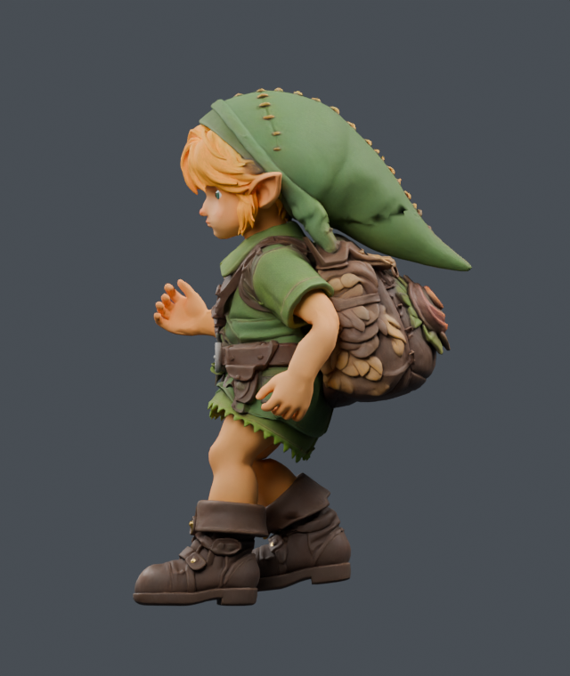 | 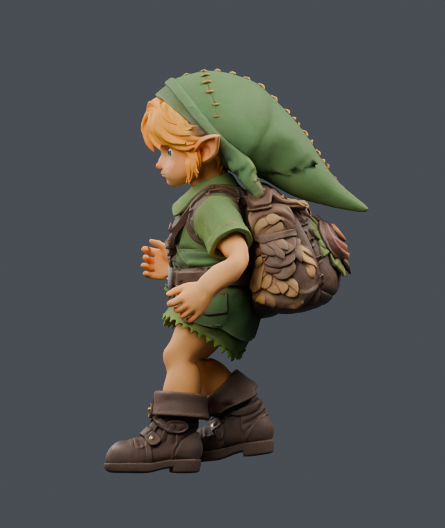 |
| 53/112, front | 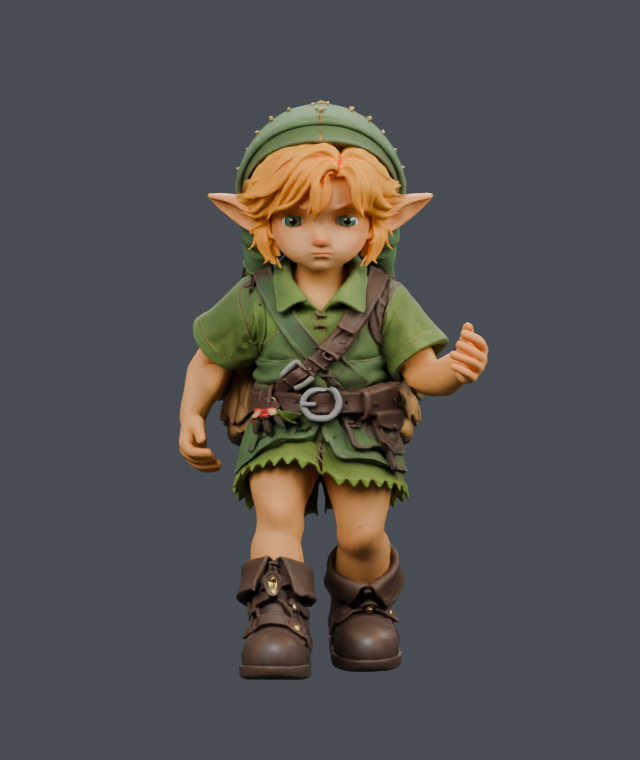 | 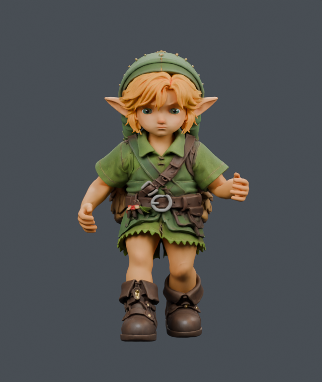 |
| 59/112, threequarter | 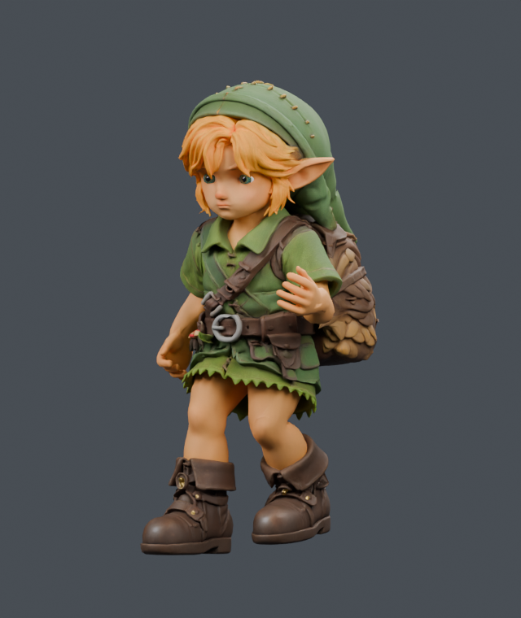 | 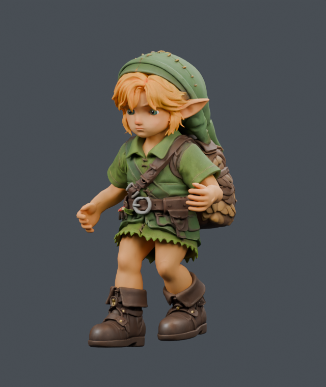 |
| 105/112, side | 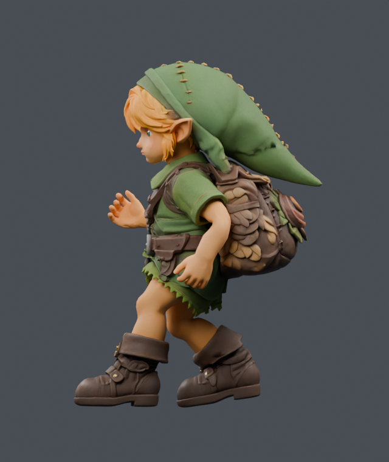 | 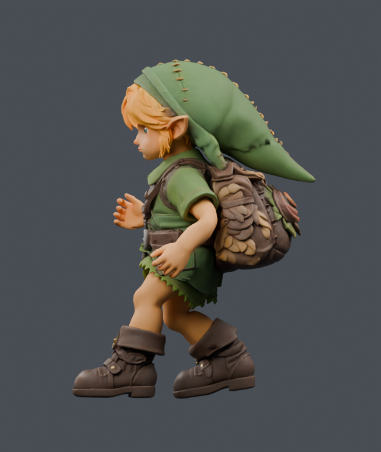 |
| 109/112, front | 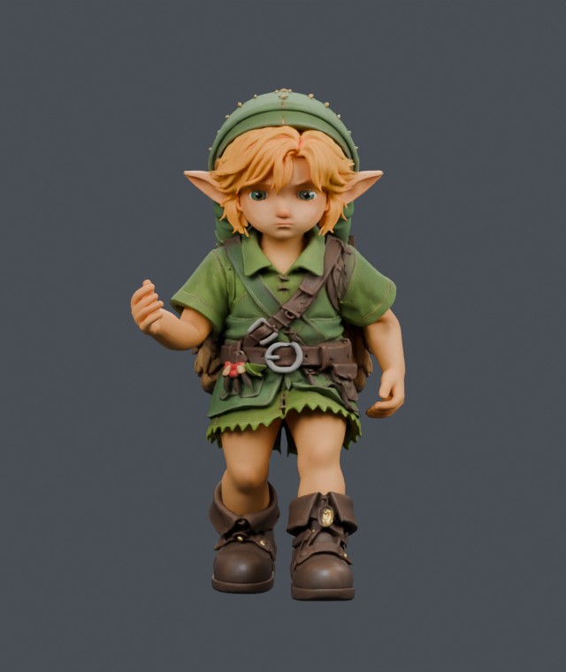 | 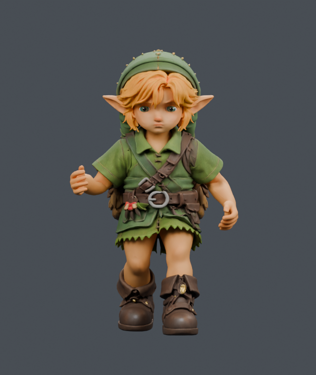 |

## Actual-game run video

[Walk → run → idle, final89df delivery](../2026-09-21T18-45-27-011Z-play-motion/walk-run-idle.mp4), [manifest](../2026-09-21T18-45-27-011Z-play-motion/manifest.json):300actual player frames, all three transitions, no page errors or reach clamps, exact10.310mm maximum root-height increment. The clip is encoded at30fps from every second60Hz simulated frame; it is not a performance benchmark.

## Stair contact: actual player, including transitions

Timber sides had inward triangle winding, so early downward-ray evidence missed the outer crowns. Commit `59cba21b` corrects that winding. The ground grid now includes timber, including its steep upper shoulders, while keeping stone-only sampling and analytic player heights unchanged. The existing foot planner, swing support and hip endpoint guard now check the oriented sole interior before IK. No new solver or layout change.

[Full actual-player capture](../2026-09-21T18-36-38-412Z-play-motion/manifest.json): **660 ascent + 660 descent frames**, 327 production sole vertices, **403,488 rendered-surface hits**, cross-checked against native Three.js rays. Minimum clearance **+1.182 mm ascent / +1.257 mm descent**, no negative sole samples, no reach clamps, no page errors. The capture used `305603e9`; the final `89df38f2` changes only four run rotation channels and preserves its stairs clip, rig and geometry exactly.

The [separate 940-pose CPU proof](../2026-09-21-curved-support/verification.json) preserves flat movement exactly. The corrected shoulders can lift the pelvis by one 270 mm riser over a span of steps; maximum per-frame root change remains 31.105/23.890 mm. At the former bad uphill frame331, the planted sole is 3.67 mm above real timber and the knee is 88.8°, but other phases still reach **168.26° uphill / 166.70° downhill**. Landing/posture work remains open.

Dense support costs roughly **61–63% more surface queries than the undersampled baseline** in the instrumented CPU fixture. That is an operation count, not an FPS result. The physical route passes; arbitrary terrain, sideways approaches and continuous swept collision are not proven. [Independent code review](INDEPENDENT_SUPPORT_REVIEW.md).

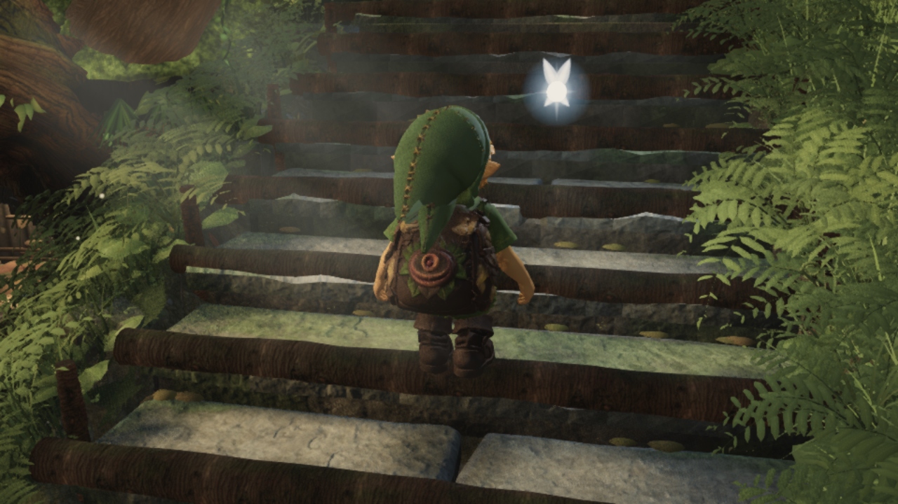

## Research and collaboration

[Johansen's locomotion thesis](https://runevision.com/thesis/rune_skovbo_johansen_thesis.pdf) and [Holden's foot-locking implementation](https://www.theorangeduck.com/page/inverse-kinematics-foot-locking) informed separating foot trajectories, support and leg reach. [Pontzer et al.](https://scholar.harvard.edu/files/dlieberman/files/2009d.pdf) and [Arellano & Kram](https://journals.biologists.com/jeb/article/217/14/2456/12120/The-metabolic-cost-of-human-running-is-swinging) support preserving the arms' counterbalancing motion, not a universal artistic angle. Existing helpers and the already licensed Quaternius motion were reused.

Fable imported the low leafy floor moss and timber winding in `27c2e3c8`; [PR25](https://github.com/Leonxlnx/zeldaremake/pull/25) has green CI. Fable also imported the independently reviewed four-helper leaf-atlas colour recovery by `c11f0ff4`; its [PR27](https://github.com/Leonxlnx/zeldaremake/pull/27) carries source `181986ba`. All handoffs are posted to PR2. Flat bank-canopy cores, distant crossed cards, face/hand art and remaining extreme stair poses are still open. No phase exit or final visual acceptance is claimed.

The optional torso and landing trials remain held: [earlier torso study](TORSO_STUDY.md). Their evidence is retained; they are not part of the delivery. Source/model provenance remains in `public/models/link/SOURCE.md`; this engineering work does not settle the fan-game's character/branding/reference-media release rights.
