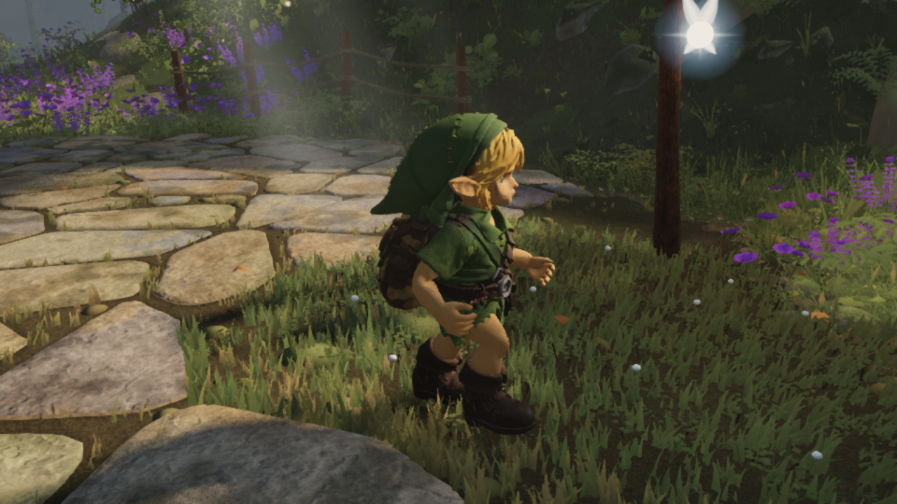
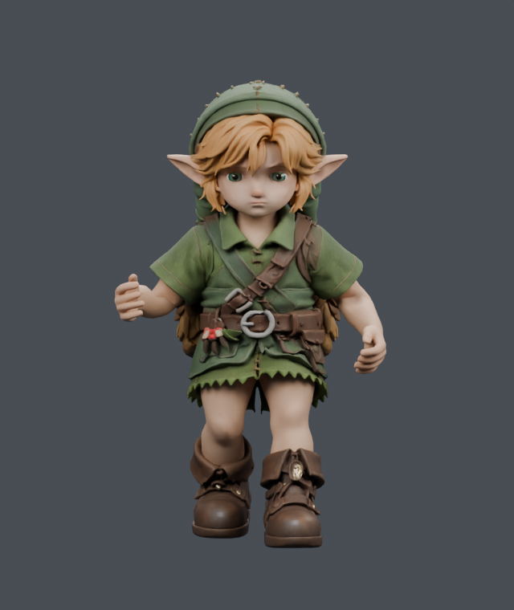
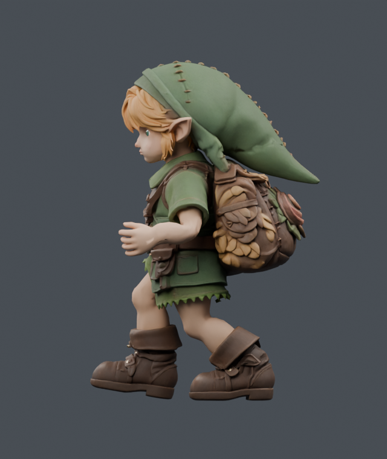
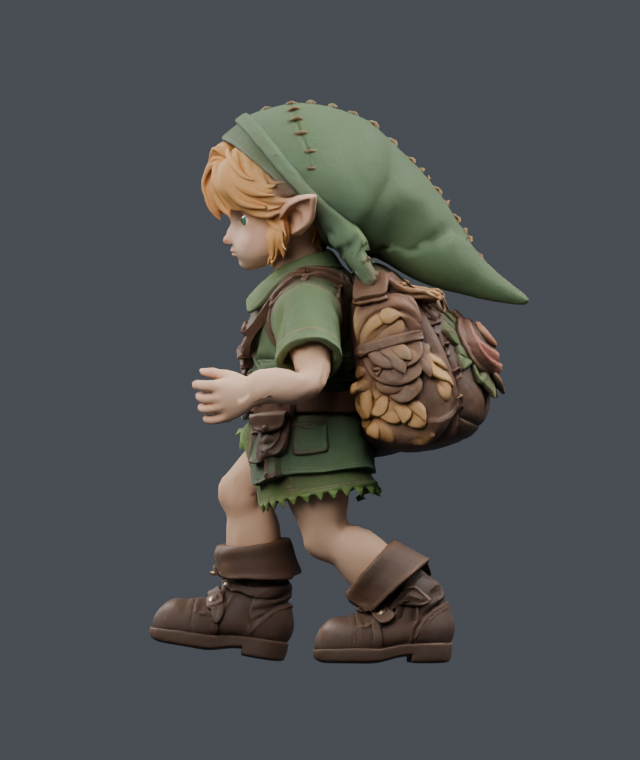
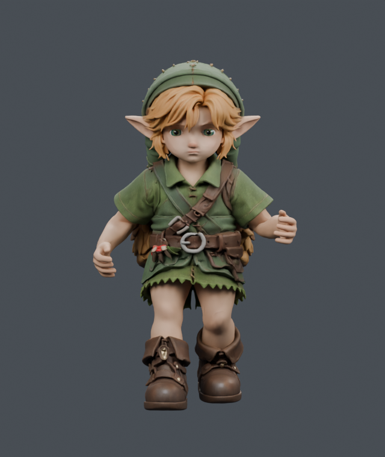
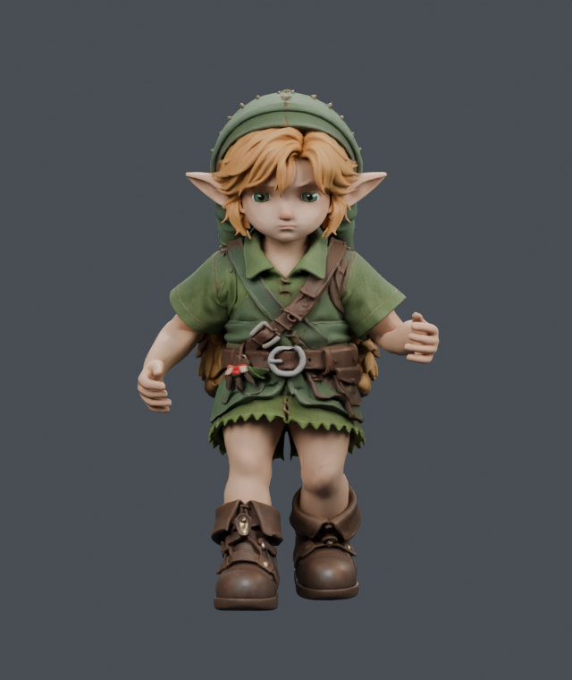
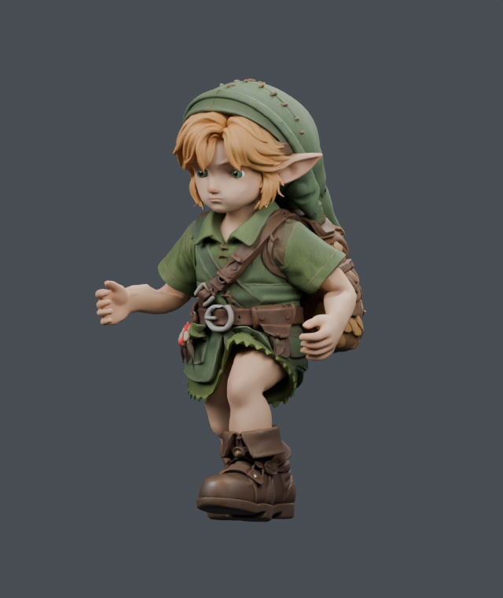
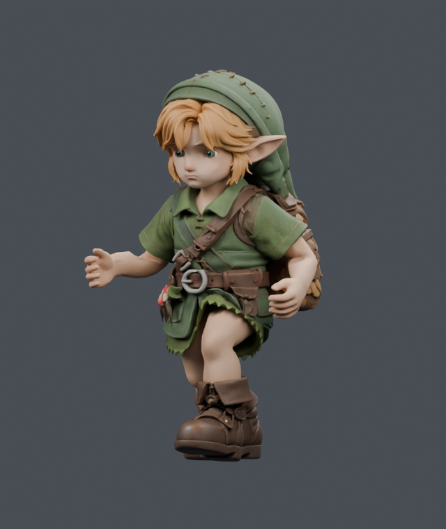
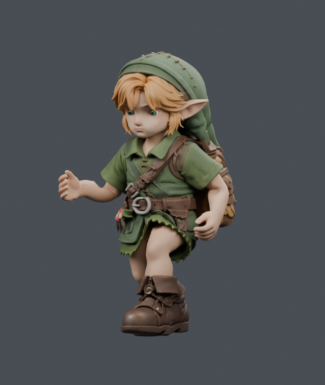
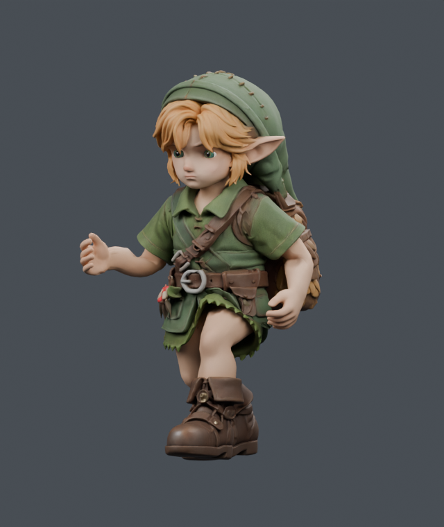

# September 21: current world, Blender motion and exact colour bake

Work resumed from Fable's integrated world `6c13f70c`. The original lower-leg alignment and backward arm carriage in `ea93932d` remain intact. Blender 4.5.13 is controlled through MCP; renders use Cycles on four CPU threads. No desktop input automation or new external asset service is involved.

## Status

- The inward-facing timber-side fix is committed as `59cba21b`, PR #26. Its default FrontSide rays now reach the outer crowns. Positions, caps, materials and layout are unchanged.
- The accepted upright-stairs carrier is composed onto the current calves/arms as `e3ef74a0`. Runtime support now includes the timber mesh, and the hip correction checks the endpoint footprint.
- **Stair contact and posture are still under revision.** Earlier positive contact results were invalid for outer crowns because rays missed the inward faces. The corrected fixture revealed 139 uphill and 119 downhill penetration frames. Read the [superseding investigation](../2026-09-21-stair-clearance/knee-peaks/README.md) and [curved-support study](../2026-09-21-curved-support/README.md) when available; do not use the earlier positive-gap captures as acceptance.
- Run torso candidate `053a1536` has a restrained ±2° turn and head compensation. It remains a visual candidate: its strict contact-count assertion fails (details below). The full ±5.7° and additional outward-shoulder studies are held.
- Fable's runtime colour grade is baked losslessly into two diffuse maps plus the brow colour in the local delivery `305603e9`. Its paired loader removes runtime grading; the production-loader pixel/material check passes exactly with `colorGrade: null`. [Pixel/material parity and delivery tools](../2026-09-21-color-bake/README.md).
- The smooth olive floor blobs were identified as moss cushions and replaced with low leafy colonies in [PR #25](https://github.com/Leonxlnx/zeldaremake/pull/25). Fable imported its source and the timber winding fix in `27c2e3c8`; the GitHub PR state and gauntlet completion remain separate.

## Current production-loader game check

[`2026-09-21T17-59-49-589Z-play-motion`](../2026-09-21T17-59-49-589Z-play-motion/manifest.json) records the actual built world with outward timber faces, the `305603e9` delivery, no runtime grade, log support, the hip endpoint guard and dense planned curved support. It completes 300 walk/run/idle frames plus 660 ascent and 660 descent frames with no page errors, no reach clamps, no fallback model and all background NPCs hidden. Native Chrome shader warnings remain recorded.

The eight selected shoe markers stay above rendered stone/timber (minimum +1.352 mm ascent / +1.798 mm descent). **This is not full-sole clearance:** the independent 327-vertex check found early-swing seams up to 2.822 mm below the crown. A bounded oriented-swing-support extension is under review. Knees still reach 174.67°/166.82° flexion at particular step phases; landing/root feasibility is being studied separately. Maximum per-frame root-height change is 31.105/23.890 mm; flat motion remains unchanged at 10.310 mm.

Dense planned support adds about one-third more surface queries in the CPU fixture. That is a measured query-count cost, not an FPS measurement. The current change fixes a sampled 36 mm crown miss; it is not final animation acceptance.

## Five matched native motion comparisons

Same camera, light, original texture maps, clip phase and 640×760 settings on both sides. The only changed run channels are chest/head rotation. These renders are not retouched and are not game screenshots.

| Pose | Before | Candidate |
| --- | --- | --- |
| Run 0.00, front |  |  |
| Run 0.25, side |  |  |
| Run 0.50, front |  |  |
| Run 0.75, threequarter |  |  |
| Run 0.85, threequarter |  |  |

## Research applied

Arm swing participates in counterbalancing leg motion; freezing the arms is not a general solution. [Pontzer et al., 2009](https://scholar.harvard.edu/files/dlieberman/files/2009d.pdf) and [Arellano & Kram, 2014](https://journals.biologists.com/jeb/article/217/14/2456/12120/The-metabolic-cost-of-human-running-is-swinging) inform the direction, not a universal elbow or lean angle. Measurements found existing forward lean but exactly zero shoulder-line yaw. The trial restores a small share of the already licensed Quaternius Jog_Fwd_Loop chest motion at its existing phase; it does not add arbitrary extra forward lean or retime the legs. Its amplitude is an artistic trial, not a value proven optimal by these papers.

The foot-placement review follows the separation of trajectory, foot alignment and leg solve described in [Johansen's locomotion thesis](https://runevision.com/thesis/rune_skovbo_johansen_thesis.pdf), and the reach/contact concerns discussed in [Holden's foot-locking implementation](https://www.theorangeduck.com/page/inverse-kinematics-foot-locking). Existing production helpers are reused; no replacement animation framework was added.

## Motion measurements and limits

[Independent CPU comparison](../2026-09-21-motion-research/balanced-README.md): 113 native samples and two 600-frame runtime modes preserve the hips/legs, root/foot/IK traces, stride and cycle. Raw first/last chest/head quaternion keys are identical. Same-time redraws preserve head pose exactly and hands within 2.24e-16 m. Runtime hand positions move up to 10.40 mm, head position up to 1.17 mm. Head orientation is not exactly preserved: native maximum 0.001389°, play maximum 0.002768°; the prior strict 0.0001° native check fails and is retained as evidence.

Native arm/body triangle-contact sum over 113 poses changes **1452→1503**, peak **99→98**, below-armpit contacts **235→234**. The increase is in the upper clothing region; the strict total-contact gate remains failed. No collision-free claim is made. Full torso gain produced 2017 contacts and is rejected. The quiet and shoulder-clearance experiments remain preserved in their JSON reports.

[Actual-game walk/run/idle video](../2026-09-21T17-45-17-823Z-play-motion/walk-run-idle.mp4) and its manifest record the balanced candidate under the real player controller: 300 simulated frames, no reach clamps, root-height increment maximum 10.310 mm. Capture playback at 30 fps is not a real-time performance measurement. It does not establish stair contact.

Native carriers and export scripts preserve the original GLB binary prefix, mesh/rig/morph/texture metadata, unselected clips and unselected channels. The selected torso carrier changes only two run rotation channels. The coloured study uses exact encoded texture pixels from Fable's loader; it is not a Blender lighting bake.

Current hashes: source ea93932d8afe02ec4bbcf3487fb20ce3f55272fb60f20998dc728cb637ae575f; stairs e3ef74a02336b5f6952ed340e8191369284dacc92da9b5782dd9f3cb7dceb552; balanced torso 053a1536b456a08f2e40adf813724d24c21ee60b80c900eda1d16734416172e6. The append-only coloured derivative d36bcc7d… is evidence, not the compact delivery asset.

No phase exit, perfect animation, full-scene visual match or rights clearance for the entire fan-game is claimed.
