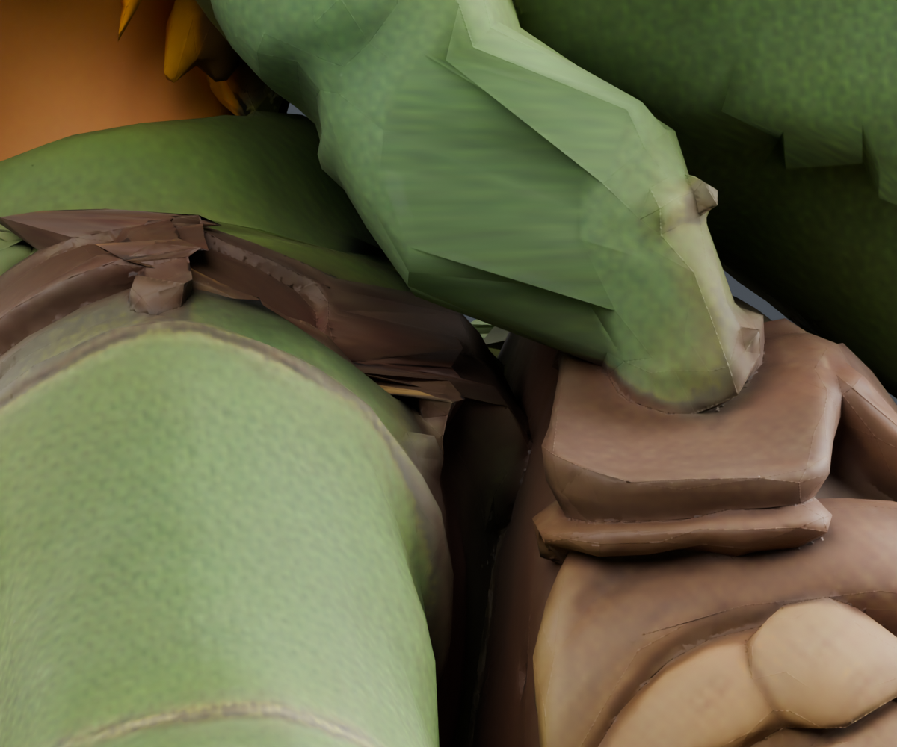

# Shoulder-strap head-weight correction

An isolated brown shoulder-strap region followed the head and stretched into visible shards during ordinary gaze. The reviewed correction assigns its **243 rigid-head vertices to chest**, without changing weight values, rest geometry, textures or any animation. Native cutaways and the closed chest/shoulder boundary establish that this is a strap region, separate from the cap. The exact region is documented in [ISLAND.md](ISLAND.md).

The native −15° comparison reduces the chest-boundary maximum length error from **36.663 mm to 0.000081 mm**. Every body vertex outside the island remains exactly unchanged. Across the existing 113-phase run check, arm/body contact samples improve **1316→1289**, peak **22→21**, and below-armpit samples remain **21**. This fixes the strap deformation; it does not claim collision-free clothing or completed running/stair animation.

| Before: head-owned strap | After: chest-owned strap |
| --- | --- |
|  |  |

Candidate `1873fc17…` changes only **243 bytes** in the original GLB joint accessor. Its reverse patch recovers source `4dcf89c5…` exactly; the native correspondence check covers all 243 vertices at neutral, ±15° gaze and run phase 102/112, with maximum error **0.0625 µm**. See [EXPORT.md](EXPORT.md) for the runnable check and complete hashes. The source/trial Blender scenes are saved outside Git, with their checkpoint receipt in `native-checkpoint.json`.

## Initial diagnostic and why native cutaways were necessary

The six new opposing faces from the held chest-plus-head torso study sit on a sharp head/chest weight boundary. Bone ownership and brown color alone did not establish whether the surface belonged to the pack/strap, collar or head. The initial diagnostic therefore changed no weights and required the marked native views before the later isolated trial.

The seed faces are `29946, 29947, 29948, 31757, 31758, 31759`; they previously intersected shoulder face `28361`. Exact-rest-position welded adjacency extends them by only two edge rings for inspection. That produces 21 faces, 48 UV-split vertices and 20 distinct rest positions: eight are entirely head-owned and twelve entirely chest-owned. These rings provide visual context, **not a proposed reweighting selector**.

On accepted asset `4dcf89c5c10391981289e2583152c26fb4ac93047c6fcb4bb0959e246805d850`, the actual source `lookAt` at idle time zero produces:

| Look request | Current play weight | Total neck/head yaw | Largest patch displacement |
| --- | ---: | ---: | ---: |
| −30° target | 0.5 | −15° | 38.200 mm |
| +30° target | 0.5 | +15° | 38.201 mm |
| Explicit diagnostic −30° | 1 | −30° | 75.746 mm |
| Explicit diagnostic +30° | 1 | +30° | 75.748 mm |

The source splits yaw 35% neck / 65% head, clamps requested yaw at ±0.8 radians before multiplying by weight, and resets both pivots before each pose. Current free play uses weight 0.5, so the explicit total ±30° rows exceed its usual maximum total yaw of 22.918°. They are labeled diagnostic rather than ordinary play.

Fourteen local triangle edges join a head-owned point to a chest-owned point. For example, edge `33518–33523` measures 2.373 mm at neutral but 39.186 mm at the ordinary +30° target / weight 0.5. Its explicit total +30° length is 76.557 mm. This proves stretching under lookAt; it does not by itself identify the surface or establish visible clipping.

`inspect_patch.mjs` reads the pinned GLB and extracts the real production `insertPivot` and `lookAt` functions through the existing TypeScript package. It applies the original idle first key and skins the local patch. `patch-look.json` contains exact source/script hashes, selected face and vertex IDs, weights, posed points, bone matrices and mixed-edge lengths. This is a local forensic study: its correspondence assertion reads the earlier untracked `2026-09-22-torso-contacts/native-pairs.json`.

`show_native_patch.py` is for the root agent's existing Blender session. It makes one `FULL_COPY` of `Link | September21 shorter boot tips`, verifies unchanged patch rest coordinates/weights, and transfers all five measured poses through the existing glTF-to-native matrix method. It requires selected native points to agree within 5 µm, and restores the previously active scene. Only the copy receives diagnostic materials and a rear fill light. Magenta marks the six seed faces; cyan marks their two rings.

With `RENDER=True`, the default produces four neutral images: rear context and rear-threequarter close-up, each textured and marked. Optional `RENDER_POSES` selects other recorded poses. The root-run `native-patch.json` confirms unchanged native rest coordinates/weights and all five poses within **0.120 µm** of the actual runtime matrices.

The first four native views placed the patch behind the lower side flap of the cap, next to the pack's upper flap. Occlusion prevented a reliable semantic assignment; a brown cap underside/trim with an incorrect chest boundary was still possible. No weight edit followed from those first views.

`show_native_cutaway.py` adds one independent diagnostic copy using the same helper. It renders a low lateral view and a camera-only cutaway of the original close angle, each textured and marked. The cutaway near plane is 0.5 mm nearer the camera than the nearest of the 48 measured patch points; thus it removes nearer occluders from the image while retaining every selected point. It does not remove triangles or change geometry. The `cutaway-` filenames and camera report make that artificial visibility explicit. These later views and the topology study established the strap interpretation before the separate 243-row trial was authorized.
