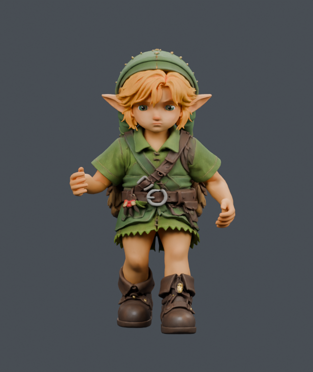
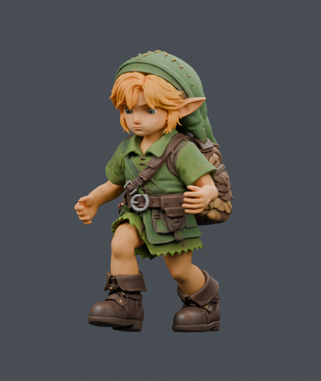
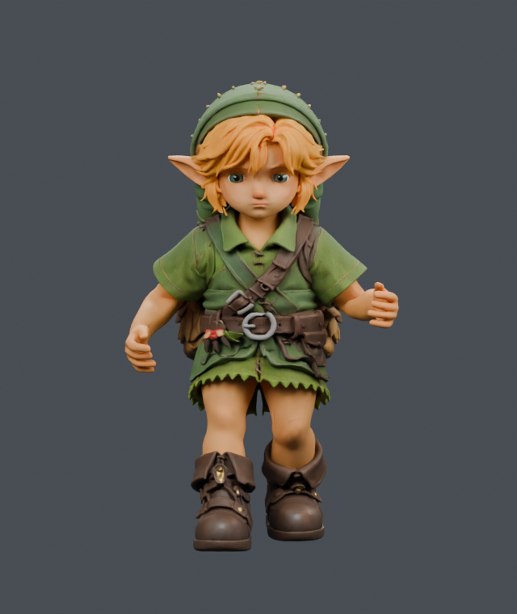
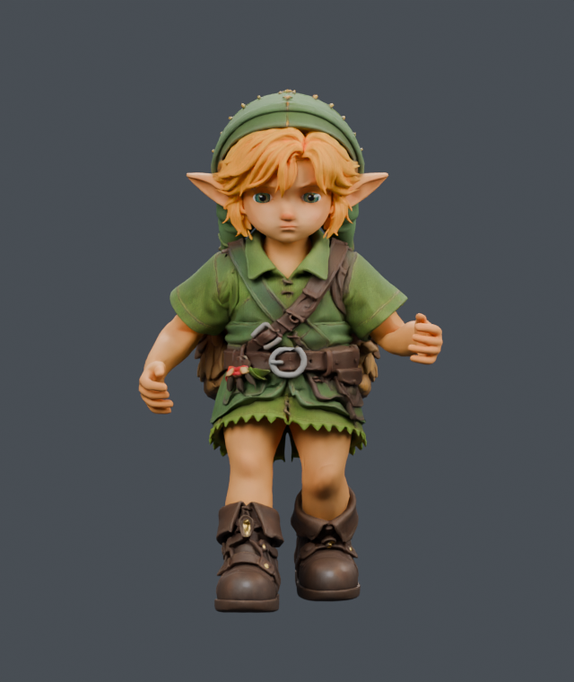
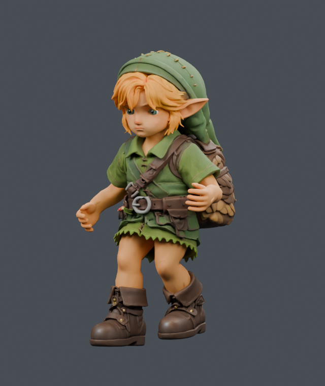
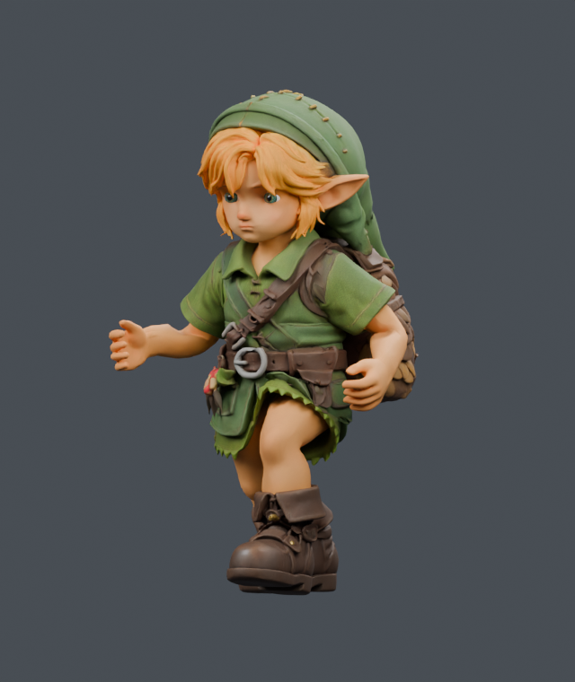

# Calf and cuff contour study

**HOLD `a70ef714`; the default remains `4dcf89c5`.** Raw preservation, native correspondence and unchanged-foot replay pass. The [completed descent solid result](../2026-09-21-stair-posture/CONTOUR_DESCENT_SOLID_RESULT.md) finds 17 true new entries into local timber sections: maximum nearest-surface depth **0.197273 mm**, and maximum existing-entry depth increase **0.338156 mm**. All 14,154 retained source/candidate positions reconstruct exactly from saved bone matrices. The apparent 49.8 mm case lies below the timber underside and is not solid penetration. These are finite vertex samples on the recorded descent route, not proof of globally watertight timber or continuous collision clearance. See [export verification](EXPORT.md) and [contact evidence and limits](CONTACT.md).

The five pairs below share scene, action, phase, camera and lighting; only the local calf/cuff field differs. The change is modest: straighter calf contours and less cuff flare, with no visible discontinuity in these views. This is not a new running clip or a correction for the existing deeply folded stair poses.

| View / run phase | Before | Contour study |
| --- | --- | --- |
| Front / 0.00 |  |  |
| Three-quarter / 0.25 |  |  |
| Front / 0.50 |  |  |
| Three-quarter / 0.53 |  |  |
| Three-quarter / 0.75 |  |  |

The accepted `4dcf89c5` mesh has a visible fixed bow in the exposed shin contour and a pronounced cuff flare. The fresh native front image at phase 0.50 and accepted three-quarter image show it. Straight joint centers do not establish a good silhouette. A local modeling preview is justified by the actual surface measurements below.

| Exact rest triangle section | Left / right |
| --- | --- |
| Knee width, height 340 mm | 93.59 / 93.42 mm |
| Knee contour midpoint outside the rig axis | 4.44 / 3.02 mm |
| Calf width, height 275 mm | 101.26 / 100.67 mm |
| Calf contour midpoint outside the rig axis | 11.82 / 10.55 mm |
| Cuff width, height 175 mm | 158.11 / 156.47 mm |
| Upper cuff midpoint outside the axis, height 240 mm | 16.55 / 15.92 mm |

These are intersections of rendered body triangles with rest-height planes, followed barycentrically through native run phases 0, .25, .50 and .75 using the existing GLTFLoader/`getVertexPosition` skinning method. Calf and knee section widths change by at most 0.086 and 0.033 mm; the largest inspected vertex's lateral change relative to its moving rig is 0.755 mm. The approximately 7–8 mm calf-to-knee midpoint difference therefore exists predominantly in the fixed mesh. The inner calf edge also bows outward: at 275 mm it lies about 4.4–4.7 mm farther from the midline than the knee edge at 340 mm.

All cuff, exposed-calf and knee vertices through rest height 360 mm are weighted only to the corresponding leg. Exposed calves average 98.2–98.5% shin influence; knees blend thigh and shin. The under-hem region above 360 mm contains other influences and is excluded. This is not a claim of zero deformation in every direction: sampled cuff contour perimeter increases by up to 18.2%, and knee perimeter decreases by up to 5.8%. Those depth/fold changes do not explain the measured outward contour.

Use one isolated native preview of the [measured profile](proposal.json), with the pure mathematical [field helper](field.py). It has a shared support interval at glTF rest Y / Blender Z **125–325 mm**, meeting identity at 250 mm. In practice the first controls keep everything through 150 mm unchanged; the ankle joint is at 110 mm and knee at 340 mm.

- **Cuff, 125–250 mm:** derive a straight envelope between the current shaft section at 125 mm and calf section at 250 mm. Remove 25% of its positive width excess, a conservative preview strength rather than an anatomical ideal. Shift its center toward that envelope, limited to half the width reduction so the sampled inner cuff contour stays put or moves outward. Maximum width reduction is 11.14 mm, about 7.05% at the widest sampled cuff; its outer edge moves inward by about 10.19 mm.
- **Exposed calf, 250–325 mm:** preserve each section's width and move its midpoint toward the line connecting the existing midpoint at each boundary. This removes the local outward bow with a measured maximum inward shift of 5.069 mm left / 4.843 mm right. Both endpoints stay fixed. Clamp the tiny negative residual to zero.

`field.py` interpolates the supplied coefficients with shape-preserving cubic Hermite curves and zero endpoint slopes. The cuff and calf profiles meet with identity and zero derivative at 250 mm. Run `python art/characters/link/progress/2026-09-22-leg-contour/field.py` for the built-in control-value, boundary/join identity, positive determinant and analytic-Jacobian finite-difference checks. It imports no Blender module, changes no mesh and exports nothing.

For glTF coordinates, height `h=y`, side sign `s=sign(x)`, the field is `x'=a(h)*x+s*b(h), y'=y, z'=z`. With `d=a'(h)*x+s*b'(h)`, the Jacobian is `[[a,d,0],[0,1,0],[0,0,1]]`. Blender coordinates are `(xB,yB,zB)=(xG,-zG,yG)`, so its Jacobian is `[[a,0,d],[0,1,0],[0,0,1]]`.

The helper exposes the existing `boots.py` field interface: `(new_blender_position, (a,1,d,0))`. Reuse that helper's inverse-transpose `normal()` and tangent handling. In Blender, the unnormalized normal becomes `(nx/a, ny, nz-d*nx/a)`; normalize afterward. Use the unposed Basis coordinates, compute each vertex displacement once, and add that **same displacement** to Basis and every shape key so morph deltas stay exact. Retain the rig, weights, UVs, materials and topology. Reuse the new boot-tip wrapper's scene-copy, native correspondence and exporter-adapter pattern in a new study; preserve both historical helper files. Its height-only normal guard must use field identity, as the boot-tip adapter already does.

The initial read-only evaluation of this field on the source POSITION rows affects 5,703 glTF rows, moves at most 10.197 mm, and has determinant at least 0.92955. The analytic derivative matches central differences within 1.85e-10. The rest transverse gap below 300 mm increases from 12.569 to 13.554 mm. All 2,970 vertices carrying any toe weight are below height 126.712 mm and remain unchanged; the complete sole is also unchanged. These initial mathematical predictions are preserved separately from the subsequent authored-candidate checks in [verification.json](verification.json).

Before adoption, the copied native scene must improve the matched front/three-quarter views at the four phases and preserve calf-to-cuff continuity. Verify source hash, raw native correspondence and deformation-delta parity with the existing 3 µm / 1 µm gates; then verify unchanged sole/toe positions, rig, weights, other channels and morph deltas, finite normals/tangents, and skin/cuff clearance through the cycle. Four sampled geometric contours and a positive Jacobian do not replace those checks.

Inputs and compact evidence: [summary.json](summary.json), source SHA256 `4dcf89c5c10391981289e2583152c26fb4ac93047c6fcb4bb0959e246805d850`. Images inspected: [accepted front](../2026-09-21-motion-integration/current-skin-review-run-0.50-front.png), [accepted three-quarter](../2026-09-21-boot-tip/after-run-0.53-threequarter.png), plus earlier repaired front poses. Detailed triangle-section records remain local in `contour.json`. The initial audit was read-only; the coordinating agent subsequently authored the copied native scene. The export and CPU validation lane did not modify production or use Blender/GPU access.
