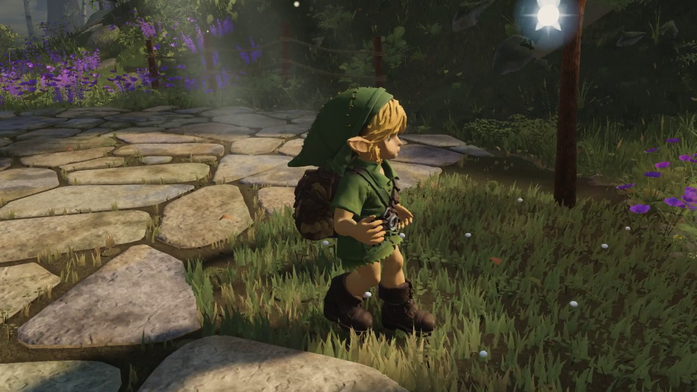
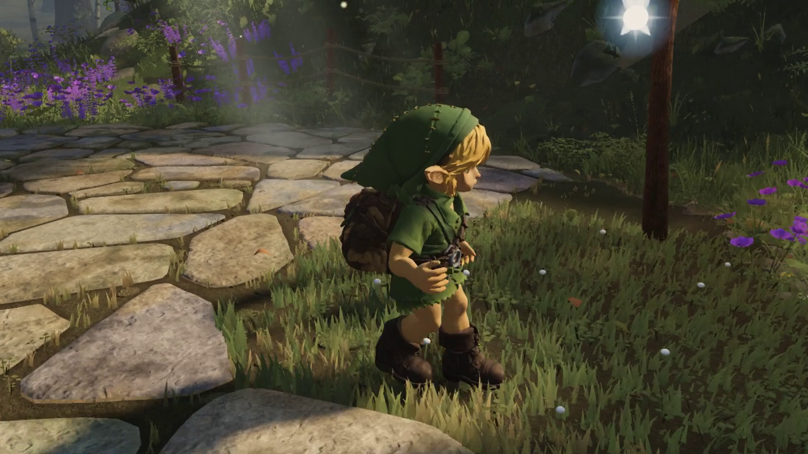
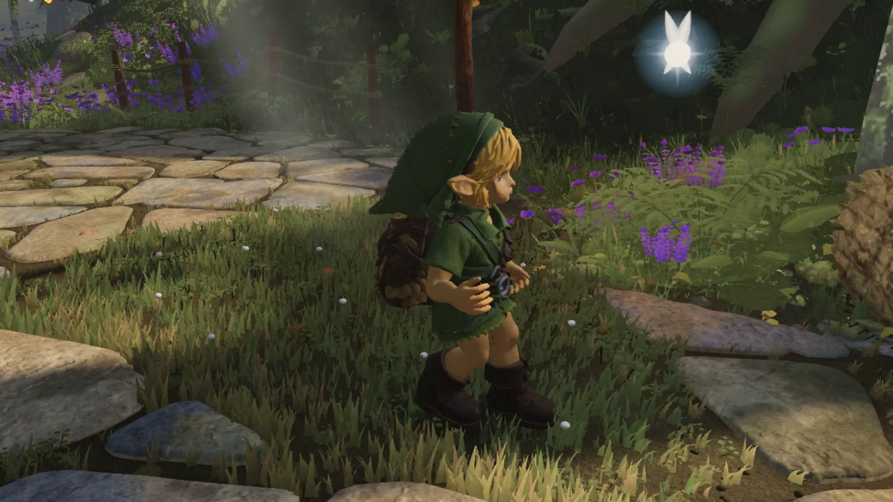
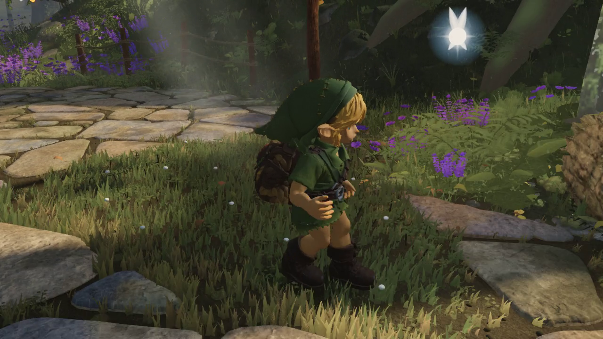
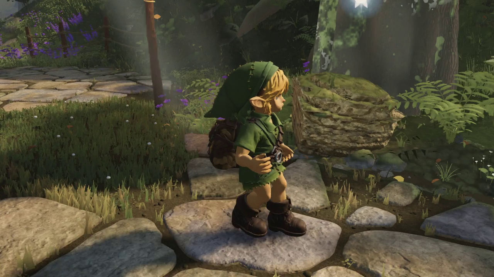
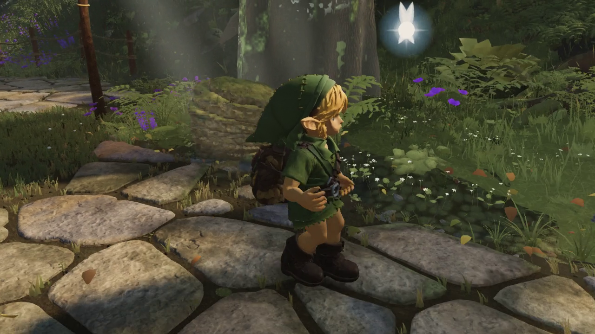
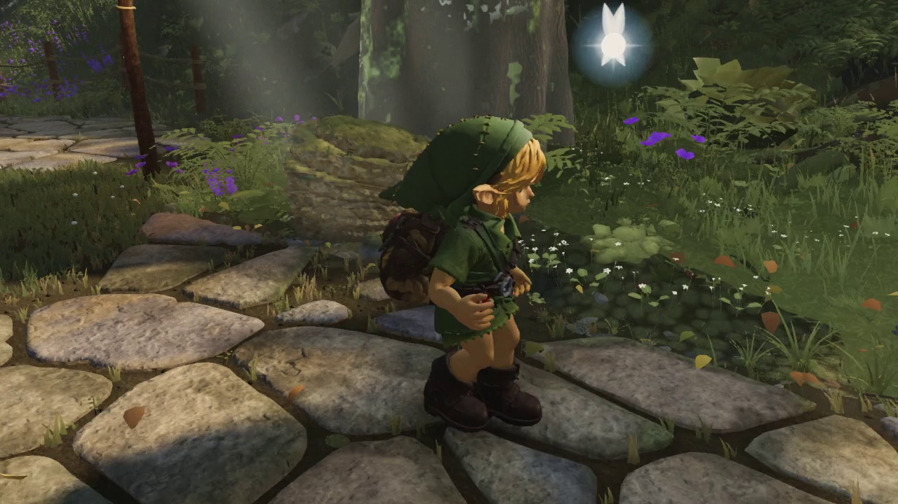
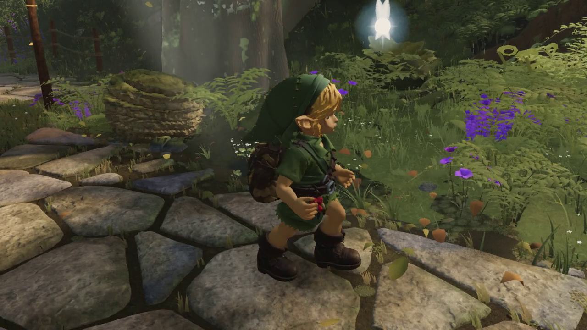
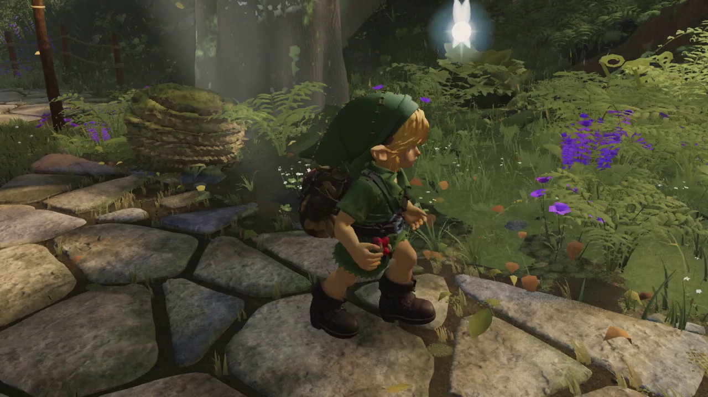

# Run posture in the game

Five matched comparisons of the same native GPU replay: **before 1873**, **after 143** (chest posture). The delivered **7f406e40** adds the independently checked right-strap repair to this posture. These videos isolate posture; they do not claim to show that last skinning change.

The player walks, runs, then stops over 300 simulation frames at 60 Hz. The saved videos show five seconds at 30 fps, 1280×720, high quality. Both runs use world commit `83ebbc63`, the same built bundle, input schedule and camera-follow formula. All 300 root, hip, foot, IK and gait records match exactly; both runs have no page errors or reach clamps. This flat route does not test stair clearance.

[Before video](before/walk-run-idle.mp4) · [After video](after/walk-run-idle.mp4) · [Hashes and comparison receipt](evidence.json)

| Simulation frame | Before | After |
| --- | --- | --- |
| 145 |  |  |
| 169 |  |  |
| 193 |  |  |
| 217 |  |  |
| 233 |  |  |

The stills are extracted from the encoded videos without sharpening or recolouring. The runtime posture now carries the wrists farther back in world space; it preserves their original cycle relative to the chest. Hands, clothing contact and stair motion still need further work.

The exact historical harness is `art/characters/link/capture_play_motion.mjs` at commit `1de60fd0`; its LF-normalized hash matches the executed file. The current harness retains `--flat-video` and adds fuller ground diagnostics. With the matching world built, set `LINK_WORLD_ROOT` to that checkout and `LINK_REVIEW_ASSET` to the reviewed sibling GLB, then run the harness with `--flat-video`. Chrome, FFmpeg and project dependencies are required. The receipt pins the original raw manifests and both asset hashes; it does not turn the older selected shoe-marker samples into an all-vertices clearance claim.
