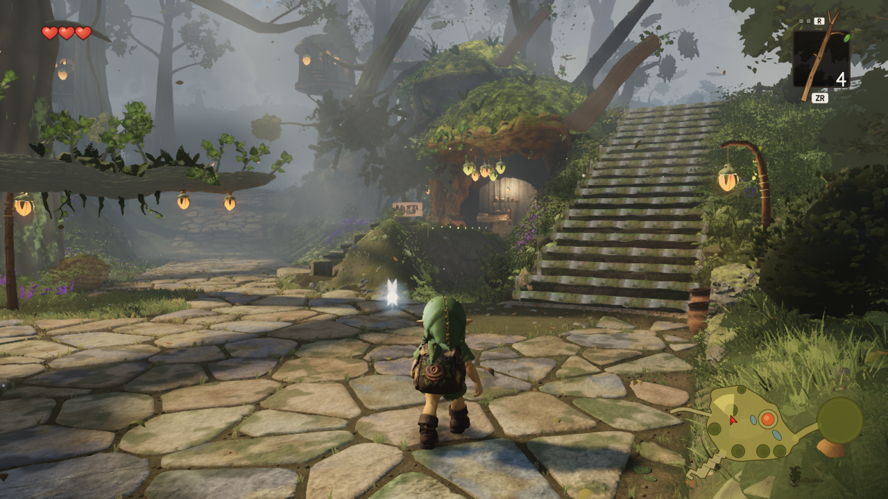

# Integrated world, September 22

Native Three.js capture of `ce2887c8`: accepted canonical world `110453d4` plus the raised-heel guard. Fable's tiled pebbles and distance LOD, wider west-deck passage and corrected log-arch roll are included. Typecheck/build, existing rock-tier and prop-geometry checks pass. [Raw capture](A_stairs.png), [renderer/source receipt](stats.json), [determinism receipt](checks.json).

High quality, 1280×720, Radeon 780M through ANGLE/D3D11, eight settle frames. The shot submits 450 draws and 8,758,901 triangles. The repeated deterministic capture is byte-identical; the later simulation frame differs. This is one visual review, not a full gauntlet take or an FPS measurement. The capture's dirty flag includes retained untracked studies; the tracked source tree was clean at this commit. Standard capture HUD is visible. Tree-core coverage and stair posture remain under review.
