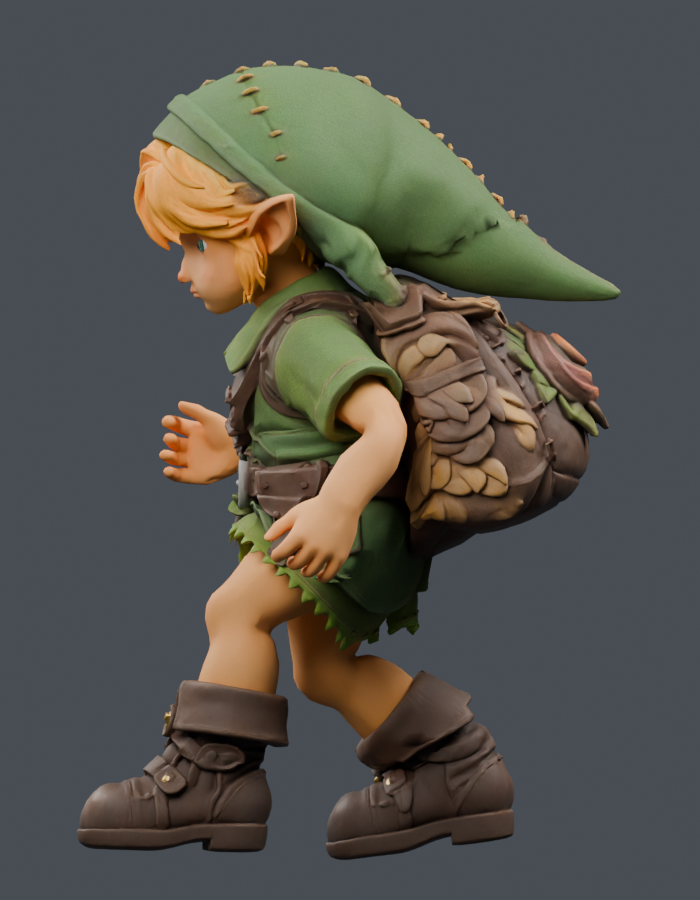
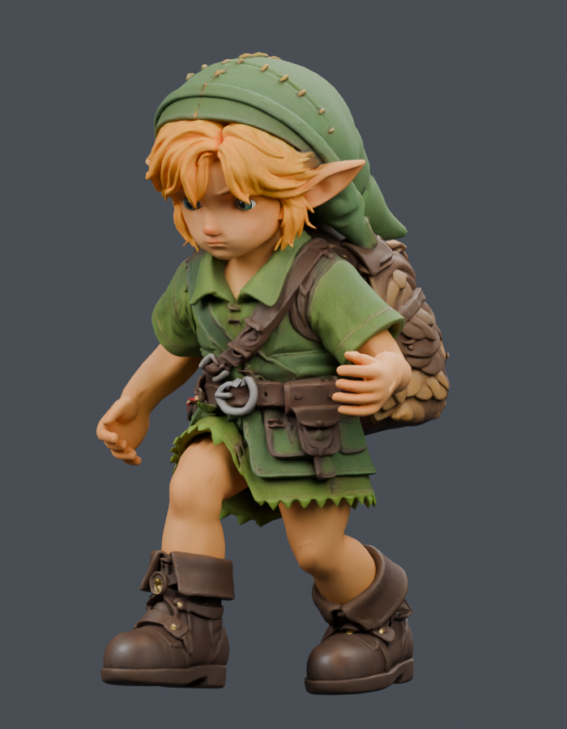
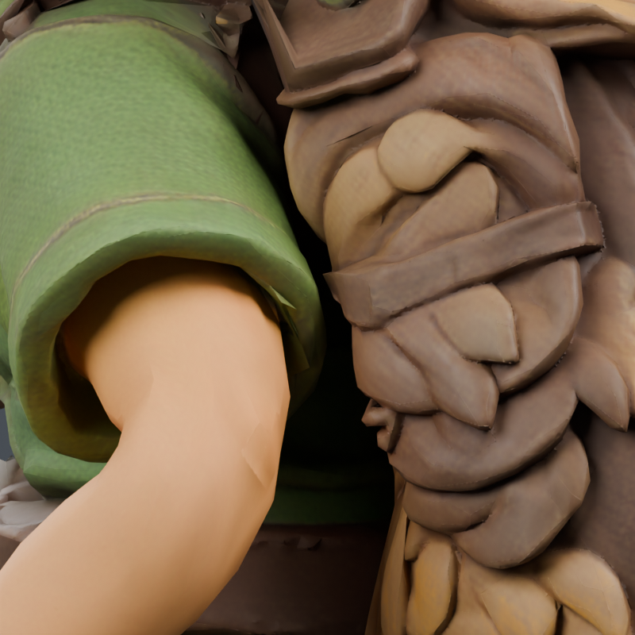
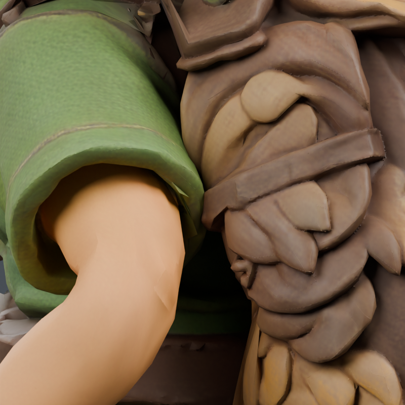

# September 23 character review

The accepted runtime remains `7f406e40e65430ed3c11bd045e2e9482dae8cee8122e9869ed62a2c3cfecbbda`. No new character asset is delivered by this review. These are unaltered Blender CPU renders of copied scenes, 16 samples, four threads; they show the raw run clip, not game IK or motion filtering.

## Current running pose

| Side, phase 102/112 | Three-quarter, phase 42/112 |
| --- | --- |
|  |  |

The forward chest posture already brings the rearward hand behind the shoulder in world space. The conspicuous remaining gesture is the stiff, spread fingers. Further upper-arm amplitude is not justified by these two stills alone. Next work examines a modest relaxed finger shape while preserving the original rig, UVs and motion. Stair knee folding is being investigated separately against actual player traces.

## Rejected pack weighting study

| Accepted weighting | Weight-only study — rejected |
| --- | --- |
|  |  |

Both images use run phase 101/112 and the same orthographic camera: target `[0.1677808434, 0.0662213147, 0.6758725643]`, offset `[1.2, 0.6, 0.2]`, scale 0.26, native Blender coordinates. The study moves the arm-influenced part of the left pack onto the chest. It pulls the band into the sleeve and is not adopted.

The copied scene preserves geometry, all actions and every unselected skin row. The exact portable patch affects 484 split rows / 154 physical points, with 4,140 changed bytes. Native topology verification includes all three body material primitives: 88,153 vertices and 68,042 triangles.

The original 9,733 arm / 56,809 opposing-face masks are frozen identically for both scenes across 113 phases. Their counts remain 1,269 total / 24 peak / 21 below-armpit. A separate fixed mask includes the 180 faces newly classified as opponents by the proposed weights: contacts worsen **705→1,641**, below-armpit **705→1,422**, peak **27→63**. Keeping those faces separate prevents a changing mask from concealing the regression. The combined total worsens **1,974→2,910**. These are triangle-pair samples, not penetration depths.

[Native receipt](pack-native.json) records `accepted: false` and both failed added-face gates. Candidate `d7426b4d` and the private Blender checkpoint remain local study artifacts. The game's asset stays 7f.
