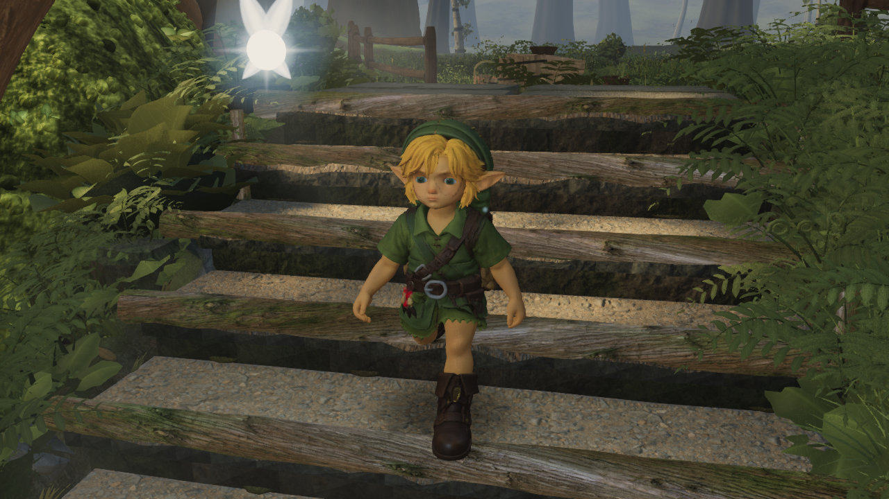
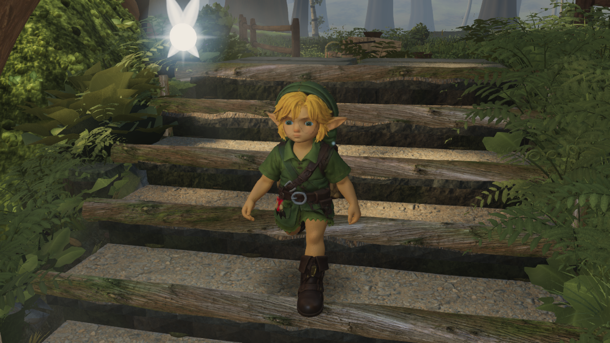
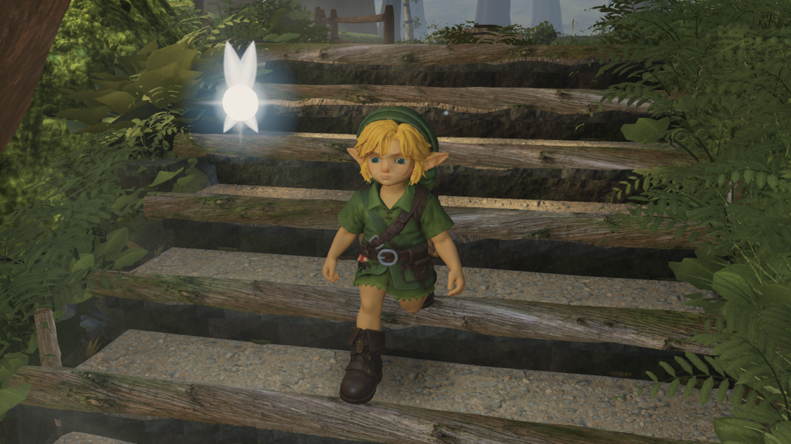

# Native validation of tilted-stance support

One actual-player replay completed on the laptop's AMD Radeon 780M through native D3D11: 660 ascent and 660 descent frames, high defaults, 1280×720. Source `b8951dd0` (adopted by root as `4cf09bc5`), bundle `index-Bxmk-iqU.js`, and Link `7f406e40…` stayed fixed. No runtime or asset changes were made during this pass.

All **537 low-sole and 4,701 fully owned foot vertices** were checked every frame against the actual stone, timber, paving and endpoint terrain. The 12 reference geometry hashes exactly match the paired CPU evidence. Full receipts and selected contact rows are in [native.json](native.json).

| Native result | Ascent | Descent |
| --- | ---: | ---: |
| Frames | 660 | 660 |
| Minimum full-shoe clearance | +1.186769 mm | +1.218283 mm |
| Frames with negative sole/foot clearance | 0 | 0 |
| Reach clamps | 0 | 0 |
| Maximum knee flexion | 164.291° | 166.131° |

The run measured 708,840 sole points and 6,205,320 full-foot points. Native roots, joints and minimum shoe gaps agree with the CPU candidate within 9.82e−12 m. This accepts the narrow contact repair; **the severe knee folding remains unresolved**. There was no old-source native rerun. The paired negative control and the earlier shared-gait-state harness correction are documented in [the source evidence](../2026-09-23-stance-support/README.md).

No page, renderer or console errors were reported. There were 59 warnings: D3D11 shader compiler messages, the Canvas2D readback hint, and the diagnostic import of a second Three.js instance. One GLB request recorded `net::ERR_ABORTED`; a completed GLB response was HTTP 200, the current model loaded successfully, and its asset audit and both served/public file hashes match `7f406e40…`. Thus this is not a claim of a warning-free or request-failure-free load.

The existing `capture_play_motion.mjs` player inputs, camera, time and frame sequence were retained. Its measurement additions cover all owned foot vertices, paving, geometry hashes and selected contact stills. Invocation: `--stairs-only --stair-detail --full-sole`, with `ZR_NATIVE_GPU=1`, using the shared capslot. The full 10.6 MB raw manifest and remaining stills stay local at the path recorded in `native.json`; this compact evidence includes its SHA-256.

These native candidate frames were inspected directly. Filenames inherit the capture helper's one-based numbering; labels below use zero-based trace frames. They are not before/after comparisons.

Descent frame 145, immediately before the former contact failure:

Descent frame 146, body vertex 56492 now has approximately +3.724 mm clearance:

Descent frame 167, after the formerly affected interval:

