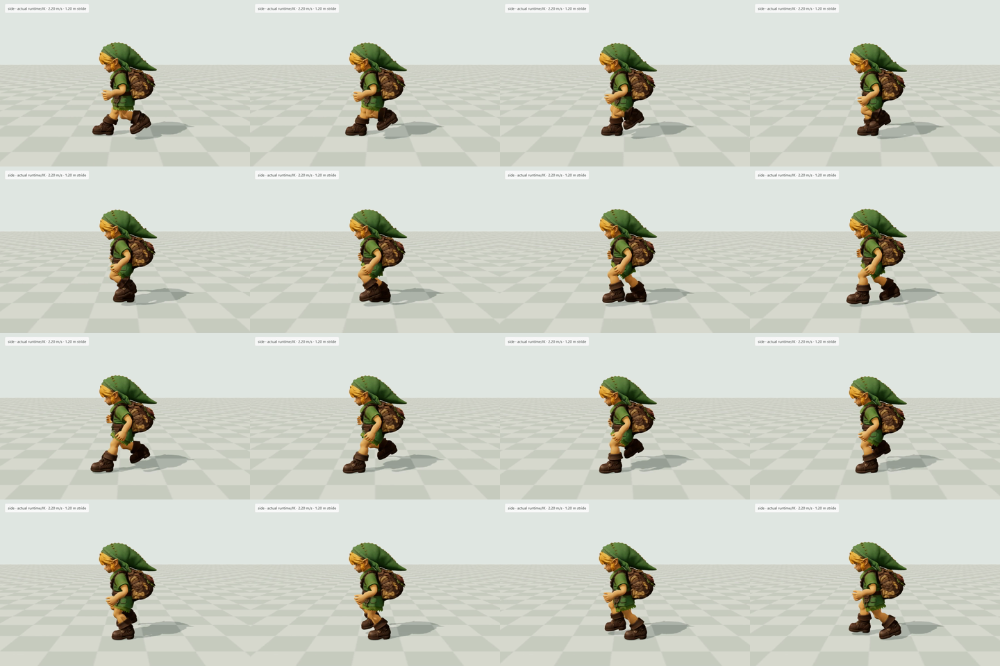

# Running leg repair — September 24

The previous run carried the boots forward close to the floor and kept the knees ahead of the hips for most of the cycle. This replacement lifts the heel behind the body, brings the folded leg through, then opens it before contact. It also replaces sharp hip-height notches with one smooth rise/fall per step.

Delivery SHA256: `8d7efa783d4bbc97d053c0a627a28c3c163351d7828124e1bf10c8232f06cedd`.

## Actual runtime evidence

[Six-second run: side and three-quarter views](run-studio.mp4). This is the production Three.js puppet and foot IK on a diagnostic floor, recorded at 30 fps from 60 Hz simulation. The recorded candidate overrides equal the subsequently adopted production stride/speed. It is not an ungrounded Blender animation preview. Source, asset, renderer and all 360 simulation samples are in [studio-trace.json](studio-trace.json). This diagnostic recording precedes the final boot-floor correction below; the leg cycle and body motion are unchanged.

The independent [visual review](REVIEW.md) identifies improved recovery, stable body height and separate foot tracks in the inspected frames. Bulky boots and relatively stiff toe-off remain visible. The review covers sequential images, not a claim of continuous video playback.

Full forest walk → run → stop capture is being generated; it will be linked here after review.

## Measured change

Matched flat-ground CPU sampling through the real puppet/IK, after warmup:

| Measure | Rejected AA run | Replacement |
| --- | ---: | ---: |
| Stride / travel speed | 1.82 m / 3.3 m/s | 1.20 m / 2.2 m/s |
| Cadence | 218 steps/min | 220 steps/min |
| Support per foot | about 20% | about 31% |
| Actual shoe clearance | 45 mm | 112 mm |
| Both boots above 3 mm | about 54% | about 17% |
| Maximum planted-foot slide | — | 0.049 mm/s |
| Maximum body step at 60 Hz | — | 2.31 mm |

The slower travel speed fits the smaller stride to this short rig without increasing cadence. Peak knee recovery is approximately 125°, with thigh pitch below 64°. The existing runtime pelvis correction now contributes only about 0.5 mm; the native action itself is smooth. Arms retain the previously repaired motion, with approximately 167° opposition to the same-side leg.

The final grounding correction enforces the lowest boot point as well as the existing upper lift bound before solving the leg. Previously, a blended foot rotation could put a corner underground despite a positive ankle-marker height. The shared correction removes the 13.8 mm startup penetration and 2.73 mm steady-run penetration (remaining numerical residual about 0.002 mm), without changing the measured pelvis motion. [Core comparison and other gait/jump checks](floor-support.json) cover this separately from the original [leg-candidate comparison](comparison.json).

Known limits: downhill minimum boot clearance remains about 9.7 mm versus 8.45 mm in the rejected baseline; that existing grounding issue is not solved here. The boot silhouette and toe-off remain stylized. No universal collision-free, performance, or photoreal-human claim is made.

## Checks and reproduction

`node art/characters/link/progress/2026-09-24-natural-legs/check.mjs` runs the current production model through the real puppet on flat ground and reports slope diagnostics. The regression checks recovery, support, sliding, body continuity, start/stop foot clearance and zero-dt stability. Typecheck, build, gait-chain tests and source anti-cheat also pass.

[grounded.py](grounded.py) is the Blender source. It changes only run hips translation and the thigh/knee/ankle rotations on both sides. All other channels and the original mesh binary are retained by the existing export pipeline. [smooth-jog-export.json](smooth-jog-export.json) records preservation; [reproduction.json](reproduction.json) confirms the final script recreated the exact delivered hash.

To rebuild, recover `public/models/link/link-runtime.glb` from commit `ae894d5d` into a local baseline file (SHA `aa0520e0…`). In a fresh Blender 4.5.13 session, execute `grounded.py` with `BASELINE` pointing to that file and `OUTPUT` to an empty directory. Then run `../2026-09-19-run-contact/export_candidate.py BASELINE smooth-jog OUTPUT` in Blender's Python. The script reuses the existing import/export and curve helpers; it never writes the production GLB itself. The small [native carrier](smooth-jog-native.glb) and [sampled study](smooth-jog-study.json) are included; bulky intermediate models and scene copies stay local.

Reference: [primary gait research and licensed donor comparison](../2026-09-24-run-jitter/LEGS_REFERENCE.md). The direct CC0 quaternion transplant was rejected because it lost support and put boots through the floor; its reference shape informed this original fitted trajectory. No new licensed asset was introduced.
