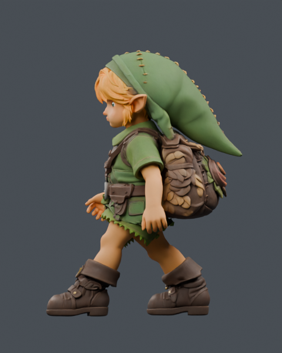
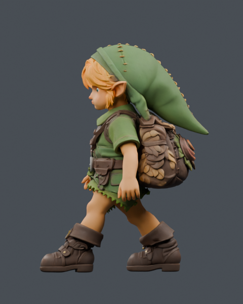
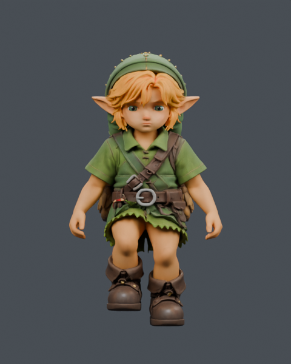
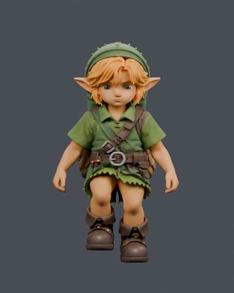
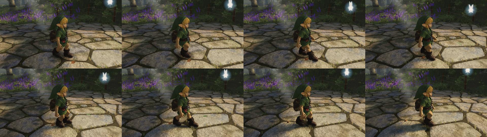

# Ordinary walking — 24 September 2026

Candidate: `walk-natural-candidate.glb`, SHA-256
`46dcbcc36490ee5c86f6d9eb28d58d1743f60cfab02bb0c899b8388b6eda3de0`.
Delivered by `01b9f1a7`. Export, structural checks and the actual player walk/stop replay pass.

## Change

The walk uses shoulder and elbow curves derived from Quaternius `Walk_Loop`,
aligned to the existing leg cycle and fitted to this rig's arm bend plane.
Only four rotation tracks change: `shoulderL`, `elbowL`, `shoulderR`, `elbowR`.
Wrist tracks, lower body, mesh, skin weights, materials and other clips are preserved.
This is an adapted reference motion, not a full-body or full-orientation retarget.

The fit moves the shoulder centre 8° rearward and opens the elbow by 15°.
Outward clearance is 0° left / 2.5° right because the sleeves and strap are asymmetric.
The authored cycle remains 0.55 s / 0.88 m. Player walk speed changes from 1.6 to
1.2 m/s, giving a 0.733 s cycle (163.6 steps/min). Distance still drives the cycle.
Walk arm scaling is 1 and filtering is disabled, preserving the authored timing.
Run and stair settings are unchanged.

## Evidence

- [Export checks](walk-natural-export.json): original binary prefix, rest data,
  other clips and unselected channels preserved; exactly four changed rotations.
- [Native contacts](contacts.json): 113 poses, existing masks and thresholds.
  Intersections: **34 → 11 total**, **4 → 2 peak**, **1 → 0 below the armpit**.
  These are triangle-pair counts, not penetration depths or a collision-free claim.
- [Production-puppet comparison](runtime-comparison.json): structural checks pass;
  protected bone matrices and root/foot/IK traces match at equal phase and speed.
  Play mode has no reach clamps, no flight phase, and minimum shoe gap −0.043 mm.
  Re-rendering at zero elapsed time produces no measured hand displacement.
- **Both CPU variants use the new runtime.** This isolates the asset change;
  it does not compare old-runtime cadence or establish that the motion looks better.

## Reproduce

Run from the repository root with Python 3, Node and installed npm dependencies.
The baseline is the GLB at `e599075f`, SHA-256
`7f406e40e65430ed3c11bd045e2e9482dae8cee8122e9869ed62a2c3cfecbbda`.
Use a binary-safe extraction; PowerShell text redirection can corrupt a GLB.

```powershell
$study = 'art/characters/link/progress/2026-09-24-natural-walk'
python -c "import pathlib,subprocess; pathlib.Path('$study/baseline-7f.glb').write_bytes(subprocess.check_output(['git','show','e599075f:public/models/link/link-runtime.glb']))"
python art/characters/link/progress/2026-09-19-run-contact/export_candidate.py "$study/baseline-7f.glb" walk-natural "$study"
node "$study/compare.mjs" "$study/walk-natural-candidate.glb"
node src/world/character/gaitChain.test.mjs
```

Export consumes `walk-natural-native.glb` and `walk-natural-study.json`; it does
not replace the production model. [native.py](native.py) authors these in Blender
4.5 from the baseline and the credited donor. Its `source` path points to the local
donor checkout; update that path when reproducing elsewhere. A fresh bake requires
a fresh Blender session and archived previous `walk-natural` bake outputs: the
script refuses to overwrite them. Full candidate GLBs and Blender studies stay local.

## References and licensing

- [Quaternius Universal Animation Library](https://quaternius.com/packs/universalanimationlibrary.html):
  `Walk_Loop`, CC0. Donor provenance and licence are in
  [`reference/animations/quaternius-standard`](../../../../../reference/animations/quaternius-standard/).
- [Stanford dynamic arm-swinging videos](https://biomechatronics.stanford.edu/dynamic-arm-swinging-videos):
  primary experimental walking-reference page; no video frames are game assets.
- [Hejrati et al., Human Movement Science, 2016](https://mmrobotics.mech.utah.edu/wp-content/uploads/2023/01/Hejrati_HMS16.pdf):
  shoulder/elbow coordination reference. Adult measurements guide the fit; they
  are not literal targets for this stylised character.

The CC0 credit applies to the donor animation, not to every asset in the game.

## In-game review

[New walk and stop, 1080p](../2026-09-24T16-46-06-324Z-play-motion/walk-idle.mp4) ·
[Before/after, left/right](walk-before-after.mp4) ·
[Full replay manifest](../2026-09-24T16-46-06-324Z-play-motion/manifest.json) ·
[Build receipt](game-receipt.json)

The new clip is four seconds of walking and one second of stopping, driven through
the actual player handle: 300 simulation ticks, 150 encoded frames at 30 fps.
The comparison uses the first two seconds of each replay at normal playback speed;
the left is the previous cinematic's walk, the right is this revision. Travel differs
because the walk speed changed. This is deterministic capture, not a real-time FPS benchmark.

Reviewed the side/front native poses, the in-game cycle frame sequence and the stop
pose. The hands stay beside the hips with restrained forward travel, and the arms
alternate with the legs. The player covers 4.763 m; there are no page errors or IK
reach clamps. This route does not perform the separate full-sole triangle scan.
One aborted GLB request is recorded alongside the successful HTTP 200 load and
the verified final GLB audit; no fallback character was used.

Build `index-CUQeRUga.js`, SHA-256 `c240459bc93c08266995f3023418cb83d7be23c56c657c2309db50fda6ec113c`.
Capture started with these changes uncommitted at `67b801db`; the receipt verifies
the runtime source against `01b9f1a7` and the unchanged built bundle. Typecheck,
build, source anti-cheat and the gait-chain test pass. The CPU report predates the
final runtime hash-label update; its motion logic is the same.

| Pose | Before | After |
| --- | --- | --- |
| Side, phase 0 |  |  |
| Front, phase 0.25 |  |  |



This addresses ordinary walking arms and cadence. It does not establish final
character quality or repair the existing extreme stair knee poses.
