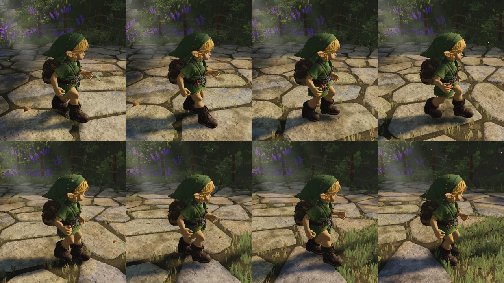
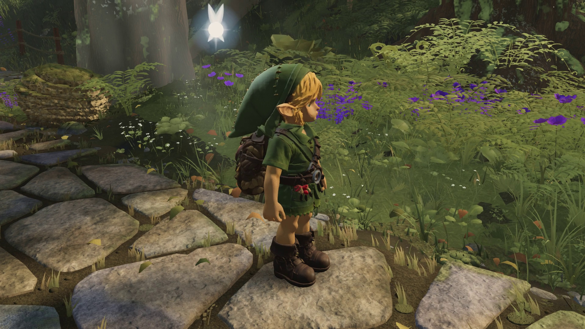
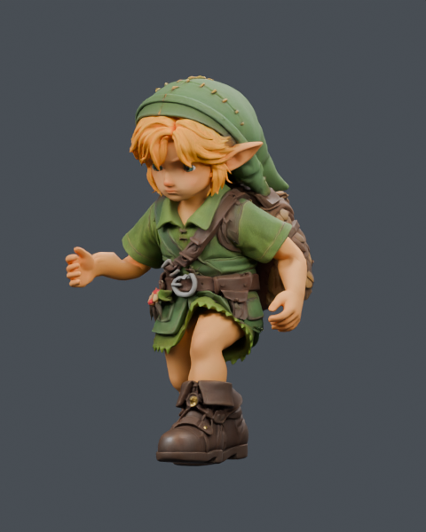
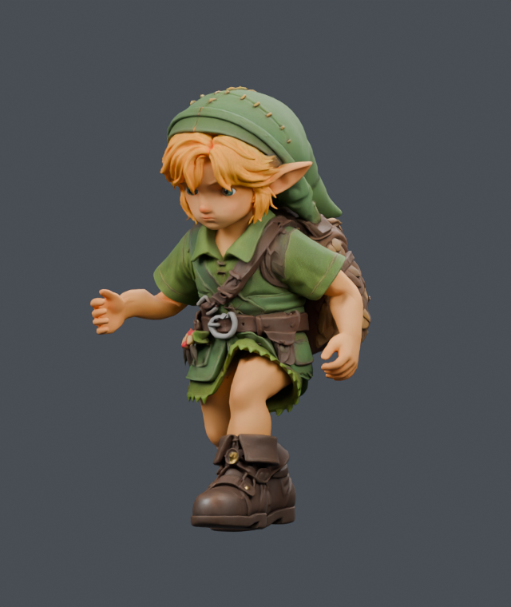
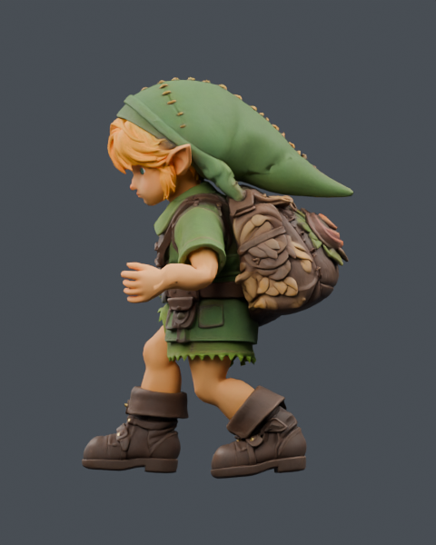
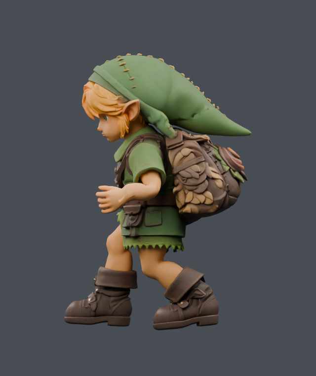

# Walking/running body shiver

## Delivered game evidence

Implementation `d3e933a0`, asset `aa0520e0`, reviewed in the actual player at native
1920×1080: [four seconds RUNNING, then stop](../2026-09-24T18-46-15-558Z-play-motion/run-idle.mp4).
[Before/after RUNNING comparison](running-before-after.mp4) retains original
30 fps playback with no retiming. The before segment is the September 23 run
(its arm/hand source is unchanged in the later walk-only delivery); the cameras
follow their actual traveled distances, so backgrounds are not pixel aligned.

The final recording contains 300 simulation ticks / 150 video frames, 12.933 m
of travel, no page errors and no reach clamps. The source/bundle/asset hashes
are bound by [game-receipt.json](game-receipt.json). This validates the filmed
route and motion, not realtime frame rate or every possible slope. Reviewed
cycle frames and the settled stop:




Reproduce using `capture_play_motion.mjs --run-video --size 1920x1080` through
the existing native-GPU capture slot. The earlier walk/run/stop intermediate
`04e6a86e` separately validated the same body-height correction; it is not the
final shoulder edit shown above.

The published walk proof revealed an authored pelvis-height defect. At the same
walking speed on a perfectly flat CPU scene, the pelvis jumped **7.844 mm in one
60 Hz frame**, while the root placement in the actual world video usually moved
less than 1 mm. This was present without a camera. The walk translation rises
10.742 mm between source keyframes at 0.28333 and 0.30000 seconds; similar narrow
notches occur at the other foot handover. The run also contains several extra
height reversals within each step.

`glbLink.ts` now fits a phase-driven pelvis envelope from the clip's existing
sampled foot/hip paths. It retains the two-step rise and fall and removes the
narrow notches. Its target stays below the sampled body height; the bounded
correction lowers the body before the existing leg solver, preserving the ankle
targets. There is no camera filter or additional time-dependent animation state.
The correction blends with walk/run weights. It tapers away during jump crouch
and returns through landing, preserving both boundaries and the ballistic arc.
Idle, stairs and fixed captures retain their existing behavior.

Run the production GLB/IK regression without a renderer:

```sh
node art/characters/link/progress/2026-09-24-run-jitter/check.mjs
```

The test compares the runtime from `11a74993` with the working runtime, serving
the same frozen GLB bytes to both. It tests all four gaits on flat ground, ±20%
slopes and uneven ground, including unchanged idle/stair traces, zero-dt poses,
sole support and reach limits. It also covers idle/walk/run transitions and
64 crouch/landing boundaries per gait. `regression.json` records source hashes.

At the current speeds (walk 1.2 m/s, run 3.3 m/s), the flat-ground measurements are:

| Measurement at 60 Hz | Before | After |
| --- | ---: | ---: |
| Walk peak body step | 7.844 mm | 1.158 mm |
| Walk second-difference RMS | 2.459 mm | 0.319 mm |
| Run peak body step | 2.984 mm | 0.721 mm |
| Run second-difference RMS | 1.867 mm | 0.148 mm |

Maximum correction is 13.22 mm walking and 6.80 mm running in those cases. No
new reach clamps or material sole-contact regression were measured. Idle and
stairs remain exactly equal in the tested traces. Separate earlier measurements
at 4.6 m/s isolate the initial correction from the run-speed change. Gait
transitions reduce second-difference RMS from 1.782 to 0.606 mm; their largest
body step is 9.93 mm versus 8.86 mm before, due to the added soft knee bend.

Steep-slope support transitions remain a separate limitation: their RMS height
roughness improves, but the uphill run's largest step increases from 11.17 to
approximately 12.4 mm. Its existing hip-flexion guard changes one swing-foot path by up to
7.64 mm while preserving support. These numbers are not a claim of perfectly
smooth terrain traversal. Root-owned game recordings provide the visual review.

## Running arms and hands

The owner's correction is specifically the **running** hand/arm motion. The
September 24 walk changes remain intact. The native run uses the already licensed
Quaternius `Jog_Fwd_Loop`-derived cycle; this pass requires no new motion download.
The [reference review](RUN_REFERENCE.md) records primary research, measurements,
anatomical hand regions and the exact authoring dependencies.

`run_native.py` retains the current opposite-leg phase and measures forward arm
reach relative to the leaning torso, reducing it by up to 6°. The elbow opens by up to 4° during the rearward half, with
smooth transitions and no added outward arm offset. Only `shoulderL/R` and
`elbowL/R` rotation tracks change. Wrist tracks, all other animation channels,
other clips, rest rig, stride and stored duration stay exact. Runtime run arm
gain/filtering are removed so the approved authored timing reaches the screen.
Play speed changes from 4.6 to 3.3 m/s: the 1.82 m distance cycle now takes
0.5515 seconds, approximately 218 steps/minute instead of 303. This is an
art-directed pacing change, not a medically prescribed gait.

The arm-only export is
`7e907dd06a7a0cbce48ae157441832a834eb505305a38f3d53cfe33a75ef2692`;
its source is delivered `46dcbcc3`. `run-torso-return-export.json` verifies the
four selected tracks and original binary preservation. Native authoring uses
`run-torso-return-study.json` and `run-torso-return-native.glb`. The existing
113-pose BVH census in `run-torso-return-contacts.json` improves **1269 to 1266
total**, with **24 peak / 21 below-armpit** unchanged. It does not certify a
collision-free character.

The final composed delivery is
**`aa0520e0d7aaedcc452103ad14c81113866ff3c5adbd5307fdcedf711a248c89`**,
54,422,264 bytes. `run-torso-hands.json` records the checked hand composition.
The earlier `04e6a86e` candidate used a world-axis forward gate that reduced the
actual peak by less than 1° because of the chest lean; it is an intermediate
comparison, not the delivered fix. The torso-relative gate now produces the
intended measured reduction. `final-torso-measurements.json` samples the raw
GLB skeleton at 241 phases; these are joint centers, not skin-surface distances:

| Native run measurement | Baseline | Final delivery |
| --- | ---: | ---: |
| Peak forward upper arm, L / R | 8.26° / 8.26° | 2.26° / 2.26° |
| Rearward upper-arm extrema, L / R | −26.47° / −27.16° | −26.47° / −27.16° |
| Maximum wrist ahead of shoulder, L / R | 97.15 / 95.19 mm | 81.55 / 80.16 mm |

The final game replay is linked above. Earlier broader carriage studies remain
rejected local experiments.

The separate `hand_native.py` study curves the four long fingers toward the palm
by up to 35°. Thumb, palm and proximal boundaries stay fixed. It modifies 1548
rows with a maximum displacement of 7.659 mm, retaining exact topology, weights,
UVs, materials and animations. The minimum deformation Jacobian determinant is
0.5295; the minimum affected face-normal cosine is 0.8218. Those checks rule out
local inversion, but do not establish global finger/body clearance. Because this
is rest geometry, its relaxed shape appears in idle, walking and running.

The root reviewed the final native run and hand composition, retained locally
in `final-torso-hands-review.blend`. The paired images below show matching native
run phases and cameras. They are Blender evidence; acceptance of the actual
game replay is separate and linked above.

| Before | Combined native candidate |
| --- | --- |
|  |  |
|  |  |

## Authoring and preservation

Recover `baseline-46.glb` from the prior delivered Git version of
`public/models/link/link-runtime.glb`; verify SHA256
`46dcbcc36490ee5c86f6d9eb28d58d1743f60cfab02bb0c899b8388b6eda3de0`.
The full local baseline, candidate GLBs and `.blend` studies are fixtures, not
additional runtime models. Import that baseline into the named native scene
before running `run_native.py` or the separately copied hand study.

`hand_export.py` composes the hands after an explicitly pinned arm-only input:

```sh
python hand_export.py run-torso-return-candidate.glb 7e907dd06a7a0cbce48ae157441832a834eb505305a38f3d53cfe33a75ef2692 run-torso-hands.glb
```

Run from this study directory with Python and NumPy available. It requires the
real `hand35-plan.json`, `hand35-native.json` and `hand35-native-rows.json` from
the native study. It reuses the existing append-only boot writer, adapted for a
full 3×3 deformation Jacobian. Only three body POSITION/NORMAL/TANGENT accessors
are rebound. Checks cover the unchanged input binary prefix, clips, rest rig,
other geometry, weights, UVs, materials, morphs, coincident aliases, unit shading
vectors and native correspondence. Deliberately corrupted 100 µm native rows
must fail. No production asset is overwritten by either authoring helper.

Blink POSITION deltas on the selected fingers are exactly zero. Their existing
sparse NORMAL deltas contain rounding residue up to `1.1920928955078125e-7`;
those bytes remain unchanged and are disclosed in the export receipt.

The reusable hand helpers required in a fresh checkout are:

- `../2026-09-23-hand-curl/prepare.py` and `native.py`;
- `../2026-09-22-rear-carriage/patch_pack.py` (only its reader/body helper is used);
- `../2026-09-22-body-posture/native.py` and
  `../2026-09-22-head-owned-patch/preview_chest_weights.py` (selected pure helper
  functions are read through the AST; their historical studies are not run);
- the already tracked `../2026-09-21-boot-tip/{preview,check}.py` and
  `../2026-09-20-run-arms/boots.py`.

The old 18° hand plans, rejected candidate GLBs, Python caches and old full
Blender studies are not dependencies of the new export. Existing source/provider
provenance remains unchanged; the hand curvature is original Blender authoring.
