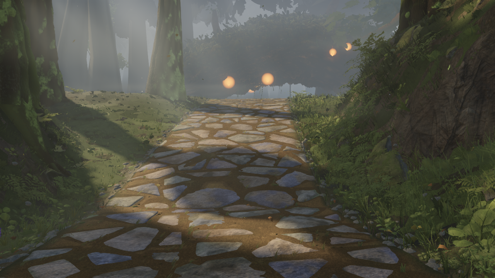
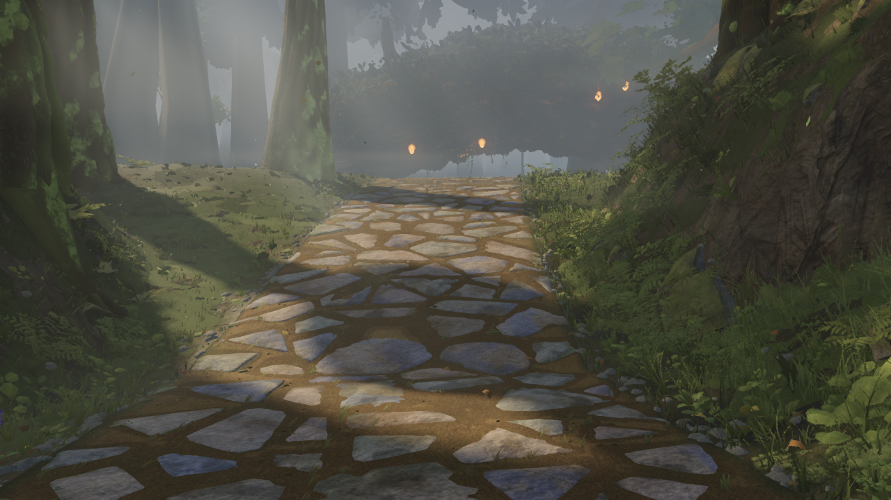
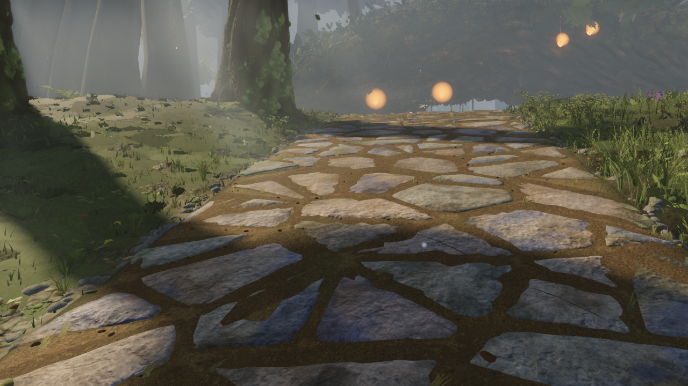

# Far lanterns: remove the oversized disc appearance

Source baseline: `50aac29e`, Fable world branch, 19 September 2026. Actual native Windows D3D11 captures, high quality,1280×720, time12.6. These numbers are not directly comparable to Fable's SwiftShader captures.

The reported bloom orbs survive disabling bloom. `structures/materials.ts` draws separate unfogged halo discs with radius0.7m; those discs hide the pod silhouette. Reducing only their radius to0.24m restores readable pods while keeping a small warm halo. Emissive strength, bloom, haze, pod geometry and placement are unchanged.

| Baseline | Compact halo |
| --- | --- |
|  |  |
|  |  |

Diagnostic proof that bloom alone is not the cause:

`settings.json` drives the initial baseline / no-bloom / no-halo / compact-halo ablation at two survey poses and D. `production-check.json` repeats all six hero views plus two survey poses on the rebuilt source: before uses radius0.7 through the existing uniform hook, after uses the new default without a radius override. Both retain exactly the same cameras and time. All screenshots are unretouched renderer output; the capture directories include settings, image hashes and source diffs.

Run `node art/environment/2026-09-19-halo-review/verify.mjs` for the comparison checks. Reference SSIM deltas: A0, B+0.0004, C0, D+0.0017, E+0.0007, F0. Draw/triangle counts are unchanged in every matched pair; maximum521 calls /8.797M submitted triangles. No page errors. Typecheck/build pass. These checks establish this bounded change, not full environment acceptance or an FPS measurement.

Independent Fable review and integration remain pending. Shade readability, shafts, sky detail, flat canopy silhouettes and far-tree detail remain separate open issues. The debug helper also now supports explicit survey poses and paired variants, reusing the existing atmosphere hooks.
