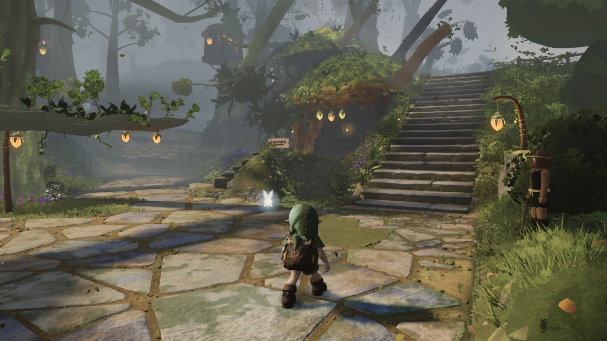
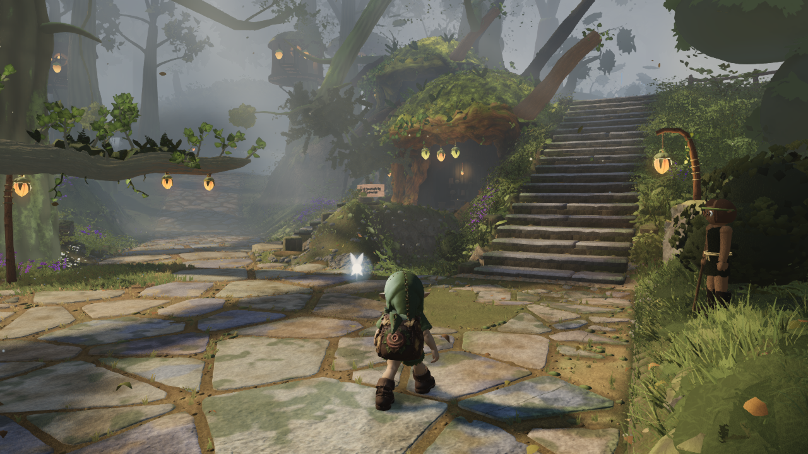
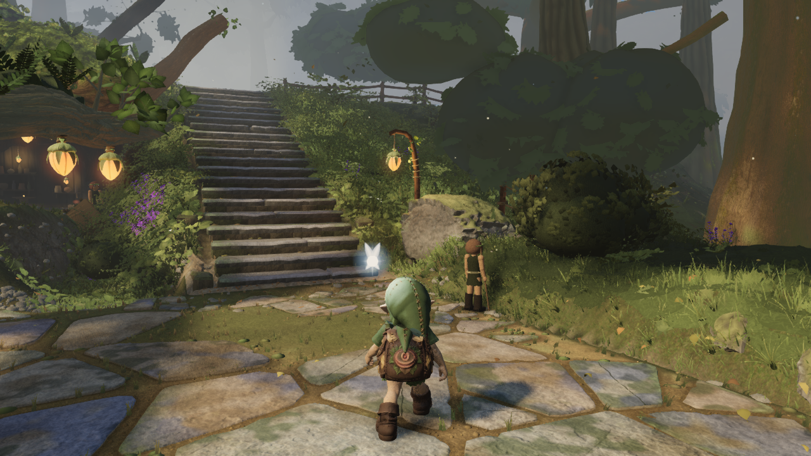
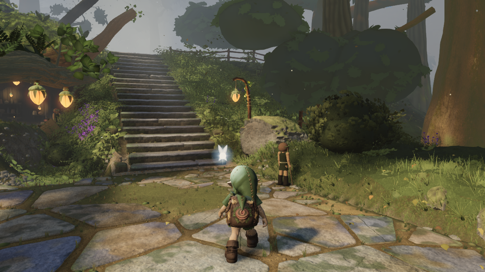
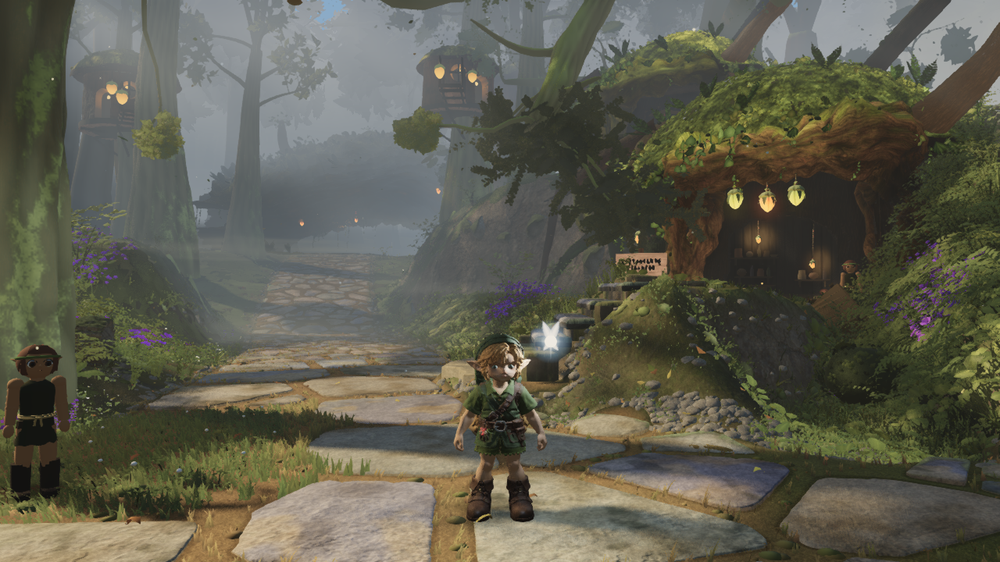
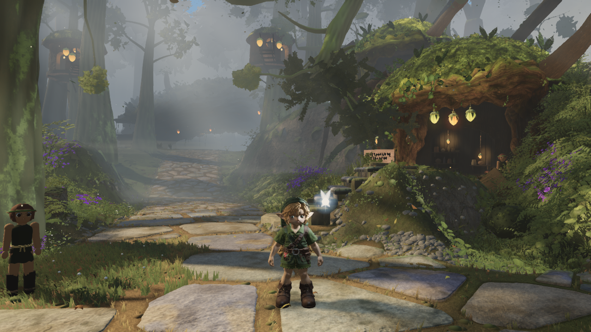
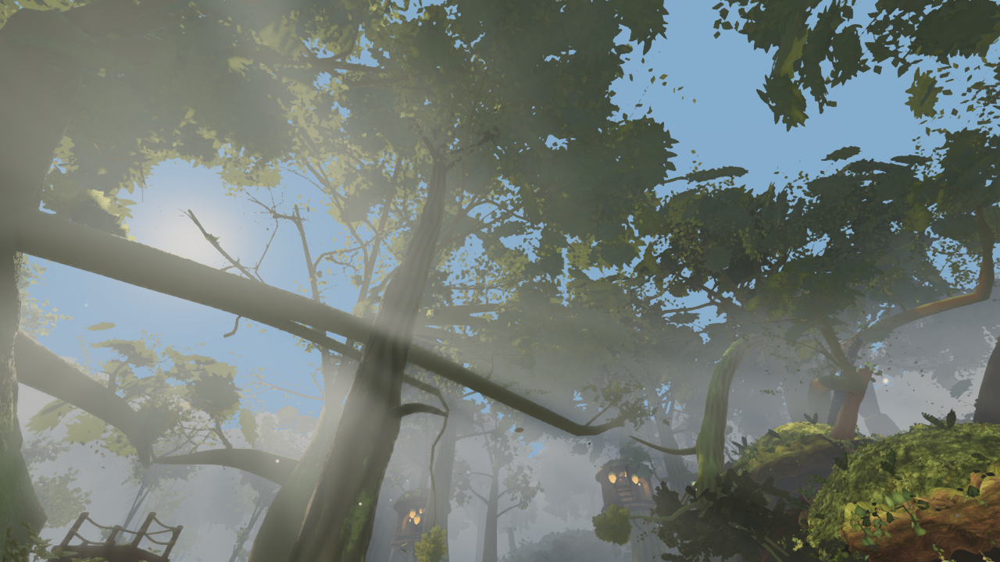
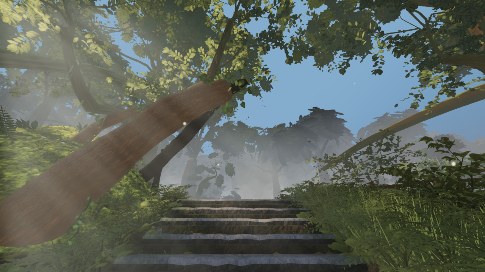
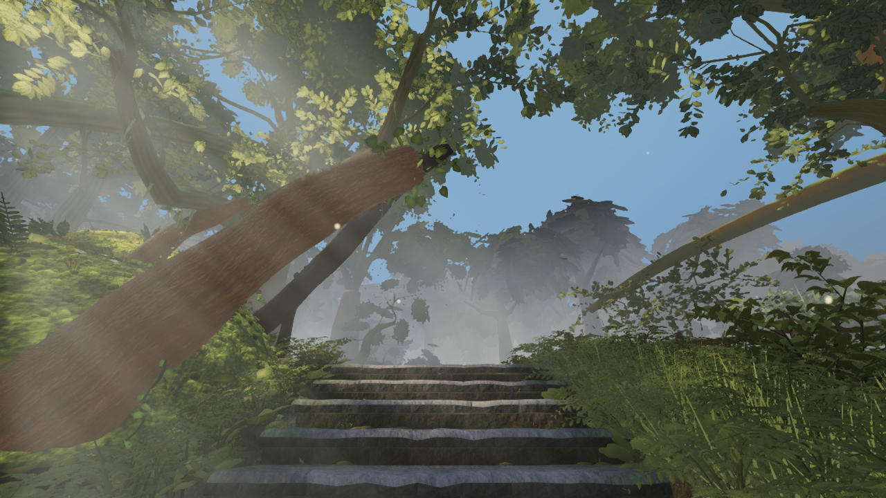

# Shafts in oblique forest views — 19 September

The screen-fan angular gate previously faded from 81 to61 degrees off the sun. It therefore entirely suppressed that part of the shafts in stair/side/back views. Widening the smooth angular fade to170–75degrees restores subtle beam separation without raising global exposure, haze density, ray intensity, or changing sun direction, canopy geometry, shadow maps or the carved columns. The existing screen-space fan is an artistic approximation; this is not a new physical scattering model.

Native six-view comparisons use identical camera/time/resolution and unchanged draw/triangle counts. Reference SSIM deltas: A −0.0005, B +0.0016, C +0.0010, D +0.0001, E +0.0039, F +0.0021. These small metric changes do not establish visual acceptance. Independent review and CI are required. A separate upward view and45matching stair-camera poses check the free-camera appearance at fixed simulation time; they are not a gameplay animation or FPS benchmark.

| Retained angular gate | Broader fade |
| --- | --- |
|  |  |
|  |  |
|  |  |
|  |  |
|  |  |

The first probe at18:25 used a tuple in `__ATMO_SETTINGS__`, whose renderer accepts only numeric/boolean values. That `facing` variant was ignored and is excluded as evidence. The actual comparison is the rebuilt source change recorded in18:32/18:36`source.diff`; the18:42baseline explicitly restores81/61. The capture helper now rejects unsupported postfx value types before launching Chrome. Its deliberate failure on `settings.json` is the regression check for this mistake. Doubling column gain alone in the original probe was visually insufficient and was not retained.

`compare.mjs` checks the six matching cameras and costs plus all45camera poses, then reports reference metrics and selected upward sample deltas. `full-review.json` and `upward-baseline.json` reproduce the captures with the corresponding source defaults. Full raw camera sequences remain local; manifests record all45PNG hashes, the committed videos contain every sample, and start/middle/end PNGs remain available for direct inspection. Source comments were updated after the first capture; executable change is only the facing pair.

The lantern halo fix is already integrated through PR16. This shaft pass is separate and leaves the character asset24591126 untouched. Owner-fable's overhead roof is under development in PR17 and is not included in these images.
