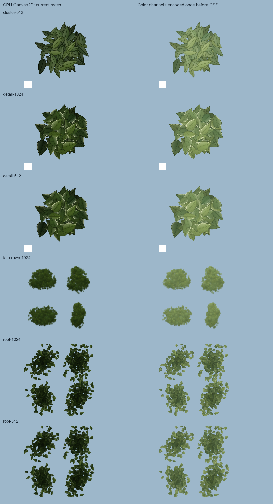

# Atlas color recovery and environment attribution

Source candidate **181986ba** recovers the exact four-helper correction from **d7516294** on
world **5f587c7f**. The matched native pair passes technical checks and supports this bounded
color correction. Independent image review accepts the same limited scope in [review-atlas.md](review-atlas.md).

The current world includes Fable's source-only import of PR25's floor moss and PR26's stair
timber winding fix (`27c2e3c8`, acknowledged in `5f587c7f`). PR25 remains open, but both of its
gauntlet CI jobs completed successfully at 18:09:09 and 18:11:49 UTC. That is the PR25 result,
not a claim that a new integrated world take has sealed. No ledger entries are changed here.

## Exact source scope

Three private brush helpers in `src/world/trees/leaf-cluster-texture.ts` and one in
`src/world/canopy/atlas.ts` serialize `Color` into Canvas CSS. The old helpers emit linear
components directly as CSS bytes, then tag the resulting color textures as sRGB. That applies
the decoding curve twice. The restored helpers explicitly request sRGB through `getStyle` or
`getRGB` before writing CSS. Three.js documents its linear working components and output color
space arguments; CSS `rgb()`/`rgba()` denotes sRGB. [Three.js Color documentation](https://threejs.org/docs/pages/Color.html),
[MDN rgb() documentation](https://developer.mozilla.org/en-US/docs/Web/CSS/Reference/Values/color_value/rgb).

This is precisely the old source patch, 16 additions / 4 removals; both commits have stable
patch ID `c425cd75f7fe5792d71c13e06d799dafd42734cf` (recorded in `source-patch-identity.json`). Copying the old complete
files would also restore an unrelated far-crown silhouette version; that is excluded. Every
statement outside the four helper declarations stays byte-identical. Geometry, alpha, palette,
lighting, shader code, placements and LOD rules are unchanged.

Callers on baseline `5f587c7f`:

| Atlas helper | Baseline source line | Caller |
| --- | --- | --- |
| `createLeafClusterTexture` brush | trees/leaf-cluster-texture.ts:34 | trees/materials.ts:1297 |
| `createLeafClusterDetail` brush | trees/leaf-cluster-texture.ts:141 | trees/materials.ts:1299 |
| `createFarCrownAtlas` brush | trees/leaf-cluster-texture.ts:413 | trees/distant.ts:333 |
| `createRoofAtlas` brush | canopy/atlas.ts:61 | canopy/index.ts:129 |

No new texture, material, mesh, draw, triangle or per-frame work is introduced. Three reusable
scratch Color objects are allocated while authoring textures at startup.

## CPU evidence

`npm run typecheck` and `npm run build` pass. The existing test from `d7516294`,
`art/environment/astra-distance/atlas-encoding-check.mjs`, was reused unchanged against the
actual source candidate and baseline `5f587c7f`. No duplicate test suite was written.

All six production cases exactly match an independent sRGB conversion oracle, repeat
deterministically, and retain exact alpha, auxiliary normal/depth data, texture dimensions and
sampling settings. [cpu-report.json](cpu-report.json) and [cpu-provenance.json](cpu-provenance.json)
record the original test hash and its inherited legacy fields, which are not used as current
world brightness claims.

| Texture | Sampled linear luma before | Corrected | Ratio |
| --- | ---: | ---: | ---: |
| Cluster 512 | 0.06501 | 0.22877 | 3.52× |
| Near detail 1024 | 0.06847 | 0.22778 | 3.33× |
| Near detail 512 | 0.06740 | 0.22710 | 3.37× |
| Far crown 1024 | 0.03780 | 0.20412 | 5.40× |
| Roof 1024 | 0.03244 | 0.16246 | 5.01× |
| Roof 512 | 0.03196 | 0.16132 | 5.05× |

These are texture data, not scene-image brightness ratios. The existing near-detail shader
clamp limits its mean response to about +2.54% for the 1024 near atlas. The untouched flat-core
path replaces atlas RGB and cannot be fixed by this patch.

## Native comparison

`freeze-build.mjs` records every file hash in immutable before/after build directories. The
before bundle is `index-BOcDijDl.js`, after is `index-BmvSROdP.js`; all public asset hashes match.
`capture-pair.mjs` reuses the earlier moss capture helper with eleven declared view entries: A–F,
W05 floor, sky opening, near crown, and the previous 119/121 m diagnostic poses. The latter
names refer to probe placement, not an assertion that every visible tree is at that distance.
There are ten distinct poses: B and E intentionally share the same held camera in
`layout.ts:578–580`, and their raw PNGs are identical within each build.

Native D3D11 is required and software renderers are rejected. Simulation time is 12.6 s,
1280×720, high quality, pixel ratio 1, current world lighting defaults. Both builds receive the
same sequence and fourteen zero-delta settling frames per pose. The comparison verifies PNG
hashes, camera, lighting, browser, renderer and public assets, plus equal draw/triangle counts.
Every capture uses the shared `capslot.mjs` with `CAPSLOT_STALE_MIN=Infinity` and owner
`astra-world-resume`. No process is killed and no lock is reclaimed.

Both builds completed all eleven entries, with no reported shader/browser errors and no audit
system failures. Native slot session49459 released cleanly. All camera, lighting, browser,
renderer and original PNG hash assertions pass. Draws and triangles match in every pair;
A is the largest at **8,773,265 triangles / 442 draws**, below9M. W05 is pixel-identical.

| View | Display luminance before → after | Pixels changed >3/255 | Reference SSIM delta |
| --- | --- | ---: | ---: |
| A | .36810 → .36827 | 0.24% | −.0001 |
| B | .36491 → .36521 | 0.51% | −.0006 |
| C | .34573 → .34646 | 1.63% | −.0023 |
| D | .36563 → .36598 | 0.36% | −.0013 |
| E (B hold) | .36491 → .36521 | 0.51% | −.0005 |
| F | .32523 → .32543 | 0.33% | −.0004 |
| W05 floor | .46955 → .46955 | 0.00% | — |
| Sky opening | .43712 → .44237 | 19.76% | — |
| Near crown | .26128 → .26310 | 6.94% | — |
| 119 m probe | .23929 → .30846 | 61.24% | — |
| 121 m probe | .24139 → .31064 | 61.10% | — |

The two high distant views gain visible olive foliage and clearer clump separation instead
of crushed dark faces. Shaded interiors remain dark; sky and ground keep their read. Existing
crossed card planes and soft atlas lobes remain conspicuous, so this is not a distant-geometry
quality approval. Sky-opening gains modest green variation, and the physical near leaves,
bark and hero compositions retain their existing read. Existing blue fringes in hazed distant
crowns and the naked bank cores remain. No new overexposed or flat bright patch was observed.
The small reference-metric losses are disclosed rather than used to override this image read.

[Interactive raw-image comparison](compare.html) · [Exact comparison data](native-pair/comparison.json).

## Separate remaining geometry defect

The most conspicuous unfinished canopy in the eight-view survey is the broad smooth bank
mass: F approximately x580–1135/y0–315 and C x0–320/y0–300 at 1280×720. Exact undeformed CPU
hits identify opaque `giants-authored-leaves-stair-bank-giant` cores:

| View / pixel | Core group | Approximate world hit |
| --- | ---: | --- |
| F (840,205) | 24 | (9.471, 3.049, 4.036) |
| F (990,159) | 25 | (9.056, 3.507, 5.782) |
| F (667,70) | 26 | (10.065, 5.066, 1.625) |
| C (160,133) | 24 | (9.967, 3.711, 2.600) |
| A (1095,29) | 26 | (9.929, 5.302, 0.988) |

The source is `trees/index.ts` `CANOPY_BOUGHS`, bank lobes at baseline lines848–862 and887,
each explicitly `flat:true, core:0.97`; `trees/giant.ts` builds a closed smooth core. The material
uses a constant for flat atlas RGB (`materials.ts:215`, `:1354`, `LEAF_FLAT_MAP_LUM` at839).
This is naked coarse geometry with intentional flat treatment, not a color-encoding failure,
normal inversion or the distant-tree atlas. The ray test omits GPU wind; these large opaque
interior hits are robust, while alpha-card attribution retains explicit limitations.

All five native flat-core sample pixels are exact before/after. The ordinary CPU-card candidates
are not promoted to visible improvement claims: F(252,42) changes only RGB[104,112,115] →
[104,113,115], and C(837,208) stays [62,70,39]. The actual high distant images establish the
rendered atlas effect. [Independent CPU attribution](audit-trees-current.md) includes source,
opaque alpha coverage, ray/LOD details, and the distinction between these old-image camera
inputs and the current native pair.

Targeted handoff to Fable: evaluate those five bank cores as one bounded botanical-surface
lane, preserving their authored seats, extents, corridor and shadow flags. Judge actual leaf
depth and edge breakup in F/C and a close player view. A metric tuned to smooth reference
windows must not be treated as visual proof. No bank geometry is edited here.

## Ownership and target audit

The ten supplied concepts are catalogued under `reference/owner-concepts/README.md`.
Environment comparisons use the village/light/path/house/foliage/scale/composition targets
(01–08), especially 01 and05; 09/10 are character/equipment references. All remain comparison
material. The exact gameplay composition is still measured against `reference/frames/`.

Current dated branch evidence, rather than claims that all agents are simultaneously live:

- Fable world `5f587c7f`, commit 18:04 UTC: PR25/26 source imports.
- Fable-2 `5123c499`, 18:02 UTC: V16 seam-tone hypothesis reverted; dark-feature count is next.
- Fable-3 `72e6ee75`, 17:55 UTC: hero house hearth detail, separate pending branch.
- Fable-5 `1efcea2b`, 17:52 UTC: positive review of plateau-roof v1.
- Fable-4 `a8c545ba`, 17:46 UTC, source `f8639ca2`: plateau-roof v4 awaiting integration,
  overhead blue23.1→9.6%; A–E essentially unchanged and F0.09%. Do not duplicate that sky lane.

Some prose timestamps in the Fable-4 log are later than its Git commit time; the commit times
above are the reliable activity evidence. No assertion is made about all five agents being
currently running. Main Fable log still reports blocked internal vegetation/LOD account lanes.

The current bark mean is already correctly linear (`BARK_DETAIL_MEAN=0.254`, prior correction
54196e0b). The current brown-bark floor and Fable-4's head review supersede the old held bark
trial. Sky uses scene-linear shader colors; no separate conversion/culling fault was found.
The old bark and pebble proposals remain held. Remote shared claims were expired when checked;
ownership was not inferred to be released. This branch claims only W10/W13 for the four helpers.
