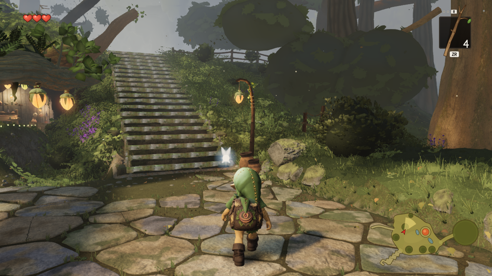
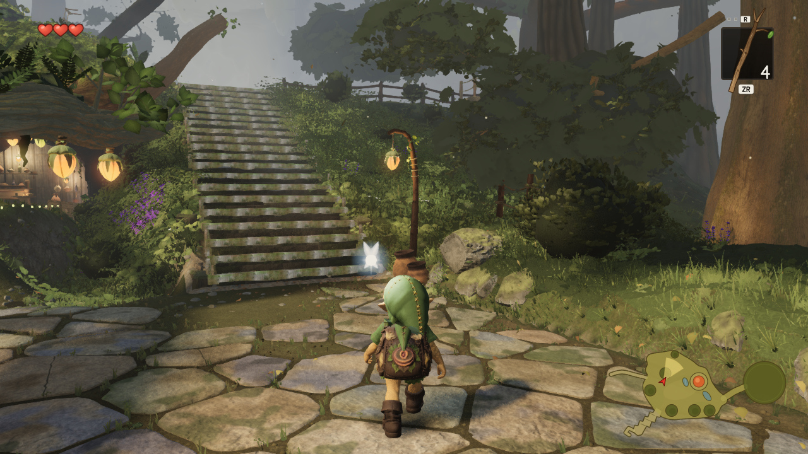
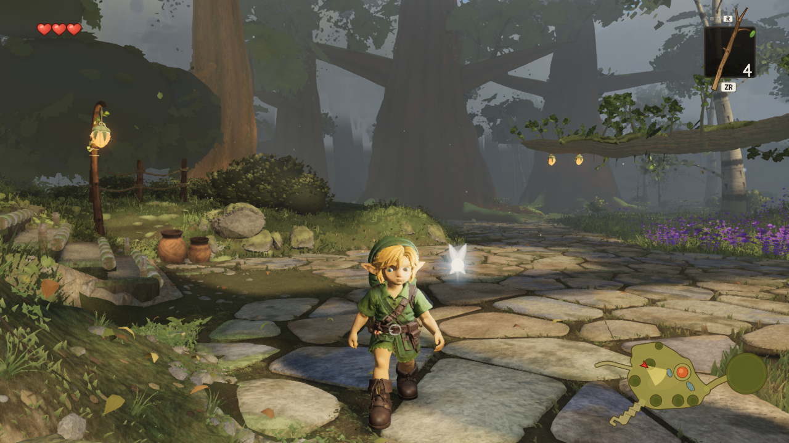
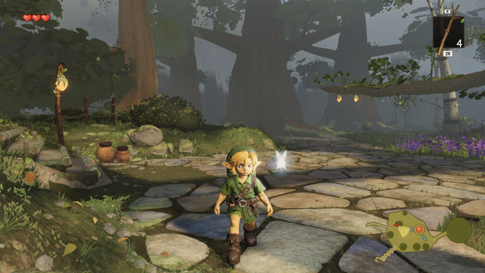

# Three bank crowns: recessed cores and layered foliage

The three authored bank crowns at groups 24/25/26 previously read as large smooth
opaque ovals in F and C. Source **57eea8c0ec77880ef4b3ae6cba51503999600e65**, based on
canonical **0963c09d**, recesses those cores to 60% radius and reuses the existing
near-canopy branches and cupped leaves to break up their silhouettes. Author,
environment reviewer and root independently accept the four raw images as a
bounded improvement. Dark flat leaf patches and separate distant crossed-card
crowns remain visible defects.

Only `trees/giant.ts`, `trees/index.ts` and `trees/nearCanopy.ts` are in the source
commit. It selects exactly the three authored records, retains their centers,
no-shadow/corridor policy and original conservative culling bounds, and keeps the
three reused near parts visible without folding the recessed far cores. Other
near records retain their existing behavior. No production trial flag, new texture
or material adjustment is delivered. Geometry is original, using the existing
botanical writer; no external assets were added.

## Raw matched images

High, 1280×720, DPR 1, simulation time 12.6. Each pair uses identical cameras,
lighting, public inputs and tree LOD decisions. Unedited native AMD Radeon 780M /
ANGLE D3D11 screenshots, Chrome 153.0.8010.52.

| View | Before | After |
| --- | --- | --- |
| F: overhead and right bank |  |  |
| C: left bank |  |  |

In F, the largest smooth outlines around x560–790/y0–140 and x700–1100/y80–290 are
replaced by layered leaves, branches and gaps. C's left bank around x0–350/y75–285
has the same improvement. The route, fence and lanterns remain readable. The cores
are recessed, not deleted; retained dark patches are explicitly unfinished.

## Measured cost and limits

| Saved view | Calls before → after | Triangles before → after | Resident geometries | Programs | Textures |
| --- | ---: | ---: | ---: | ---: | ---: |
| F_canopy | 407 → 410 | 8,090,816 → 8,156,256 | 314 → 317 | 100 → 101 | 91 → 91 |
| C_lookback | 341 → 344 | 7,053,338 → 7,118,778 | 353 → 356 | 100 → 101 | 91 → 91 |

Both views add **65,440 triangles, 3 calls, 3 resident geometries and 1 program;
0 textures**, or 0.81% of F's prior triangle submission. Reusing mesh objects does
not make rendered calls free: these three parts were previously hidden in F/C.
Their 7,100 leaves account for 56,800 triangles; wood adds 8,640. Combined attribute
and index footprint: **4,966,080 bytes**. No FPS claim is made.

Conservative visibility bounds remain exact, but the actual silhouette contracts
on some axes. Group24's new near-geometry top is 4.650686m versus the old envelope's
4.967937m. Including the retained far fringe, its complete static top is 4.690058m.
This is an accepted art change, not a claim of identical physical extrema.

## Source and invariant evidence

- [Final-source parity](delivery-proof.json): final code after comment removal
  equals the reviewed true branch. A complete CPU tree rebuild matches all 564
  geometry records, 426 near parts, 528 scene mesh records and all placement hashes.
  Exactly three authored selectors; no production trial flag.
- [Original bounded proof](cpu-summary.json): only 1,479 old core positions change,
  at scale 0.60 (maximum float32 error 6.87e-7m). Existing non-position attributes
  and indices remain exact, as do 560 unrelated geometry records, 423 other near
  parts and all 31 white-bark records. Whole-leaf containment, branch attachment,
  authored tone and deterministic chunked rebuild checks pass. Petiole-to-parent
  centerline error is at most about 2.77mm; this is not an exact bark-surface contact claim.
- [RNG and complete floor proof](streams-and-floor.json): 1,034 unrelated streams
  and 14,052,615 draws exact. Only the selected near-lobe streams and their parent
  forks change. Analytic wind bounds use actual attributes and current 0.85 wind
  strength, 0.97 tree stiffness and 0.3 flex, covering every phase. Group26's new
  foliage minimum is 4.829414m; including its retained far fringe the minimum is
  4.787514m, above the authored 4.75m floor.
- [Native receipt check](native-report.json): exact PNG hashes, camera/light/time,
  hardscape audit, distant LOD/placement and resource deltas. No page, shader or
  system errors. Raw manifests retain every value, compactly serialized. This
  is local review evidence, not a gauntlet take or Phase1 exit.

The 9.6MB original raw CPU report remains local; its SHA-256 is in the compact
summary. The runnable final check needs neither that file nor the unpublished
trial Git object. It reads the exact Git ref supplied, not uncommitted files.
The optional third argument selects a separate JSON output path. The additional
[root integration receipt](root-integration-proof.json) records a real PASS on
root's source004ef8f4 after its canonical tree-context imports; the original
57eea8c0 delivery receipt remains separate.

```sh
npm ci
node art/environment/astra-bank-layered/check-delivery.mjs 57eea8c0
node art/environment/astra-bank-layered/compare-native.mjs
npm run typecheck
npm run build
```

`check-delivery.mjs` verifies normalized source hashes against
[reviewed-geometry.json](reviewed-geometry.json), then invokes its bounded full-tree
worker and reruns the selected geometry invariants. `check-geometry.mjs` and
`inspect-layered.mjs` are its existing CPU-only implementation. No browser or GPU
is launched. The recorded direct RNG/far-floor supplement belongs to the same
proven geometry output.

## Frozen native provenance and coordination

These are original immutable trial receipts, not a fresh final-merge render.
Both builds use HEAD **79b7fe25**, geometry **94afa311**, source base **445fa453**
and separate accepted warmth **0858f39f**. Only the old build flag differs: 0/1.
Later canonical source has unrelated arch-rim updates; final-source parity proves
the same reviewed tree geometry on 0963c09d. Warmth is common to both images and
absent from the geometry source commit; its handoff is [PR28](https://github.com/Leonxlnx/zeldaremake/pull/28).

- Before bundle: `assets/index-CKTuEYEL.js`, SHA-256 `04a8a1e1585598b2b34db6eb0251faa7c02fec1f8f68577c4d90c68e46417ce4`.
- After bundle: `assets/index-w49WQtWO.js`, SHA-256 `860cf1fcef530fa8e8285902249106958bebdcd0908c2d808c1262cd133d8900`.
- Common public digest: `ee9be37e731df7a655cbaf22faa3d5a06a3f2bc7607312883b0197d0c8b02524`.
- Full build/source receipts: [before](native-pair/before-build.json), [after](native-pair/after-build.json).

`capture-pair.mjs` retains the original capture procedure. Repeating it requires
the immutable builds at their recorded local paths, a fresh output directory with
their manifests, native GPU settings and the existing shared capslot with
`CAPSLOT_STALE_MIN=Infinity`. It refuses to overwrite complete receipts. Published
PNG/receipt validation is portable and needs none of those builds. The GPU slot
was released after this single pair. No new capture was needed for proven
true-branch flag removal.

Fable assigned these groups in comment 5766645274. The concrete change from
retaining core mass to recessing it was posted in
[comment 5767824932](https://github.com/Leonxlnx/zeldaremake/pull/2#issuecomment-5767824932).
No acknowledgment of that scope update has been received as of publication.
This PR is offered for review and source-only import; it has not been merged.
