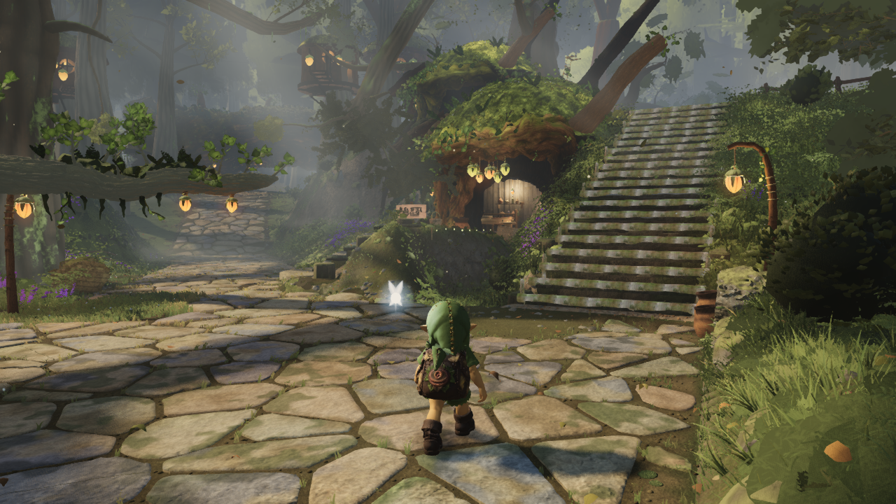
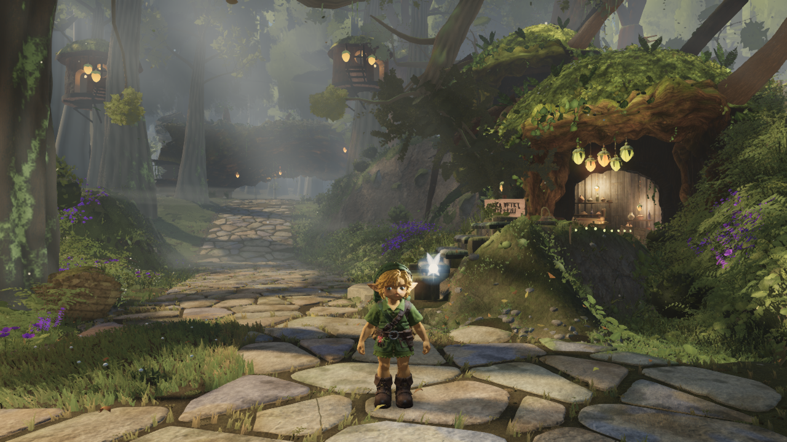
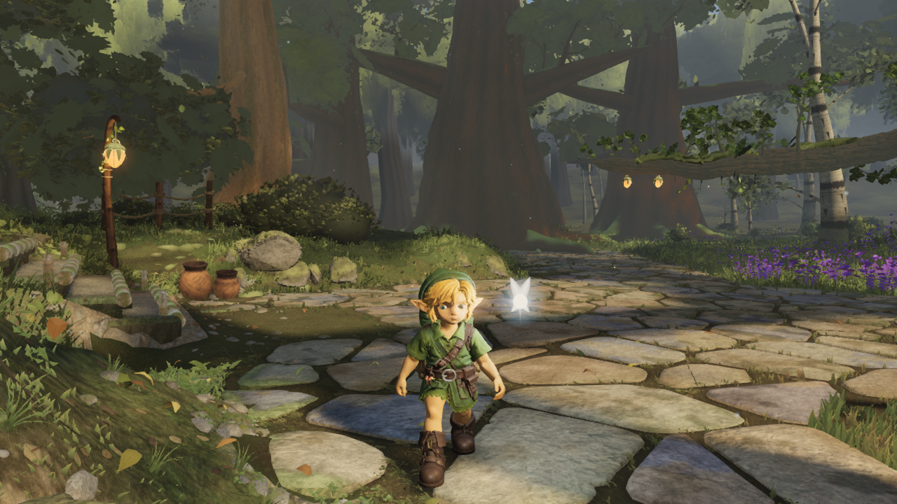
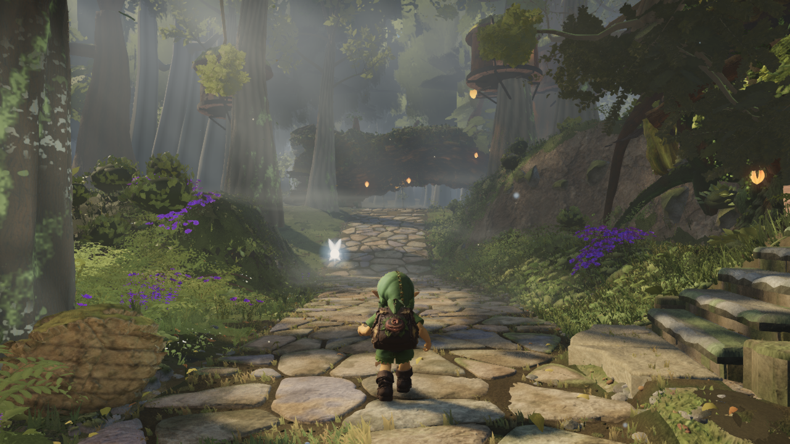
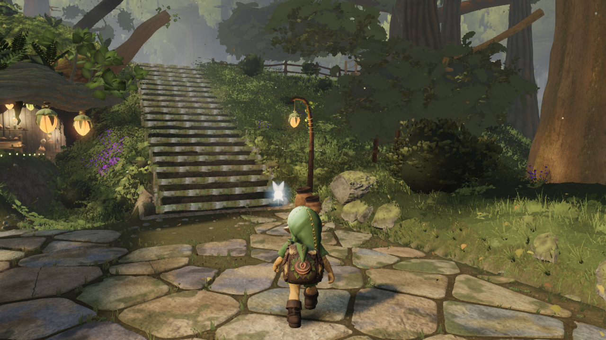

# Upper crown detail within the existing render budget

Source `105a61d545674132e6400366b96a84d37046c08b` combines the reviewed upper-canopy admission fix with the three far-plant packing changes. Detailed giant crowns now follow actual camera distance to their envelope. Fixed viewpoints no longer permanently restrict their detail. Missing detailed geometry retains its far foliage while the existing pool builds it.

The vegetation change avoids submitting variants that the shader collapses to invisible triangles. It preserves the selected plants, wind, materials, distance ranges and shadows. The combined A/F PNGs are **byte-identical** to the upper-canopy candidate alone, with 139,540 / 119,470 fewer submitted triangles. No fog, render-distance, camera or rubric changes make room for this detail.

## All six native fixed views

| View | Triangles | Draw calls |
| --- | ---: | ---: |
| A_stairs | 8,867,001 | 479 |
| B_house | 8,068,261 | 466 |
| C_lookback | 7,112,969 | 379 |
| D_log | 8,253,079 | 434 |
| E_ground | 8,068,261 | 466 |
| F_canopy | 8,312,047 | 449 |

All six satisfy the existing 9 M triangle / 700 draw-call limits at high quality. Typecheck/build pass; all native error arrays are empty. This verifies the fixed-view submission limits, not an FPS target or complete Phase 1 exit. The scene still needs further canopy/material refinement, and the separate distant real-leaf prototype is not included.

| Stairs | House |
| --- | --- |
|  |  |
| Look back | Log arch |
|  |  |
| House hold | Canopy |
|  |  |

Native GPU captures use 1280 x 720, pixel ratio 1, high quality, time 12.6 and the unchanged named viewpoints. No material or scene overrides are set. [Settings](settings.json) and [manifest](native/manifest.json) pin the source, bundle, camera transforms and image hashes. `native/source.diff` is empty. Bundle: `index-BeSuDGjf.js`. Character remains accepted `7f406e40`.

The [isolated canopy review](../astra-upper-canopy/REVIEW.md) shows the modest visible improvement, exact cold/warm repeatability, 16 passing regressions and limitations. Its standalone over-budget status is resolved by this measured integration. The [plant packing proof](../astra-far-packing/README.md) shows the separate zero-pixel-change comparison and existing selection tests. Large foreground leaves and some flat crown masses remain; these captures do not claim that every tree-quality problem is solved.

```text
npm run typecheck
npm run build
node art/environment/owner-fable-canopy/tools/capslot.mjs astra-six-views -- node art/environment/astra-distance-crown-clarity/native-capture.mjs art/environment/astra-canopy-packed-integration/settings.json
```
