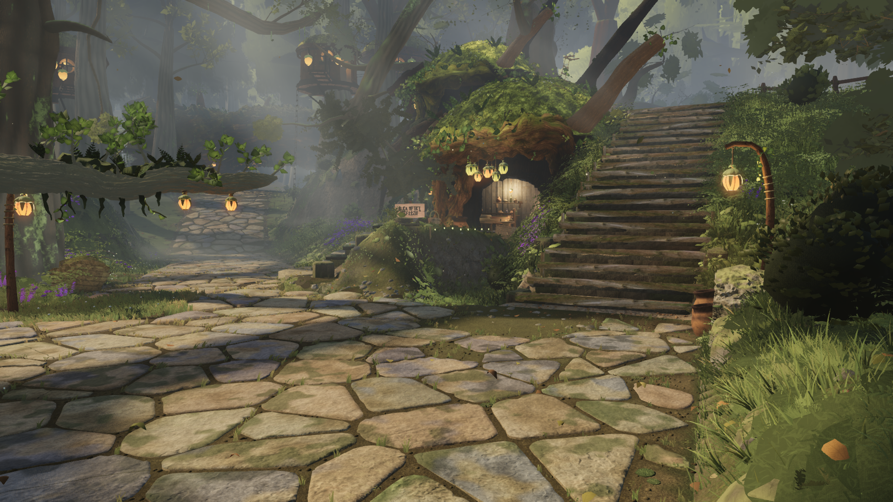

# Kokiri Forest — cinematic checkpoint

[Download the cinematic MP4](Kokiri-Forest-Cinematic-1080p.mp4) · [Frozen game source](https://github.com/Leonxlnx/zeldaremake/tree/cinematic-2026-09-23) · [Checkpoint PR #33](https://github.com/Leonxlnx/zeldaremake/pull/33)

**30 seconds · 1920×1080 · 30 fps · H.264/AAC · 82,500,543 bytes.**
Five shots: village arrival, canopy, house, Link walking/running, then the forest path.
The soundtrack combines the game's original procedural forest ambience and woodwind/harp music.
World UI and NPCs are hidden; Link's insert uses actual player input.

The recorded game is source `e599075ff78aa39954375c3ecdb7a74ab46aca3c`, tagged
`cinematic-2026-09-23` and merged into main as `c5d4aec9` with the same tree.
No runtime changes were made for this media delivery. Partner development continues separately.

The movie uses native renderer frames captured at fixed simulation steps. Its 30 fps is an
**output frame rate, not a measured real-time gameplay frame rate**. No upscaling, optical
interpolation, generated scenery or replacement frames were used. Editing consists of cuts,
a final one-second picture fade, and the separately rendered original game soundtrack.

The complete file passed independent CPU decode and format checks: 900 frames, exactly
30 seconds, H.264/yuv420p, AAC 48 kHz stereo. Fifteen encoded images spanning every cut,
the Link transitions and the final fade were visually inspected. This is sampled visual review,
not a claim of a complete human playback review. The encoded audio measures -21.61 LUFS
integrated and -5.89 dBTP after the final +3 dB mix gain.

SHA-256: `2ba1deb6dbcdd5f1dc88fef12796ffcab879ac0b443555770b03ba90dcccfd81`.

- [Cut and camera choices](CUT.md), [assembly and source hashes](delivery.json).
- [Independent MP4 verification](verification/verification.json), [ffprobe](verification/ffprobe.json), [full decode progress](verification/ffmpeg-full-decode-progress.txt).
- [World frame hashes and camera/timing checks](world/verified.json), [preflight](preflight/verified.json), [Link capture manifest](link/manifest.json).
- [Exact-source CI result](checkpoint/ci.json), [local gauntlet results](checkpoint/gate-exits.json), [anti-cheat](checkpoint/anti-cheat.txt).
- [Audio provenance](audio/provenance.json) and [soundtrack notes](audio/README.md).

The local frozen-build gauntlet passed 104 checks with zero failures; the existing score is
40/50 and Phase 1 is 35/42. This is a showcase checkpoint, not Phase 1 completion. Known
remaining issues include pronounced stair knee folding and some broad distant foliage
planes. Four moving house frames exceed 9M triangles by at most 1,408; all six fixed gauntlet
views remain below the current submission ceilings. The Link manifest retains one aborted
model request; the accepted model loaded with HTTP 200, the expected hash,
and no recorded runtime errors.

The 2.19 GB of original world PNGs and intermediate Link MP4 remain in the capture workspace;
their per-frame/source hashes are published here. `delivery.json` records the exact FFmpeg
arguments used, with paths relative to that workspace. These receipts preserve the actual
capture-machine paths; they are not additional game dependencies.
