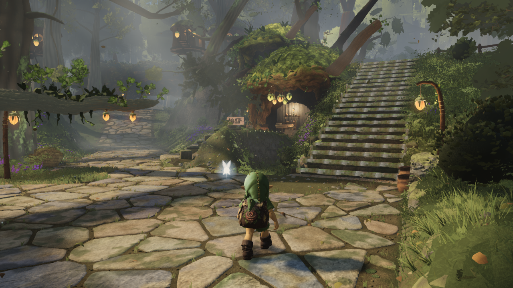
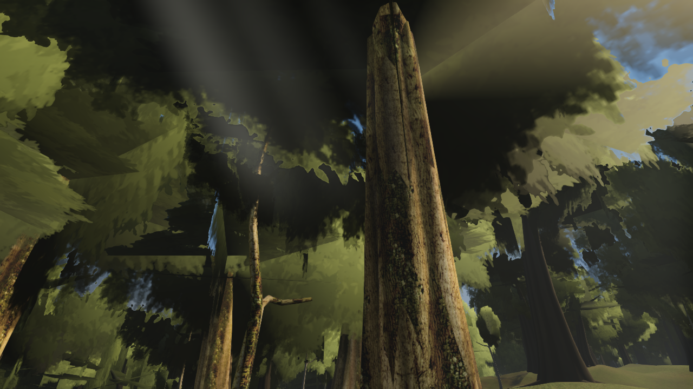

# Integrated crown and atmosphere clarity

Source `9cecec3a` combines the accepted leaf-shaped crown atlas (`886c531c`) with reduced distance haze and less aggressive distant shading (`c241593e`). Build `index-DDctkRbA.js` passed typecheck/build. These are native game captures, with no image edits or diagnostic material overrides.

The distant trunks and crowns behind the stairs are more legible. Low mist, local light shafts and the near ground remain. The reconstructed outer-forest view confirms sharper foliage margins, but large crossed crown planes still require the separate close-geometry work; this is not a completed forest-quality claim.

Both views use 1280×720, quality high and simulation time 12.6. No browser errors. A submits 8,741,301 triangles / 450 draws; the reconstructed view submits 2,039,386 / 131. These counts match the isolated baselines. The character in these captures is still the prior `4dcf89c5` asset, before the independent shoulder-strap fix.

The original user screenshot camera was unavailable; the second view is explicitly reconstructed. Settings and raw image hashes are in `settings.json` and `native/manifest.json`. The frozen bundle SHA-256 is `911e47bf7253f445e447fdeb4388d0a64bc27128447131a1fdec4fc547f8cca6`.

- [Five isolated crown comparisons](../astra-distance-crown-clarity/README.md)
- [Four isolated atmosphere comparisons](../astra-atmosphere-clarity/REVIEW.md)

The combined capture reuses `art/environment/astra-distance-crown-clarity/native-capture.mjs` and the shared `capslot.mjs` wrapper. Its two-view capture completed and released the GPU slot. No FPS improvement is claimed.
