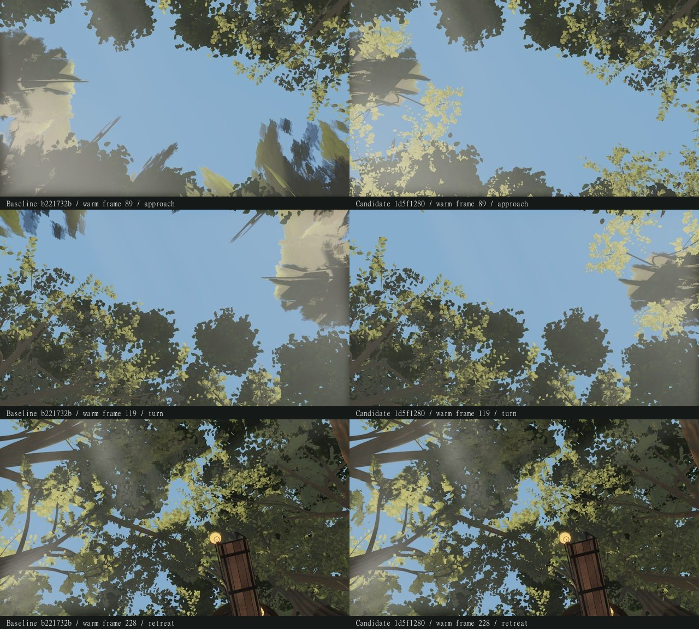

**Frozen combined-crown receipt — 2026-09-23. Adoption held.**

The candidate exceeds the shared 64 MiB canopy residency cap on two recorded retreat frames.
The baseline's recorded snapshots stay below the cap. This receipt preserves the failed candidate and its evidence;
any source fix and subsequent validation belong to a separate worktree.

Baseline: `b221732b64724ee9c3a2b4c81e757ed605a41efb`, bundle `index-DwReWLkW.js`.
Candidate: `1d5f12801b986ed933871a13551f0d6ade6767e3`, bundle `index-BM1z1geb.js`.
Full bundle, helper, module, manifest and trace digests are in [comparison.json](comparison.json).

The candidate imports only the `6231cffb..1f3b51fd` changes to
`src/world/trees/distant.ts`, `index.ts` and `nearCanopy.ts` onto the accepted baseline.
The sole merge conflict was the Three.js import list: retain the accepted removal of
`PerspectiveCamera`, add `DynamicDrawUsage` and `Vector4`. The accepted 105 additional
upper-canopy parts, deferred construction/admission, support packing, 64 MiB small pool,
`slimTrunks`, character asset and global/shadow settings are retained. Typecheck, build and
all 19 existing canopy-pool/leaf-colour tests passed. No historical claim or evidence was imported.

The two fresh pages run the route **before** their eight fixed captures. Each route has
255 first-pass and 255 warm-pass frames at `dt=1/30`: approach, full turn, retreat, hold.
The frozen settings select `quality=high`, `pool=small`, 1280×720, HUD off; fixed captures use
time 12.6. Renderer on both pages:
`ANGLE (AMD, AMD Radeon 780M Graphics (0x00001900) Direct3D11 vs_5_0 ps_5_0, D3D11)`.

**Headless warmup is OFF:** these settings omit `warmup=1`, and `src/main.ts` skips warmup
by default under capture. Timings describe this capture profile, not demonstrated interactive
hitches or FPS. Boot-ready time includes browser startup and loading. Completed-render waits
include requestAnimationFrame, GPU readback, shader compilation and host scheduling.
The initial explicit route pose is separate from the following first/warm movement passes.

| Measurement, milliseconds | Baseline | Candidate |
| --- | ---: | ---: |
| Fresh page boot-ready | 186,634.6 | 167,320.0 |
| Initial explicit route pose | 1,036.0 | 1,819.3 |
| First completed-render wait, median / p95 / max | 66.2 / 82.8 / 5,576.4 | 64.8 / 81.0 / 3,968.0 |
| Warm completed-render wait, median / p95 / max | 59.8 / 78.5 / 88.0 | 64.3 / 78.0 / 370.3 |
| First tree update, median / p95 / max | 7.3 / 11.0 / 84.6 | 7.2 / 12.5 / 329.4 |
| Warm tree update, median / p95 / max | 6.3 / 8.9 / 15.1 | 6.5 / 10.0 / 302.5 |

Pool figures below include each pass-start snapshot. Counter changes exclude the initial route
pose, which itself performs 54 baseline versus 64 candidate synchronous canopy builds.
“Warm” still has pool churn; neither warm route is a fully resident control.

| Pass / source | Peak resident MiB | Peak pinned MiB | Builds / evictions / synchronous builds |
| --- | ---: | ---: | ---: |
| First / baseline | 63.999 | 30.721 | 115 / 116 / 0 |
| First / candidate | **67.853** | 52.330 | 99 / 93 / 2 |
| Warm / baseline | 63.989 | 30.721 | 75 / 75 / 0 |
| Warm / candidate | **68.740** | 52.284 | 86 / 85 / 2 |

The cap is 67,108,864 bytes. Candidate first frame **204** reaches **71,149,313 bytes**;
warm frame **201** reaches **72,079,235 bytes**. Each pass has one observed over-cap frame.
Pinned bytes remain below the cap, so these observations do not establish an unavoidable pinned
memory floor. Pre-route and post-pose snapshots, plus all settled fixed captures, are within the cap.
The largest warm candidate tree update is frame **228**, 302.5 ms, with a 370.3 ms completed wait.

All six fixed views **A–F have identical PNG bytes**, decoded pixels, draw calls and submitted
triangles. Each has zero close-crown slots. The candidate retains one extra shader program;
resident geometry counts differ with pool history, so this is not equality of all resource stats.

| Additional fixed view | Changed pixels | Mean channel error / 255 | Extra draws | Extra triangles |
| --- | ---: | ---: | ---: | ---: |
| `w19-spine-u` | 28.546% | 8.458 | 2 | 973,570 |
| `reconstructed-distant-up` | 64.013% | 33.078 | 4 | 882,741 |

Both additional poses use eight close slots. Pixel change is descriptive, not a visual acceptance
score. Across both routes, visible point lights stay at 19, total point lights at 24; there are
no paired light-count mismatches. Programs increase 90→100 before and 90→101 after during first
use, then remain at 100/101 during warm movement. Both renderer error lists are empty.



The contact sheet contains the warm endpoint (89), turn midpoint (119) and retreat (228),
baseline left and candidate right. It is a labelled, downscaled JPEG derived from the verified
raw route JPEGs; it is not a substitute for the raw images or motion. Broad pale planes remain
visible in these views. No new movie is included for this held candidate.
Contact SHA256: `2de47ffa123a0cdadcca17e5059b58f8fe2708b1f1a916f452653edbba82f937`.

Recheck from the worktree root:

```powershell
node art/environment/astra-distance-combined/compare.mjs --self-test
node art/environment/astra-distance-combined/compare.mjs before-settings.json after-settings.json
```

The second command writes [comparison.json](comparison.json) and deliberately exits nonzero
(Node exit code 2) for the measured cap failure. It checks frozen source/bundle identities,
served HTML entries, helper/module hashes, capture-time trace hashes, matched controls/cameras,
every fixed PNG and every scheduled warm JPEG, and every recorded pool observation.
Comparison SHA256: `0bf9551750a15dbb85374b6551a2e6c6411b509d05cf5d90f70dacee8f5d2351`.
The local `.gitattributes` preserves JSON bytes. The source, capture helpers, settings, traces
and raw captures remain unchanged; adoption is still held pending a separately tested fix.
