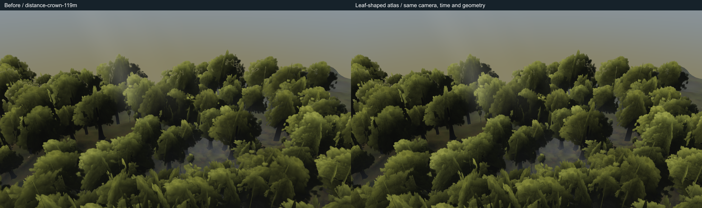

# Distant crown clarity — 2026-09-22

The owner's current preview screenshot shows large soft crown shapes above the player. This candidate changes one proven source of that softness: `createFarCrownAtlas` painted each clump with radial gradients and elliptical translucent dabs. Both distant-tree LODs sampled that same blurred source. The neighboring white-bark leaves use another geometry/material path.

Base: `664f3418570f51dae5fcc9c2babbd8eb5cd1d0f4`, the current motion preview. This restores the scoped leaf-shaped atlas painter reviewed as `6252deef` / `a9eccd15`, while retaining the newer accepted sRGB brush encoding. No other old branch changes are imported.

## Source and sampling

- Four cells remain in one 1024×1024 RGBA atlas. Per-cell source resolution is 512 pixels, with the same margins, UVs, original clump centres/radii and seeded draws.
- The replacement uses the existing cluster leaf outline as a CPU alpha stamp and draws the existing lit leaflet population as teardrop blades. It introduces leaf edges and gaps in the authored texture; there is no sharpening shader or noise overlay.
- Both LODs use `distant-crown`, trilinear mip filtering, linear magnification, anisotropy 4 and mip bias −0.5. These settings are unchanged. Generating more mip detail from the old atlas could not recover absent leaf shapes.
- The distant near/far threshold is **120 m × quality distance in XZ**. It ignores camera height; both sides retain crown cards. Placement is the 60–215 m radial ring plus authored depth rows. Submission uses actual transformed geometry bounds plus 4 m padding against the view frustum, with no new distance cull.
- Giant near-canopy geometry is a different path: 3D distance to lobe centre, 26/30 m on the large tier (22/26 on small), further reduced by authored hero-camera constraints; local centres above 25 m are excluded. Those gates, the 64-slot cap, flat cores and roof remain unchanged in this candidate.

For scale, an unscaled 19 m broad distant tree has a 7.98 m crown radius and a 22.34 m full card. At 720 pixels high / 60° vertical FOV, its front-facing card projects to approximately 697 / 233 / 116 pixels at 20 / 60 / 120 m optical depth. The atlas UV span is 486 texels: idealized mip levels before the −0.5 bias are −0.52 / 1.06 / 2.06. Thus a large nearby card already uses the base texture, where the old soft blobs were painted. Oblique cards and perspective change these estimates; native probes report actual triangle projections separately.

## CPU check

Run from this worktree:

```powershell
node art/environment/astra-distance-crown-clarity/atlas-cpu.mjs 664f3418
```

The bundled Canvas2D implementation runs the actual painters without WebGL or added dependencies. The check proves deterministic output, unchanged original random streams, unchanged ordinary/near painters and layout, and identical texture dimensions/filtering. It compares alpha coverage, footprint and covered display luminance through a simulated box-filter mip chain. This is CPU texture evidence, not a world render or exact GPU mip implementation.

At the base mip, enclosed gaps increase from 5 to 63 across the four cells. Alpha-tested coverage rises by 0.65–1.03 percentage points per cell; outer bounds move at most 1.96% of a cell. Covered luminance changes by at most 0.283% over the 512→16-pixel cell mip checks. Full metrics and the texture comparison are in `cpu/`.

## Cost and limits

No new triangles, draw calls, shader programs, texture dimensions or texture uploads. The same atlas uses approximately 5.33 MiB including mipmaps. The temporary 128-square stamp is CPU-only and its temporary Three texture is disposed before upload. Native fill cost may change slightly with coverage; equal submission counts alone do not prove equal GPU time.

Bundled CPU atlas generation measured 286 ms before / 585–587 ms after, an approximately 0.30 s one-time startup increase on this run. It is not a browser timing claim. Typecheck and production build pass; baseline bundle is `index-B1aAZhde.js`, candidate `index-BbCczJse.js`.

Planar card intersections, giant solid cores, roof coverage and atmospheric washout are separate remaining issues. At distances where leaf blades become subpixel, mipmaps must merge them to avoid shimmer. This patch improves the texture's available detail without promising individually resolved leaves at unlimited range.

## Native comparison

`native-capture.mjs` uses the existing capture API, 1280×720, quality high, simulation time 12.6 and 14 settling renders. `before-settings.json` selects a frozen baseline build; `after-settings.json` selects the candidate. The original screenshot camera was unavailable: `reconstructed-distant-up` is explicitly a new camera on an actual placed tree, accompanied by the established `w19-spine-u`, 119/121 m transition views and fixed F.

The diagnostic Three devtools hook observes the existing scene without changing production code, materials, geometry or the beauty render. CPU rays ignore shader wind and alpha rejection, so probes include source alpha and are not presented as perfect GPU picking. Their mip estimates are affine triangle estimates, not claims about the exact anisotropic sample level selected by the GPU.

Both captures completed on native Radeon 780M / D3D11 with no browser errors. `compare-native.mjs` verifies raw image hashes, camera, time, lighting and every reported render counter for all five pairs; all match. This is a local comparison, not a gauntlet exit claim.

| View | Triangles / draws, unchanged | Visible result |
| --- | --- | --- |
| reconstructed-distant-up | 2,039,386 / 131 | Smooth radial margins become leaf-shaped edges and gaps. Fixed crown ROI edge RMS rises 27.8%; display luma falls 0.0091. Large planar faces and dark interior regions remain visible. |
| w19-spine-u | 3,653,114 / 175 | Blurred shapes at the frame margins become ragged foliage. The oblique planes and bare twig spikes remain; central diagnostic rays hit sky. |
| distance-crown-119m | 194,640 / 62 | Sharper distant silhouettes and clump boundaries; upper-band edge RMS rises 20.9%, mean display luma +0.00088. |
| distance-crown-121m | 196,717 / 62 | The same improvement persists after the distant LOD switch; upper-band edge RMS +21.2%, luma +0.00089. |
| F_canopy | 7,994,522 / 406 | 0.194% of pixels change by more than two display levels; the nearby bank cores are outside this change. |

The upward view is aimed at the established 26 m stem target, but a **closer actual radial tree** dominates it. Alpha-covered CPU intersections at two upper-left samples hit `distant-0-near`, material `distant-crown`, atlas `procedural:far-crown`, at approximately 7 m. Its projected texture footprint is 0.52–0.98 texels/pixel in the inspected triangles: already base-level magnification, rather than lost detail from a coarse mip. The foreground trunk is also closer; this evidence does **not** claim that the entire frame is the 26 m target.

Read the raw PNGs and labelled pairs together with `native-comparison.json`. Edge energy is supporting evidence, not a quality score: direct image review shows the smaller leaf margins improve, while broad card interiors and overlapping planes still need a geometry-aware solution. The candidate is recommended as this bounded atlas improvement, not as completion of the owner's whole-forest clarity request.


