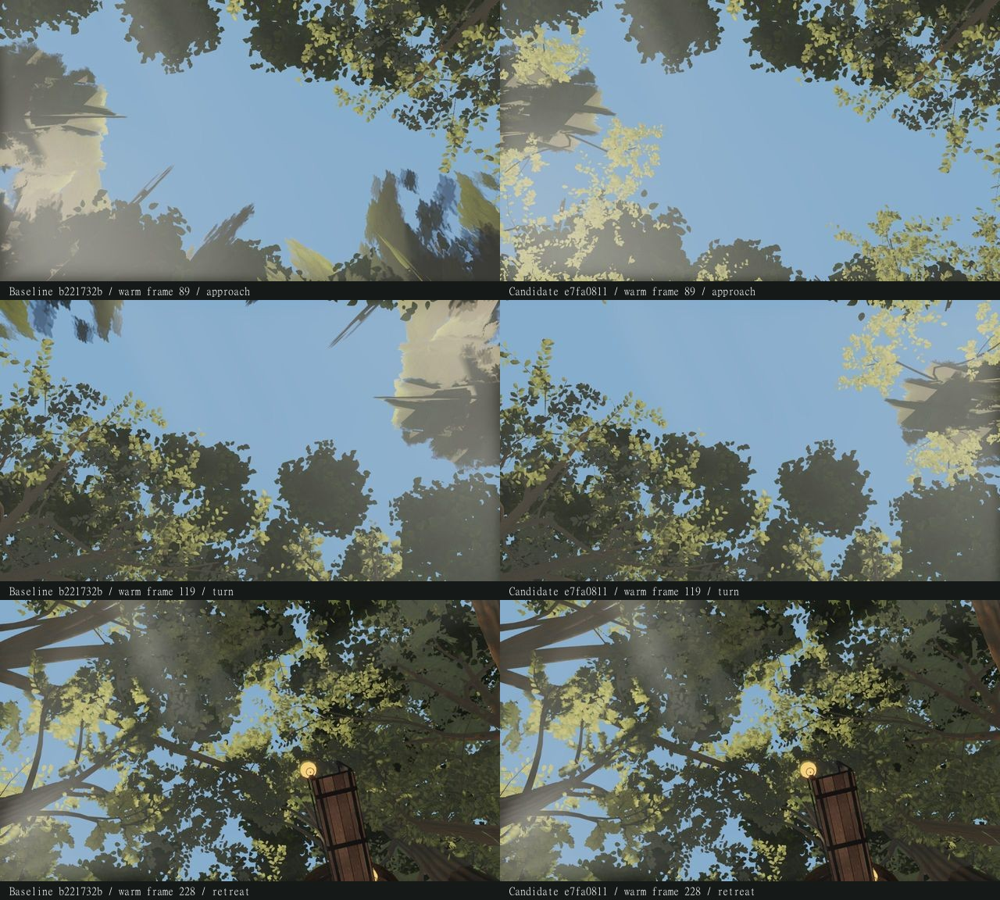

**Crown pool repair receipt — 2026-09-23. Source held pending coordinator judgment.**

The recorded 64 MiB route passes the pool bound and has **zero synchronous canopy builds in
both ordinary movement passes**. This is a bounded result for these captures, not a general
performance or visual-completion claim. The prior held `1d5f1280` capture remains preserved with
its two measured overflows and two synchronous canopy builds per movement pass.

Baseline: `b221732b64724ee9c3a2b4c81e757ed605a41efb`, bundle `index-DwReWLkW.js`.
Corrected candidate: `e7fa081152314b592bec147541944e9fbdbfd1f5`, bundle `index-Bq5genaK.js`.
The repair rechecks admission before each resumed pool chunk, lets fitting work proceed,
starts walking fades only when replacement geometry is resident, and protects resident
selections during synchronous resets. It keeps the **eight-slot limit**, 34 m prefetch and
existing geometry/materials. Accepted upper-canopy/deferred detail, packing, slim trunks,
medium shadows and 120 m distant switching are retained. Recorded source checks: 22 CPU tests,
typecheck/build and 97 anti-cheat checks passed; 86 inherited warnings remain disclosed.

This run reuses the earlier frozen baseline capture; it is not a simultaneous or randomized
GPU benchmark. Both pages use identical capture/route helper bytes, native AMD Radeon 780M
via ANGLE Direct3D11, 1280×720, high quality and `pool=small`. Headless warmup is **OFF**.
Boot/first-use measurements describe this capture profile, not demonstrated interactive
hitches or FPS. Completed-render waits include RAF, GPU readback, compilation and host scheduling.
The route precedes fixed captures: 255 first-pass frames, then 255 warm frames at `dt=1/30`.

| Pass / source | Peak resident MiB | Peak pinned MiB | Canopy builds / evictions / sync builds |
| --- | ---: | ---: | ---: |
| First / baseline | 63.999 | 30.721 | 115 / 116 / 0 |
| First / corrected | 63.998 | 52.330 | 118 / 93 / 0 |
| Warm / baseline | 63.989 | 30.721 | 75 / 75 / 0 |
| Warm / corrected | 63.999 | 45.719 | 88 / 88 / 0 |

The exact corrected resident peaks are **67,106,741** and **67,107,579 bytes**, below the
**67,108,864-byte** cap. Pre-route/post-pose snapshots and settled fixed captures also stay
within the cap. The separate initial explicit route pose takes 1,036.0 ms baseline versus
1,553.5 ms corrected, with 54 versus 64 synchronous canopy builds. “Warm” still includes
88 corrected builds/evictions; it does not mean every part remains resident. Both first passes also contain two synchronous base-pool builds; warm passes contain none.

| Measurement, milliseconds | Baseline | Corrected |
| --- | ---: | ---: |
| First tree update, median / p95 / max | 7.3 / 11.0 / 84.6 | 6.9 / 9.7 / 65.5 |
| Warm tree update, median / p95 / max | 6.3 / 8.9 / 15.1 | 6.5 / 8.9 / 19.1 |
| First completed-render wait, median / p95 / max | 66.2 / 82.8 / 5,576.4 | 54.8 / 69.9 / 3,278.2 |
| Warm completed-render wait, median / p95 / max | 59.8 / 78.5 / 88.0 | 51.6 / 64.4 / 80.4 |

All six A–F fixed views retain draw calls, submitted triangles, texture count and zero close
slots. **A, B and E are PNG-byte-identical; C, D and F are not.** There are four changed pixels
in total, each differing by one value in one RGB channel. Their cause is unassigned; do not
report exact six-view equality. The same four residuals occur against the held `1d5f1280`
candidate, whose A–F captures were byte-identical to baseline.

| View | Pixel (x, y), zero based | Baseline / held RGB | Corrected RGB |
| --- | --- | --- | --- |
| C | (907, 17) | 72, 79, 66 | 72, 79, 65 |
| C | (429, 67) | 69, 74, 54 | 70, 74, 54 |
| D | (1155, 63) | 39, 41, 34 | 39, 41, 33 |
| F | (224, 63) | 90, 96, 91 | 90, 96, 90 |

The corrected fixed **w19** and **reconstructed-distant-up** PNG hashes and decoded pixels
are exact matches to held `1d5f1280`. Against baseline, w19 changes 28.546% of pixels and adds
2 draws / 973,570 triangles; reconstructed changes 64.013% and adds 4 / 882,741. Each uses
eight close slots. The exact fixed w19 IDs are **2, 3, 4, 5, 6, 7, 8, 10**; **ID 48 is not
selected**. The source-pinned diagnostic places its close envelope at **13.2779 m**, rank **10** for eight slots; the large nearby plane therefore remains. At route endpoint frame 89, both passes use **3, 4, 5, 6, 7, 8, 10, 49**, all at
weight 1. These are different selection histories, not an increased slot budget. Moving
slot counts range **5–8**; queued/unselected trees retain their original crown until detail
is resident. Broad pale planes remain visible and are not declared resolved.

Programs increase 90→100 baseline and 90→101 corrected during first use, then stay at 100/101
through the warm passes. Visible point lights remain 19, total lights 24, with no paired
light-count mismatches. Fixed candidate captures retain one extra program; resident geometry
counts vary with pool history. Both renderer error lists are empty.



The contact sheet is a labelled/downscaled derivative of verified warm JPEGs: endpoint 89,
turn 119, retreat 228. Contact SHA256:
`0e2937f9dc9cb2e37ebf9464aaa0e2132e427c21a1b1931010d331108caca792`.
Full source/bundle/helper/module/trace bindings and measured deltas are in
[comparison.json](comparison.json), SHA256
`9eb9ab6b413cfbdd4f5914c61ef2bb7d53e83a9cfca4bc8cefb4f19b48a1b6b7`.

Recheck from this worktree root, using the original baseline settings:

```powershell
node art/environment/astra-distance-pool/compare.mjs E:/zeldaremake-astra-crown-combined/art/environment/astra-distance-combined/before-settings.json after-settings.json
```

The comparer exits 0 with no warnings after verifying all expected frames, provenance,
image hashes and pool observations. Coverage means all views were checked, not that all
six are byte-identical. Source, helpers, settings, traces and raw captures were not modified
while preparing this receipt. Adoption remains the coordinator's decision.

The full 255 warm JPEGs remain locally in `native-after/warm/`, with capture-time SHA256 bindings in `trace.json`; they are ignored by Git to keep this receipt compact. The eight fixed PNGs are committed at full native resolution. The unchanged helper regenerates the route frames under the shared capslot.
