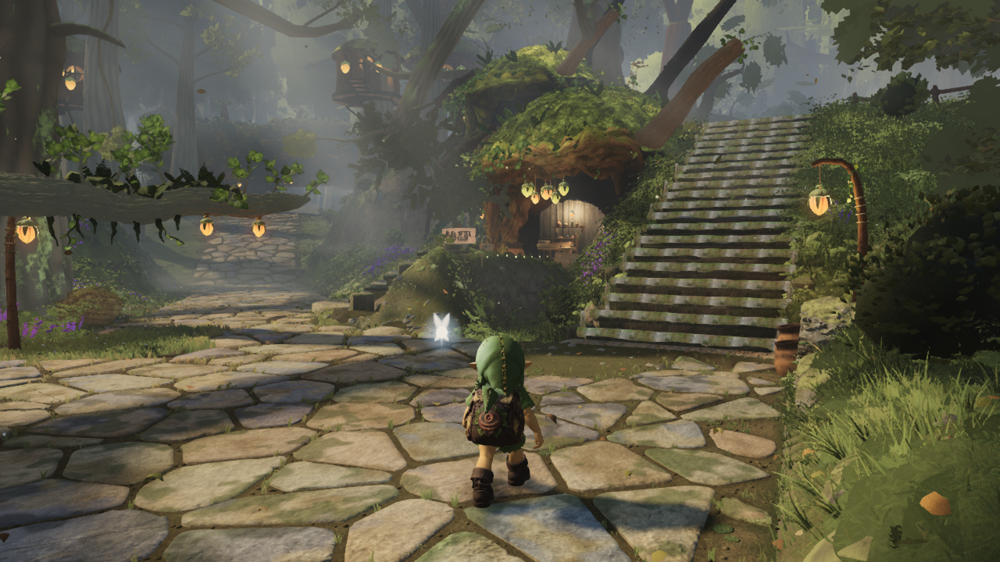
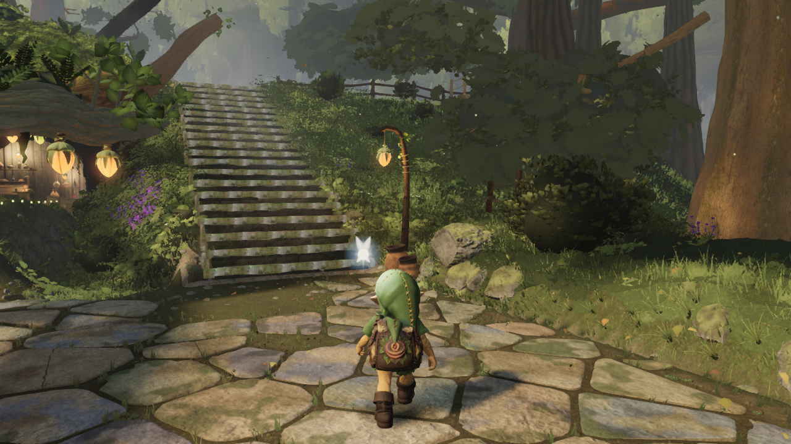

# Far plant packing: unchanged images, fewer submitted triangles

Source-only commit: [`1c69102d`](https://github.com/Leonxlnx/zeldaremake/commit/1c69102d2156a00b7dd46ae78006f438e0383764), based on `6231cffb`.

Only three far-LOD `PACKS` entries in `src/world/vegetation/plants.ts` change to the existing `SINGLE` helper: ferns, north ferns and tufts. Previously each far instance submitted other packed variants which the existing material collapses to zero-area triangles. Separate variant packs submit only the selected geometry. No generator, position, RNG, wind, material, LOD distance, culling helper, shadow setting or grass range changes.

| Native view | Before triangles | After triangles | Saved | Draw calls | Changed RGB pixels |
| --- | ---: | ---: | ---: | ---: | ---: |
| A stairs | 8,889,627 | 8,750,087 | 139,540 | 459 → 467 | 0 |
| F canopy | 8,180,156 | 8,060,686 | 119,470 | 416 → 421 | 0 |

Maximum RGB channel difference is zero in both 1280 × 720 pairs. Cameras, simulation time (12.6 s), lighting, resolution and pixel ratio match. Textures (91) and programs (101) are unchanged; resident geometry count increases by eight. The renderer is native AMD Radeon 780M via ANGLE D3D11, with no page or shader errors. These results measure submissions and image equality, not FPS.

| View | Before | After |
| --- | --- | --- |
| A stairs |  |  |
| F canopy |  |  |

The baseline reuses root's existing `6231cffb` native A/F pair. An independent rebuild produced the identical `index-Hs0AcnGr.js` bundle (`e9abdc2c…`), verified in [baseline-reuse.json](baseline-reuse.json). The candidate bundle is `index-tB-Xa4Qn.js`. The [baseline manifest](before/manifest.json), [compact candidate receipt](after/receipt.json) and [native comparison](native-comparison.json) retain source, image and bundle hashes plus camera, lighting and renderer metadata. The full candidate placement audit remains local; its hash is recorded in the receipt. Both captured source diffs were empty. All native work used the shared capslot; the capture exited successfully and released it.

The existing `lodset`, material and plant CPU contracts, TypeScript and production build all passed; commands and exit codes are in [checks.json](checks.json). The existing selection checks preserve copied position/normal/UV data, indices, transforms, colours, instance counts, bounds and shadow bindings. [source-proof.json](source-proof.json) records the exact three executable changes; other production files are unchanged. Opaque pack centres can affect sorting at equal-depth ties, so the raw pair checks were required; neither tested view changed.

Run `node art/environment/astra-far-packing/compare-native.mjs` after installing dependencies to verify the published raw images and metadata. [native-capture.mjs](native-capture.mjs) reuses the existing capture helper, adding only read-only vegetation audit and renderer metadata. A new capture requires the shared GPU slot.

Root accepted this bounded source change and is combining it with upper-canopy detail. These pairs isolate plant packing: they do not include that integration or the separate distant-crown candidate. Standalone A headroom is 249,913 triangles; combined six-view cost remains to be measured. No visual-quality deficiency is claimed fixed by this packing change.
