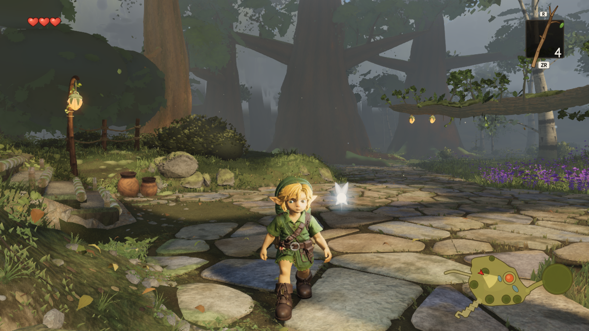
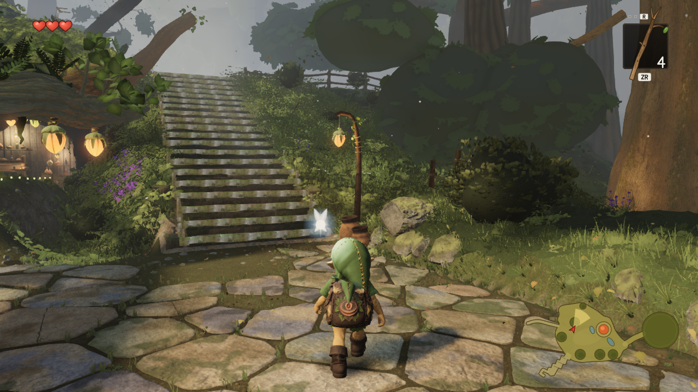

# Recovered leaf warmth on the current world

Source **0858f39f75ee14130be7ff84692cdd33422c83ab** recovers the previously measured
leaf-only warmth **0.5**, separately from held geometry work. Author and independent
root review of all four raw images accept the modest colour improvement on canonical
**0963c09d**: foliage reads more olive/golden with essentially stable exposure.
The current pair does **not** close the reference hue target or improve crown shape.

The helper and its existing three-contract test are byte-identical to **0645b7d3**.
Only the earlier hook/cache-key changes are reapplied to current `materials.ts` and
`distant.ts`. Removing these hooks restores both canonical files exactly. In
particular, current bark values, near-floor profiles and near-canopy arguments are
retained; no old flat-floor variant or geometry change is imported.

The existing hook covers seven colour programs, including `whiteTree` and
`giantTreeNearCanopy`. Mixed tree materials gate on `vIsLeaf > 0.5`; crown-only
materials use the whole surface. The near-base material (ground ferns/litter) is
excluded. Completed green-dominant leaf radiance warms before fog, preserving its
linear luminance and olive-colour HSV saturation. Final screenshot colour is also
affected by lighting, tone mapping and fog.

## Current native comparison

One serial native pair: AMD Radeon 780M, ANGLE D3D11, Chrome153.0.8010.52,
1280x720, High, DPR1, fixed simulation time12.6. Identical saved cameras, light,
public assets, all renderer counts and structural tree/hardscape audits. Three
wall-clock pool work timings naturally differ and are recorded separately.
No page, shader or system errors. Shared capslot wrapper exited0 and released its
lock after the pair. No FPS claim.

| View | Calls, before = after | Triangles, before = after | Geometries | Textures | Programs |
| --- | ---: | ---: | ---: | ---: | ---: |
| F_canopy | 407 | 8,090,816 | 314 | 91 | 100 |
| C_lookback | 341 | 7,053,338 | 353 | 91 | 100 |

Fixed baseline pixel membership and the prior `tree-hue-evaluate.mjs` region
definitions are reused. Top-band measurements use a Lanczos3 320x180 image with
rows0–61 and the original H55–170/S>.12/L.06–.85 foliage mask. Native interior boxes
are C[44,93,281,154] and F[793,144,1049,237]. Values are HSL hue degrees; decoded Y is
post-tone-map screenshot Rec.709, not shader radiance.

| Region | Before | After | Reference top band | Decoded Y change |
| --- | ---: | ---: | ---: | ---: |
| C top35, fixed foliage | 85.00 | 72.86 | 68.57 | -0.47% |
| F top35, fixed foliage | 77.50 | 74.12 | 60.00 | -0.20% |
| C native interior, fixed foliage | 88.00 | 72.00 | — | -0.70% |
| F native interior, fixed foliage | 90.00 | 72.00 | — | -0.91% |

The older mixed-branch headline (C near66°) is not reproduced on this current
world and is not claimed. Both current top-band medians move toward the reference,
but F still contains a large residual mismatch. Masks are colour selections, not
material IDs; darker reference interiors are poorly selected, so no native-box
reference equivalence is asserted. This pair does not repeat the earlier
near-white-bark, distant or sky controls. CPU contracts verify their existing hooks.

Visually, C's upper-left crown and F's large right bank crowns shift from cool dark
green toward olive while preserving the shaded interior and silhouette. The smooth
opaque ovals, sparse pasted foliage and distant crossed cards remain obvious.
Those geometry defects are separate held/prototype lanes.

### C before / after




### F before / after




## Evidence and reproduction

- `source-proof.json` / `check-recovery.mjs`: exact old helper/test and inverse
  current-source proof; no other source/assets changed.
- `native-pair/{before,after}-build.json`: immutable bundles, source SHAs and public
  hashes. Before JS6145e298…; after JS1aff24f9…; publicaa8fd950….
- `native-pair/{before,after}/manifest.json`: native renderer, cameras, scene state,
  screenshot hashes and console receipts. The four PNGs are raw renderer captures.
- `native-report.json` / `compare-native.mjs`: provenance, identical submissions,
  timing disclosure and PNG hash verification.
- `hue-report.json` / `evaluate-hue.mjs`: unchanged prior colour math, masks and
  regions, adapted only to these two immutable source builds and C/F.

Passed: `node --test src/world/trees/leaf-color.test.mjs` (three contracts),
`npm run typecheck`, and `npm run build`. The contracts cover all seven colour
programs and excluded depth/base programs; unchanged vertex/wind/LOD, normals,
alpha, existing uniforms and material properties; neutral/bark/zero controls; and
luminance/saturation preservation across radiance scales.

CPU evidence replays from this worktree:

```powershell
node art/environment/astra-leaf-warmth/check-recovery.mjs
node art/environment/astra-leaf-warmth/compare-native.mjs
node art/environment/astra-leaf-warmth/evaluate-hue.mjs art/environment/astra-leaf-warmth/native-pair
```

For a new GPU replay, build the two pinned source revisions into separate directories,
freeze each with `freeze-build.mjs` and use `capture-pair.mjs` through the shared
`capslot.mjs`, with `ZR_NATIVE_GPU=1` and `CAPSLOT_STALE_MIN=Infinity`. Freeze/capture
helpers refuse to overwrite completed receipts. Local build directories are ignored.
No gauntlet ledger, scoring or production default outside this source slice changed.

Fable coordination, including the independent three-bank-core proposal, is recorded
in [comment5767824932](https://github.com/Leonxlnx/zeldaremake/pull/2#issuecomment-5767824932).
That prototype is not part of this change.
