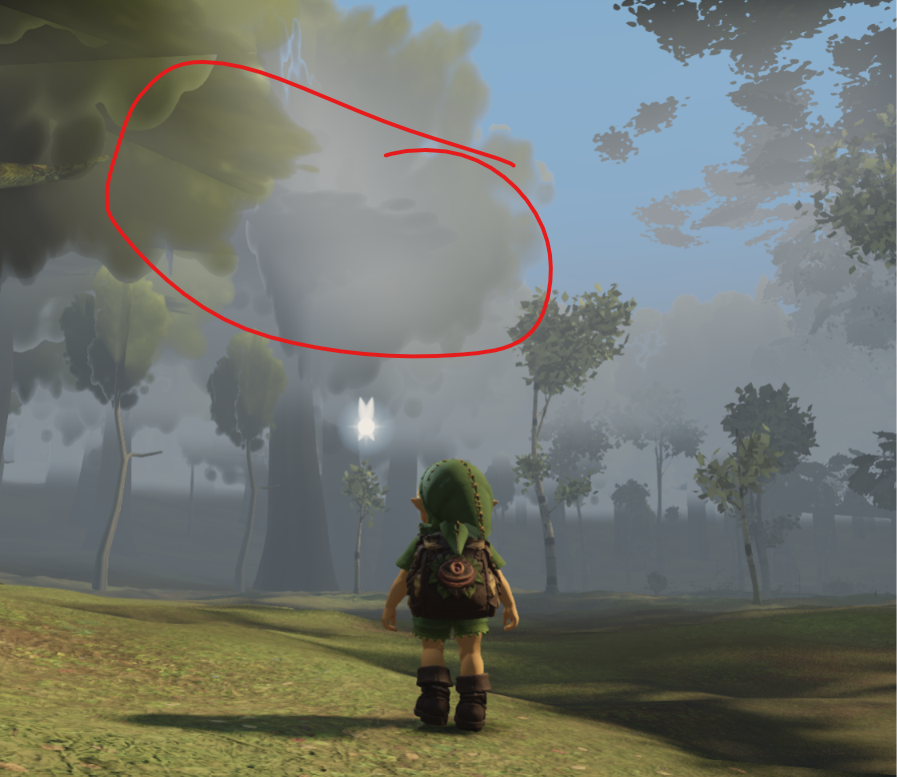

# Owner tree-clarity direction — 2026-09-22

The owner supplied this screenshot of the current local game preview (port 61020)
and explicitly requested clearly rendered distant/high trees, less grey washout,
and removal of the large blurry leaf/crown shapes at height. The red marking is
part of the supplied image. It is a visual issue report, not scenery or a texture.

The large marked area lies around x100–550/y60–357 of the 897×777 image. The
foreground ground also reads as bare turf. Actual mesh/LOD attribution is pending;
the image alone does not identify the responsible source geometry.

Astra's independent lanes are tree/LOD attribution, fog/sky clarity and the already
bounded three-bank-core distribution study. Fable4 retains north-spine roof and
white-bark ownership; Fable's grass 26 m change is already known. Any proposal must
measure actual visual improvement and runtime cost. Fixed-frame similarity alone
does not settle the owner's clarity complaint.
