# Environment — native before/after comparisons

Latest reviewed source **0645b7d3**, [local preview](http://127.0.0.1:61023/?mode=play&dev=0&hud=0), frozen bundle **index-ClEBro72.js**. The moss-cap normal fix removes the reproduced black bloom square. Tree foliage now has a measured, subtle warmer hue; ground plants, wood and global lighting retain their existing treatment. Native24views (12poses × neutral/.5) and24stair camera frames completed without page/shader errors. All variant camera/time/render counts match; A remains8,741,626triangles/571calls.

| Latest isolated comparison | Before | Reviewed correction |
|---|---|---|
| Stair crown: reduced green cast | 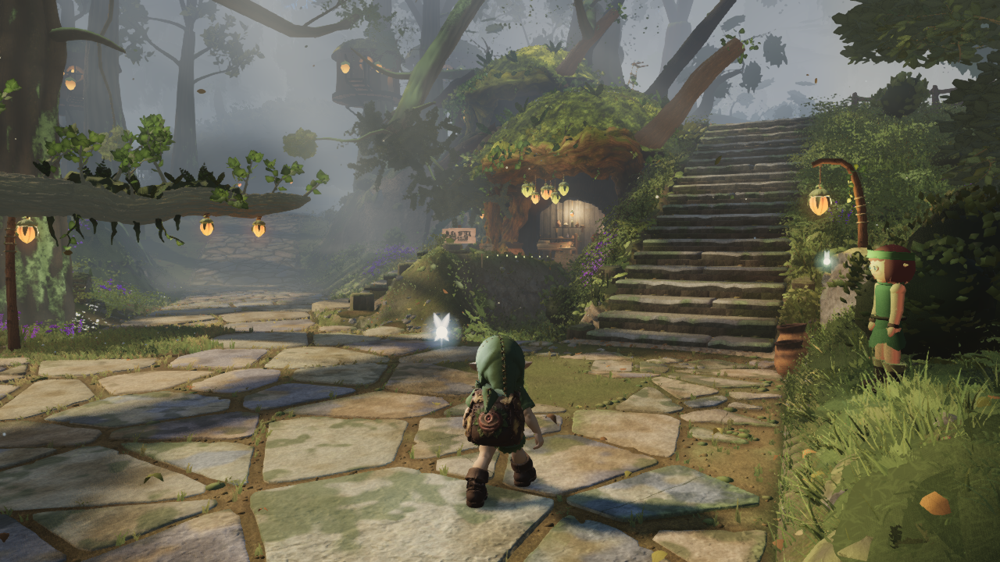 |  |
| Lookback crown: warmer leaves at retained brightness |  |  |
| Canopy: leaf relief retained |  | 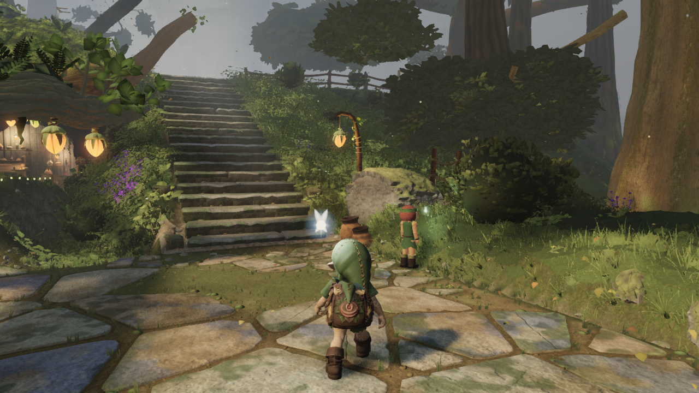 |
| Distant tree at121m: same geometry with warmer leaf colour |  | 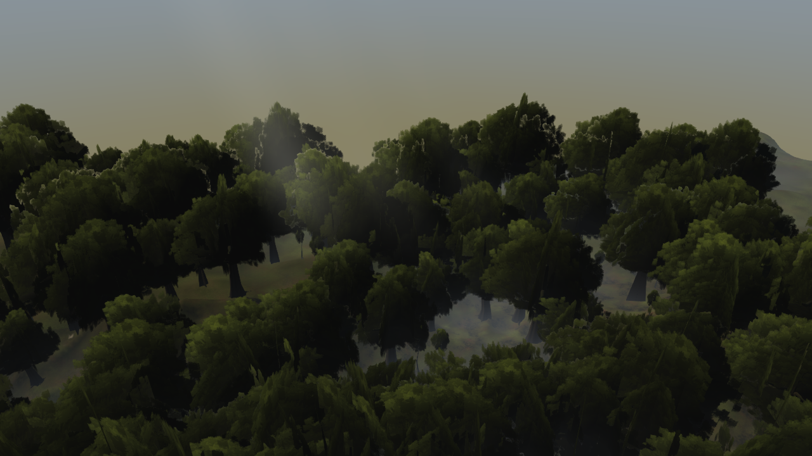 |
| Stair landing: invalid moss normal removed | 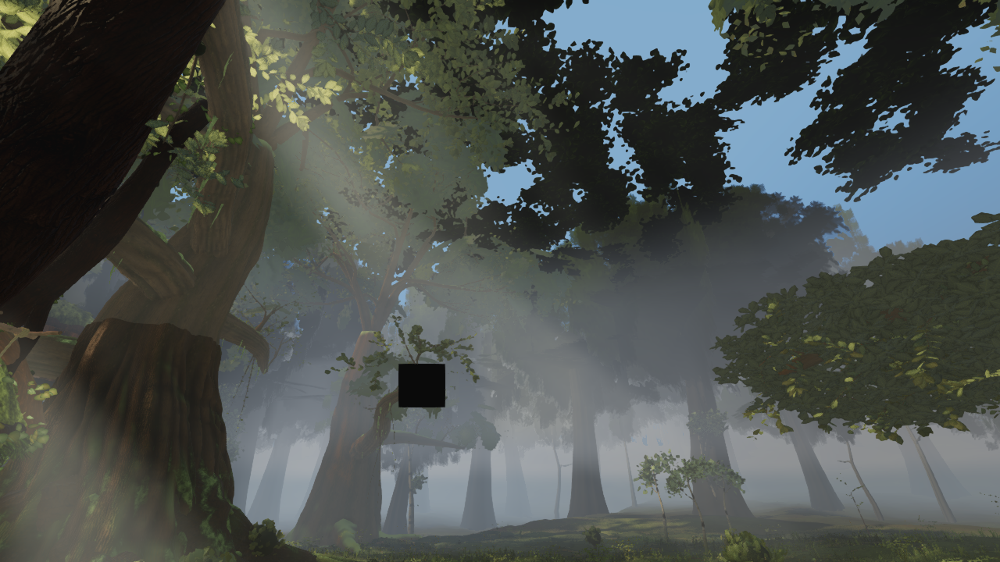 | 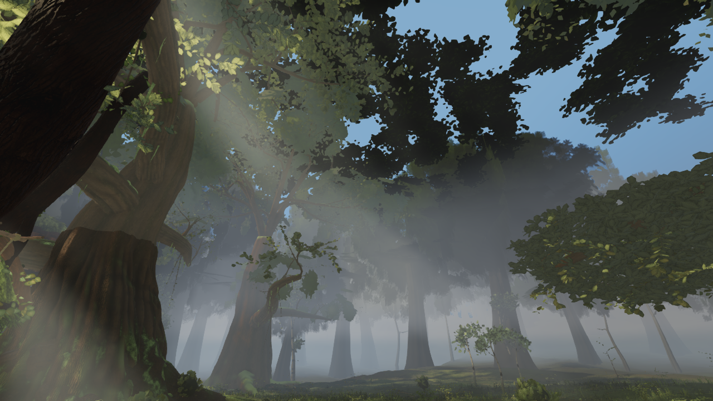 |

Fixed-mask native crown interiors A/C/F move from78–79° green toward67.5/66/66° olive; decoded screenshot brightness shifts by less than0.3%. The distant controls both improve77.1→69.5°, with about1.1% lower decoded brightness after display processing. Blue-sky median hue/saturation/lightness stays exact. This is a modest material improvement, not full reference parity: mixed vegetation bands remain greener, large crown shapes and root transitions need work. Reference SSIM changes from the neutral variant by0 to−.0001; combined deficits versus97c83227 remain up to−.0116. PR remains draft; no new formal take or FPS claim.

CPU leaf contracts3/3, moss-domain15degenerate/384ordinary cases, typecheck/build passed. [Detailed hue evaluation](../astra-trees-quality/tree-hue-review.md), [midpoint measurements](../astra-trees-quality/tree-hue-midpoint.json), [raw NaN cause and guard proof](moss-normal-study/README.md). The final archive retains24variant images and3diagnostic walk frames; full24-frame local sequence remains in ../2026-09-20T17-06-07-764Z-daylight.

## Root-profile patch — held for Fable trees-32

Candidate **0db15909** replaces only the far giant root tubes with coarse versions of the existing broad fins and split toes. Twelve matched native views against0645b7d3 completed with no page/shader errors. Added submitted triangles are9,688 in these views, with no added draw calls (4,844 extra source triangles rendered in colour/shadow passes); A8,751,314/571. C reference SSIM improves+.0029, Aunchanged at4decimals, F−.0001.

| Just beyond near-root range | Previous tubes | Shared coarse root profile |
|---|---|---|
| Lantern tree,12.15m | 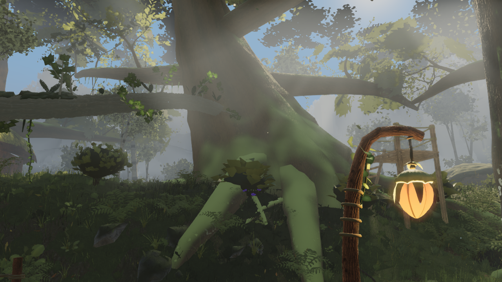 | 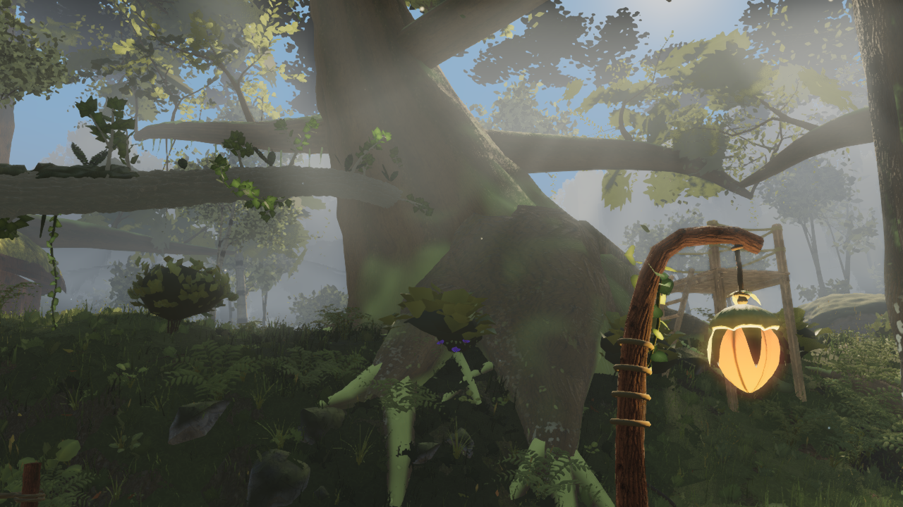 |
| Northwest tree,10.15m | 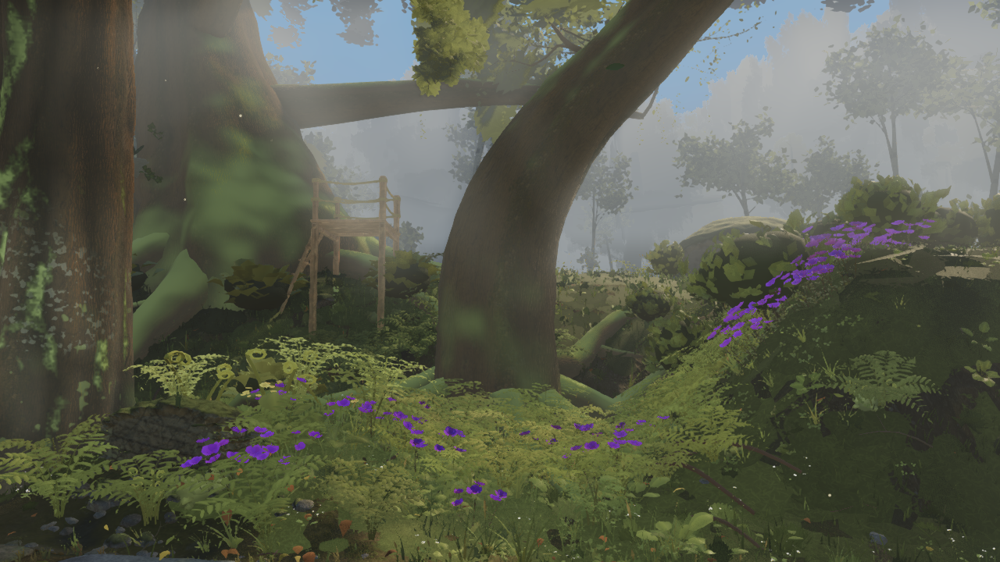 | 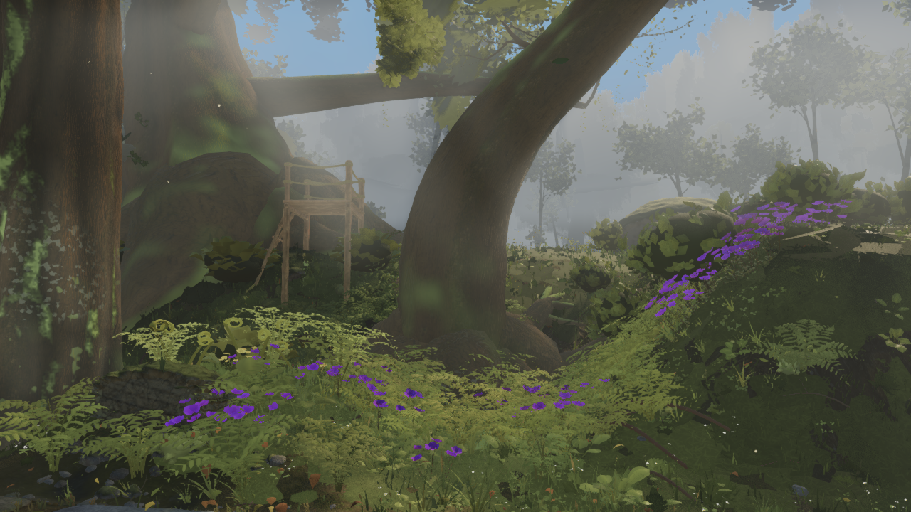 |

The wider root silhouette is visibly retained, but the lower-bole material/relief switch and collar seam remain. Near geometry is CPU-byte-identical; the close lantern/stair-bank PNGs are also exact. Other boundary images change because their frames include coarse roots/shadows, so no blanket near-image invariance claim. [Exact comparisons](root-profile-comparison.json), [CPU geometry proof](root-profile-cpu.json). Reproduce CPU proof with `node art/environment/astra-distance/root-profile-check.mjs 0645b7d3 0db15909`.

Fable47ce1295 reports active trees-32 ownership ofgiant.ts/bole.ts. This remains a standalone patch for that owner to apply on top; **680adc76 restores the accepted geometry**, and preview61023 is unchanged. No lower-trunk splice, material change or larger detail radius is part of this patch.

## Prior combined geometry review

Latest combined native source **fedffe49**, preview **http://127.0.0.1:61022/?mode=play&dev=0&hud=0**, frozen bundle **index-CdXyIg1Y.js**. Fresh Fable production baseline97c83227 and candidate each have27 matched native views. The candidate also has24 fixed-time stair camera frames. Source includes Fable's backside expansion/wood tint/previously accepted Link changes, our stone and distant-tree work, corrected bark texture mean, Fable4's leaf detail range, and dense near crown leaves with the original flat-core shade floor restored.

Independent visual review accepts the crown improvement: F shared-core luminance0.208→0.189, C0.220→0.203; edges and interiors now contain leaves instead of smooth cores. A8,741,626 triangles/571 calls versus baseline8,615,890/566. No frame-rate improvement is claimed. Full-frame reference SSIM deltas are A−0.0021, B−0.0051, C−0.0106, D−0.0091, E−0.0044, F−0.0115. This is still outside Fable's comparison budget in five views; visual progress is not reference parity or permission to merge the entire branch.

| Current matched comparison | Fable baseline97c83227 | Combined candidatefedffe49 |
|---|---|---|
| Stair-side crown: leaf edges and a layered body replace the smooth closed core | 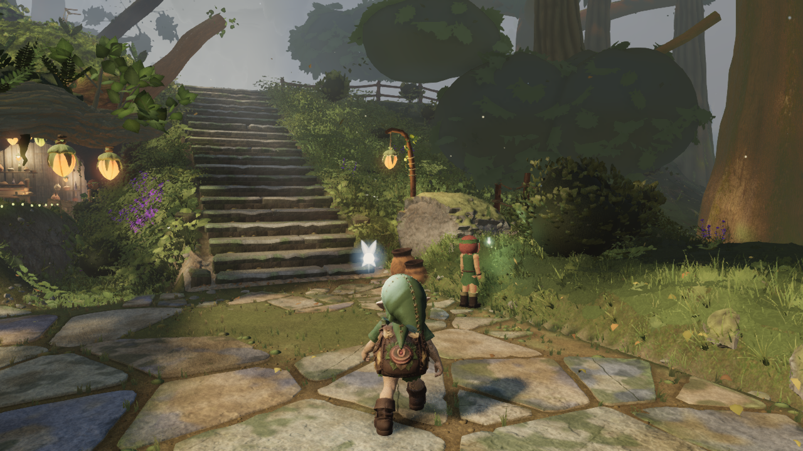 |  |
| Looking back: dark canopy mass retained while foliage gains structure | 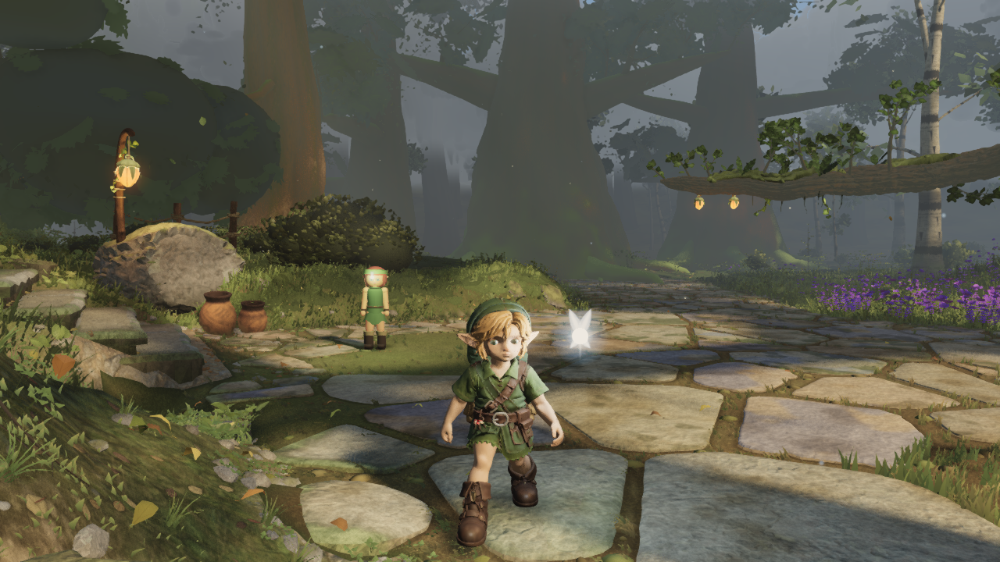 | 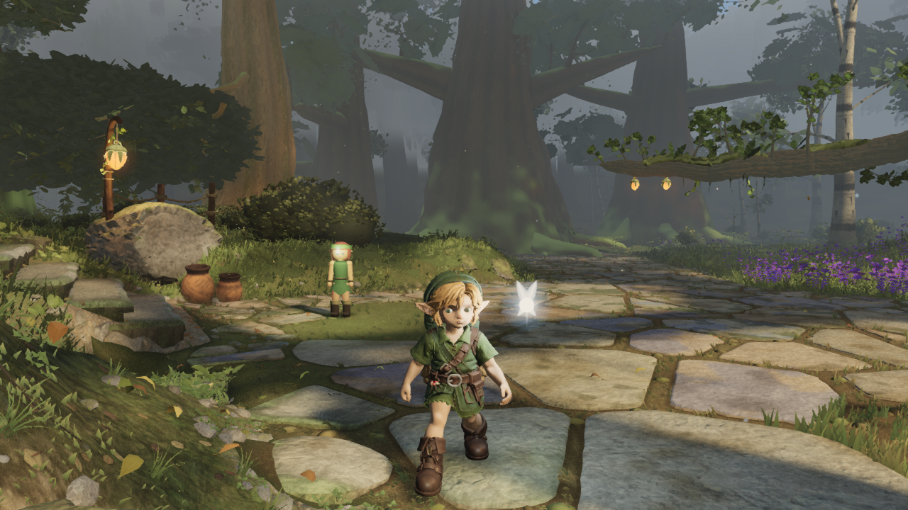 |
| Close stair-bank bark: corrected linear texture mean retains warm fissures |  |  |
| Approached distant-tree type at3m: mapped bark plates recover |  | 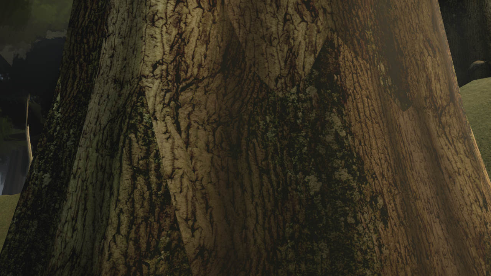 |
| Distant crown at121m: leaf-shaped margins with retained crown/underside geometry |  |  |

Reproduce all27 pairs with `node art/environment/astra-quality/check.mjs before-round49 after-round49 round49-comparison.json`. Both manifests have no recorded page/shader errors and exact camera/time/viewport matches. Geometry/pool/terrain/placement/gait tests15/15, the flat-floor280-case check, typecheck/build passed at this source. The last formal local take remains0124/a9eccd15; these are surveys, not a new formal score.

**Rendering defect diagnosed:** walk frames018/019/023 show a black rectangular patch near the stair landing, also reproduced on unchanged upstream97c83227. Raw native HDR readback at pose23 finds five RGB-NaN pixels, four CPU rays hitting constant-V UV branch caps. The procedural moss normal normalized a zero tangent axis. Applying only a nondegenerate-axis guard to the runtime shader produces zero invalid HDR pixels and removes the block at the same camera. See [paired raw reports and images](moss-normal-study/). Production guard/walk verification follows; the separate6a694b66 power/derivative fix alone did not remove this defect. Visible bough tips, higher crown cards, broad moss and the distant scene remain unfinished. Fable has routed the expansion placement-filter gap to its five round50 lanes (b27c39f4).

The9-pose paired near-floor uniform study is separate: restoring NEAR_BASE_FLOOR.texture .75→.65 modestly separates dark wood from moss without new geometry. Sourcec62980fd implements that rollback after this combined capture; it is not retroactively included in fedffe49 images. See astra-trees-quality/bark-albedo-trace.md for the actual material×vertex×map trace. No moss-gap experiment is retained.

## Earlier studies and checkpoints

Latest verified source: **d9eee5d7**, native27-view `after-bark-linear/` (bundle `index-CUzYDOZs.js`). The bark colour-space correction is accepted: clearer warm grain with identical geometry/draws and five byte-identical hero images versus a9eccd15; D differs in one colour channel of one pixel by one 8-bit level. The earlier canopy replacement is still under review: Fable-5 correctly found its foliage too sparse to retain C/F's dark crown masses. This branch is not ready for integration as a whole.

| Latest material comparison | Before | Verified mean-only correction |
|---|---|---|
| Tree beside the stairs: visible wood grain instead of unnecessary darkening | 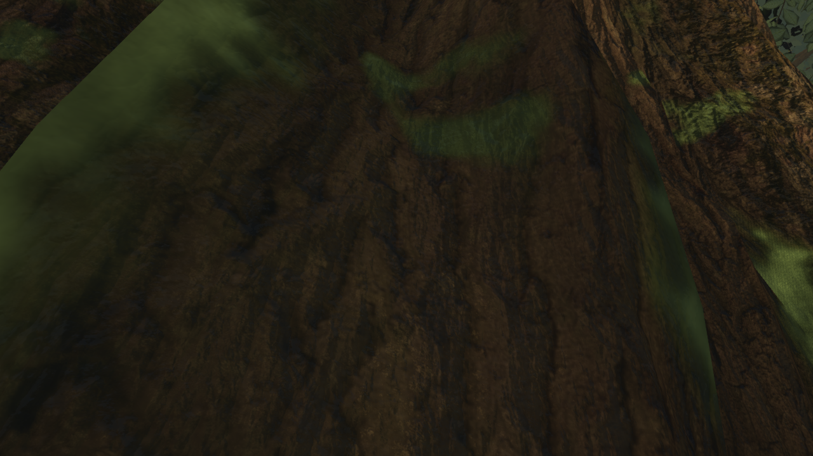 | 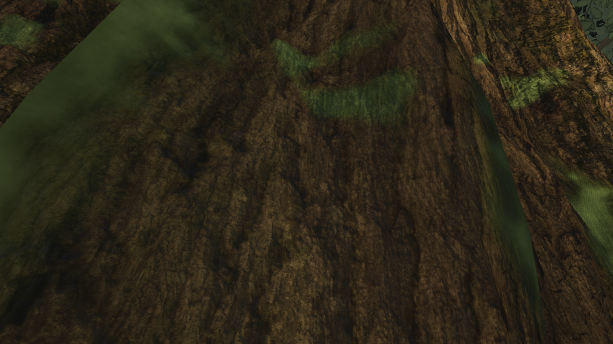 |
| Approached distant-tree type, axis3m away: mapped plates and fissures recover | 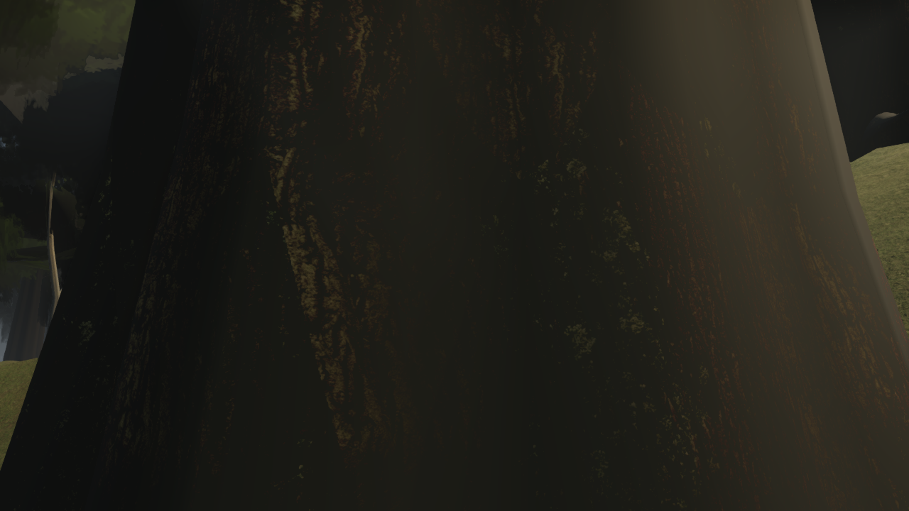 |  |

Reproduce the27 matches using `check.mjs after-atlas after-bark-linear bark-linear-comparison.json` and `check.mjs before-stems after-bark-linear bark-linear-stems-comparison.json`. No page/shader errors; the three bole and three stem images are also byte-identical to the combined study after the deferred chips were removed. Typecheck/build, the linear texture-mean check and source anti-cheat pass. Last formal valid take remains0124 on a9eccd15; it is not relabelled as a take of the new source. See the26m composition caveat below.

The most visible correction replaces the closed dark crown discs beside the stairs with the existing layered branches and leaves. Stone shading is more coherent and exposed bark is slightly warmer; these are modest material improvements, not a claim that the forest has reached the owner references.

Three owner-requested Astra Max agents contributed, alongside Fable's separate geometry/expansion lanes. Character work is deferred. The ten original targets remain in `reference/owner-concepts/` and are comparison-only.

| View | Before | After |
|---|---|---|
| Stair-side canopy: closed cores become leaves and gaps; exposed blunt tips still need work |  |  |
| Gameplay composition: the top-right circular mass is removed |  |  |
| Stone close view: shallow crack relief and calmer plate shading |  |  |
| Walking-height bark: less olive tint, with existing broad moss still visible |  |  |
| Looking upward: comparison of bark/foliage detail, not a new sky or increased tree count |  |  |

## What changed

- Stone: near AO follows the enlarged colour/normal tile; rotated detail normals point correctly; existing authored cleaves gain shallow recessed shading; worn plate centres are quieter.
- Bark: six existing shade-floor presets retain more bark/moss albedo and less green canopy tint. Geometry, moss placement and leaf lighting are unchanged.
- Distant trees: both detail levels retain the same seeded crown lobes/undersides, and far stems follow near bends. All729 placements and near meshes are unchanged. This repairs the120m switch; it does not disable frustum culling.
- Stair-bank canopy: the existing near-foliage replacement now covers flat lobes at26/30m. No new geometry algorithm, generated mesh change or shadow pass.

## Evidence and limits

Baseline source `ca562e76` (capture HEAD `50ed2466`); combined candidate `3dadc4a3`, bundle `index-BDyGtHka.js`. Both surveys use high quality,1280×720, time12.6, identical19-camera order and no visibility/material overrides. Both manifests completed without page errors. The candidate helper additionally records shader/WebGL console errors. `node art/environment/astra-quality/check.mjs` verifies image hashes, exact camera/time/viewport/override equality and regenerates `comparison.json` using the repository's existing image metrics.

| Main view | Before triangles / calls | After triangles / calls |
|---|---:|---:|
| A_stairs | 8,595,330 / 566 | 8,634,322 / 571 |
| B_house | 7,754,627 / 522 | 7,764,699 / 523 |
| C_lookback | 6,938,215 / 407 | 6,976,959 / 412 |
| D_log | 7,986,347 / 396 | 7,989,171 / 396 |
| E_ground | 7,754,627 / 522 | 7,764,699 / 523 |
| F_canopy | 7,922,992 / 507 | 7,961,736 / 512 |

A rises0.45% in submitted triangles. The existing40-part canopy budget reallocates some other near parts, so a few look-up/control views submit fewer parts; this is a combined gameplay comparison, not isolated per-material attribution. The diagnostic stair view remains above9M triangles (9,934,850); that pre-existing expense is not hidden by the main-view table.

Detail and video-frame similarity are different measurements. Daylight reference SSIM drops by A−0.0013, B−0.0059, C−0.0258, D−0.0099, E−0.0045 and F−0.0289. The largest differences include replacing deliberately uniform closed cores with leaf gaps. These figures are reported unchanged; no rubric/threshold was edited. Formal take-0123 is preserved under `take-0123/`:36/50 overall,31/42 world; W35/W38/determinism pass and anti-cheat is green (97 checks), but the take is INVALID because W24 dropped to1,822 pebbles versus the previous take. Rocks source was unchanged by this iteration. Fable already documented the regression and supplied51fb6b35; that fix and its newer world integration are next. W37/reference matching and other remaining rubric failures are not waived. Independent Fable art review remains pending.

Five additional `after/distance-crown-118m.png` through `122m.png` views inspect an actual placed tree around its switch. They have no corresponding baseline images in this survey and are not presented as matched before/after proof. The CPU geometry check verifies all six crown variants, retained undersides and stem alignment.

Baseline `before-perf.json`:600 identical fixed-step frames from spawn to stair ascent at high720p on the owner's AMD Radeon780M, `perftrace.mjs --finish` (GPU completion included). Median261.9ms/p95354.4ms; a159s cold shader-compilation first frame is retained in the raw data. Other owner browser tabs may remain open, so this is a synchronized local harness result, not an isolated GPU benchmark or a30fps claim. The matching candidate trace (`after-perf.json`) completed at median115.2ms/p95324.9ms; its unchanged vegetation update also fell from14.0 to4.9ms. This large host/load variation prevents attributing the apparent speedup to these changes. No30fps result or isolated fragment-cost conclusion is claimed.

Remaining art work: fuller canopy edges and tapered visible bough ends; less smooth moss coverage; more varied slab/joint/stair geometry; leaf-scale structure in the blurred distant crown atlas. Static stills do not prove temporal stability. The next atlas candidate is separate and is not included in these images.
## Second iteration: distant leaf edges and Fable integration

`after-atlas/` records24 complete native views at `a9eccd15` (bundle `index-Dcw7zlsM.js`). This combines the leaf-shaped far-crown atlas with Fable's newer structures32 world (`69d16c4f`) and its exact W24 pebble fix (`51fb6b35`, cherry-picked as `d459afb3`). It is a separate stage: the five original comparison pairs above remain frozen.

| Target | Previous candidate | Second iteration |
|---|---|---|
| Upward depth-row crowns: blurred margins become leaf edges; oblique planes still show | 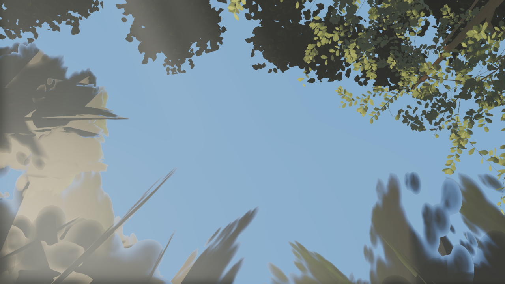 | 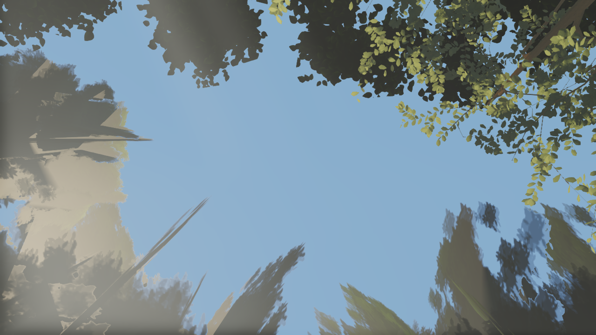 |
| Actual distant crowns at121m: sharper contours at the same geometry budget | 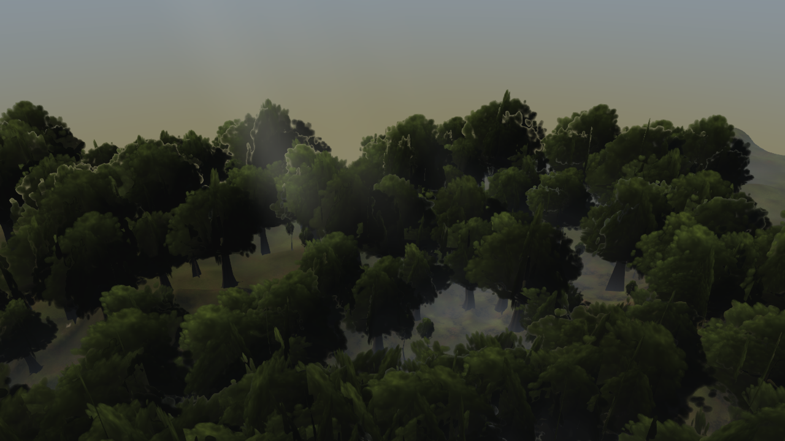 | 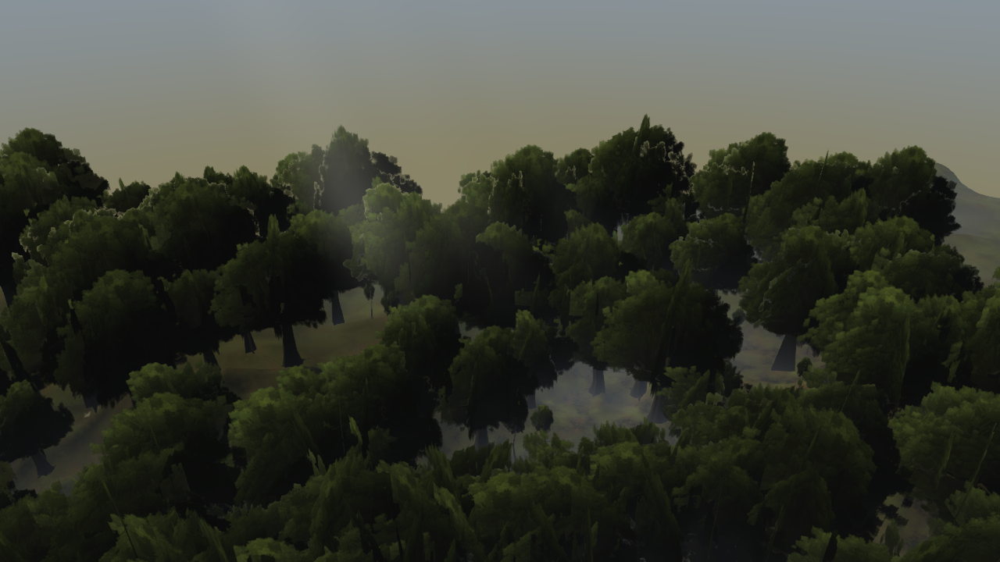 |

`node art/environment/astra-quality/check.mjs after after-atlas atlas-comparison.json` verifies all24 matched views. Both119m and121m comparisons retain identical submitted triangles, draws and textures. The atlas itself changes no geometry, draw groups or persistent texture size; CPU startup painting adds roughly0.4s on this machine. Native inspection accepts the sharper leaf margins as an incremental improvement, while pale underside planes and close overhead structure remain unfinished. Stills do not establish shimmer or isolated GPU cost.

Fable's pebble correction accounts for the extra20,560 submitted triangles in the six hero views: A now8,654,882/571 calls. The w21 image is chiefly changed by Fable's real log tunnel, so it is not presented as atlas evidence. Formal take-0124 is VALID:37/50 overall,32/42 world, W24 restored, W35/W38 and determinism pass,97 anti-cheat checks green, no new rubric regressions versus take-0122. Evidence is preserved under `take-0124/`; the initial invalid take remains under `take-0123/`. This is still below the phase exit requirement, and W37 remains failing.
## Held bark experiment

The material-only candidate `a2eb130f` has24 matched native views in `moss-study/` against `after-atlas/`; all cameras/time/image hashes match, geometry and draw counts are unchanged, no page/shader errors. `node art/environment/astra-quality/check.mjs after-atlas moss-study moss-study-comparison.json` reproduces the comparison.

Decision: **HOLD / source restored to a9eccd15**. The lantern trunk loses some uniform green but reveals near-black bare patches; north-west is similar, stair-bank and w04 improve too little. It does not reach reference05 warm readable bark. Independent shader review also identified that new near-only coarse moss suppression could amplify an existing LOD colour jump. No NaN, unbounded tint gain, additional texture sample or geometry issue was found. This study is retained honestly and is not part of the owner preview.
## Separated follow-up studies

`chip-and-bark-study/` is the complete27-view native study of ee7de70a. It combined the bark linear-mean correction with sparse chips on11 existing lawn slab rims. All submitted triangle/draw counts match the relevant baselines. The24 original cameras compare to after-atlas; three actual distant-stem controls compare to before-stems (captured at f4a44634, source equivalent to a9eccd15). Reproduce with check.mjs and chip-study-comparison.json / chip-study-stems-comparison.json.

The chip geometry is **deferred**, not accepted: Fable clarified in2d0742a6 that expansion-2 owns flagstones.ts/stairs.ts. The scoped source/test can be recovered from ee7de70a for that owner; d9eee5d7 restores the original geometry. Its independent CPU gates preserved all555 seats, footprints and crowns, all48,969 foot vertices and175,977 triangles. Native w05 differs by0.66% of pixels, so this is a small edge study, not a large stone-quality upgrade.

The bark correction fixes an existing colour-space mismatch: an encoded ffmpeg YAVG value was used as the mean of linear GPU texture samples. The measured high-quality2K mean is0.2554942; the1K version differs by0.67%. The same scalar serves nearby bark detail and distant bark contrast. See the runnable bark-linear-mean-check.mjs and its notes. No moss/floor/light changes or new rendering operations are included. The final mean-only source is d9eee5d7; its separate verified27-view evidence is after-bark-linear, described at the top.
Distance-control caveat: the26m-axis image contains the intended tree only partly. At native y360 it is roughly x586–660 (centre hit24.649m), while the dominant trunk at x662–938 is an intervening variant0 tree about4.7–4.9m from those camera rays. Its improvement is close-range evidence, not26m-fade evidence. The3m/6m controls and partially visible26m target were separately checked. No image was cropped or altered to hide this.

## Near-only moss follow-up: held

Source573ada5d is preserved in after-moss-near (33 native views, zero page/shader errors). All six near-base reset boundary controls are byte-identical to before-moss-boundary, and every compared draw/triangle count is unchanged. The near-faded mask avoids the previous transition problem. Nevertheless this study is **HOLD**, and production materials.ts is restored to d9eee5d7: the lantern trunk gains textured brown gaps but their darkness still worsens readability. Its matched central ROI mean falls31.11 to27.49/255; pixels below20 rise17.38% to28.98%. NW is similar but smaller; stair-bank is visually almost unchanged. These are regional image statistics, not a quality score. Broad green moss still needs an albedo/vertex-colour solution rather than additional compensating layers.

Reproduce image checks: `node art/environment/astra-quality/check.mjs after-bark-linear after-moss-near moss-near-comparison.json` and the same helper with `before-moss-boundary after-moss-near moss-boundary-comparison.json`. Historical candidate CPU checks belong to573ada5d, not the restored production shader. The owner preview remains the accepted d9eee5d7 build.

## Dense crown first render: shading correction pending

`crown-mass-study/` captures27 views of2d76dac2, bundleCE6X0JIm. Geometry now fills the missing crown bodies with leaf clusters instead of closed smooth cores. A submits8,741,626 triangles/571 calls (+86,744/no extra calls versus the sparse candidate); the stair diagnostic remains expensive at10,027,850. Ordinary52 near parts and10 far geometry buffers remain byte-identical in the CPU check. Runtime pool residency can shift one part in other views; this is not a claim of identical submitted counts everywhere.

The candidate is **not accepted yet**. C reference SSIM recovers0.0033 versus sparse foliage, while F loses0.0040; versus the initial world C remains−0.0217 and F−0.0332. Native matched core interiors expose the cause: F luminance0.208 original→0.132 candidate, C0.220→0.149. The original flat core uses a6/.4 floor (lift/texture), but new leaves use the3.2/.75 near-canopy floor. Its neutral contribution drops while the albedo-dependent contribution stays equal. A flat-only material correction is in preparation; no lighting-wide lift is accepted. This capture includes the separately held moss candidate; comparisons of bole views must not be attributed to the crown change. Production moss was subsequently restored.

Fable production source97c83227 is integrated separately as360c896b, including the backside expansion, wood tint and already-upstream Link/contact work. Fable4's isolated white-leaf range change isfd76f783; no geometry changes. Expansion/placement/gait/pool tests15/15 and build/typecheck pass. The local and upstream sealed ledgers diverge after0122; both remain unchanged in their own histories. A clean source97c83227 native baseline is being captured separately for the next combined comparison.
