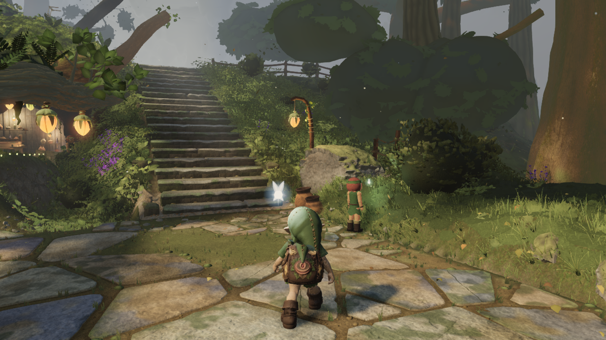
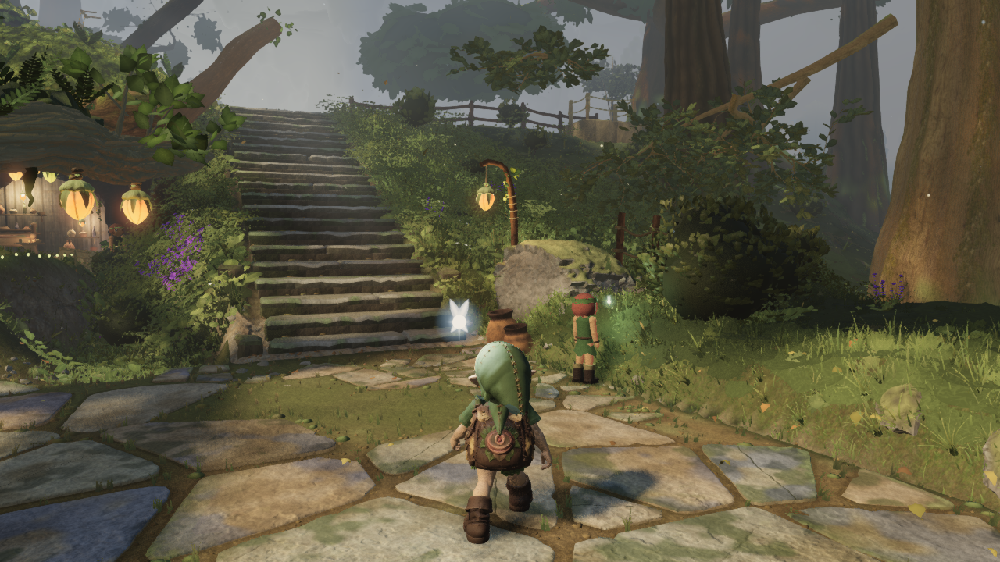
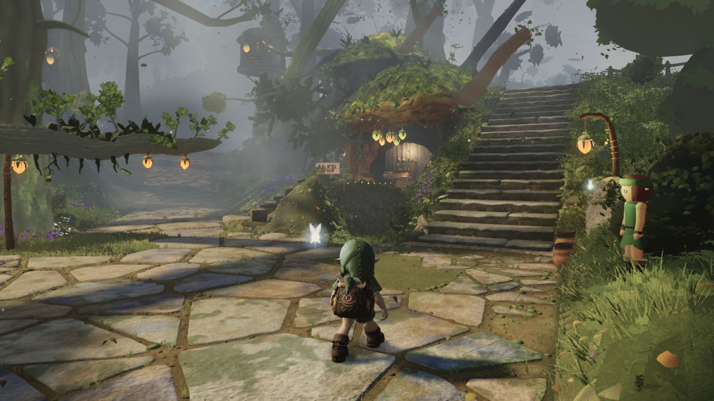
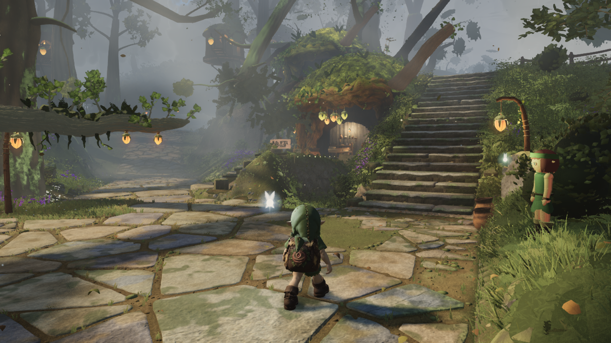
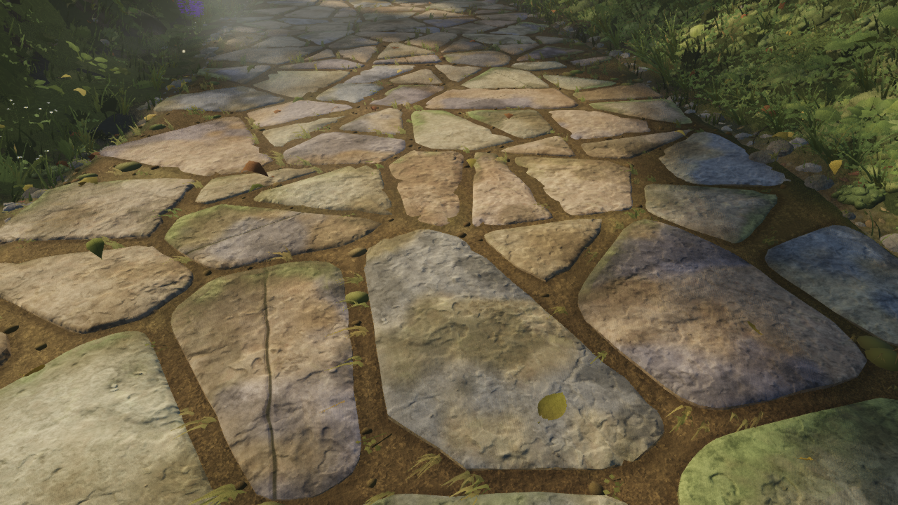
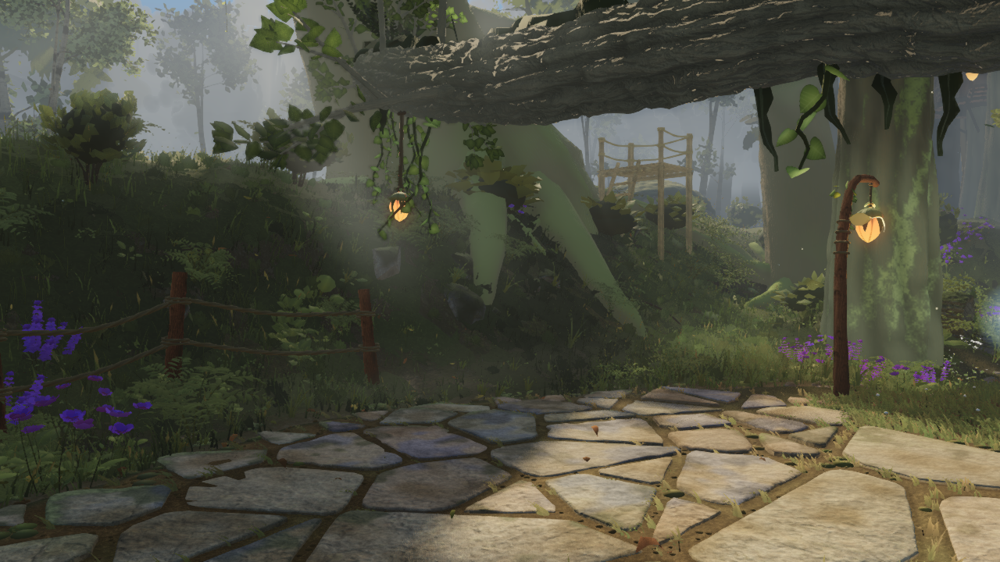
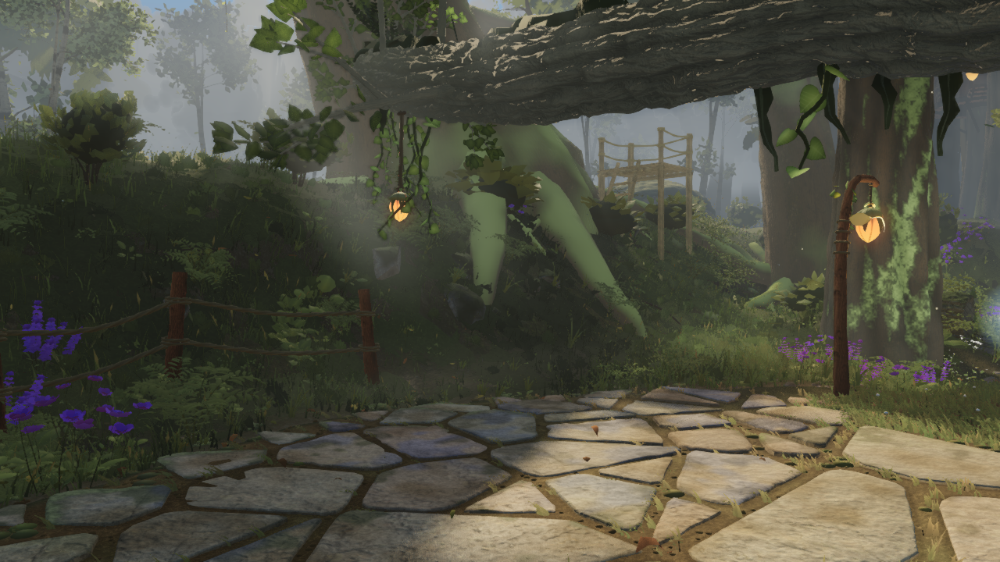
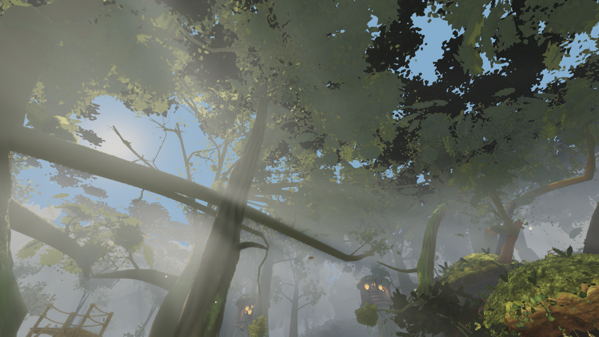

# Environment — five native before/after comparisons

The most visible correction replaces the closed dark crown discs beside the stairs with the existing layered branches and leaves. Stone shading is more coherent and exposed bark is slightly warmer; these are modest material improvements, not a claim that the forest has reached the owner references.

Three owner-requested Astra Max agents contributed, alongside Fable's separate geometry/expansion lanes. Character work is deferred. The ten original targets remain in `reference/owner-concepts/` and are comparison-only.

| View | Before | After |
|---|---|---|
| Stair-side canopy: closed cores become leaves and gaps; exposed blunt tips still need work |  |  |
| Gameplay composition: the top-right circular mass is removed |  |  |
| Stone close view: shallow crack relief and calmer plate shading |  |  |
| Walking-height bark: less olive tint, with existing broad moss still visible |  |  |
| Looking upward: comparison of bark/foliage detail, not a new sky or increased tree count |  |  |

## What changed

- Stone: near AO follows the enlarged colour/normal tile; rotated detail normals point correctly; existing authored cleaves gain shallow recessed shading; worn plate centres are quieter.
- Bark: six existing shade-floor presets retain more bark/moss albedo and less green canopy tint. Geometry, moss placement and leaf lighting are unchanged.
- Distant trees: both detail levels retain the same seeded crown lobes/undersides, and far stems follow near bends. All729 placements and near meshes are unchanged. This repairs the120m switch; it does not disable frustum culling.
- Stair-bank canopy: the existing near-foliage replacement now covers flat lobes at26/30m. No new geometry algorithm, generated mesh change or shadow pass.

## Evidence and limits

Baseline source `ca562e76` (capture HEAD `50ed2466`); combined candidate `3dadc4a3`, bundle `index-BDyGtHka.js`. Both surveys use high quality,1280×720, time12.6, identical19-camera order and no visibility/material overrides. Both manifests completed without page errors. The candidate helper additionally records shader/WebGL console errors. `node art/environment/astra-quality/check.mjs` verifies image hashes, exact camera/time/viewport/override equality and regenerates `comparison.json` using the repository's existing image metrics.

| Main view | Before triangles / calls | After triangles / calls |
|---|---:|---:|
| A_stairs | 8,595,330 / 566 | 8,634,322 / 571 |
| B_house | 7,754,627 / 522 | 7,764,699 / 523 |
| C_lookback | 6,938,215 / 407 | 6,976,959 / 412 |
| D_log | 7,986,347 / 396 | 7,989,171 / 396 |
| E_ground | 7,754,627 / 522 | 7,764,699 / 523 |
| F_canopy | 7,922,992 / 507 | 7,961,736 / 512 |

A rises0.45% in submitted triangles. The existing40-part canopy budget reallocates some other near parts, so a few look-up/control views submit fewer parts; this is a combined gameplay comparison, not isolated per-material attribution. The diagnostic stair view remains above9M triangles (9,934,850); that pre-existing expense is not hidden by the main-view table.

Detail and video-frame similarity are different measurements. Daylight reference SSIM drops by A−0.0013, B−0.0059, C−0.0258, D−0.0099, E−0.0045 and F−0.0289. The largest differences include replacing deliberately uniform closed cores with leaf gaps. These figures are reported unchanged; no rubric/threshold was edited. The formal gauntlet take and independent Fable review are still pending.

Five additional `after/distance-crown-118m.png` through `122m.png` views inspect an actual placed tree around its switch. They have no corresponding baseline images in this survey and are not presented as matched before/after proof. The CPU geometry check verifies all six crown variants, retained undersides and stem alignment.

Baseline `before-perf.json`:600 identical fixed-step frames from spawn to stair ascent at high720p on the owner's AMD Radeon780M, `perftrace.mjs --finish` (GPU completion included). Median261.9ms/p95354.4ms; a159s cold shader-compilation first frame is retained in the raw data. Other owner browser tabs may remain open, so this is a synchronized local harness result, not an isolated GPU benchmark or a30fps claim. The matching candidate trace (`after-perf.json`) completed at median115.2ms/p95324.9ms; its unchanged vegetation update also fell from14.0 to4.9ms. This large host/load variation prevents attributing the apparent speedup to these changes. No30fps result or isolated fragment-cost conclusion is claimed.

Remaining art work: fuller canopy edges and tapered visible bough ends; less smooth moss coverage; more varied slab/joint/stair geometry; leaf-scale structure in the blurred distant crown atlas. Static stills do not prove temporal stability. The next atlas candidate is separate and is not included in these images.