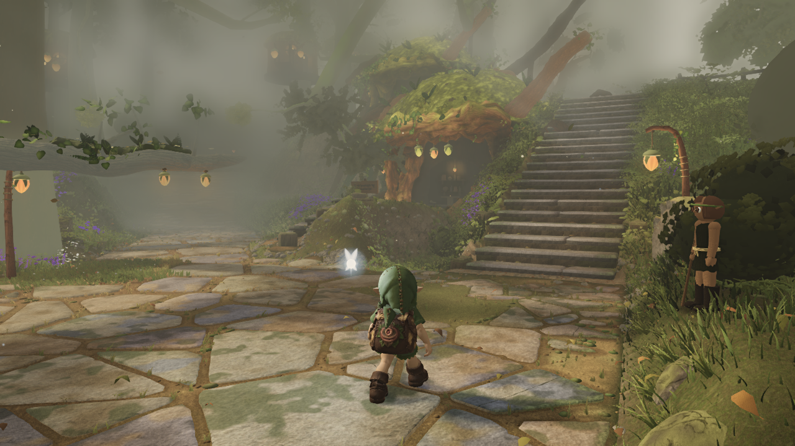
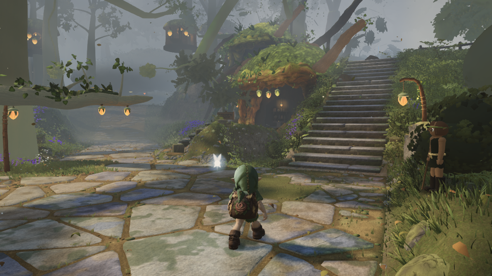

# Clear daylight from ground level to the stair landing

The elevated stair camera revealed strong defocus of distant crowns against the visible blue sky. A diagnostic with the optional video-matching softening stage disabled restored the same trees' leaf layers and trunks. Reducing far sigma to 2.2 or .8 still blurred them. The final choice disables that existing stage globally, using its existing FXAA output path. AO, rays, bloom, high-resolution shadows, geometry and textures remain active. The stage audit reports the actual disabled state.

This deliberately revisits the earlier softening hold because the new elevated view exposed a problem outside the six ground-level reference cameras. It is a clearer game rendering direction, with a significant cost in reference-video SSIM, not a reference-match win. The implementation remains available; there is no separate capture-only appearance.

## Validation

- Build/typecheck pass. Default local take-0112 has 24/50, phase 1 20/42, zero console errors and determinism difference, 84 anti-cheat checks pass, no rubric status regressions. D purple .00345; AO/rays/bloom true, soft false. The phase is not complete.
- Clean HUD-off six-view probe: B/E sharpness .891/.833, hue differences below 10.5 degrees, overexposure zero. SSIM relative to the penumbra pass falls by .0073–.0343 (full compare included). Standard take conditions differ from this clean probe; do not mix their metrics.
- Same-page native A/B timing on parent e6de41e0, 1280x720, 15 alternating pairs: on median40.6ms, off39.1ms, paired median delta−1.6ms; ten fewer draws (539→529). Shared-laptop, single-view evidence, not a general FPS guarantee. The timing report restores the original on state before writing its final audits.
- The prior clear-air commit8341d8cd independently passed GitHub run35096795493, merge test9fca23788ca1960d74e53862dc86fb22bb18102e: D purple .00347,0console/determinism,84 anti-cheat checks. Its reports are explicitly under ci-clear-air; this is not CI approval of the newer clarity revision.

The before/after landing files are direct native screenshots at the same camera and simulation time. The ascent uses the existing main-stair layout, 120 camera positions, fixed simulation time12.6, and a smooth camera-height ramp. It is a camera diagnostic, not player foot-placement or FPS evidence. Raw frame hashes and poses remain in the manifests; local timestamped directories retain every raw frame.

## Complete pass: matched native views

Baseline f3314dc2 at11:43 UTC and final production2132882a at13:31 UTC: same camera,1280x720,HUD off,time12.6,seed and two settling frames; no tuning overrides and empty source diffs in both manifests. These images compare the whole session, rather than only the last clarity change. Full per-view metrics and provenance are included.

| Initial plaza | Final plaza |
| --- | --- |
|  |  |

| Initial sky | Final sky |
| --- | --- |
|  |  |
