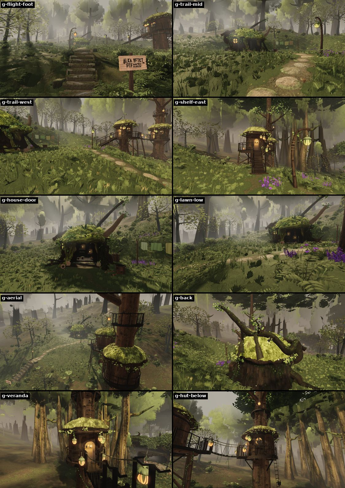
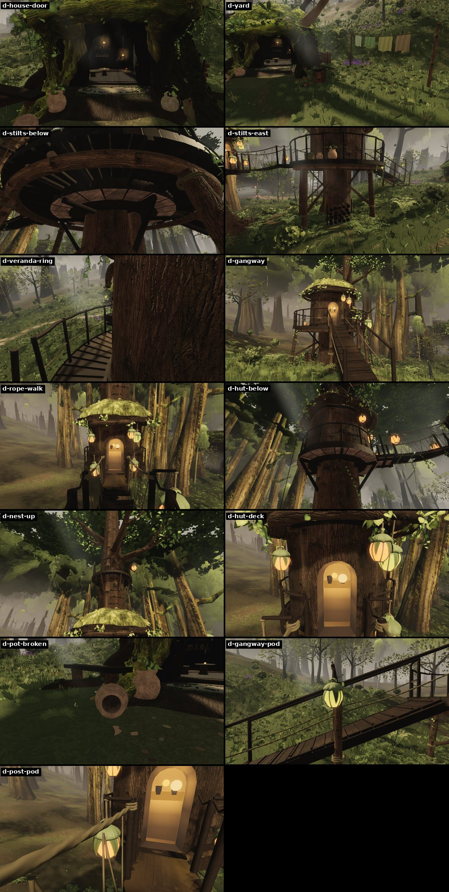
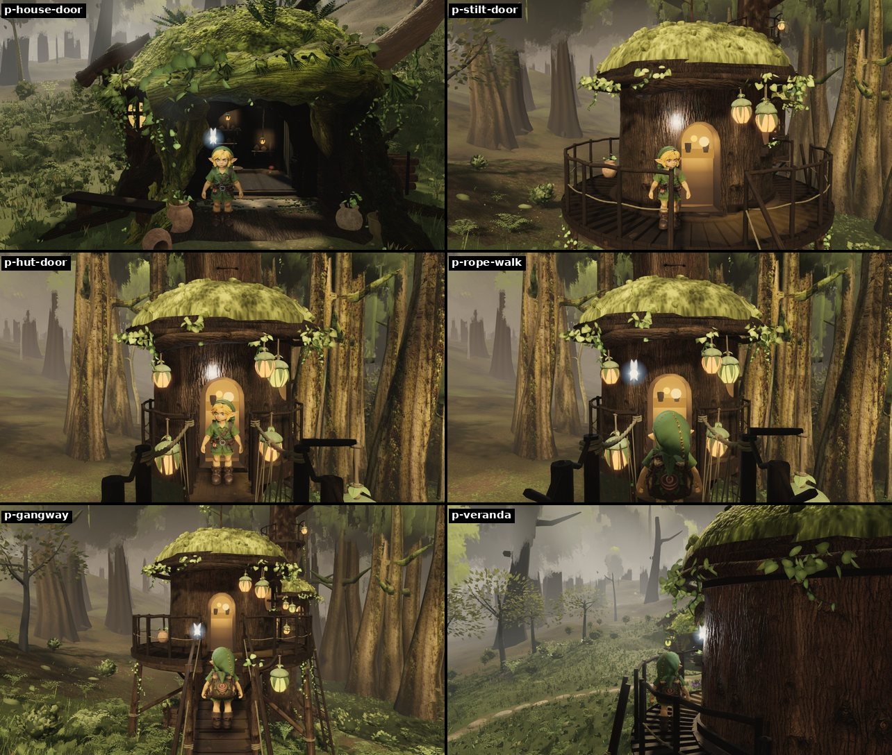
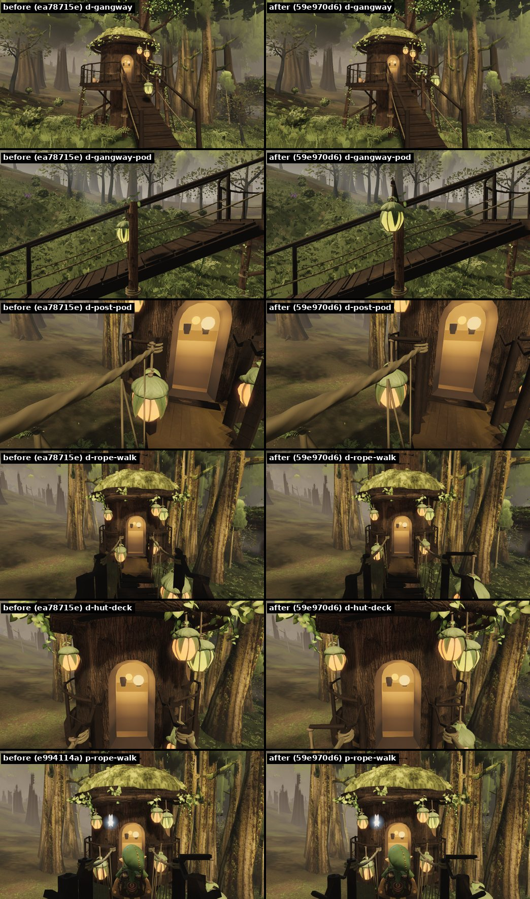
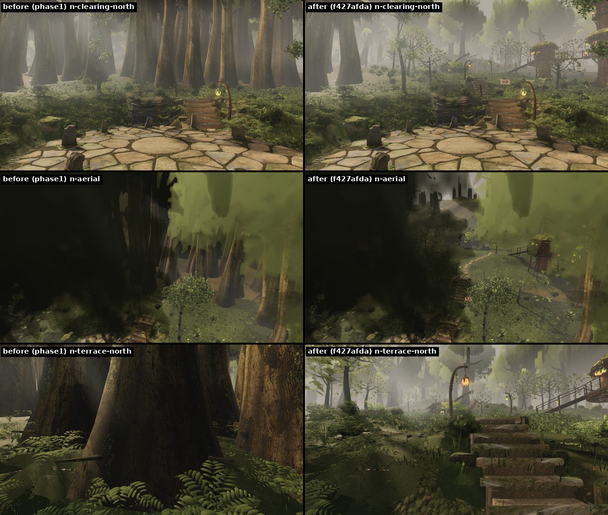

# The north grove (fable-cursor, expansion-north — 2026-09-24)

The owner, 06:07: *"are you going to add more stuff and the structures from the screenshot … more structures along the
path further down"*. Past the log arch, the second clearing and the ledge terrace, a trail climbs 30 m north into a
second hamlet on a shelf cut into the hillside: a trunk house with its yard, a stilt house over the falling east slope,
and a tree hut high on its own bark column, joined to the stilt house by a rope walk, with a lookout nest above it.
Branch `agent/fable-cursor-exp-north`.

## Results at a glance

On 59e970d6, the grove's last code commit:

- **Rubric** (`docs/RUBRIC_50_STRUCTURES.md`, 50 checks scored 0–4): the trunk house 174, the stilt house 170, the
  tree hut 171 and the grove as a place 170, out of 200. No check is under 2 (the one 2: the stilt house's cap ties to
  nothing above it) and every ★ check scores 3 or 4.
- **Walking** (checks 41–43): in Chrome the real controller walks the `north-grove` route from the second clearing to
  the tree hut's walkway deck and reaches 28 / 28 waypoints with 0 stuck frames. `northProbes` answers as intended at
  all 64 points: every railing, deck side and shut wall blocks him, and every deck holds him at its height.
- **Cost** (checks 46–47): the grove's heaviest view, the look back over the hamlet (`g-back`), is 689 draws and
  8.88 M triangles (730 draws before the fix); the other 23 of the grove's 24 views count 161–648 draws and
  1.58–8.63 M triangles. The fixed cameras A–F never draw the grove and count the same as phase1's own.
- **Camera** (check 44): in the node replays the grove's worst pop is 0.26 m (phase1's camera: 4.28 m); in Chrome the
  one frame over 100 m/s² on the grove's route is a 0.14 m second difference at the trunk house's door.
  `node --test src/camera/*.test.mjs` passes (16 tests).
- **Checks**: `npx tsc --noEmit` and `npm run build` are green, and `node --test src/world/*/*.test.mjs
  src/camera/*.test.mjs src/audio/*.test.mjs gauntlet/scripts/lib/*.test.mjs src/perfFlags.test.mjs` passes 159 / 159.
- **Merged with phase1** (6c4c918d, phase1 at eb8b727e): no conflicts, and tsc, the build and the same tests (178 / 178,
  the camera's 16 among them) are green. The merge changes none of the grove's code, its ground, its camera or the
  walk script: phase1 brings the hero flight back to 20 treads, the girls' belt, props wear and contact shadows, far
  pebbles, the crown veil and audio. The grove's 54 structure meshes hash as on 59e970d6 and the 132 outside it as on
  phase1's own. In a node count of the six heaviest grove views, each is 2–16 draws and 0.02–0.05 M triangles lighter
  on the merge (phase1's far pebble tiles stop drawing there), which puts `g-back` near 675 draws / 8.84 M. The
  Chrome walk, probes and counts in this README are on 59e970d6.

## What is where (world metres; y is absolute height)

| item | where | what |
| --- | --- | --- |
| grove sign | (2.25, 5.62, −79.1) | the village's signpost at the grove flight's foot on the ledge terrace, facing the ledge stairs' head |
| grove flight | base (0.5, 5.62, −79.85), 9 steps × 0.27 m rise × 0.42 m tread, 1.4 m wide, up to 8.05 m at z −83.6 | log-nosed earth steps up the bank (hardscape, the ledge flight's nosings) |
| lantern posts | (−1.35, −84.3) orange, 2.35 m; (3.55, −94.4) lime, 2.45 m | pod posts at the flight's head and at the shelf's lip (their point lights taken out; the pods are emissive) |
| trail | (−0.15, 8.05, −85.25) → (−0.95, −87.45) → (−0.45, −89.85) → (1.05, −91.95) → (2.3, −93.9) → (2.5, 10.0, −96.0) | a trodden path 1.9 m wide, 24 % out of the landing easing to 15 %, set stepping discs every 0.92 m |
| shelf | centre (−0.5, 10.0, −99.2), 16.4 × 10.8 m superellipse, a pad (6.7, −94.35) r 1.5 for the gangway's foot | the levelled yard; a 2 m bank on its north side, a lawn on it (`terrain/north.ts groveLawn`) |
| trunk house | trunk (−3.9, 10.0, −101.4), radius 2.2 m, door facing (0.68, 0.73), door front (−1.75, −99.1) | `house.ts` with the upper house's settings: two pods outside the wall and two room lamps hanging inside; its point lights taken out |
| the yard | washing line (0.9, −102.7) ↔ (4.5, −101.3) with 4 cloths; chopping block ≈ (0.8, −99.8); woodpile ≈ (−1.2, −103.1); bench ≈ (−3.4, −97.8); three pots and a basket of kindling by the door; a fourth pot knocked over and broken ≈ (−2.3, −97.8) | signs of life, each with a blocker |
| gangway | foot (6.16, 10.1, −94.68) → head (9.72, 11.62, −92.75), 4.05 m run, 0.84 m wide | cleated treads on two stringers, a trestle, a sill, hand rails; a lime pod at (7.52, 11.69, −92.99) on a bracket rising off the trestle's leg outboard of the hand rail |
| stilt house | centre (12.0, −91.5), floor 11.6 m, wall radius 1.55 m × 2.35 m, cap 1.05 m | a round hut on a cut stump and four log stilts on stone pads; door 0.76 × 1.55 m toward the gangway's head |
| veranda | round the stilt house, walkable ring 1.81–2.45 m from its centre, railing at 2.58 m | plank deck, bent-pole rail on posts with a rope mid-rail; pots and a herb basket; a wooden ladder down its south side (decorative) |
| rope walk | (14.03, 11.6, −88.84) → (15.36, 11.3, −87.09), 0.84 m wide, 0.12 m sag | planks on two floor ropes between the walkway stubs, hand ropes lashed to the stubs' end posts (round poles with a rope rail, `roundWalkway`) |
| tree hut | centre (16.8, −85.2), floor 11.3 m (4.3 m up its column), wall radius 1.45 m × 2.3 m | on its own bark column (base radius 0.9 m, 22 m tall, limbs into a crown from 17.5 m); door 0.72 × 1.5 m toward the rope walk; a walkway deck at the rope walk's end |
| tree hut's dressing | rope ladder (−30°), hoist with its basket (40°), a woodpile in the column's root gap, a basket of leaves | the ladder is decorative |
| lookout nest | on the column over the hut's cap, floor 16.3 m, ring radius 1.2 m | boards, rungs up the column, the same railing as the veranda |
| light pools | 15: under the trunk house's 2 outside pods and the posts' 2 (on the ground), the gangway's pod (one on the treads beside it, one on the slope under it), the stilt house's 4 (on the veranda) and the tree hut's 5 (on its platform and walkway stub); the room lamps inside the trunk get none | additive vertex colour, `lanternGlow` at ≤ 0.085 linear, clipped to the deck it lands on, faded by the haze's extinction; no light joins the scene |
| pods | 17: the trunk house's 2 outside + 2 room lamps, 2 posts, the gangway's, the stilt house's 4, the tree hut's 5, the nest's 1 | the huts' walkway post pods hang from brackets 0.28 m outboard of their posts (`postPodsOutboard`); every pod is at least 8 cm clear of anywhere Link can stand; they glow and cast no sun shadow |
| understory | 16 leafy trees round the walks, crowns ≥ 4.5 m off the decks and huts and ≥ 2.2 m off the walkable ground | `trees` north-grove zone, drawn only near the grove |

Everything in the grove is 78–112 m north of the plaza, behind the log arch and the ledge. It is drawn only within
`GROVE_VISIBLE_M` (60 m) of it and only when the frustum meets its spheres (`util/groveLocality.ts`); no fixed camera
frames it.

**Decorative, not walkable:** the stilt house's wooden ladder down its south side and the tree hut's rope ladder (the
veranda's railing and the hut's platform railing run across their heads; probes `veranda-rail` and `hut-rail` blocked).
The huts' doors are shut to Link (the wall ring has no gap; probe `hut-door` and `stilt-wall` blocked) — the rooms are
glimpsed, not entered.

## Images

Headless Chrome (SwiftShader), 960 × 540 at t = 12.5 s, 6 settle frames; the play-mode frames are 1280 × 720 with
Link on the real controller and the follow camera.

`grove-views.jpg` (59e970d6): from the grove flight's foot, the trail's middle, the trail's west bend, the shelf's east
side, the trunk house's door, low over the lawn, from above, the look back over the hamlet from the bank behind the
trunk house (`g-back`), from the veranda to the rope walk, and under the tree hut.

`grove-details.jpg` (59e970d6): the trunk house's door and yard, the stilts from below and from the east slope, the
veranda's ring, the gangway, the rope walk, under the tree hut, the nest from below, the tree hut's walkway deck, the
broken pot, the gangway's pod and a walkway post's pod.

`play-views.jpg` (59e970d6): Link at the trunk house's door, the stilt house's door and the tree hut's door, on the
rope walk, on the gangway and on the veranda.

`pods-before-after.jpg`: ea78715e (before e994114a) against 59e970d6, the same five shots at the same clock, and in the
last row the play camera on the rope walk (e994114a against 59e970d6). The gangway's pod hung over the treads at Link's
hip and now hangs from a bracket off the trestle's leg outboard of the hand rail; the huts' walkway post pods hung on
the rail line and now hang 0.28 m outboard; the walkway's square posts and rail are round poles and a rope; the pods
cast no husk shadow.

`before-after-terrace.jpg`: from the second clearing, from above and on the ledge terrace, on phase1 and with the grove
(f427afda). Where phase1 ends in a wall of trunks, the grove's sign and flight rise off the terrace and the stilt house
and the tree hut show through the trees.

## The 50 checks (`docs/RUBRIC_50_STRUCTURES.md`)

Four items, each scored 0–4 per check, judged at player height in play mode and from the grove's views:

- **T**: the trunk house and its yard.
- **S**: the stilt house with its stump, stilts, veranda and gangway.
- **H**: the tree hut with its column, walkway stub, rope walk and lookout nest.
- **G**: the grove as a place (the sign, the flight, the trail, the lantern posts, the shelf and its lawn, the understory).

Evidence names a tile on one of the sheets: *views* (`grove-views.jpg`), *details* (`grove-details.jpg`), *play* (`play-views.jpg`), *pods* (`pods-before-after.jpg`) or *terrace* (`before-after-terrace.jpg`); or it names a number. The numbers come from the structures audit and the probes on the final build (59e970d6) unless the row says otherwise.

| # | check | T | S | H | G | evidence |
| --- | --- | --- | --- | --- | --- | --- |
| 1 ★ | reads in one glance from 20 m | 4 | 4 | 4 | 3 | views g-house-door (9 m), g-shelf-east (the stilt house at 12 m, the tree hut at 19 m), g-trail-west, g-hut-below: a house grown in a trunk, a hut on stilts with a stair up to it, a hut high on its own column with a lookout. G: from the flight's foot (views g-flight-foot) the sign, the steps, a post and the stilt house over the bank read as a way up to somewhere, but the hamlet only shows as a whole from the trail |
| 2 | Kokiri proportions, Link beside it | 3 | 4 | 4 | 3 | doors S 0.76 × 1.55 m, H 0.72 × 1.5 m (`doorSize`); play p-stilt-door and p-hut-door show Link (1.25 m) a head under the lintel. T keeps the village's upper-house door (house.ts), roomier than a Kokiri needs (play p-house-door). G: the flight's 0.27 m rise per 0.42 m tread is on the steep side for his legs |
| 3 | irregular, hand-built outline | 4 | 3 | 3 | 3 | T: the trunk's buttress roots and lobed cap (house.ts). S/H: the walls wobble ±2 cm and taper, the caps' rims are lobed, the rails are bent poles and the walkway stubs' posts capped round poles with a sagging rope rail (details d-veranda-ring, d-hut-deck), but the huts are still round barrels in outline. G: the trail wanders and its discs are all different |
| 4 | varies from its siblings with purpose | 3 | 4 | 4 | 4 | three kinds of house on one shelf: grown in a trunk, raised on a stump over the falling slope, lifted up a column to the canopy with a nest above. Each has its own dressing (S flowers 7, herbs 6, an awning; H a ladder of 14 rungs, a hoist and a woodpile in the roots; T a yard). T is the village's upper-house type with its own settings |
| 5 | holds up from above and below | 3 | 3 | 3 | 3 | details d-stilts-below and d-hut-below (looking up 20–30°), views g-aerial and g-back (looking down 25–30°): no open undersides, the decks show their beams and the nest its boards from below |
| 6 ★ | every part visibly held | 3 | 4 | 3 | 4 | S: the hut on a cut stump, the veranda's ring beam on four stilts on stone pads, the gangway's stringers on a lashed trestle and a sill log (details d-stilts-below, d-gangway). H: the platform on the column's shoulder, the walkway stub on posts, the rope walk's planks on two floor ropes tied to end posts (details d-rope-walk, d-hut-below). Every pod hangs from a peg, a bracket or a toggled cord (details d-gangway-pod, d-post-pod). T/H 3: the house.ts window shelf and the hut platform's outer edge read as carried by the trunk and column without a visible bracket |
| 7 | joints meet: no gaps, floats, z-fighting | 3 | 3 | 3 | 3 | the grove's largest base gap is 0.52 mm; every log's seam closes (0.00 mm, was 10.7 mm) and the rings' maps meet themselves (f427afda, 41b3809d). Nothing z-fights in the views; the pools sit 12 mm over the decks and 30 mm over the ground |
| 8 | load paths make sense | 3 | 4 | 4 | 3 | S: deck boards on the ring beam, the ring beam on stilts, the stilts on pads (details d-stilts-below, d-stilts-east). H: the platform on the column, the nest's ring on the column over the cap, the rope walk sagging 0.12 m between its posts. T: the house.ts root arch carries the trunk. G: the posts stand in the ground, the sign on its post |
| 9 | trim and edges finished | 4 | 3 | 3 | 3 | T: the threshold slab, the door frame and the eave board (details d-house-door). S/H: a sill plank across each hut's door, a fascia round each deck, the veranda's rail capped, a sill log across the gangway's foot (details d-veranda-ring, d-gangway) |
| 10 | small detail at 2–5 m | 4 | 4 | 4 | 4 | details d-gangway-pod and d-post-pod (brackets, cords, toggles), d-rope-walk (plank ends, rope lashings), d-gangway (cleats every 0.36 m, one lost with its two pegs left), d-pot-broken (shards); 64 veranda boards, 34 railing posts, 19 treads |
| 11 ★ | wood reads as wood, bark as bark, stone as stone | 4 | 3 | 3 | 4 | the planks carry the plank atlas along their length with end grain on the cut ends; the logs are bark tubes with checked end caps; the pads and discs are stone (details d-gangway, d-stilts-east, d-rope-walk; views g-trail-mid). S/H 3: the walkway stubs' posts were square 9 cm bars that read as black boxes in the caps' shade; they are capped round poles with rope lashings now and read as wood at 2–3 m (details d-hut-deck), but a metre from the play camera, still in that shade, they are near-black with no grain (pods, play p-rope-walk and p-hut-door) |
| 12 | texel density matches the neighbours | 3 | 3 | 3 | 3 | the rings' maps now run 1.2–1.6 texture tiles a metre where they had folded to 18–39 (the stump 1.20 against 0.74 on the wall next to it, f427afda); the decks and rails share the village's 1.6 m tile |
| 13 | colour and value in the village's palette | 4 | 3 | 3 | 3 | warm browns and moss greens throughout; the lime pods are the village's lime; nothing in the grove is near white (check 38) |
| 14 | believable roughness and sheen | 3 | 3 | 3 | 3 | the village's own materials: matte wood, soft moss, dry stone. Nothing in the grove is wet, so no stone is glossy |
| 15 | no stretching, seams or tiling at 3–10 m | 3 | 3 | 3 | 3 | the grove's own rings and logs are seamless: the stump's, column's and fascias' maps meet themselves (f427afda) and so do the huts' window tunnels, cap skirts, eave rolls and platform rims (41b3809d: folded triangles per hut 33 → 22; what is left is the rope's, at 7.4 tiles a metre, invisible at 3 m). T: house.ts's threshold and eave band fold their maps over a few triangles (63 and 23), shared with the village's houses and not visible at 960 × 540 (details d-house-door) |
| 16 ★ | weathering follows exposure | 3 | 3 | 3 | 3 | moss on the caps and on the posts' and stilts' feet (footMoss), the stump's and column's bark darker at the foot; the hand rails' tops rubbed pale (details d-gangway, d-veranda-ring). No sun-bleach beyond the village's |
| 17 | wear follows use | 3 | 4 | 3 | 4 | S: the sills dished and trodden pale, the gangway's treads and rail tops worn (details d-gangway). G: the trail trodden bare between set stepping discs (views g-trail-mid). T: the house.ts threshold worn. H: the walkway's boards worn toward the door |
| 18 | signs of life, placed | 4 | 4 | 3 | 4 | T: a washing line with 4 cloths, a chopping block, a woodpile of 59 logs, a bench, three pots and a kindling basket by the door, a fourth pot knocked over (details d-yard, d-pot-broken). S: flower boxes (7), herbs drying (6), an awning, pots and a herb basket on the veranda. H: a hoist with its basket, a woodpile in the column's root gap, a basket of leaves |
| 19 | damage plausible and sparse | 3 | 3 | 3 | 3 | the broken pot at T's door (details d-pot-broken), the gangway's lost cleat (details d-gangway), a checked end cap here and there; nothing else broken |
| 20 | nothing brand-new unless meant | 3 | 3 | 3 | 3 | every plank carries grain and tone jitter (0.82–1.15), the logs bark, the rails worn; the pots have darkened insides (f2437aea) |
| 21 ★ | sits in the terrain | 4 | 3 | 4 | 4 | T: its roots run into the shelf (house.ts root tips on the terrain). S: the stump's foot sinks 1.05 m, the stilts stand on pads half sunk (details d-stilts-east). H: the column's 5 roots spread into the slope (details d-hut-below). G: the shelf is levelled into the hill with a bank behind it, the trail trodden in, the flight cut into the bank (views g-lawn-low, g-flight-foot) |
| 22 | no floating corners, nothing buried | 3 | 3 | 3 | 3 | largest base gap 0.52 mm over every foot, pad, post and pot; the gangway's pad and the sill log sit on the shelf's pad |
| 23 | contact shadow / AO | 3 | 3 | 3 | 3 | shadow maps at every foot, moss tufts round the posts' and stilts' feet, the root gaps darker (details d-stilts-east, d-hut-below) |
| 24 | vegetation grows round it | 3 | 3 | 3 | 4 | grass and ferns up to the feet and off the trail (`builtFootprints` keep them out of every footprint), the lawn on the shelf, 16 understory trees round the walks with crowns ≥ 4.5 m off the decks (views g-lawn-low, g-trail-west) |
| 25 | paths lead to its door from the walk network | 4 | 4 | 4 | 4 | the second clearing → the ledge flight → the sign → the grove flight → the trail → the trunk house's door; the shelf → the gangway → the stilt house's door; the veranda → the rope walk → the tree hut's door. The route `north-grove` walks all of it (28 waypoints) |
| 26 | recessed doors and windows | 4 | 3 | 3 | 3 | T: the door under the root arch with a room behind it (details d-house-door). S/H: round-topped doors in tunnels through the wall, round windows with a splayed reveal and cross bars |
| 27 | interiors glimpsed with depth | 4 | 3 | 3 | 3 | T: a furnished room lit by two hanging lamps and embers (details d-house-door). S/H: the doors open on a warm-lit recess, a back wall with a shelf, two cups and two lamp discs (play p-stilt-door, p-hut-door), not a flat card or a void; the rooms behind are not modelled |
| 28 | openings face where people come from | 4 | 4 | 4 | 4 | T's door faces the trail's arrival (0.68, 0.73); S's door the gangway's head; H's door the rope walk; the sign faces the ledge stairs' head |
| 29 | round Kokiri doors and windows | 4 | 4 | 4 | 4 | round-topped doors and round windows on every house |
| 30 | curtains, shutters or leaves soften the openings | 3 | 3 | 3 | 3 | vines and leaf fringes hang over the doors (the door boughs' pods and leaves), the eave fringe over each window |
| 31 ★ | soft, organic roof edges | 4 | 3 | 3 | 3 | T: the house.ts moss cap rolls over its rim. S/H: lobed moss caps with an eave roll and a fringe of leaves (views g-shelf-east, g-hut-below); the caps' rims are lobed, not polygons, but the moss sheet's edge is still a clean line from 10 m |
| 32 | eaves overhang and shade the walls | 3 | 4 | 4 | 3 | the huts' caps hang 2.2 m over the decks and shade the walls' tops (views g-veranda, details d-veranda-ring) |
| 33 | thickness at every edge | 4 | 3 | 3 | 3 | the caps' skirt and eave roll give the moss sheet an edge, the decks a fascia, every board a thickness (0.045 m treads) |
| 34 | tops carry growth | 4 | 4 | 4 | 4 | moss caps with cushion lumps on all three, a sapling in the stilt house's cap (views g-back), leaves on the rails and pods' brackets |
| 35 | the roof line ties to the tree or rock | 4 | 2 | 4 | 3 | T is a tree. H's column runs on up through the nest into its crown. S's cap ties to nothing above it: a hut on a cut stump under open sky and the understory's crowns |
| 36 ★ | pods glow warm and steady, each on a believable hanger | 4 | 4 | 4 | 4 | the crafted pods (ribs, panels, a flame) glow and cast no sun shadow (a husk's shadow under a lit lamp read as a smudge; e52bc63a); they hang from pegs, toggled cords and brackets; the gangway's pod and the huts' post pods now hang from brackets outboard of the rails (details d-gangway-pod, d-post-pod; pods), clear of Link by 8 cm or more (all 17 pods; four hung in his way before, e994114a) |
| 37 | light pools restrained and soft | 3 | 3 | 3 | 3 | 15 pools of additive `lanternGlow` at ≤ 0.085 linear, soft-edged, clipped to the surface they fall on and faded by the haze (views g-house-door, play p-hut-door) |
| 38 | no clipped whites | 3 | 3 | 3 | 3 | on 59e970d6 no pixel of the 23 views and details has all three channels over 235; the brightest are the pods' flames at (253, 200, 107). In the six play frames 0–3 pixels pass 235 and none 245, all of them in the fairy's glow beside Link |
| 39 | reads in the shafts and in shade | 3 | 3 | 3 | 3 | the stilt house in the light and the tree hut in the column's shade (views g-shelf-east, g-hut-below); the trunk house's door in shade with its room lit (details d-house-door) |
| 40 | no new real-time light | 4 | 4 | 4 | 4 | the grove adds none: the structures system has 18 point lights on phase1 and 18 here; the house's and posts' 6 are taken out, every glow is emissive |
| 41 ★ | Link walks every intended surface | 4 | 4 | 4 | 4 | in Chrome on 59e970d6 the real controller walks the `north-grove` route from the second clearing up both flights, along the trail to the trunk house's door, back across the yard, up the gangway, round the veranda and over the rope walk onto the tree hut's walkway deck: 28 / 28 waypoints, 0 stuck frames (as on e156566f). The node replays walk the grove 48 more ways and reach every waypoint |
| 42 | walls, rails and edges block him | 4 | 4 | 4 | 4 | `northProbes` on 59e970d6: 64 / 64 as intended. Every railing, deck side, shut wall and door, the tree hut's railed platform and the trunk house's bole block him; the veranda, the gangway, the rope walk and the walkway deck hold him at their heights. The decorative ladders' heads are railed (probes on the veranda railing and the hut's railing) |
| 43 | walkable rise, even underfoot | 3 | 3 | 3 | 4 | flight 0.27 m rise per 0.42 m tread, gangway 20.5° with a cleat every 0.36 m, rope walk 0.3 m drop and 0.12 m sag, trail 24 % easing to 15 %; all under the 0.55 m step guard; the feet's sole gap 3 mm median, 28 mm p95 along the route |
| 44 | camera never inside, never pops over 0.3 m | 3 | 4 | 4 | 3 | the camera section: in the node replays the grove's worst pop is 0.26 m (phase1's camera 4.28 m); in Chrome one frame over 100 m/s² at T's door, a 0.14 m second difference |
| 45 | footsteps play the right surface | 3 | 4 | 4 | 4 | wood on the veranda, gangway, stubs, rope walk and hut platform (`onGrovePlanks`), stone on the discs, grass on the lawn (`src/world/terrain/expansionNorth.test.mjs`); T's yard is grass and its threshold plays grass |
| 46 ★ | every hero view ≤ 9.0 M triangles and ≤ 700 draws, its own too | 4 | 3 | 4 | 3 | Chrome, 59e970d6 (the cost section). T: its door, yard and broken-pot views 161–183 draws / ≤ 1.71 M. S: its heaviest view, `d-stilts-east`, 648 draws / 8.63 M. H: `d-hut-deck` 572 / 7.26 M, `d-rope-walk` 564 / 7.43 M. G: the look back over the hamlet, `g-back`, 689 / 8.88 M (730 draws before the fix). All 24 of the grove's views are within budget; A–F count the same as phase1's own, the grove hidden there. S and G score 3: their heaviest views sit 7 % and 2 % under the draw budget |
| 47 | hidden when far or off-screen | 4 | 4 | 4 | 4 | drawn only within 60 m (`GROVE_VISIBLE_M`) and when the frustum meets its spheres (`util/groveLocality.ts`); off-screen it costs 0 draws |
| 48 | deterministic | 3 | 3 | 3 | 3 | the structures' 186 meshes (47 of them the grove's) hash identically in two separate builds of 59e970d6; no `Math.random` in `src/world` (seeded `prng` forks); the 108 node camera replays reproduce to the digit on 59e970d6; A, B and C count the same draws and triangles on two builds that differ only inside the grove. Rendered twice at the same clock, four of the pods sheet's five shots are pixel-identical and the rope walk differs in 6 of 518 400 pixels by one level, all in the foliage at the frame's upper right, none on the structures |
| 49 | belongs to this forest | 4 | 3 | 3 | 3 | the village's own house, huts, pods, posts, sign, rope and materials, in its palette (views g-trail-west, g-house-door) |
| 50 | the owner would stop and look | 3 | 4 | 4 | 4 | the hamlet from the trail's bend (views g-trail-west), the rope walk from the veranda (views g-veranda), the nest over the tree hut (details d-nest-up) |
| | **total** | 174 | 170 | 171 | 170 | ship at ≥ 170 with no check under 2 and every ★ at 3 or more |

## Walking it (checks 41–45)

The route `north-grove` in `gauntlet/scripts/playtest.mjs` drives the real player controller in Chrome from the second
clearing (3.6, −65.2): up the ledge flight, past the sign and up the grove flight, along the trail to the trunk house's
door, back across the yard, up the gangway, round the veranda the south way past the decorative ladder's head, over
the rope walk and onto the tree hut's walkway deck. 28 waypoints.

| build | waypoints | stuck frames | frames | walked | camera accel p95 / max | frames over 100 m/s² | camera lowest above ground | feet: sole gap p95 |
| --- | --- | --- | --- | --- | --- | --- | --- | --- |
| e156566f (all 11 routes, 10:38 UTC) | 28 / 28 | 0 | 1248 | 61.8 m | 69.6 / 124.6 m/s² | 1 | 1.53 m | 0.047 m |
| 59e970d6 (the grove's route only, 14:18 UTC) | 28 / 28 | 0 | 1248 | 61.8 m | 69.6 / 124.6 m/s² | 1 | 1.53 m | 0.028 m |

On both builds the one frame over 100 m/s² is the same, at the trunk house's door (Link at (−0.75, 10.02, −98.8)) as
he turns back into the yard: the camera swings 0.36 m in that frame while holding its distance (nothing cut the line;
keep 1 → 0.987). What reads as a pop is the change in its motion, the second difference of its position, and that is
0.14 m.

The e156566f run's other routes all reach every waypoint with nothing stuck:

| route | waypoints | frames | walked | camera accel p95 / max (m/s²) | frames over 100 m/s² |
| --- | --- | --- | --- | --- | --- |
| plaza-to-upper-house | 6 / 6 | 627 | 27.2 m | 69.8 / 79.4 | 0 |
| plaza-to-south-bank-top | 4 / 4 | 306 | 14.8 m | 6.3 / 72.3 | 0 |
| saria-front-arc | 3 / 3 | 105 | 5.3 m | 68.3 / 72.3 | 0 |
| west-deck | 3 / 3 | 132 | 6.2 m | 69.9 / 73.0 | 0 |
| plaza-loop | 4 / 4 | 510 | 26.9 m | 69.8 / 94.2 | 0 |
| south-approach | 2 / 2 | 264 | 13.8 m | 46.5 / 72.3 | 0 |
| house-west-to-saria-door | 5 / 5 | 204 | 8.8 m | 71.3 / 73.2 | 0 |
| west-house-to-plaza | 5 / 5 | 402 | 20.5 m | 69.7 / 412.4 | 2 (phase1's camera: 6, see the camera section) |
| north-clearing-ledge | 15 / 15 | 1569 | 82.2 m | 67.8 / 87.8 | 0 |
| south-bridge-to-log | 21 / 21 | 969 | 51.4 m | 68.0 / 72.3 | 0 |

The node replay (the camera section) walks the grove 48 more ways — there and back, hugging the veranda both ways, at walk,
jog and run with different arrival radii and steering — and reaches every waypoint in all 48, on the current build
with the broken pot's blocker as before it.

**Edges.** `northProbes` asks the ground at 64 points what Link would stand on; all 64 answer as intended, on 59e970d6
as on e156566f:

| where | expected | ok |
| --- | --- | --- |
| veranda, 7 bearings round the stilt house at 2.05 m | the deck's height | 7 / 7 |
| veranda railing, 8 bearings at 2.58 m (the decorative ladder's head at 108° among them) | blocked | 8 / 8 |
| the stilt house's wall at 1.4 m (on the door's bearing, 90°, −30°) | blocked | 3 / 3 |
| gangway, 3 stations × centre and ±0.28 m | the gangway's height | 9 / 9 |
| gangway sides, ±0.47 m | blocked | 6 / 6 |
| rope walk, 3 stations × centre and ±0.25 m | its sagging height | 9 / 9 |
| rope walk sides, ±0.46 m | blocked | 6 / 6 |
| the tree hut's walkway deck at 1.9 m | the floor's height | 1 / 1 |
| the tree hut's platform off the walkway, 4 bearings at 1.5 m (a ledge inside the wall's clearance) | blocked | 4 / 4 |
| the tree hut's railing, 3 bearings | blocked | 3 / 3 |
| the tree hut's door, 1.35 m on the walkway's bearing | blocked | 1 / 1 |
| the trunk house's bole | blocked | 1 / 1 |
| the trunk house's door front, 4 trail points, the flight's middle | walkable, at the ground's height | 6 / 6 |

On e156566f the south expansion's 41 probes hold too (41 / 41).

**Steps and ramps (check 43).** The flight rises 0.27 m per 0.42 m tread, the gangway 1.52 m over 4.05 m (20.5°) with
a cleat every 0.36 m, the rope walk falls 0.3 m with 0.12 m of sag, the trail climbs at 24 % out of the landing, easing
to 15 %. All of it is well under the 0.55 m step guard. Along the route the feet's sole gap is 3 mm at the median and
28 mm at p95 on 59e970d6 (47 mm on e156566f).

**Footsteps (check 45).** `src/audio/index.ts` `onGrovePlanks` plays wood on the veranda, the gangway, the walkway
stubs, the rope walk and the tree hut's platform; the trail's discs play stone and the lawn grass
(`src/world/terrain/expansionNorth.test.mjs` checks each).

**Not the grove's.** On e156566f `climb.main.reachedTop` is false on this branch and on phase1-based builds alike: the
same end point (13.74, ·, −5.12) after the same 255 frames, with no stalled frame. The hero flight had 26 treads then
and the climb's frame budget ended before its top (W02). Phase1's 36d722fa, merged here in 6c4c918d, puts the flight
back to 20 treads; the climb was not re-run on the merge. The pad's look reaches 60.2° up and −35.5° down, as on phase1.

## Cost (checks 46–47)

`gauntlet/scripts/pose-counts.mjs` in Chrome (960 × 540, the world at t = 12.5 s, 6 settle frames per pose), the
grove's views before the draw fix (e994114a) and after it (59e970d6):

| view | e994114a draws / triangles | 59e970d6 draws / triangles |
| --- | --- | --- |
| `g-back`, the bank behind the trunk house, looking back over the hamlet to the village | 730 / 8.88 M | 689 / 8.88 M |
| `d-stilts-east`, the stilts from the east slope | 690 / 8.62 M | 648 / 8.63 M |
| `g-veranda`, from the veranda to the rope walk | 658 / 8.54 M | 640 / 8.50 M |
| `d-hut-deck`, the tree hut's walkway deck | 599 / 7.34 M | 572 / 7.26 M |
| `d-rope-walk`, along the rope walk | 583 / 7.46 M | 564 / 7.43 M |
| `d-stilts-below`, under the veranda | 551 / 7.44 M | 512 / 7.41 M |
| `g-shelf-east`, the shelf's east side | 503 / 5.89 M | 469 / 5.91 M |
| `d-gangway`, the gangway from the shelf | 496 / 6.36 M | 462 / 6.35 M |
| `d-hut-below`, under the tree hut | 475 / 6.35 M | 448 / 6.27 M |
| the other 12 views counted on both builds: `g-flight-foot`, `g-trail-mid`, `g-trail-west`, `g-lawn-low`, `g-house-door`, `d-house-door`, `d-yard`, `g-aerial`, `g-hut-below`, `g-veranda-out`, `d-veranda-ring`, `d-nest-up` | 184–335 / 1.64–4.56 M | 161–304 / 1.65–4.48 M |
| `d-post-pod`, a walkway post's pod (new since e994114a) | | 383 / 4.73 M |
| `d-pot-broken`, `d-gangway-pod` (new since e994114a) | | 163 / 1.58 M, 164 / 1.66 M |

The fix is two commits. In e52bc63a the pods, the log ends and the lichen plates stop casting: every caster is a
second draw in the sun's shadow pass, and the pods glow (a husk's shadow under a lit lamp reads as a smudge), the
plates lie on the bark and the end caps shade only inside their logs' own shadow. In eeb94809 the grove's far-LOD
plants draw as one pack per LOD: the village splits these per variant because it holds thousands of each plant, and
the grove holds tens to a few hundred. Only whole merge buckets changed (`consolidateStaticMeshes` keys on
`castShadow`, so half a bucket costs a draw). The triangles stay where they were: the shadow pass lost 87 k and a
pack's unused slots draw zero-area triangles.

**On the merge with phase1** (6c4c918d), a node count of the same six poses: every system built from source, the
lighting system's sun and shadow box, the renderer's frustum and shadow culling. On 59e970d6 it reads −39 to +4 draws
and −0.01 to +0.29 M triangles against Chrome, so only the change between the builds is the evidence:

| view | 59e970d6 (node) | 6c4c918d (node) | change |
| --- | --- | --- | --- |
| `g-back` | 693 / 9.17 M | 679 / 9.13 M | −14 / −0.04 M |
| `d-stilts-east` | 648 / 8.90 M | 633 / 8.86 M | −15 / −0.04 M |
| `g-veranda` | 640 / 8.49 M | 624 / 8.44 M | −16 / −0.05 M |
| `d-hut-deck` | 538 / 7.36 M | 525 / 7.32 M | −13 / −0.04 M |
| `d-rope-walk` | 525 / 7.48 M | 511 / 7.44 M | −14 / −0.04 M |
| `d-stilts-below` | 478 / 7.47 M | 476 / 7.45 M | −2 / −0.02 M |

At `g-back`, phase1's far pebbles take 18 tiles off, the background characters add 3 draws and the clearing's props 1.

**The hero views.** Every fixed camera stands 74 m or more from the grove's box, where the grove draws nothing, and
59e970d6 changes nothing outside the grove (the 139 meshes outside it hash identically). On 59e970d6 they count A 639
draws / 8.87 M triangles, B 628 / 8.29 M, C 571 / 7.93 M, D 562 / 8.63 M, E 628 / 8.29 M and F 599 / 8.01 M, the same
as on e994114a and as phase1's own full check (f04d9529), and A, B and C re-counted here on phase1 (3c6cc553) are
identical.

**Hidden (check 47).** The grove's structures, paving, dressing and understory are drawn only within 60 m of its box
and when the frustum meets its spheres (`util/groveLocality.ts`). In view, the grove's structures are 47 draws; from
the fixed cameras A–F the counts are the same with the grove (e994114a, 59e970d6) as without it (phase1's full
check, f04d9529; A, B and C re-counted on 3c6cc553).

## The camera change (check 44; `src/camera/follow.ts`, `src/camera/collision.ts`)

The camera is the camera lane's, so it is changed here only because the grove needs it, and measured before and
after. The grove puts Link right beside round walls: a 0.64 m-wide veranda ring round the stilt house, a gangway rising
along its wall, a door he turns about at under the trunk house's root arch. Phase1's camera meets a wall that its line
of sight swings into by pulling in to it within the same frame, and in the grove that was a 3.6–4.3 m jump every time
Link went round the veranda or turned down the gangway.

What changed:

- `collision.ts`: the huts' walls reach the camera as exact round solids (`cameraSolids.walls`, from `distantHouse.ts`
  with the barrel's taper and wobble) in place of their voxels, so a line along a wall keeps its length and a line into
  it stops at its surface. A line is blocked only where it runs through a surface (four consecutive samples, a fifth of
  a cell each), not where it clips the corner of the grown shell round it (a door's edge). A plain `sweep()` serves the
  look-ahead.
- `follow.ts`: the line is also swept where it is going (0.12, 0.3 and 0.6 s ahead), so the camera eases in before a
  wall arrives instead of jumping when it does. Every eased move along the line is held to 8 m/s and 50 m/s². The swing
  behind Link waits when swinging on would run the line into a wall and hurries when swinging faster clears it; on a
  hut's ring it trails Link along the ring. The orbit's own turn is held to 4 rad/s and 75 m/s² sideways at the camera.
- Kept: the camera lane's stair smoothing (cc360d8a, 34b81013 and 5bd1aeee are ancestors of this branch; their easing
  of the aim, the orbit's height and the ceiling duck is unchanged; where the eased duck and the pull-in disagree the
  camera's own line is swept), the pitch orbit, the look and the pad. The fixed viewpoints A–F do not use the follow
  camera.

**In Chrome**, with the real controller: the phase1 camera's own published run after the stair fix
(`art/environment/stairs-look/playtest-after.json`, 00:43 UTC) against this branch (e156566f, 10:38 UTC; the grove's
route again on 59e970d6 at 14:18, the same to the digit).

| route | phase1's camera: frames over 100 m/s², worst | this branch |
| --- | --- | --- |
| west-house-to-plaza | 6; 1128 m/s², a 1.26 m jump | 2; 412 m/s², 0.51 m |
| plaza-loop | 4; 158 m/s² | 0 (max 94) |
| north-clearing-ledge | 6; 327 m/s² | 0 (max 88) |
| plaza-to-upper-house | 2; 330 m/s² | 0 (max 79) |
| the other five village routes | 0 | 0 |
| north-grove | (no grove in that build) | 1; 125 m/s², 0.14 m second difference |

The stairs keep the camera lane's numbers: climbing the main flight 3.78 m/s² of vertical acceleration (5bd1aeee
recorded 4.95), the south bank 5.25 up and 5.25 down (5bd1aeee: 5.25 and 5.26), no spikes.

The trade: the 95th percentile of the camera's acceleration is about 70 m/s² on every route where it was about 36. A
turn behind Link now runs at a bounded 75 m/s² for a few frames instead of peaking in one; `SWING_ACCEL` is the knob.

**In the grove**, where phase1's camera has no Chrome run, a node replay: the real `follow.ts`, `collision.ts` and
structures, Link's controller mirrored, at 30 fps. The grove is 4 routes (there, back, and hugging the veranda both
ways) × 12 variants of pace, arrival radius and steering = 48 replays; the village is its 10 routes × 6 = 60.

| replays | camera | worst pop (second difference) | frames over 100 m/s² | frames moving > 0.3 m | waypoints missed | frames within 1.5 m of Link |
| --- | --- | --- | --- | --- | --- | --- |
| grove, 48 | phase1 | 4.28 m | 370 | 441 | 0 | 23.4 % |
| grove, 48 | phase1's `follow.ts` + this `collision.ts` | 4.55 m | 388 | 475 | 0 | 9.1 % |
| grove, 48 | this branch | 0.26 m | 153 | 924 | 0 | 3.0 % |
| village, 60 | phase1 | 4.65 m | 69 | 46 | 0 | 2.7 % |
| village, 60 | this branch | 1.17 m | 32 | 54 | 0 | 1.9 % |

More frames move over 0.3 m because the camera now holds its distance behind a running Link instead of collapsing onto
him, and 4.3 m back a turn sweeps it further per frame. What reads as a pop is the second difference, at most 0.26 m in
the grove (check 44 asks for 0.3 m). The collision change alone does not fix the grove: it keeps a line along a round
wall at length (within 1.5 m of Link on 9 % of frames instead of 23 %), and the look-ahead and the swing take the pops
out. Re-run on 59e970d6 (the broken pot, the pods on their brackets, the round walkway posts), all 48 grove and 60
village replays come out identical: 0.259 m, 153, 924, 0, 3.0 % and 1.172 m, 32, 54, 0, 1.9 %. The camera's code has
not changed since e156566f (da209e4b adds its tests).

Tests: `node --test src/camera/*.test.mjs` passes: `follow.test.mjs` (the camera lane's 12, unchanged) and
`walls.test.mjs` (4 new). The new ones check that a line along a wall's grown cells keeps its length and one through it
stops in front; that a round wall blocks to its surface, a tangent line passes and the air over its eave is free; that
walking and running round the veranda both ways the camera never pops over 0.3 m, never enters the wall and never
loses Link; and that a right-angle turn has no jump in its turn rate.

Left as they are: west-house-to-plaza still pops 0.66–1.17 m in 3 of 6 replay variants (phase1: 1.29–1.33 m in all 6)
and 0.51 m once in Chrome, at the west house's cap skirt; the plaza loop's U-turn has 1–3 replay frames just over
100 m/s² (0.12–0.18 m, where phase1's replay has none and its Chrome run has 4).

## What changed outside the grove's own files

The grove's own files are `src/world/structures/expansionNorth.ts`, `src/world/terrain/north.ts`,
`src/world/vegetation/expansionNorth.ts`, `src/world/util/groveLocality.ts`, `src/world/terrain/expansionNorth.test.mjs`
and `src/camera/walls.test.mjs`. The shared files each take a small addition:

| file | change |
| --- | --- |
| `src/world/layout.ts` | a new `EXPANSION_NORTH` block (the grove's places, sizes and walk numbers); no existing value moved. Inside it the stilt house's wall went 1.9 → 2.35 m and the tree hut's 1.8 → 2.3 m (137cee05), so the caps' rims hang 2.2 m over the decks |
| `src/world/terrain/heightfield.ts` | the live view inside `EXPANSION_NORTH_BOX` reads `terrain/north.ts`; the interface is unchanged and nothing outside the box moves |
| `src/world/terrain/material.ts` | the forest floor's patch grows by 57 rows on the same lattice (to z −130.1) and gives way to the grove's lawn |
| `src/world/hardscape/index.ts`, `flagstones.ts` | the grove flight and the trail's stepping discs, in a group drawn only near the grove |
| `src/world/character/ground.ts` | stands Link on the grove's discs and decks, and blocks him at the published walk edges (railings, deck sides) |
| `src/world/structures/index.ts`, `distantHouse.ts` | builds the grove; `distantHouse.ts` gains `doorSize`, `walkway.from`, `cameraWalls`, `seamlessRings` (whole texture repeats round the window tunnel, cap skirt, eave roll and platform rim), `postPodsOutboard` (the walkway's post pods on brackets 0.28 m outboard) and `roundWalkway` (the walkway's posts, rail and pod brackets as capped round poles and a rope, like the dressing's railing; its rope tint moves to module level unchanged); every default leaves the far huts and the expansion's houses as they were, and the 139 meshes outside the grove hash identically to f427afda on 59e970d6 |
| `src/world/structures/geometry.ts` (+ `geometry.test.mjs`) | `repeatsRound` and `seamUV` (a closed ring's uv with whole repeats and an extrapolated seam column), moved here from the grove so `distantHouse.ts` can share them |
| `src/world/structures/cameraSolids.ts`, `src/world/util/voxelGrid.ts`, `src/world/system.ts` | exact round walls for the camera (`CameraWall`), the grid's undilated core, `builtFootprints` for the vegetation to keep off |
| `src/camera/collision.ts`, `follow.ts` | see the camera section |
| `src/world/trees/index.ts` | the far layer keeps off the grove; a 16-tree understory zone appended last in the shared stream, so nothing else re-rolls |
| `src/world/vegetation/index.ts`, `grass.ts` | the grove's ground dressing (`vegetation/expansionNorth.ts`, which packs its far-LOD plants one draw per LOD with `packedAt`), shown only near the grove; `bladeGeometry` exported for the lawn's blade tiles. This is codex's directory: additions only |
| `src/audio/index.ts` | wood footsteps on the grove's planking (`onGrovePlanks`) |
| `gauntlet/scripts/playtest.mjs` | the `north-grove` route and `northProbes` |

The huts' doors are shut to Link: `shut()` in `expansionNorth.ts` closes the wall ring's door gap and puts its outer
edge `WALL_CLEAR` (0.16 m, his shoulder's half width) beyond the wall's widest bulge. Two notes on the history, which
is not rewritten: 7bf128ec's message says the rope walk's "east hand rope" is spliced, and it is the west one; and
97ba059a on its own does not typecheck (it reads two helpers that 34c100dc adds; both went up in the same push, and
every pushed tip builds).

## Known issues and what is left

The grove's own:

- The stilt house's cap ties to nothing above it (check 35 scores 2 for it): it is a hut on a cut stump, and the only
  thing over it is sky and the understory's crowns.
- The huts are glimpsed, not entered: their doors are shut, and behind each is a warm-lit recess (a shelf, two cups,
  two lamp discs), not a room. From 2 m the recess's back wall reads as smooth tan.
- The walkway stubs' posts and pod brackets sit in the caps' shade, and a metre from the play camera on the rope walk
  and at the tree hut's door they are near-black (check 11 scores 3 for both huts; play p-rope-walk, p-hut-door). They
  are round poles now, not boxes; a lighter wood tint or a little ambient lift on those posts would let the grain read.
- Every pool of light takes the village's `lanternGlow`, so the two lime pods (the gangway's and the shelf-lip post's)
  lay an amber pool. A per-pod tint in the pools' builder would fix it.
- The trunk house is `house.ts` with the upper house's settings, so it keeps that builder's two shortfalls: its
  threshold and eave band fold their maps over a few triangles (63 and 23; check 15) and its door is roomier than a
  Kokiri needs (check 2). Both are shared with the village's houses and left alone.
- The lawn's blade tiles (8 m) draw one call per tile in view, with no cell cull (18 draws at `g-back`).
- The camera issues listed in the camera section: the west house's cap skirt pop (improved, not gone), the plaza loop's
  replay-only frames just over 100 m/s², the swing at the trunk house's door (0.14 m second difference).

Not the grove's, seen while checking:

- The village's west house hangs three walkway pods where Link walks, 27, 20 and 9 cm into him, at (−16.0, 3.5, 6.8),
  (−18.2, 3.8, 6.6) and (−19.9, 4.7, 10.1) (the grove's pod probe run on it). `postPodsOutboard` and a shorter cord
  would clear them; it is the village's house, so it is left to its lane.
- The west house's wall ring (round 49's `distantHouse.ts` walk surface) is still ±0.2 m round its eave's radius, so
  where the wall's wobble swells Link's shoulder can overlap the wall (on the stilt house, before `WALL_CLEAR`, that
  was 0.16 m).
- `climb.main.reachedTop` was false while the hero flight had 26 treads (W02, e156566f); phase1's 36d722fa, merged
  here, puts it back to 20 and the climb has not been re-run on the merge.
- Two views outside the grove are over budget, and the grove draws nothing in either: the south far bank's look-back
  (818 draws, 9.30 M triangles; exp-south2's, flagged in f04d9529) and the perf lane's `perf-stairs2-base` (622 draws,
  9.45 M triangles). Both count the same on e994114a and on phase1 (3c6cc553).
- The views that look back over the village carry its background characters, a few pixels tall 100 m off: 57 draws
  and 6 more in the shadow pass at `g-back` (node count; 60 and 6 on the merge with phase1). A distance cull in the character lane is the largest saving
  left there.
