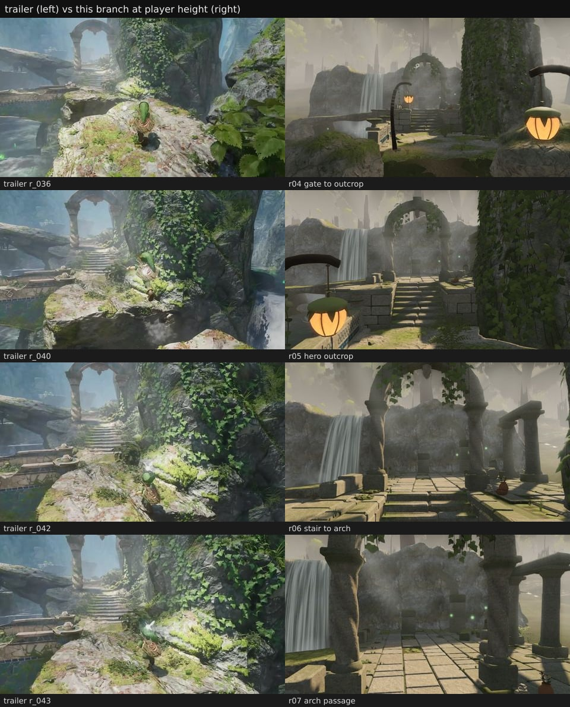
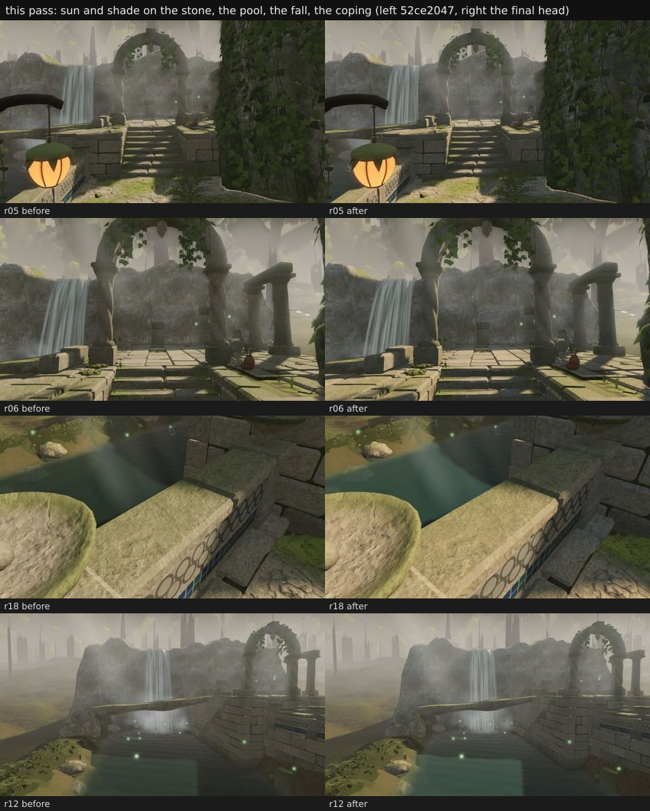
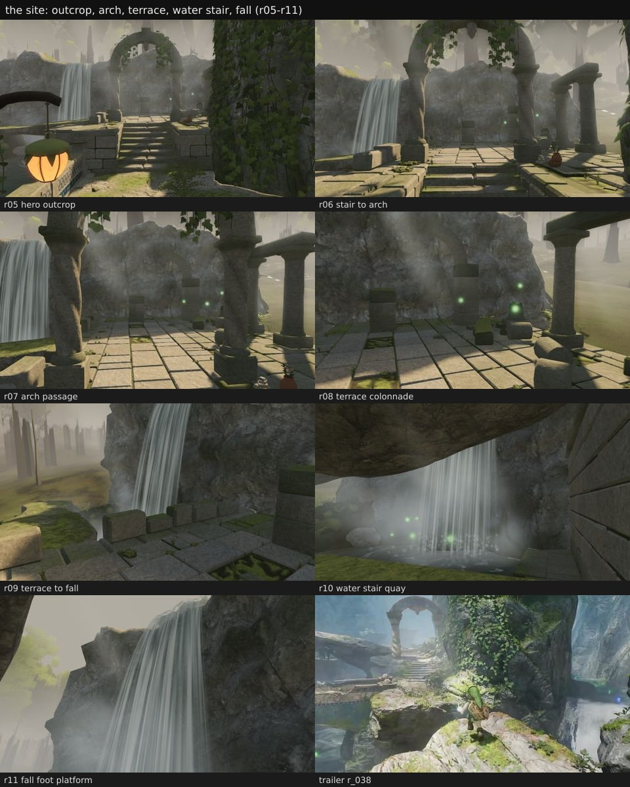
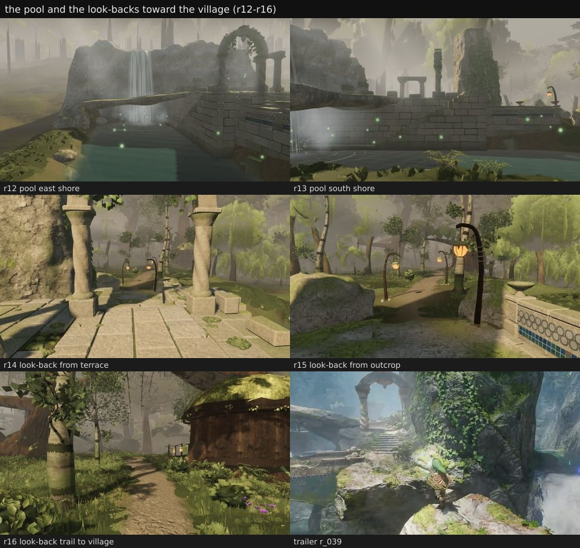
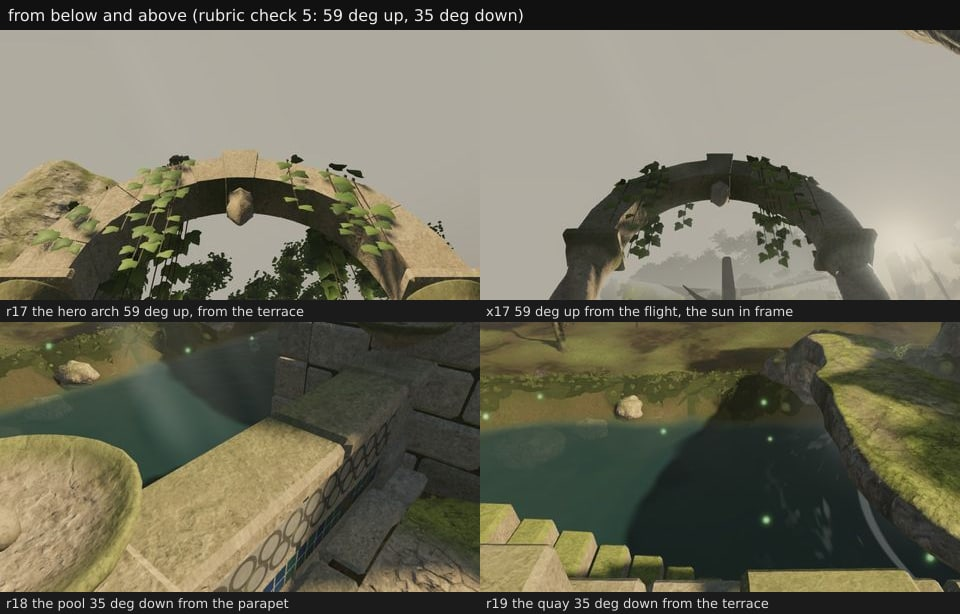
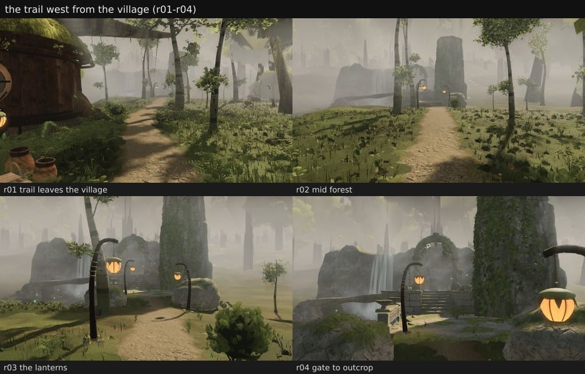

# exp-ruins: the waterfall ruins west of the village (2026-09-24 / 26)

Trailer shot r_036–r_043 (`reference/frames-dense/review46/`): a path runs west past the west house to mossy stone
arches, a terrace, and a waterfall into a pool. Branch `agent/fable-cursor-exp-ruins`. Every image here is 960×540 at
`quality=high`, simulation time 12.5 s, HUD off, character as the capture places him (at the spawn in the village).

## Results at a glance

Measured on the build of fcec1575, whose `src` is unchanged through de701e09 and which has canonical 33e92705 merged
(the new legs, the column-lobe and far-foliage batches, the audio rounds), against canonical 33e92705 itself; every
capture with `views.mjs --settle 6`. The branch has since merged canonical 2b15f687 (e76effad: the trees' far-shadow
depth trim, lodFade 3 and kept instance attributes, the audio's release and step levels; no ruins file). That merge
passes tsc and the tests (257 / 257) but the cost and the heroes are not re-measured on it; fable-5 read the far-shadow
trim on canonical as pixel-identical at A–F with the same draws and 0.10–0.20 M fewer depth-pass triangles. The walk,
the probes and the camera check were re-run on e56a4c0f's build (the water stair's span fix, 2b15f687 merged). On all
three routes Link's path and the follow camera are frame for frame as on fcec1575's build, and the 80 probes read the
same; only the water stair's feet changed.

- **Rubric: 158 / 200, NOT READY** (ship bar ≥ 170, no check below 2, ★ ≥ 3). Below 3: #44 camera (2) and
  #46★ budget (2).
- **Budget (700 draws / 9.0 M triangles):** heroes A–F within (max A 574 / 8.746 M); the ruins' views r01–r19
  within (max r16 607 / 8.492 M). The trail's east end is over on triangles: r20 674 / 9.908 M, where canonical draws
  661 / 10.142 M at the same pose (the village's own cost; the ruins draw nothing there).
- **Heroes against canonical:** A, B, D, E and F pixel-identical, one draw and 0.012 M triangles fewer each; C moves
  839 px (0.16 %, max Δ 44), scattered blade edges at the back of the flower bed right of the plaza.
- **Walk (new legs, walk 1.2 / run 2.2 m/s):** `plaza-to-ruins-terrace` 26 / 26, `ruins-trail-to-shore` 10 / 10,
  `ruins-water-stair` 15 / 15, 0 stuck; `ruinsProbes` 80 / 80. Soles p95 2.1–7.2 cm. The water stair's 1.18 m
  reading is found and fixed (e56a4c0f: a boot reaching over the wall beside the paving read the ground under the
  terrace); its worst sole is now a 15.5 cm float, and no boot corner sinks below the ground.
- **Camera (`camcheck.mjs`, now a containment test):** none of the 2,970 route cameras in stone, rock, ground or
  water, none nearer a stone face than 0.28 m; of the 360 swung views, 2 end inside the wall's coping at the water
  stair's mid tread (up to 9.7 cm deep) and 5 nearer a face than the near plane.
- **This pass:** warmer lit stone and cooler shade, a clearer pool and a lighter fall, copings 12 cm proud with
  closed undersides, the moss's own grain; the camera solid holds the copings' overhangs; the wall's coping is ground
  for a boot that reaches over it.

## What is where (world metres; y is absolute height; layout `EXPANSION_RUINS`)

| item | where | what |
| --- | --- | --- |
| trail | 17 nodes from (−13.7, 8.3) beside the west house's flight foot to (−57.0, −4.3) on the outcrop, 48.3 m; ground 1.9 m at the discs, 2.5–2.9 m along the ledge | packed earth 1.7 m wide with a 0.7 m worn verge (the splat's path layer), north of the west house's wall ring, then west-north-west through the forest (`ruinsTrailLine`) |
| trail lanterns | (−45.6, −1.14), (−49.74, −5.32), (−55.1, −2.62), 2.25–2.45 m | bent bark posts on the verge with a pod on a hook over the path; emissive pods, no point light, no sun shadow from the pods |
| gate | boulders (−52.9, −7.2) r 1.5 and (−53.2, −1.2) r 1.3 | the trail enters the site between them |
| outcrop | x −61.0 … −54.4, z −8.2 … −1.85, top 2.9 m, eased to the forest floor over 1.8 m | the pale outcrop the trail climbs onto (terrain `ruins.ts`, stone skin `rock.ts outcropSkin`) |
| parapet | along the wall z −1.85 from x −61.0 to −55.6, 0.95 m, posts with basin finials at x −61.0, −58.3, −55.6 | the rail over the pool with the tile band |
| stair | base (−61.0, 2.9, −4.2), 8 risers × 0.2 m, tread 0.4 m, 2.4 m wide, climbing west | worn treads cut into the terrace's east front |
| terrace | x −74.9 … −61.0, z −9.8 … −1.85, slab tops at 4.5 m; front notched back to x −63.0 north of z −7.0 round the ivy rock | a solid ashlar block with a paved top; the retaining wall runs along its south face over the pool; copings 12 cm proud of every face |
| hero arch | (−64.75, −4.2) at the stair head, 2.9 m clear span, twisted columns r 0.25 m × 2.9 m, the ring to 9.6 m | voussoir ring with ivy hung from it (`hangArchIvy`) |
| colonnade | z −9.1: columns at x −66.8 and −69.2 (3.2 m) under a lintel, a 1.05 m broken stump at −71.6 | along the terrace's north edge |
| broken arch | two piers at x −73.3, z −7.6 and −4.2 | the half-fallen arch at the terrace's west end |
| offering | (−63.72, −6.28) | a small offering on the paving between the stair head, the arch's north column and the ivy rock |
| water stair | base (−69.2, 0.85, −0.9), 18 risers × 0.203 m, tread 0.35 m, 1.2 m wide, climbing east to a landing reached through a break in the parapet (x −62.45 … −61.35) | down the retaining wall's pool face to the quay |
| quay | y 0.85 along the wall's foot, widening at the fall's foot to x −71.5, z 0.0 | the walk to the platform at the fall's foot |
| pool | centre (−64.9, 3.35), half extents 9.5 × 4.85 m (superellipse n 4), water 0.55 m, 1.45 m deep, a 1.6 m shelf | the basin below the wall |
| waterfall | lip (−74.35, 2.7) at 9.6 m, sheet 3.0 m wide | the fall off the west cliff into the pool's west end, with plunge foam, spray and mist |
| cliff | face along x ≈ −74.9 from z −12.5 to 10.5, top 10.8 m | the pale west cliff behind the terrace and the fall |
| ivy rock | (−60.6, −9.0), r 2.4 m, top 13.6 m | the great rock right of the stair, 201 ivy strands with 1,777 leaves on its shaded stair-side face |
| slab bridge | its piles at (−68.9, 0.5), (−69.5, 4.5), (−70.1, 8.6) | the natural stone slab spanning the pool's west end in front of the fall |

The ruins system (`src/world/ruins/`) builds 14 meshes, 156,574 triangles: 390 ashlar blocks, 59 coping stones, 144
paving slabs, 34 stair treads, 18 voussoirs, 25 rubble pieces, 150 water-stair stones, 20 boulders, 3 lantern posts,
201 ivy strands with 1,777 leaves on the rock and 24 strands with 151 leaves on the arch, 16 offering pieces and 16
motes over the water. It adds no point light. It publishes 12 walk spans, 45 blockers and 246 paving seats for the
character ground and the vegetation. Its sounds are one waterfall and three pods (the audit's `soundSources`).

## This pass (2026-09-26)

- **Light on the stone** (b6aa387f, fcec1575, `ruins/materials.ts`): the sun's direct light on the stone ×1.32 /
  1.18 / 0.98 and the sky's fill ×0.9 / 0.97 / 1.1. No light is added: the site's one sun and sky split warmer on the
  lit faces and cooler in the shade, so the sunlit treads, tops and arch read against cool shade (r05, r06).
- **Water** (e9fe1b6d, `ruins/water.ts`): a clearer, brighter pool, green over the shallows to teal in the deep
  (env ×1.25); the fall's glassy and white water a step lighter; spray and mist thinner, so the fall and the pool
  read through them (r12, r18, r19).
- **Overhang and shade** (fa7bd3fc, `ruins/masonry.ts`): every coping stands 12 cm proud of its face (was 6 cm), its
  underside closed, so it throws a shade band on the wall under it (r05, r18). The backs stay 0.44 m behind the face,
  and the outside corners run on by the overhang. The water stair's landing keeps off the wall's coping.
- **Texel density** (b6aa387f, fcec1575): the moss has a grain of its own. The stone's colour and normal maps are
  sampled at 4.7× the stone's density under the cushions, at ±20 %, so the quay's moss band (r10) holds the
  blocks' crispness where it was a smooth green before.
- **Camera solid** (1f715863, `ruins/cameraSolid.ts`): the copings' overhangs join the camera's solid core up to the
  walked top, so the follow camera's sweep stops at the coping's face, not 12 cm inside it.
- **`camcheck.mjs`** (1748e8a2): every camera is tested for containment in the stone as laid. Each block's chamfered
  box (its sag included) is recorded from `geom.ts`'s `block`; the lathes and the voussoirs are tested by ray
  parity. The old side-of-the-nearest-face test counted a camera inside the coping as in front of the ashlar face
  just under it (0 inside / 5 near before; 2 inside / 5 near now, on the same run).
- **The water stair's feet** (e56a4c0f, `ruins/masonry.ts`): the terrace's south walk span runs on over the wall's
  coping to the ruined parapet's inner face (z −1.94; it stopped at the paving's edge, z −2.32). On the return leg,
  at frames 699–701, Link walked west on the paving by the west end of the parapet's break (−62.3, 4.5, −2.32). His
  left boot's toe reached past the crossing over the wall, where the character's ground read the terrain under the
  terrace (2.28 m). The leg's IK reached for it, clamped, and dropped the root 1.19, 1.74 and 1.95 m, taking the
  planted right foot 1.18 m under the paving. The coping's top is 4.5 m, and the ground there now says so. Link is
  still held off the wall from z −2.32 (unchanged).

## Images

Contact sheets made with `sheet.mjs` from the captures (`poses.json`); the trailer frames are for comparison only.

- `sheet-trailer.jpg`: trailer r_036 / r_040 / r_042 / r_043 (left) beside r04–r07 (right) at player height.
- `sheet-light.jpg`: this pass, before (52ce2047) and after (fcec1575): r05, r06, r18, r12.
- `sheet-site.jpg`: the outcrop, the arch, the terrace, the water stair and the fall's foot (r05–r11), with trailer r_038.
- `sheet-water.jpg`: the pool from the east and south shores (r12, r13) and the three look-backs toward the village
  (r14–r16), with trailer r_039.
- `sheet-abovebelow.jpg`: rubric check 5, the arch 59° up from the terrace (r17) and from the flight with the sun in
  frame (x17), the parapet 35° down onto the pool (r18), the quay 35° down from the terrace (r19).
- `sheet-trail.jpg`: the trail west from the village, r01–r04.








## The 50-point rubric (`docs/RUBRIC_50_STRUCTURES.md`)

Judged at player height from the captures listed (r01–r20 and x17, `poses.json`), the playtest run and the tests.
4 is kept for what matches the trailer or is fully proven by a measurement. Every visual check that is plainly short
of the trailer's light and lushness stays at 3 or below.

| # | check | score | evidence |
| --- | --- | --- | --- |
| 1 ★ | reads at 20 m | 3 | r04 (16 m from the arch) and r12 (25 m): arch, stair, terrace, fall and pool read at a glance; the trailer's arch stands against bright sky, ours against the grey west cliff, so it reads less crisply |
| 2 | Kokiri scale | 3 | arch 2.9 m clear span on 2.9 m columns, risers 0.2 m / treads 0.4 m, parapet 0.95 m (chest height on Link's 1.25 m); no capture shows Link beside it (captures park him at the spawn) |
| 3 | irregular outline | 3 | 390 ashlar blocks of varied length and set-back, a broken parapet run, the half-fallen west arch, a 1.05 m stump, rubble; the terrace's mass is still a rectilinear block (r12) |
| 4 | varies with purpose | 3 | twisted hero columns against the colonnade's plain shafts, the broken arch, three lantern posts each bent its own way, the water stair's rough stones against the flight's cut treads |
| 5 | above and below | 3 | `sheet-abovebelow.jpg`: r17 and x17 (59° up): the ring's soffit, the keystone boss and the arch ivy hold, the ring shows its depth, and with the sun in frame nothing flares or clips; r18 (35° down from the parapet): the coping tops, the basin finial and the tile band are closed and textured; r19 (35° down on the quay): the treads read and the pool is clear teal with the terrace's shadow on it, but its surface is plain beside the trailer's |
| 6 ★ | visibly held | 3 | voussoir ring on capitals on twisted shafts on plinths, lintel on the colonnade, coping on the wall, pods on lashed hooks from bark posts, the slab bridge on three piles (r05, r06, r12) |
| 7 | joints meet | 3 | test "every loose stone meets what it lies on and stands out of it"; plinths and bases reach the paving bed (7c4fb16f); no gap or z-fight in r05–r11 |
| 8 | load paths | 3 | ring → capitals → shafts → plinths → paving → terrace fill behind the retaining wall; the slab bridge on piles in the pool; the flight cut into the terrace front |
| 9 | trim and edges | 3 | 59 coping stones, parapet posts with basin finials and the tile band, plinths, capitals, the lintel (r05, r13, r18) |
| 10 | detail at 2–5 m | 3 | paving joints with grass and moss, lost slabs' moss beds, worn treads, lashing on the lantern hooks (r06, r08, r09); no tooling marks or chipped arrises on the blocks |
| 11 ★ | stone reads as stone | 3 | ashlar, paving and rock read as stone from 3 to 20 m (r06–r09, r11) |
| 12 | texel density | 3 | the moss's own grain (the stone's maps at 4.7× under the cushions, ±20 %) gives the quay's moss band (r10) the blocks' crispness; the masonry and the cliff hold at 3 m (r09, r11). The east shore's lawn (r12) is the terrain's texture and stays soft |
| 13 | palette | 3 | grey-green stone, moss greens, warm pods; the lit stone warmer and the shade cooler (b6aa387f); nothing chalk-white; the blue tile band is the one saturated accent, as on the trailer's parapet |
| 14 | roughness | 3 | a wet band at the waterline at ×0.5 roughness, moss 0.97, water 0.14 (`ruins/materials.ts`) |
| 15 | no stretching or tiling | 3 | no tiling repeat on the cliff or the terrace faces at 3–10 m (r09–r11); the paving is individual slabs |
| 16 ★ | weathering follows exposure | 3 | moss on the coping tops and ledges, a sunward moss cap on the cliff's brow (7b0d8121), damp shade moss low, the wet band at the waterline, ivy on the ivy rock's shaded stair-side face (201 strands) |
| 17 | wear follows use | 3 | the flight's treads worn at the middle; the trail's packed earth and worn verge from the village to the outcrop (r02, r06) |
| 18 | signs of life | 3 | the offering at the arch (a jar of wild flowers, a bowl of fruit, a cairn), three lit pods over the trail; sparse, as a ruin should be |
| 19 | damage plausible and sparse | 3 | a broken arch, a stump, a broken parapet run, lost slabs grown over, six rubble blocks in the shallows |
| 20 | nothing brand-new | 3 | every block weathered and mossed; the pods' husks aged |
| 21 ★ | sits in the terrain | 3 | the outcrop is terrain (`terrain/ruins.ts`), eased to the forest floor over 1.8 m; the terrace stands in the carved basin on its retaining wall; both stairs cut in (r04, r12, r13) |
| 22 | nothing floats or is buried | 3 | tests "every loose stone meets what it lies on…" and "the water meets its banks, the rock and itself" (18 k+ points, none bare); plinths reach the paving bed |
| 23 | contact shadow / AO | 3 | the sun's shadow and the AO at the column feet and along the block courses (r07, r08) |
| 24 | vegetation around it | 3 | 246 paving seats root the terrace's tufts in joints and lost beds, none on a slab's face; outcrop lawn, pool rim, cliff and pillar feet (`vegetation/expansionRuins.ts`); thinner than the trailer's moss |
| 25 | paths lead to it | 4 | the 48.3 m trail from the west house's flight foot to the outcrop with three lanterns; playtest `plaza-to-ruins-terrace` 26 / 26 waypoints |
| 26 | openings framed | 3 | the arch's opening is a voussoir ring on capitals and plinths; the colonnade's bays framed by the lintel |
| 27 | through the openings | 3 | through the arch: the paving and the cliff's blind arch (r06, r07), never a void; the trailer shows bright sky there |
| 28 | openings face arrivals | 4 | the arch stands at the stair head facing the trail's approach (r04–r06), as in r_036–r_043 |
| 29 | round where the reference is | 4 | a round arch on twisted columns, as in r_036–r_043 |
| 30 | leaves soften openings | 3 | 24 ivy strands (151 leaves) over the ring hang into the opening (r06) |
| 31 ★ | soft organic tops | 3 | moss on the coping and ledges, the cliff's brow fringe, ivy over the rock; the coping line itself stays straight |
| 32 | overhang and shade | 3 | every coping 12 cm proud with its underside closed (fa7bd3fc): a shade band under the copings on the terrace front and the parapet (r05, r18); the ring and the lintel shade their faces. A ruin has no roof-deep eave, so nothing throws a deep overhang shadow |
| 33 | thickness | 4 | every block, slab, coping stone and the slab bridge is a closed solid; no single-sided shell |
| 34 | tops carry growth | 3 | moss caps on the coping, tufts in the paving, the cliff's cap, ivy over the rock and the arch |
| 35 | ties to the rock | 3 | the terrace is built against the west cliff and notched round the ivy rock (its front stepped back to x −63.0 north of z −7.0) |
| 36 ★ | lanterns glow warm | 3 | three pods, warm emissive, each on a lashed hook from a bent bark post with wedged foot stones (r03–r05) |
| 37 | light pools restrained | 3 | no point light, so no pool at all under the pods: restrained, but no soft pool either |
| 38 | no clipped whites | 3 | r01–r20 and x17 (the sun in frame): no pixel with all three channels ≥ 250 in any frame; only the pods' cores clip, in one channel (at most 0.64 % of a frame, r05); the brightest pixel is luma 235 (r06). Held at 3 because the frames are dim enough that nothing comes near clipping |
| 39 | reads in sun and shade | 3 | the paving and the treads in sun patches and in shade (r05–r08), the lit faces warmer and the shade cooler; the wall's pool face in shade (r13) |
| 40 | no toggling light | 4 | the ruins add no light; the village rule hides meshes only, never a light (structures audit `villageFromRuins`) |
| 41 ★ | walks every surface | 4 | playtest with the new legs: `plaza-to-ruins-terrace` 26 / 26, `ruins-trail-to-shore` 10 / 10, `ruins-water-stair` 15 / 15, 0 stuck; the site's walk and water-stair tests |
| 42 | edges block | 4 | `ruinsProbes` 80 / 80 (50 blocked where they should be: walls, parapet, cliff, ivy rock, gate boulders, columns, piers, lantern posts, offering, deep water, every open edge); test "the ruins hold Link off their stone, their edges and the deep water" |
| 43 | steps even underfoot | 3 | risers 0.2 m on the flight and 0.203 m on the water stair, far inside the 0.55 m step guard; 51 / 51 waypoints over the three routes, 0 stuck; soles p95 2.9 cm (plaza to terrace), 7.2 cm (trail to shore, down the bank into the shallows) and 2.1 cm (water stair). The water stair's 1.18 m reading is fixed (e56a4c0f); no boot corner there is below the ground. Short of 4: brief floats in the stance phase, 10–15.5 cm on treads 6 and 14 of the water stair on the way up (4 and 9 frames), 12–26 cm coming up out of the shallows onto the east bank, 10.2 cm on a village step (see Walking) |
| 44 | camera | 2 | `camcheck.mjs` (containment, e56a4c0f's run): 0 of 2,970 route cameras in stone, rock, ground or water, none nearer a stone face than 0.28 m, the worst jump 0.052 m; but 2 of 360 swung views end inside the wall's coping at the water stair's mid tread (9.7 and 7.0 cm deep, heading 0°) and 5 nearer a face than the near plane (0.9–3.8 cm). The camera's 0.6 m minimum distance carries it there (see Walking) |
| 45 | footsteps | 4 | `surfaces.test.mjs`: dirt on the trail, stone on the masonry, water in the shallows (a wading step of its own, f9f27f3f); `afae710e` |
| 46 ★ | budget | 2 | heroes A–F within (max A 574 / 8.746 M), and the ruins' views r01–r19 within (max r16 607 / 8.492 M, where canonical is over at 692 / 10.471 M); but r20, on the trail's east end looking back at the village, is 674 / 9.908 M, over on triangles. Canonical is over there too (661 / 10.142 M) and the ruins draw nothing in that frame, but the check asks for the item's own views as well, and r20 stands on the item's trail. The earlier measurement also had the branch over the 700 draws at x −26.4 on the trail, where canonical was not (see Cost) |
| 47 | hidden when far | 4 | `ruinsVisible` (casters and their shadow footprints); tests "no fixed frame sees the ruins or their shadows, and the zone views do" and "the village hides only from the ruins zone…" |
| 48 | deterministic | 4 | test "the same seed builds the same stone"; PRNG only; r20's pose drawn twice in one session moves 0 px (probe3), and drawn by the builds before and after the village rule (outside its zone) it also moves 0 px (verify2) |
| 49 | belongs to this forest | 3 | the trailer's own ruins, in the forest's palette; but past the site the backdrop is flat hazy meadow and bare distant trunks (r09, r12), not the trailer's gorge |
| 50 | worth walking up to | 3 | the arch at the stair head with the fall beside it (r04, r05) is a vista worth the walk; the sunlit treads and the clear pool help, but the haze still flattens the site next to the trailer's crisp light |

**Total 158 / 200.** Below 3: #44 (2), #46★ (2). The ship bar is ≥ 170 with every ★ at 3 or more, so the lane is
NOT READY.

## Walking (gauntlet/scripts/playtest.mjs)

`node gauntlet/scripts/playtest.mjs --dist <dist> --out <dir> --only walk --walk-routes plaza-to-ruins-terrace,ruins-trail-to-shore,ruins-water-stair`,
run on e56a4c0f's build (the new legs: walk 1.2 / run 2.2 m/s; 2b15f687 merged), then `camcheck.mjs` on its output.
The run used a copy of playtest.mjs that also lists every stance foot more than 10 cm off the ground, and the
character audit at any frame with a foot more than 0.3 m off. The steering is the same: on fcec1575's build the copy
reproduces playtest.mjs's run frame for frame.

| route | waypoints | stuck | length | soles off the ground (p50 / p95 / max) | camera: min over ground, worst jump |
| --- | --- | --- | --- | --- | --- |
| `plaza-to-ruins-terrace` (plaza → trail → outcrop → flight → arch → paving) | 26 / 26 | 0 | 77.5 m | 0.3 / 2.9 / 10.2 cm | 1.62 m, 0 m |
| `ruins-trail-to-shore` (off the trail, down the east shore, round the south bank, into the shallows) | 10 / 10 | 0 | 28.4 m | 1.9 / 7.2 / 26.2 cm | 0.56 m, 0 m |
| `ruins-water-stair` (paving → parapet break → landing → 18 treads → quay → fall's foot, and back) | 15 / 15 | 0 | 27.5 m | 0.0 / 2.1 / 15.5 cm (118.2 cm before e56a4c0f, see below) | 2.03 m, 0.05 m |

- `ruinsProbes`: 80 / 80 as expected. 30 walkable spots: the trail, the lantern verges, the outcrop, the stair, the
  arch passage, the paving, inside every open edge, and the water stair's crossing, landing, treads, quay and
  platform. 50 held: every open edge from inside and off it, the ivy rock over the paving, deep water, the wall, the
  parapet, the cliff, the gate boulders, the columns, the piers, the lantern posts, the offering and the plunge.
- Wading (`wade`): from the east shore at 15°, 90° and 345° he wades to the waterline and 0.25–1.1 m past it before
  the depth holds him; at 68° the bank holds him before the water.
- Soles on the water stair (`feetContact`'s gap: the rendered sole against `surface()` under it): of 678 stance
  samples the median gap is 0, the p95 2.1 cm and the worst 15.5 cm, and no boot corner is below the ground. Before
  e56a4c0f one foot read 1.18 m under the paving and 0.44 % of the samples had a boot corner more than 5 mm inside.
  The character audit placed it at frames 699–701 of the return leg: the left toe over the wall band beside the
  paving, the ground there read as the terrain under the terrace, the root dropped by the leg's clamped reach (see
  This pass).
- The floats left, all short and in the stance phase: on the water stair's way up 10–15.5 cm on tread 6 (4 frames)
  and 11.4 cm on tread 14 (9 frames), the whole boot that far over the stone under it; 12–26 cm coming up out of the
  shallows onto the east bank (−55.3, 4.6; 7 frames), where the bank rises at about 35° (0.28 m in 0.4 m) and the
  whole boot is 12–22 cm up; 10.2 cm on a village step at (−7.1, 8.2), its heel 1.5 cm over the step. Offline, the
  character's ground reads every one of the 18 treads at its own height across the flight's full width and length
  (the nosings included, 0 mm off), so the stair floats are the gait's plant on a 0.35 m tread, not the stone. The
  bank's float is not traced to the gait or the bank's shape.
- Camera (`camcheck.mjs` on the same run): of the 2,970 route cameras none is inside the stone, the cliff, the ivy
  rock, the ground or the water, and none is nearer a stone face than 0.28 m. The worst jump is 0.052 m (a tread's
  step down on the water stair). Of the 360 swung views (15 spots × 8 headings × 3 pitches), 2 end inside
  the wall's coping at the water stair's mid tread and 5 more there are nearer a face than the near plane. The view
  is hidden behind stone from one spot (terrace north-west by the cliff, heading 225°).
- **Why the camera ends in the coping, and what would fix it.** On the mid tread (−66.2, −0.95) Link stands 0.55 m
  from the wall's pool face: the flight is 1.2 m wide against a wall 1.8 m over the tread, and the coping's band
  (4.27–4.49 m) sits just over his aim point (4.18 m), where the camera's line runs. The ruins' camera solid holds
  the wall and the coping's overhang, so the sweep stops at the stone short of 0.6 m. The follow camera never comes
  nearer Link than `MIN_DISTANCE` 0.6 m (`camera/collision.ts`; `follow.ts` takes `max(minT, free.t)`), so the boom
  is held at 0.6 m (13–14 % of its length), and at 0.6 m toward the wall the camera is in the coping. At the same camera
  position a flush coping would still hold it 1.5 cm deep and the old 6 cm one 7.5 cm, so no shape of the ruins' own
  stone clears it while the wall stands at the terrace's height. The fix belongs to the camera: when the free line
  is shorter than `MIN_DISTANCE`, crane up over Link (or let the near fade dissolve opaque stone as it dissolves
  foliage) instead of holding the camera at 0.6 m inside the solid.
- Footsteps (`src/audio/surfaces.test.mjs`): the trail is dirt, the masonry stone, the shallows water; the ruins'
  standing places all sound built (`afae710e`).

## Cost

Draw calls / triangles (M) after a composed frame, the sun's depth pass included (`views.mjs --settle 6`, 960×540,
`quality=high`). Canonical 33e92705 against fcec1575's build, which has 33e92705 merged. ✗ marks a frame over 700
draws or 9.0 M triangles.

| view | canonical | branch | | view | canonical | branch |
| --- | --- | --- | --- | --- | --- | --- |
| A stairs | 575 / 8.758 | 574 / 8.746 | | r09 terrace to fall | 66 / 0.118 | 88 / 0.356 |
| B house | 557 / 8.133 | 556 / 8.121 | | r10 water stair, quay | 66 / 0.080 | 95 / 0.390 |
| C look-back | 494 / 7.848 | 492 / 7.825 | | r11 fall's foot | 64 / 0.081 | 92 / 0.375 |
| D log | 484 / 8.563 | 483 / 8.551 | | r12 pool, east shore | 88 / 0.735 | 110 / 0.779 |
| E ground | 557 / 8.133 | 556 / 8.121 | | r13 pool, south shore | 180 / 1.379 | 200 / 1.337 |
| F canopy | 516 / 7.942 | 515 / 7.930 | | r14 look-back, terrace | 590 / 9.512 ✗ | 460 / 7.100 |
| r01 trail leaves village | 328 / 4.420 | 361 / 4.397 | | r15 look-back, outcrop | 601 / 9.490 ✗ | 502 / 7.371 |
| r02 mid forest | 186 / 2.976 | 210 / 2.689 | | r16 look-back, trail | 692 / 10.471 ✗ | 607 / 8.492 |
| r03 lanterns | 133 / 1.877 | 150 / 1.749 | | r17 arch 59° up | 109 / 1.037 | 103 / 1.095 |
| r04 gate | 93 / 1.038 | 116 / 0.991 | | r18 pool 35° down | 72 / 0.514 | 95 / 0.502 |
| r05 outcrop | 87 / 0.536 | 105 / 0.722 | | r19 quay 35° down | 103 / 0.734 | 122 / 0.826 |
| r06 stair to arch | 78 / 0.276 | 95 / 0.488 | | r20 trail's east end | 661 / 10.142 ✗ | 674 / 9.908 ✗ |
| r07 arch passage | 65 / 0.093 | 85 / 0.417 | | x17 flight 59° up | 67 / 0.094 | 65 / 0.361 |
| r08 colonnade | 66 / 0.078 | 91 / 0.456 | | | | |

- The site's own frames (r05–r13, r18, r19) draw 17–29 more than canonical's empty ground there and up to 0.38 M
  triangles more (r08); the most any of them draws is 200 / 1.337 M (r13). Looking up (r17, x17) the branch draws
  2–6 fewer, with 0.06–0.27 M triangles more.
- On the trail (r01–r04) the branch draws 17–33 more and 0.02–0.29 M triangles fewer.
- The three look-backs toward the village (r14–r16) are over on canonical (590 / 9.512, 601 / 9.490 and
  692 / 10.471 M) and within on the branch (at most 607 / 8.492 M): west of x −30 the village rule hides the
  village's drawables.
- r20, at the trail's east end by the west house's flight foot looking back at the village, is over on triangles on
  both sides: canonical 661 / 10.142 M, the branch 674 / 9.908 M. It lies east of the rule's line. The ruins and
  their plants draw nothing there (probe3, 2026-09-25: hiding them changes 0 draws and 0 px), and the village is in
  view (hiding it moves 6,848 px), so the frame is the village's own cost. The branch draws 13 more there and
  0.234 M triangles fewer; the 13 draws are not attributed to a system. In the earlier measurement (52ce2047
  against canonical 14fda29d, probe3) two more look-backs east of the line were over: at x −26.4 the branch drew
  704 / 9.992 M against canonical's 694 / 10.204 M (over the 700 draws where canonical was not), and at x −19.6
  673 / 9.545 M against 668 / 9.746 M. Neither is re-measured on fcec1575.
- The heroes draw one draw and 0.012 M triangles fewer than canonical (C: two and 0.023 M), and A, B, D, E and F
  move no pixel.

The rules that keep it inside the budget:

- `ruinsVisible` (`util/expansionLocality.ts`): the site's meshes draw only when a caster sphere or its shadow
  footprint meets the camera's frustum within reach; no fixed frame ever does (test).
- The vegetation's ruins share is pruned last with the packs' sort centres pinned (`lodset.ts pinSortCentres`),
  so the fixed frames draw their plants in the same order as before the ruins (332e8a13). A, B, D, E and F are
  pixel-identical to canonical; C still moves 821 px of blade edges in one flower bed (see Hero frames).
- Trees: the mid grove and the distant layer keep 11 m off the trail's line and 10 m off the site's box; legacy
  boles keep their flare off the trail and the masonry (`trees/index.ts`, `ruinsTrunkCull`).
- The village from the ruins (e37b1777, `villageHiddenFromRuins`): west of x −30 inside the trail's or the site's
  box and at walking height (≤ 5 m over the ground), the structures system hides the village's drawables (the
  plaza's houses, posts, fences, arch and the distant huts; 35–95 m east behind the west giant and the forest). The
  lantern branch down the trail, which the zone does see, stays drawn.
  Lights are never toggled (a light leaving the scene recompiles every lit program).

**The village rule, checked (verify2, 2026-09-25).** The check compared 52ce2047 against the same tree before the
rule, with the same settle on both sides. At 17 zone poses (the three look-backs plus trail, forest, site and
hut-facing views, eye 1.5–3.8 m) the rule saved 103–115 draws and 1.8–2.0 M triangles each. It also hid something the
zone does see: 208–6,644 px moved (max Δ 16–114). Every moved pixel lies on the lantern branch's limb, moss and tufts
down the trail (the diff masks). The control pose just east of the line moved 0 px. 99ad4987 keeps the branch: the
branch is no longer in the hidden set, and the parts of it that the village merge folds into the houses' buckets are
copied and drawn as their own merged group while the rest of the village is hidden. This pass changes neither the
rule nor the branch.

## Hero frames A–F

Canonical 33e92705 against fcec1575's build, `views.mjs --settle 6` on both sides, PNG (`herodiff.mjs`: a pixel
"moves" when any channel changes by more than 4 of 255).

| frame | draws / triangles (M), canonical → branch | pixels moved | max Δ | PSNR | where |
| --- | --- | --- | --- | --- | --- |
| A stairs | 575 / 8.758 → 574 / 8.746 | 0 | 0 | identical | — |
| B house | 557 / 8.133 → 556 / 8.121 | 0 | 0 | identical | — |
| C look-back | 494 / 7.848 → 492 / 7.825 | 839 (0.16 %) | 44 | 57.1 dB | 821 px of scattered blade edges in the grass and flowers at the back of the purple bed right of the plaza (x 654–950, y 245–309) and 18 px of leaves at the top right (max Δ 11); the frame reads the same |
| D log | 484 / 8.563 → 483 / 8.551 | 0 | 0 | identical | — |
| E ground | 557 / 8.133 → 556 / 8.121 | 0 | 0 | identical | — |
| F canopy | 516 / 7.942 → 515 / 7.930 | 0 | 0 | identical | — |

The earlier measurement (canonical 14fda29d against 52ce2047) moved 5 px in A, 8 px in F and 781 px in the same bed
in C.

No hero frame sees the ruins or their shadows (test), and the village rule never fires at a fixed viewpoint (test).

## Changes outside the ruins' own files

| file | what |
| --- | --- |
| `src/world/index.ts` | one line: the `ruins` system (built before the vegetation and the character, which read its spans and blockers) |
| `src/world/system.ts` | `SharedGeometry.cameraSolidGrids` (further camera solids) and `pavingSeats` (where growth roots in the paving) |
| `src/world/layout.ts` | `EXPANSION_RUINS` (trail, site boxes, stairs, water stair, pool, fall, lanterns, offering) and `inExpansionRuins` |
| `src/world/terrain/heightfield.ts` | live view only: the trail's grade and verge, the outcrop and the pool's basin, the masonry in the structure mask; `expansionCull(…, withRuins)` |
| `src/world/terrain/expansion2.test.mjs`, `expansionSouth.test.mjs` | the older expansion tests skip the ruins' ground, which `ruins.test.mjs` and the vegetation's own rules cover |
| `src/world/character/ground.ts` | the ruins' flight and water stair in the stair list; `createRuinsBlocked` (pool, walls, cliff, ivy rock, boulders, columns) |
| `src/camera/collision.ts` | reads every grid in `cameraSolidGrids` beside the structures' solid |
| `src/world/trees/index.ts` | the grove and the distant layer keep off the trail and the site; boles keep their flare off them (merged beside canonical's column-lobe and far-foliage batches, far-shadow trim, lodFade 3 and kept instance attributes) |
| `src/world/vegetation/expansion.ts`, `index.ts`, `lodset.ts`, `plants.ts` | the ruins' live sets (`expansionRuins.ts`), their prune last with the sort centres pinned, the butterflies' flower list as it stood before the prune |
| `src/world/structures/index.ts`, `src/world/util/expansionLocality.ts` | the village hides from the ruins zone at walking height (meshes only); the lantern branch stays drawn there |
| `src/audio/ambience.ts`, `footsteps.ts`, `index.ts` (+ tests) | the waterfall's roar (silent from 42 m), the trail pods' flames, the wading footstep, the ruins' surfaces |
| `gauntlet/scripts/playtest.mjs` | the three ruins routes, `ruinsProbes` (80 walk / block probes and the wading scan) and `ruinsCamera` (360 swung views) |

## Known issues

- The light at the site is still hazier and flatter than the trailer's sunlit arches and bright water (r_036–r_043).
  The stone's own sun-and-shade split and the clearer pool help, but the global haze (atmosphere) veils the site
  past about 15 m, and the trailer's arch stands against bright sky where ours stands against the grey cliff.
- Past the site the backdrop is flat hazy meadow and bare distant trunks (r09, r12), not the trailer's gorge.
- r20, at the trail's east end looking back at the village, is over the 9.0 M triangle line on both sides:
  canonical 661 / 10.142 M, the branch 674 / 9.908 M. The ruins draw nothing there, and the pose lies east of the
  village rule's line (x −30). The branch's 13 extra draws there are not attributed to a system. It holds #46★ at 2.
- The camera at the water stair's mid tread: 2 of 360 swung views end inside the wall's coping (up to 9.7 cm), 5 more
  nearer a face than the near plane. It is the camera's 0.6 m minimum distance against a 0.55 m stand-off, which the
  lane's stone cannot clear (see Walking for the fix in the camera).
- Brief stance floats hold #43 at 3: 10–15.5 cm on two of the water stair's treads on the way up (4 and 9 frames),
  12–26 cm coming up out of the shallows onto the east bank (7 frames), 10.2 cm on a village step. The treads read
  true under the stair's floats, so those are the character's plant on a 0.35 m tread (the character system); the
  bank's, on a 35° rise of this lane's shore, are not traced yet. The water stair's 1.18 m sole reading is fixed
  (e56a4c0f).
- The east shore's lawn (r12) is soft beside the masonry: the terrain's texture, not the ruins'.
- No capture shows Link at the ruins: the capture API parks him at the spawn in the village.

## Reproduce

```bash
npx tsc --noEmit
node --test $(rg --files -g '*.test.mjs' | rg -v '^(dist|node_modules)/')
npx vite build --outDir /tmp/ruins-dist
node art/environment/exp-ruins-2026-09-24/views.mjs --dist /tmp/ruins-dist --out /tmp/ruins-views \
  --shots art/environment/exp-ruins-2026-09-24/poses.json --heroes 1 --settle 6 --audit 1
node gauntlet/scripts/playtest.mjs --dist /tmp/ruins-dist --out /tmp/ruins-play --only walk \
  --walk-routes plaza-to-ruins-terrace,ruins-trail-to-shore,ruins-water-stair
node art/environment/exp-ruins-2026-09-24/camcheck.mjs /tmp/ruins-play/playtest.json
node art/environment/exp-ruins-2026-09-24/sheet.mjs <spec.json> <out.jpg>
```
