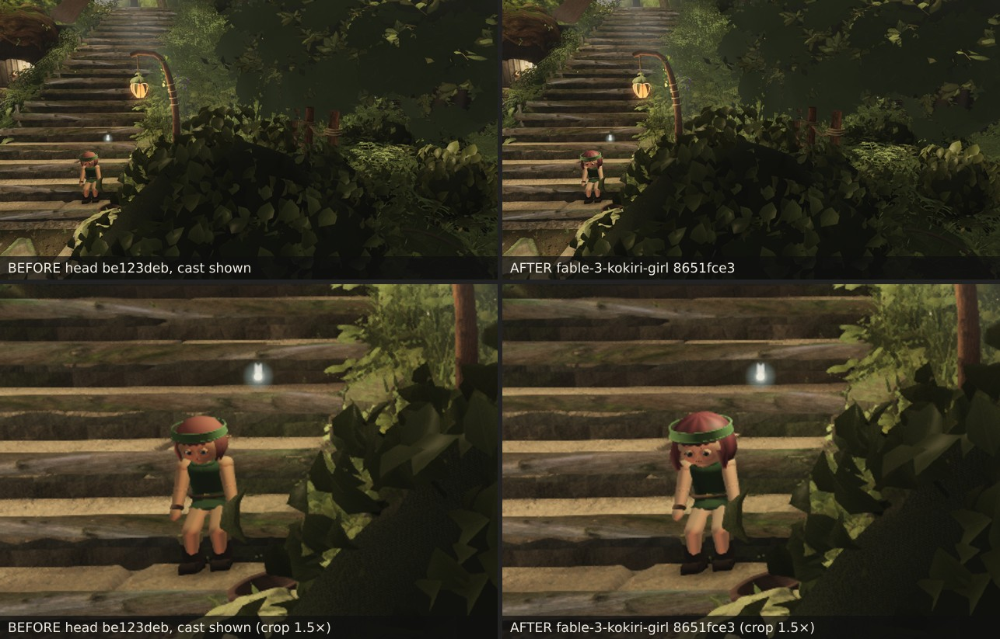
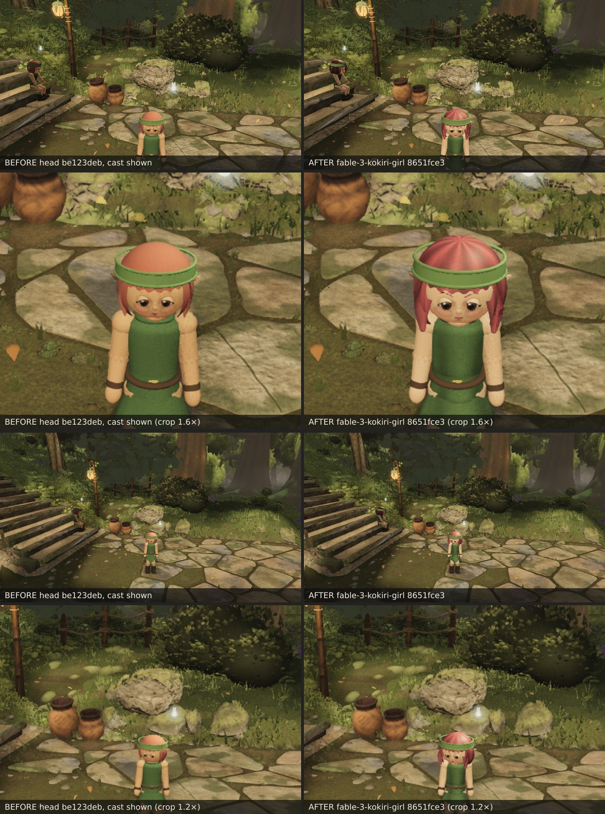
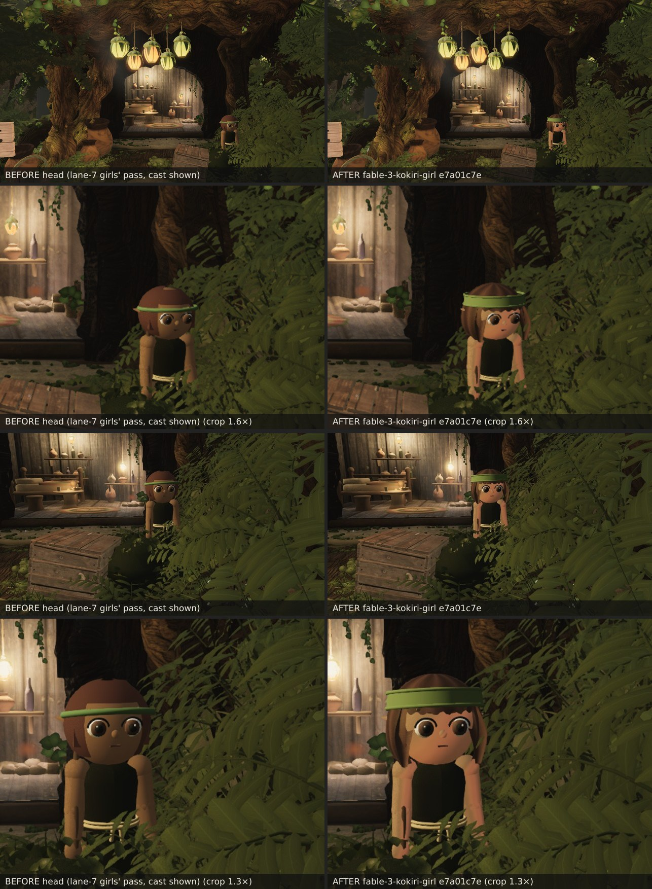
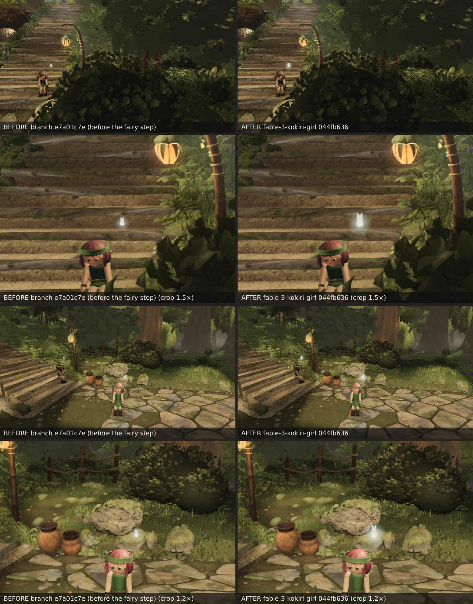
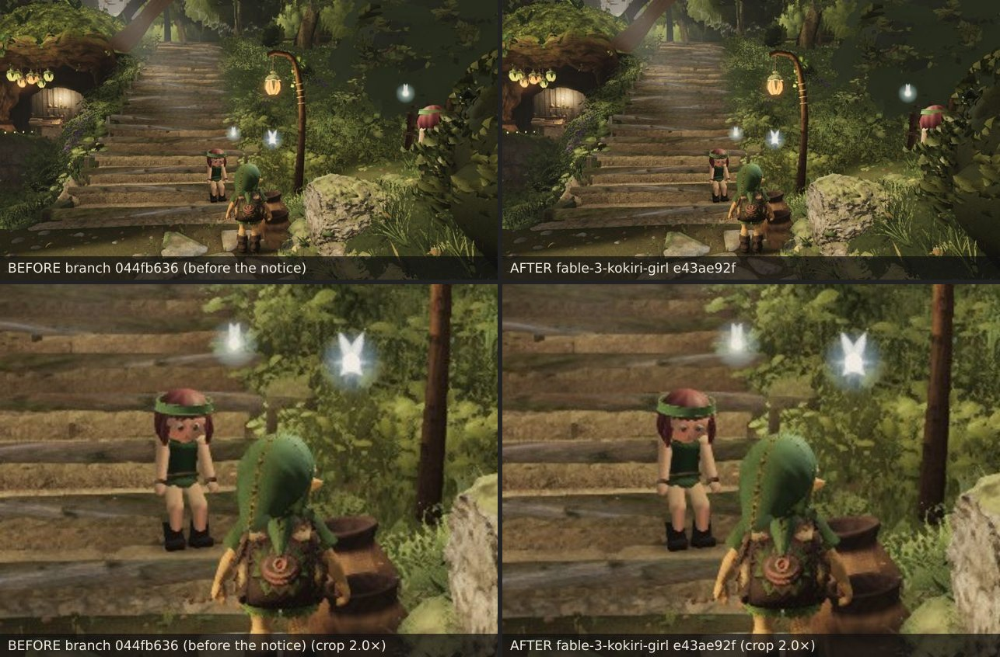
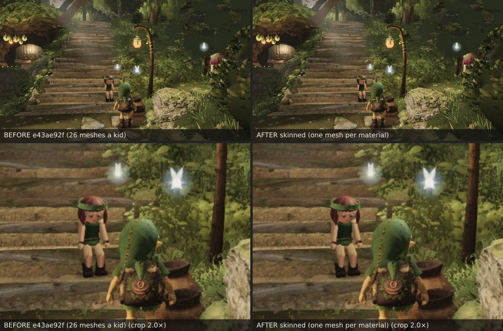
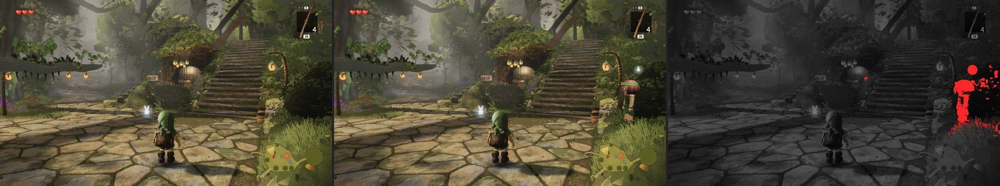
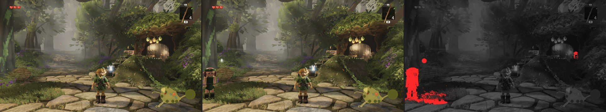
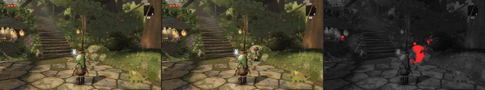

# The girl by the signpost, and the cast comes back (fable-3, lane 7, 2026-09-23)

The owner asked twice for "the people" (06:50); fable-cursor handed lane 7 to fable-3 at 12:55: the kids
stay procedural (`character/kokiri.ts` — no Kokiri asset exists), so the promise is a clear visible step at
the follow camera's 4–8 m, not Link's sculpt. Start with the girl by the signpost with her fairy (ref-01,
demo d_023–d_036), then bring the cast back (`backgroundCast.visible = false` since the owner's 09-20
request) with the girl walking her loop, and keep the light count constant.

## What the follow camera saw (before)

Rendered on the head (`be123deb`) with the cast forced visible, 5 m from the girl on the first tread of the
hero flight (kokiri-b, the sitter — at broll's simulation time the walker, kokiri-a, is dwelling at (4.4, 0.9)
across the plaza; the girls share every line of the build, only the look index differs): a smooth brown
helmet of hair hugging the skull, orange-tan skin, a flat green tunic cylinder, a head a quarter of her
height. ref-01 / d_024 have a wide maroon bob with a sheen, pale peach skin, cloth with folds, and a
head-and-hair a third of the height.

## What changed (`agent/fable-3-kokiri-girl`)

`character/kokiri.ts`
- **Proportions** — the head joint (pivoted at the head centre) is scaled ×1.14 (`HEAD_SCALE`): head and
  hair become a third of the height, with the face, hair and band tuned at r 0.13 growing together. The
  skull's underside meets the shoulder line as in d_024; the collar tucks under the bob's hem.
- **Hair volume** — the bob r × 1.10 → 1.16 with a 0.20 hem flare (was 0.11) and seven soft lobes below the
  band so the outline reads as locks; the crown dome r × 1.14 → 1.18 (its edge still inside the band, at
  the back too where the band dips); the side locks moved to the bob's cut edge, thicker, 5 mm clear of
  the cheek; the nape tufts a little bigger.
- **Hair material** (`girlHair`) — the footage's maroon (0x7e2f33; the old 0x93412f brick rendered
  orange-brown) under a 512 × 256 canvas: nine broad locks across u (a dark valley and a lighter core
  each, widths uneven), fine strands in long runs, a shade toward the hem, a lift at the crown; roughness
  0.9 → 0.58 so the sun leaves a sheen where the crown turns. Every hair part carries UVs onto it: the
  spheres their own, the fringe a grid (`shell` takes a UV function now), the clumps re-laid (`clumpUv`).
- **Cloth** (`girlCloth`) — a 256 × 128 canvas on the tunic: four drape valleys in step with the skirt's
  `cos(4a + 0.7)` fold ridges (`skirtPanel` lays u out as a / 2π now, the lathed upper's UVs are turned to
  the same convention), shade under the belt and along the hem, a two-texel weave, a soft mottle; the
  upper carries four shallow geometric fold ridges (`ovalLathe` folds) it never had.
- **Skin** — 0xbd8a62 → 0xd3a98a (all four looks paler in step): the pale peach of the footage.
- Same meshes per kid; the belt torus and the headband leave the shadow pass (their shadows fall on the
  skirt and the hair a centimetre under them).

`character/npc.ts` — the four fairy point lights ride on the npc group, not inside the fairy bodies
(`structures/index.ts` keeps the north posts' lights in the scene for the same reason): a light that
leaves or joins the scene changes `NUM_POINT_LIGHTS`, the key every lit program is compiled on — the free
camera parking on a viewpoint hid the ledge girl's fairy, capture toggled the bank fairy's `light.visible`.
Now the lights are positioned from `anchor + offset(t)` each frame and dimmed by a `glow` factor (0 for the
ledge fairy under capture, 0 for the bank fairy under capture, as round 50 had it). The audit reports
`glow` and `lightInScene` per fairy.

`character/index.ts` — `backgroundCast.visible = true`: the walker on her plaza loop by the signpost, the
sitter on the steps, the boy at Saria's door, the ledge and bank girls, on their round 47–50 spots (the
demo's d_090–d_104: kids on the path and the bank). **Shadow-pass scoping**: the sun's shadow window is a
92 m box fitted ahead of the camera, so every kid in the village was drawn into it each frame — a full
set of shadow submissions per kid whether the camera saw them or not (camera A read 723 draws with the
cast back). A kid whose shadow reach (2.6 m; 7 m for the ledge girl, whose shadow can fall down the ledge
face) misses the view frustum cannot shadow a visible pixel, and stops casting until it can. `castShadow`
is no program key; the toggle recompiles nothing. The audit reports `kidShadowCasting` / `kidShadowMeshes`.

## Before / after

Pose: (5.2, 2.75, 6.3) → (9.0, 1.75, 3.6), vfov 46, high quality, 1280 × 720, `--character`, settle 8. The
before is the head `be123deb` with the cast forced visible (a throwaway build, nothing committed).

Poses: (2.3, 2.2, −0.66) → (4.4, 1.45, 0.9), vfov 40; (0.6, 2.7, −2.1) → (4.4, 1.5, 0.9), vfov 46 — the walker
(kokiri-a, look 0) where the loop has her at t ≈ 13.2 s, facing the camera.

## The boy at Saria's door (second landing, `e7a01c7e`)

The owner walks to Saria's door constantly, and the boy beside it still wore round 1's build: a sphere-and-boxes bob, a
thin torus band, plain tan skin, a flat near-black tunic. He now shares the pass — the girls' lobed bob (`buildGirlHair`
without its tube brows; `buildFace` gives him box brows) in the palette's brown under the lock canvas, the wide Kokiri band,
the cloth canvas with four fold ridges on both lathes (the near-black lifted a step to 0x2f3320 so valleys and weave read at
all), pale ramped skin (0xb28058 → 0xcfa07c, in step with the girls). Hair / cloth / skin materials are keyed by name now
(`hairMaterial`, `clothMaterial`, `rampedSkin`) so a look is one line.

Poses: the threshold follow camera (6.76, 2.77, −5.59) → (9.77, 2.52, −8.69), vfov 46; (8.6, 2.1, −6.0) → (10.5, 1.55, −7.6),
vfov 40. The before is the head with the girls' pass (`8651fce3`, cast shown), so the sheet isolates the boy.

Six views — the boy stands in B / E (at the door) and F (far left); against the merged head `bd0bd1ba` (the girls' pass +
fable-2's paving change), settle 12:

| view | SSIM vs ref, head | branch | Δ | SSIM head↔branch | changed px | draws | M tris |
| --- | --- | --- | --- | --- | --- | --- | --- |
| B | 0.1734 | 0.1732 | −0.0003 | 0.9995 | 685 (all in the boy's box at the door) | 683 = 683 | 8.08 = 8.08 |
| F | 0.2085 | 0.2085 | 0.0000 | 0.9998 | 515 (the boy's box) | 642 = 642 | 7.69 = 7.69 |

E shares B's camera; A, C, D do not see him. Same submissions (the wide band is one mesh like the torus was; the bob one
mesh like the old one).

## The fairies (third landing, `044fb636`)

"The girl by the signpost with her fairy": in demo d_026 / d_090 her fairy is a glowing ball with wings about as wide as her
head, a head-and-a-half above it; ours (round 47, `navi.ts createFairy` at the kids' 0.75) was a 5 cm ball, a 0.2 m halo at
three-quarter tint and a 0.1 m wing pair — a dot at 5 m. Now a 7.5 cm ball, a 0.3 m halo at full tint, a 0.17 m wing pair;
the light, the hover and the three submissions unchanged.

Poses: the 5 m follow pose on the tread girl (her fairy over the flight) and the walker's 5 m pose (her fairy by the
boulder; the tread girl's by the lantern post at the top left). Six views against the branch before the step (`e7a01c7e`
on the merged head), settle 12 — the walker's fairy is at A's right edge, B / E's left edge and beside Link in F:

| view | SSIM vs ref, before | after | Δ | SSIM before↔after | changed px | draws | M tris |
| --- | --- | --- | --- | --- | --- | --- | --- |
| A | 0.1824 | 0.1826 | +0.0002 | 0.9978 | 2 630 (the fairy's box) | 692 = 692 | 8.88 = 8.88 |
| B | 0.1732 | 0.1727 | −0.0004 | 0.9983 | 1 693 (the fairy's box) | 683 = 683 | 8.08 = 8.08 |
| F | 0.2085 | 0.2082 | −0.0003 | 0.9993 | 826 (the fairy's box) | 642 = 642 | 7.69 = 7.69 |

(The reference SSIMs differ from the first table's because the head moved under the branch between the two measurements —
fable-2's paving and earth changes; each table is before/after on one head.)

## The kids notice Link (fourth landing, `e43ae92f`)

Nothing in the cast reacted to the player: walk up to the girl on the steps and she kept her seeded look-around. Now
(`npc.ts noticePlayer`) a kid within 5 m turns her head to Link — fully on him by 2.8 m, within the neck's range (past
±1.05 rad the turn fades out over 0.7 rad rather than pinning to the shoulder, so walking round behind her lets her go), the
pitch to his eyes (the bank girl looks down from her terrace), blended over the pose's own look; a walking kid gives him
half the turn. The driven kids get it inside `drive()`, the boy at the door after his idle pose; it is a pure function of
the two positions (no state — a zero-dt re-render repeats the pose). Capture passes no player, so the six frames keep
their heads: **B and F byte-identical** to the branch before the step.

`kokiri-notice-walk-in` (artifact): Link walks from the plaza to the stair foot and stops beside her; her head comes round
to him as he closes and holds on him.

## The kids skinned to their own joints (fifth landing, perf, `814af6c9`)

fable-5's lane-10 read of the cast's return: a kid in view is ≈ 50 submissions (a mesh per joint per material, drawn
again in the shadow pass), B / E sat two draws under the 700 cap, and "lane 7's next perf item is the kid as merged
meshes". `character/skin.ts`: after a kid is built, every Mesh riding a joint becomes part of ONE `SkinnedMesh` per
(material, shadow flags) for the whole rig, with the joint as its only bone (weight 1) — the rig's own `Group`s serve as
the skeleton (a `Skeleton` only reads their world matrices), bound at the rest pose with the root at the identity, attached
bind mode, so the poses keep moving the joints exactly as before and the blink's Y-squash on the eye groups rides along
(a group with meshes is a bone too). ≈ 26 → 11 colour submissions a girl, 16 → 5 in the shadow pass; same triangles, same
materials, same textures. The rest-pose sphere is grown 0.35 m so a swung arm at the frame's edge is never culled.

Play still at the stair foot (Link two metres from the sitter, the walker at the right edge, the boy at the door): **702 →
623 draws**, triangles 10 038 277 = 10 038 277, and against the unskinned still 151 px differ by more than 8 levels, 8 by
more than 24 — the skinning path's float noise. The walker mid-stride (broll t 10.4 s, her leg toward (4.4, 0.9), facing the
camera) and standing at her dwell (t 12.0 s): 17 px and 1 px between the two builds — the stride, the sit and the head turn
all ride the same joints. The first cut had the parts' vertices in joint space (the skinned mesh
wants its bind space, the root's): the kids came apart; the joint's rest world matrix is baked in now.

Six views against the same head (the branch before the step), settle 12 — the kids stand in A (the walker at the right
edge), B / E (the walker at the left edge, the boy at the door) and F (the walker beside Link):

| view | SSIM vs ref, before | after | Δ | SSIM before↔after | changed px | draws | M tris |
| --- | --- | --- | --- | --- | --- | --- | --- |
| A | 0.1826 | 0.1826 | 0.0000 | 1.0000 | 0 | 692 → **640** | 8.88 = 8.88 |
| B | 0.1727 | 0.1727 | 0.0000 | 1.0000 | 8 | 683 → **631** | 8.08 = 8.08 |
| F | 0.2082 | 0.2082 | 0.0000 | 1.0000 | 2 | 642 → **590** | 7.69 = 7.69 |

E is B's camera; C sees the sitter (≈ −26); D sees no kid (557, unchanged). The cast's cost in a frame with three kids drops
from ≈ 100 to ≈ 50 submissions; the next halving (skin / cloth / leather on one canvas atlas → three submissions a kid) is
there if the squad's layers need it.

## Play mode

`kokiri-play-walk` (artifact): `?test=1` at 960 × 540, Link placed at (0.8, 6.2) facing the stair foot,
two seconds standing, then W held for six — the sitter on the steps with her fairy, the walker at her verge
spot, the boy at Saria's door. Programs 111 → 112 over the walk (one material's first draw), no light-count
recompile. Draws 711 → 537 as the plaza leaves the frame; the walk ends in the verge's understory (the
route, not the cast). Standing at (3.0, 7.5) facing the stair foot (the plaza, Saria's house, the flight
and three kids in frame): head 604 draws / 9.98 M, branch 779 / 10.05 M — the cast in play mode costs
≈ 175 submissions where three kids and their shadow passes are in view. From that spot the walker's loop
is behind an understory bush for most of her circuit (a sightline note for lanes 2 / 4: the scatter does
not know `NPC_LOOP`).

## Six views

Measured against the exact head build (`be123deb`, cast hidden — the sealed state) at settle 12. The cast's
return is an owner-approved look change: the six frames show the kids again where round 47–50 pinned them
(the walker and the sitter per `VIEW_TABLE`), so the −0.003 rule does not apply to those pixels.

| view | SSIM vs ref, head | branch | Δ | SSIM head↔branch | changed px | draws head → branch | M tris head → branch |
| --- | --- | --- | --- | --- | --- | --- | --- |
| A | 0.2035 | 0.1991 | −0.0044 | 0.9826 | 15 339 | 597 → 698 (final 692) | 9.15 → 9.19 |
| B | 0.1836 | 0.1773 | −0.0063 | 0.9720 | 26 880 | 589 → 690 (final 684) | 8.30 → 8.33 |
| C | 0.1794 | 0.1793 | −0.0001 | 0.9916 | 5 163 | 472 → 525 | 6.77 → 6.80 |
| D | 0.2430 | 0.2430 | 0 | 1.0000 | 0 | 557 → 557 | 8.53 → 8.53 |
| E | 0.1946 | 0.1901 | −0.0045 | 0.9720 | 26 880 | 589 → 690 | 8.30 → 8.33 |
| F | 0.2159 | 0.2145 | −0.0014 | 0.9922 | 11 950 | 547 → 648 | 7.99 → 8.03 |

The six frames are the branch at `b1ebee6b` (the scoping); the final (`8651fce3`: thinner brows, cuffs out of the shadow
pass, no neck mesh) was re-captured at A and B — A 692 draws, B 684, and against `b1ebee6b`'s frames 8 px changed in A,
30 px in B (the walker's brows; a cuff's shadow sliver). C–F's draws at the final are those minus the cuffs' and the neck's
submissions per kid in frame.

Every changed pixel is a kid, her fairy, her shadow or her fairy's light pool (`diff-A.jpg` … `diff-F.jpg`: the walker
at A's right edge and B / E's left edge as the footage has her, beside Link in F; the boy at Saria's door in B / E / F; the
sitter on the steps in C). D sees no kid and is byte-identical — with every kid inside its shadow window, that is the
shadow-pass scoping doing its job (D drew 557 before the cast came back and 557 after). The SSIM against the reference drops
where the kids appear (A, B, E): the frames now hold our kids where the footage holds its own — the cost of the cast being
in the frames at all, the same as before the 09-20 hide, not of this pass.

Draws: the cast costs ≈ 100 submissions where three kids are in frame (each kid is 22–25 meshes over 13 joints, drawn again
in the shadow pass when in view, plus a contact shadow and a three-part fairy). Without the scoping A read 723. The remaining
lever, if the perf pass needs it: one canvas atlas per kid so every joint is one submission (skin / cloth / leather share a
joint today) — roughly half the main-pass cost.

