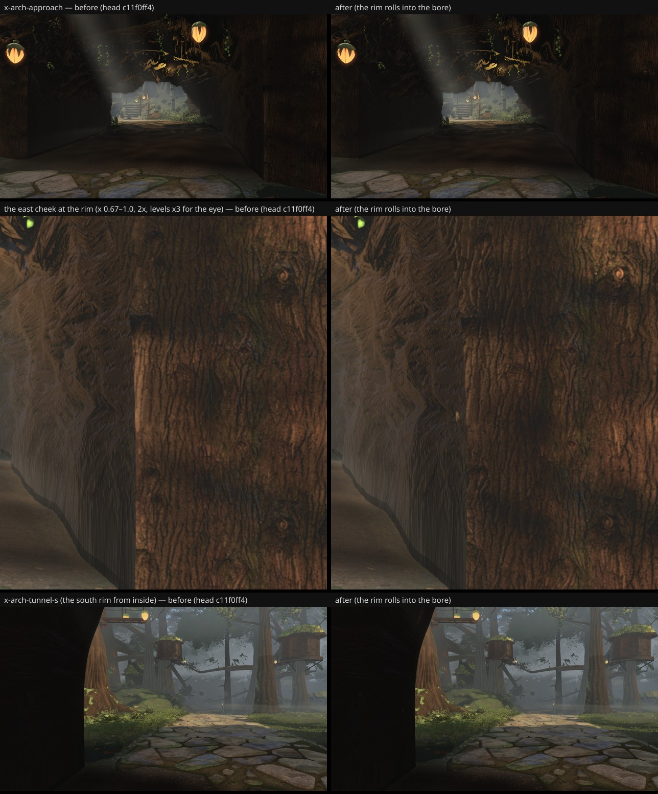
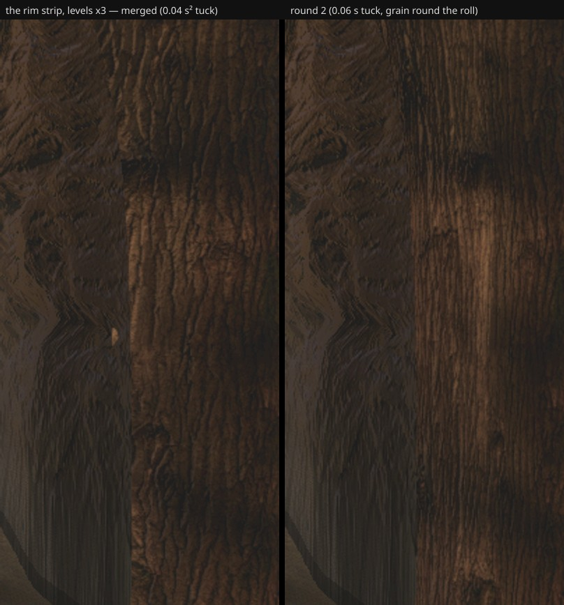

# The arch's mouth rims roll into the bore — round-50 #12's first half (fable-3, 2026-09-21)

fable-5's round-50 list, #12 (sev 1, structures-33, paused): "at `x-arch-approach` the right cheek
carries a vertical shading seam at frame x ≈ 0.85 where the near wall section meets the far one (the
grain runs through, the value steps)". On the owner's walk to the clearing (owner #13). Announced in the
INBOX at 20:05 before taking; branch `agent/fable-3-arch-rim`.

## What it was

Measured on the head at fable-5's pose (camera (6.6, ground + 1.45, −48) → (6, ground + 1.3, −58),
vfov 46): a vertical value step at frame x 0.805 from y 250 to 550, luminance 14 → 21 (12-px step 15.5
in rows 350–450). It is the tube's south rim on the east cheek: `mouthFace()` built each cheek face as
an annulus from the tube's rim outward, so the face met the bore at a mathematically sharp corner.
Both surfaces carry the same bark maps (`barkC` / `barkN`) and `logBark`'s base colour (0x7e7268) is
three times `tunnelWall`'s (0x2b2119) — the grain runs through, the value steps.

## What changed (`structures/logArch.ts`, `mouthFace()` only; both faces)

- The first **0.32 m of every ray is a quarter-round rolling into the bore**, by physical distance
  along the ray (so every ray rolls the same whatever its length); `gridSurface`'s analytic normals
  follow the roll.
- The occlusion is **graded down to the bore's value** over the roll (× 0.6 at the rim → 1 at 1.5
  radii); the bark plates are kept off the roll.
- The roll's end would lie on the tube's wall at the same depth (a brighter material, z-fighting
  through in patches — seen in the first render); it is **tucked 4 cm outward along the ray**, behind
  the wall, where the tube occludes it.
- The faces' rows 7 → 12, packed toward the rim (`v^1.7`) so the roll has geometry. Tube, cheek
  envelopes, portal, east/west ends untouched. ≈ +900 triangles, culled with the cheeks beyond 40 m.

## Before / after

Head c11f0ff4 (before) vs this branch (after), high quality, 1280×720, `--settle 12`. The crop row
is levels × 3 so the eye can see what the meter measured: the 12-px step at the seam falls from 15.5
to 5.6 in rows 350–450 (3.7–6.5 elsewhere, ordinary bark texture); no gaps at the rim from inside.

## Six views

Only D and C can see the arch; both captured on both sides (same settle): **pixel-identical** (0
changed px), SSIM equal (C 0.2199, D 0.2786), draws equal (341 / 390), triangles equal (7.05 M /
8.18 M) — the cheek faces are culled beyond 40 m, so D at 45 m never sees the roll. A/B/E/F do not
see the arch; unchanged by construction.

## Round 2 — fable-2's residual (21:40 review of c48d6a6e)

fable-2's non-author review: IMPROVED, one residual — the `0.04 · s²` tuck left a small triangular slot
on the east face where the mid-roll rays meet the wall at the shallowest angle (their slot box
x 0.765–0.825 × y 0.40–0.64, pixels above 2× the rim strip's median: 72 → 25 on their VM). Two changes in
the same hunk (`agent/fable-3-arch-rim-2`):

- the tuck is **`0.06 · s`** — 6 cm at the rim, linear, so the mid-roll rays get their share;
- the bark **continues round the corner**: the roll's arc advances the across texture coordinate, so
  the strip carries the wall's grain instead of a stretched smooth band (fable-2's "texture
  discontinuity at x ≈ 0.79").

Slot-box count on this VM, same pose and threshold: pre-roll head 436 (the lit face itself) → roll 106 →
`0.04 · s²` 16 → **`0.06 · s` 0**. `D_log` against the current head (0963c09d, built in a worktree):
**pixel-identical** (0 changed px, SSIM 0.2788 both, 390 draws / 8.18 M). The 1 728 px that differed
against my older head capture were the head's own move (Astra's character import), not the arch.

