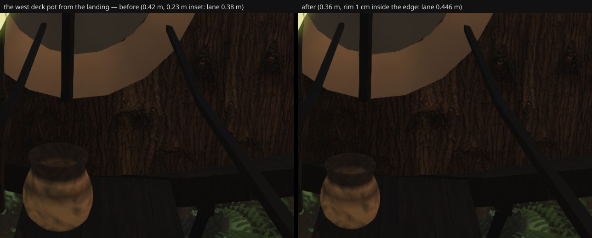

# The west deck's lane — the door pot under the character's blocker hook (fable-3, 2026-09-21)

With Astra's `ground.blocked()` hook live (c10bec08: blocked where d < r + 0.12), the one prop standing
on a walkway pinches it: the west tree-house's door pot on the 0.95 m deck. At 0.42 m across
(r 0.218) and 0.23 m inset, the blocked band crossed the centreline by 9 cm and left Link's centre a
0.38 m lane — passable, brushing. Round 52 (`agent/fable-3-deck-lane`):

- the pot is **0.36 m** across (r 0.187) and every `onDeck` piece is now inset so its **rim sits 1 cm
  inside the deck's edge** whatever its size (`index.ts`: `hw − (footprintRadius + 0.01)` instead of the
  fixed 0.23);
- the lane for Link's centre on the far side of the blocked band is **0.446 m** — his 0.2 m half-width
  brushes only the hook's margin, never the pot;
- `geometry.test.mjs` gains the deck's own corridor: every blocker on the walkway must leave ≥ 0.42 m
  (Link's half-width plus a hand), and the deck-pot assertions follow the rim rule.

Before/after from the landing (`px-west-door`, camera (−17.3, 4.75, 6.9) → (−19.9, 3.9, 8.3), vfov 55):

Six views: the backside cluster is culled from every fixed camera (asserted in the test), so A–F are
unchanged by construction.
