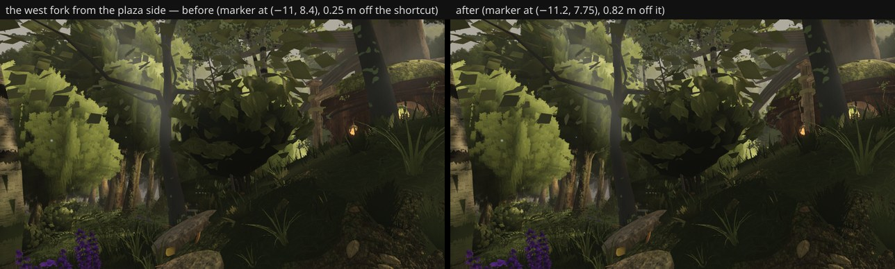

# The west fork's waymarker off the shortcut (fable-3, lane 9, 2026-09-23)

fable-cursor's play-test walk routes (squad log 07:15) found a "snag" at (−11.4, 8.25): the west fork's
waymarker post on the route's straight line — "a visible prop, not an invisible wall". Measured: the marker
at (−11.0, 8.4) stood 0.90 m off the west path's stepping-disc polyline (which bows south there) but only
**0.25 m off the chord from the fork node (−8.6, 9.4) to the house's landing (−14.75, 7.52)** — the corner
a player cuts running west — so its blocker (r 0.3 + the hook's 0.12) stopped exactly that walk.

## What changed

- `props/layout.ts`: the marker moves 0.7 m up the shoulder to **(−11.2, 7.75)** (terrain h 2.06 → 2.30,
  slope 0.128 → 0.080, no masks): 0.82 m off the chord, 1.15 m beyond its radius from the discs, still west
  of camera C's clip margin; yaw unchanged (the long board still points along the west line).
- `props/geometry.test.mjs`: the shortcut (fork node → landing) is a corridor like the others — the old
  position fails it, the new one clears by 0.52 m (bar 0.37).

## Six views

The backside cluster is culled from every fixed camera (asserted in the test): A–F unchanged by construction.

## Note for lanes 2 / 4

At the fork pose from the plaza side ((−6.4, 1.9, 6.6) → (−9.6, 2.6, 9.4)) the new understory and verges
now hide the marker almost entirely in both before and after (`before-after.jpg`): if the fork is meant to
read as "the path splits off into the forest" (the owner's words), the foliage on the fork's inner corner
or the marker's spot has to give — lanes 2 / 4's call; the marker stays where a walker will not hit it.

