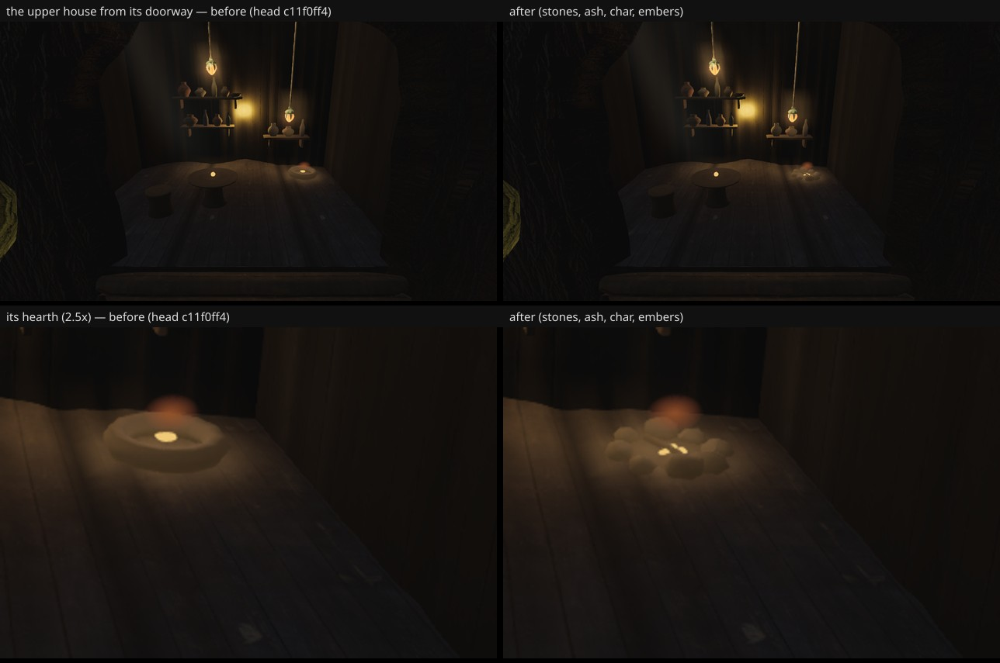

# The other house's hearth — the plateau's doorway (fable-3, 2026-09-21)

Follow-up to the hero house's hearth (`../hearth/`, merged 962f9fed's tick 210): the plateau is a
destination (owner #14 "when I walk up the steps I want more to do afterwards") and the upper
house's doorway shows its hearth, which was still the noise-lumped torus with one squashed emissive
sphere. `structures/house.ts`, the same kerb / embers block: the `hero` gate is gone — the other
furnished house gets the ring of separate field stones at a coarser build (eight 9×6 stones, two
charred sticks, five ember lumps; the hero house keeps ten 12×8 stones, three sticks, seven embers).
The torus and the squashed sphere are no longer built anywhere; `TorusGeometry` leaves the file's
imports.

## Before / after

Head c11f0ff4 (before) vs cedd3bbd (after), high quality, 1280×720, `--settle 12`, from the upper
house's doorway: camera (11.2, 6.9, −15.2) → (13.5, 5.8, −17.5), vfov 60.

## Six views

Same settle both sides, 256×144 luminance SSIM vs the reference frames; "changed px" is the
1280×720 count over tolerance 8.

| view | before | after | Δ | SSIM before↔after | changed px | draws | tris |
| --- | --- | --- | --- | --- | --- | --- | --- |
| A | 0.2204 | 0.2204 | 0.0000 | 1.0000 | 0 | 442 = 442 | 8.80 M = 8.80 M |
| B | 0.1967 | 0.1967 | 0.0000 | 1.0000 | 0 | 424 = 424 | 7.95 M |
| C | 0.2199 | 0.2199 | 0.0000 | 1.0000 | 0 | 341 = 341 | 7.05 M |
| D | 0.2786 | 0.2786 | 0.0000 | 1.0000 | 0 | 390 = 390 | 8.18 M |
| E | 0.2184 | 0.2184 | 0.0000 | 1.0000 | 0 | 424 = 424 | 7.95 M |
| F | 0.2376 | 0.2376 | 0.0000 | 1.0000 | 0 | 407 = 407 | 8.09 M |

Pixel-identical: the upper house's hearth is not in any fixed view. (A is at 8.80 M on this head —
200 K under the 9.0 M line; none of it is this change.)
