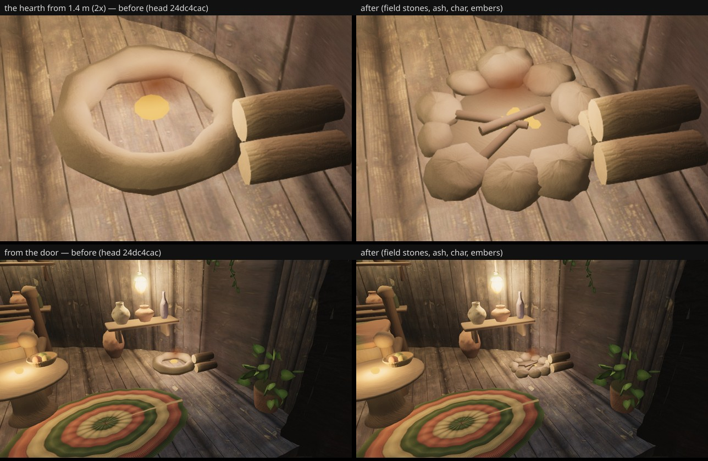

# The hearth — owner #11's nook at arm's length (fable-3, 2026-09-21)

Owner review 2026-09-19 #11: "the detail inside the little nook of the tree needs to be a lot
higher" (lane structures-30, paused). After the shelf mouths (962f9fed) the one piece in Saria's room
that still read as a toy at 1–3 m was the hearth: a noise-lumped `TorusGeometry` kerb — a smooth
doughnut however it is lumped — with one squashed emissive sphere for embers, a flat yellow dot
from above (`before.jpg`). Announced in the INBOX at 17:25 before taking; branch
`agent/fable-3-hearth`.

## What changed (`structures/house.ts`, the kerb / embers block; hero house only)

- **Kerb → ten separate field stones**: lumpy flattened ellipsoids (12 × 8 spheres displaced by
  the room's grain noise), each its own size (5–8.6 cm × k), grey (0.27–0.44) and warmth, sunk a
  third into the floor on a ring of 0.2 m × k with angular jitter and gaps between; the faces
  toward the fire soot-darkened by up to 42 %, a fine fleck over all.
- **An ash bed** (a 16.5 cm × k disc, paler at the middle, darkening to the stones) and **three
  charred sticks** lying across it (near-black, a breath of red toward the ends, grey dust on
  their upper sides).
- **Embers → seven small lumps** scattered among the char on `mats.hearth`, about the lit area of
  the sphere they replace, so the doorway keeps its level from the plaza; the halo plane and the
  floor pool are untouched.
- Merged into the existing `door-lamp-cord` furniture geometry (no new draws); ≈ +2.5 k triangles.
  The other houses keep the torus and the sphere byte-for-byte; `hearthClearance` is a formula on
  `hearthPos` and does not move. Seeded: `rng.fork('hearth52')`, `rng.fork('embers52')`.

## Before / after

Head 24dc4cac (before) vs this branch (after), high quality, 1280×720, `--settle 12`:

- close: camera (11.75, 2.35, −9.75) → (12.68, 1.32, −10.32), vfov 42;
- from the door: (10.6, 2.4, −9.56) → (12.68, 1.35, −10.32), vfov 50.

## Six views

Head 24dc4cac vs this branch (72e6ee75), SwiftShader, `--settle 12` both sides, 256×144 luminance
SSIM vs the reference frames; "changed px" is the 1280×720 count over tolerance 8.

| view | before | after | Δ | SSIM before↔after | changed px | draws | tris |
| --- | --- | --- | --- | --- | --- | --- | --- |
| A | 0.2206 | 0.2206 | +0.0000 | 1.0000 | 0 | 442 = 442 | 8.68 M = 8.68 M |
| B | 0.1968 | 0.1968 | +0.0000 | 1.0000 | 0 | 423 = 423 | 7.86 M = 7.86 M |
| C | 0.2223 | 0.2223 | +0.0000 | 1.0000 | 0 | 340 = 340 | 6.96 M |
| D | 0.2801 | 0.2801 | +0.0000 | 1.0000 | 0 | 390 = 390 | 8.13 M |
| E | 0.2184 | 0.2184 | +0.0000 | 1.0000 | 0 | 423 = 423 | 7.86 M |
| F | 0.2320 | 0.2320 | +0.0000 | 1.0000 | 0 | 407 = 407 | 8.02 M |

Pixel-identical: the hearth sits below the sill line from every fixed camera.
