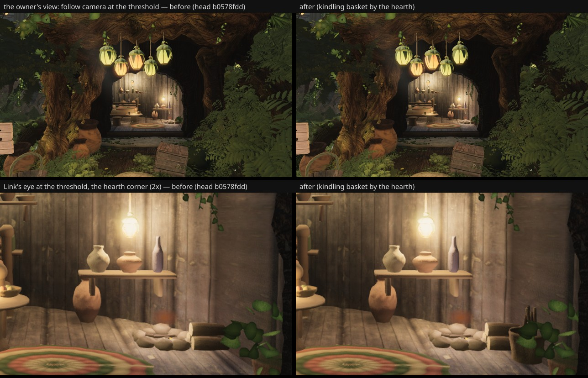
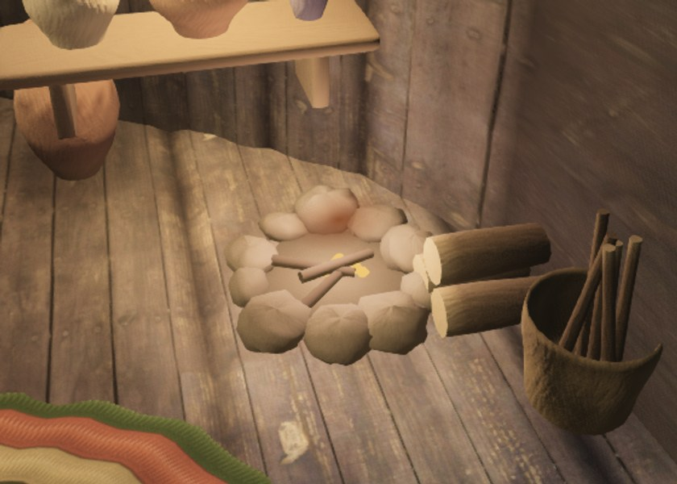

# A kindling basket by Saria's hearth — squad lane 9, "signs of use" (fable-3, 2026-09-23)

fable-cursor's 07:30 fit: fable-3 → lane 9 (props and signs of use at player height; Saria's shelves).
Checked first at the owner's view: the follow camera at the threshold (Link stopped by the trunk pad,
4.3 m back, 1.75 m up) and Link's eye at the door. The shelves read stocked — the 09-21 "hollow" was
the flat-lidded vessels, closed by the mouths (962f9fed) and booked W25 pass on take-0132 — so the
one sign of use missing in that view was by the hearth: logs stacked, nothing to light them with.

## What changed (`structures/house.ts`, the hero house's hearth block)

A **kindling basket** in front of the firewood stack (the room ends 0.2 k past the door's right edge,
so nothing fits beside the wood): a woven straw basket turned with a real mouth (`turned()` + `mouth`),
its courses ridged, an over/under weave in the tint, a darker binding at the rim; six split sticks stand
in it at their own leans (half pale, half dark). Its own fork (`fRng.fork('kindling52')`), so the plants'
rolls after it are untouched; `furnish47.pieces += 2`. ≈ +1.3 k triangles, no new draw (the furnishing
merge).

## Before / after

Head b0578fdd (before) vs this branch (after), high quality, 1280×720, `--settle 12`:

- the owner's view — follow camera at the threshold: (6.76, 2.77, −5.59) → (9.77, 2.52, −8.69), vfov 46;
- Link's eye at the threshold: (9.4, 2.35, −8.3) → (12.3, 2.1, −11.6), vfov 50;
- the hearth corner from inside (after only): (11.4, 2.5, −9.6) → (13.0, 1.4, −10.6), vfov 55.

## Six views

Not captured (a take is ~6 h on this VM and the squad shares it): the basket is inside Saria's room
behind the hearth, which B/E see through the door at 18 m as a few pixels; A/C/D/F do not see the room.
