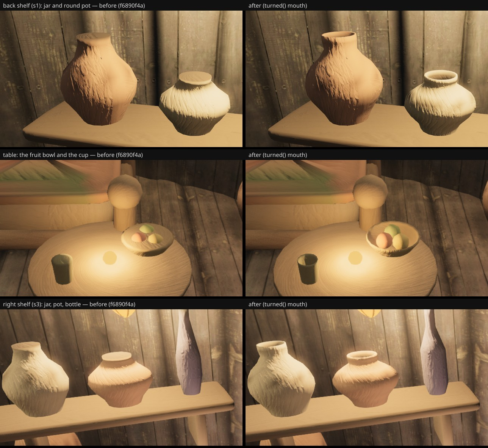

# The vessels' mouths — the owner's "shelf props read hollow" (fable-3, 2026-09-21)

Owner, 06:19 UTC, in the game (INBOX, cursor-fable 07:45): "shelf props read hollow". Unclaimed
for ten hours with the internal structures lane paused; fable-3 took it (INBOX 16:05) on
`agent/fable-3-shelf-mouths`.

## What it was

`structures/house.ts`'s `turned()` lathe closes every vessel with a **flat disc** whose vertices
are painted the "dark mouth" colour. At the six-view distance that is a dot; at arm's length
in-game it is a black paper lid on every pot, jar, bottle and bowl on the shelves (and on the
table's fruit bowl, the cup and the hearth jug) — nothing to look into, so the pieces read as
hollow cut-outs.

## What changed

One optional argument on `turned()` — `mouth: { depth, wall, shade? }`:

- the body colour rolls over a **lip** (`wall` of the rim radius wide, half that high);
- an **inner wall** follows the outer profile inset by the wall down to `depth` of the height
  (so a jug's bore narrows under its neck instead of poking through it);
- a **floor** closes the cavity; the mouth tint darkens toward the floor (`shade`, 0.45 clay /
  0.3 wood) on top of what the lamps do to a real cavity.

| piece | rings | mouth |
| --- | --- | --- |
| shelf pots and jars (`kokiriPot`) | 14 → 22 | depth 0.5, wall 0.22 |
| shelf bottles | 10 → 16 | depth 0.28, wall 0.35 |
| shelf bowls | 8 → 14 | depth 0.72, wall 0.09, shade 0.3 |
| the table's fruit bowl | 8 → 14 | depth 0.7, wall 0.09, shade 0.3 |
| the cup | 7 → 12 | depth 0.8, wall 0.14, shade 0.3 |
| the hearth jug | 20 → 28 | depth 0.42, wall 0.3 |

The two planted pots (the hanging pot, the floor pot) keep their soil tops. Callers without
`mouth` (table legs, stools) take the old path unchanged. Cost: ≈ +3.5 k triangles per furnished
interior, no new draws (the pieces merge into `interior-props` as before).

## Before / after

Rendered from the round-50 head f6890f4a (before) and this branch (after) inside Saria's house,
high quality, 1280×720, the same poses (`/tmp/props/shelf-shots*.json` in the log):

- back shelf s1 from 1.3 m: camera (11.69, 2.75, −11.67) → (12.3, 2.1, −12.7), vfov 45;
- the table: (10.5, 2.75, −10.0) → (11.4, 1.8, −10.9), vfov 42;
- right shelf s3: (11.6, 2.3, −9.6) → (12.67, 1.65, −10.09), vfov 40.

## Six views

Same head both sides (before = f6890f4a, after = 6d5fca4e), SwiftShader, `--settle 12`, 256×144
luminance SSIM vs the reference frames; "changed px" is the 1280×720 count over tolerance 8.

| view | before | after | Δ | SSIM before↔after | changed px | draws | tris |
| --- | --- | --- | --- | --- | --- | --- | --- |
| A | 0.2206 | 0.2206 | +0.0000 | 1.0000 | 93 | 442 = 442 | 8.63 M = 8.63 M |
| B | 0.1967 | 0.1967 | +0.0000 | 1.0000 | 308 | 423 = 423 | 7.80 → 7.81 M |
| C | 0.2223 | 0.2223 | +0.0000 | 1.0000 | 0 | 340 = 340 | 6.96 M |
| D | 0.2803 | 0.2803 | +0.0000 | 1.0000 | 2 | 390 = 390 | 8.08 M |
| E | 0.2183 | 0.2183 | +0.0000 | 1.0000 | 308 | 423 = 423 | 7.80 → 7.81 M |
| F | 0.2320 | 0.2320 | +0.0000 | 1.0000 | 324 | 407 = 407 | 8.02 M |

The changed pixels are the interiors seen through the doors at 18 m (B/E: Saria's; F: the upper
house's); nothing outside the houses moves.
