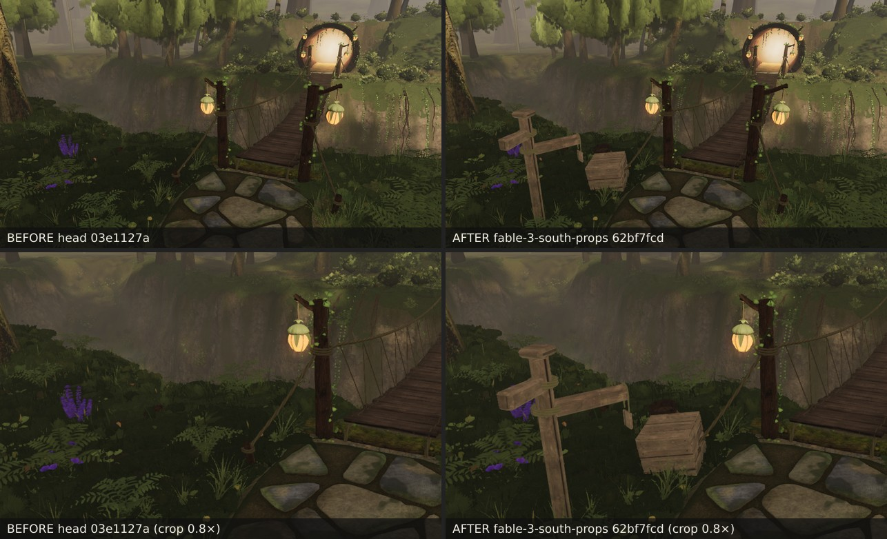
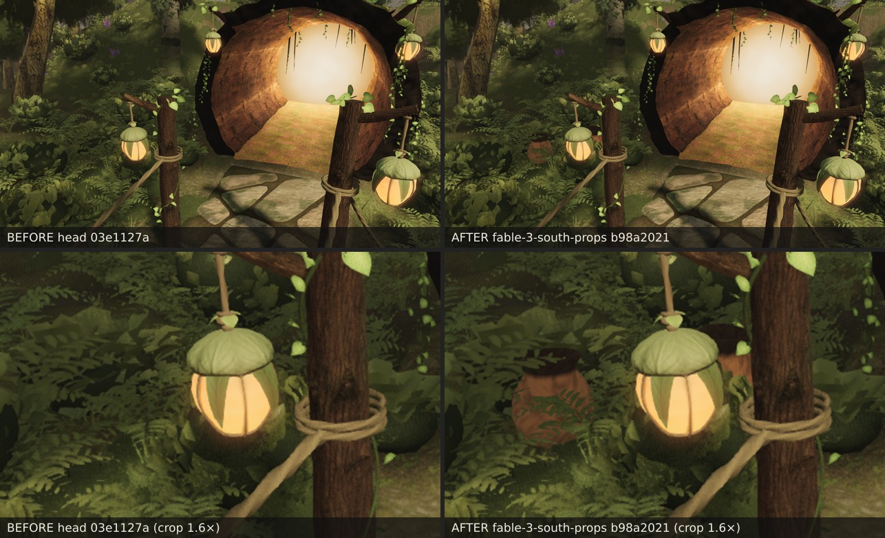
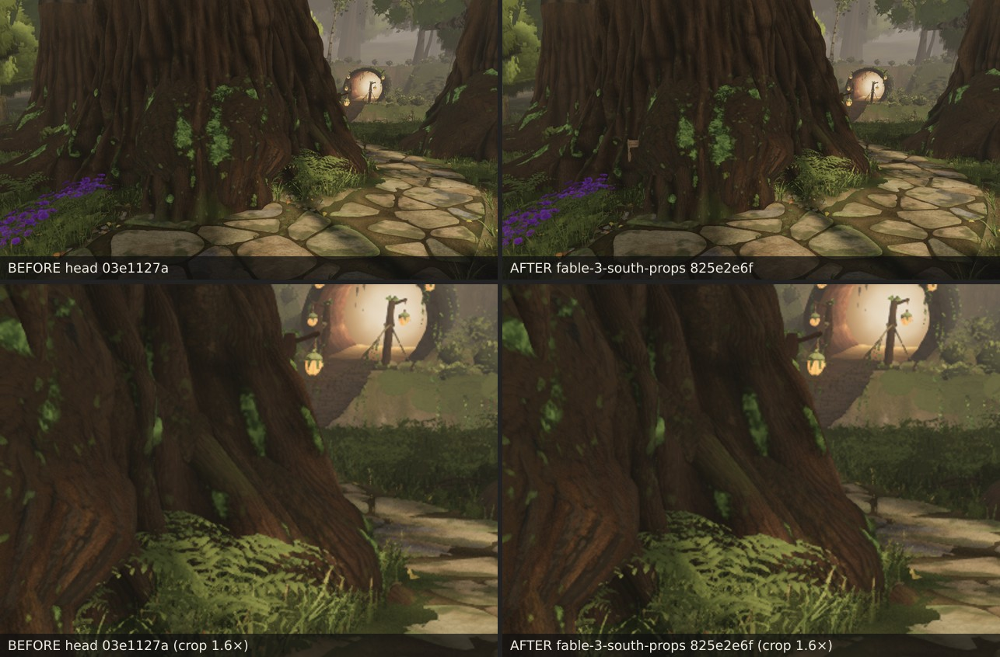

# The south exit's signs of use (fable-3, lane 9, round 56 — 2026-09-24)

fable-cursor's south expansion (`31992fa4`, merged 04:25): a 16.6 m path from the spine's south end round `plaza-south`'s
foot to a rope-and-plank bridge over the ravine, and a far path to the glowing hollow log. Bare ground beside it. Props for
the way out, all on the route's EAST side — fable-cursor composed the exit so camera C (the only fixed camera looking
south) sees only what `plaza-south`'s trunk leaves uncovered: x ≥ 0.11 (z − 0.5) is hidden from C, and every spot here is.

## What changed (`agent/fable-3-south-props`)

- `props/layout.ts`: cluster `south` (its own merge locality, three meshes) — `south-way-marker` on the east verge where
  the path straightens for the bridge (5.6, 27.7), its board toward the sill; `bridge-crate` (5.4, 29.3) and
  `bridge-pot-squat` (5.95, 29.85) on the verge at the bridge head, 1.3 m from the east post and 2.5 m short of the lip's
  rounding — the toll pile every bridge has; `log-mouth-pot` (7.0, 46.05) and `log-mouth-pot-squat` (7.7, 45.3) east of
  the log's mouth on the far bank, 0.7 m clear of the rim's flank.
- `PropDef.live`: a prop that stands on the LIVE heightfield view. Props build on the legacy view (round 49), whose mask
  knows neither the south paving nor the bridge / log — placed against it a prop could stand on the route — and
  `expansionCull` drops legacy-placed props wherever the live ground moved. A `live` prop is placed against the live mask
  laid over the system's own (max per channel), takes its height, normal and underside seating from the live ground, and
  is exempt from the cull. `props/index.ts` picks the view per prop; nothing else moves.
- `geometry.test.mjs`: the five placed where authored on the live ground, off the paving and the structures, each with a
  blocker; the far path and the log's mouth refused by the live mask and admitted by the legacy one (the reason `live`
  exists); the south path and the far path as walk corridors (clearance 1.46 m / 2.40 m beyond any blocker); every south
  prop outside the five north-looking fixed frustums and inside C's hidden wedge; the locality drawn at the bridge head.
  Mesh bound 14 → 17 (the locality's three, drawn within 45 m).

## Before / after

Pose (2.2, 2.4, 25.0) → (4.6, 0.6, 30.2), vfov 46, no character, 1280 × 720; the before is the head `03e1127a`.

Pose (3.2, 2.2, 41.5) → (5.5, 0.6, 46.4), vfov 46.

## Tried and moved

The marker first stood at the fork itself (3.4, 17.4), the only spot east of the plaza's wide end cap that is off the
paving — `plaza-south`'s root ground, and from the walker's approach the trunk hides it (776 px of board past the
buttress): a sign nobody sees. The west verge would stand in C's frame. It moved to the bridge approach.

## Six views

Only C looks south. Against the head `03e1127a`, settle 12: **C 0 px changed, SSIM 0.1878 = 0.1878**; draws 560 → 568
(the locality's meshes are inside C's frustum behind the trunk, so they are submitted; no pixel of them shows),
triangles 7.68 → 7.70 M — measured with the marker at the fork and again at the final `62bf7fcd` (the marker at the bridge
approach): 0 px both times. A, B, D, E, F look north and hold no south prop in their frustums (asserted in the test).

## The 50-point rubric (owner 06:07, `docs/RUBRIC_50_STRUCTURES.md`), scored at `62bf7fcd`

Judged at player height from the bridge approach (2–6 m) and the log's mouth, play mode and the broll poses above; 0–4
with evidence. A prop cluster has no openings, roof, lanterns, steps or footstep surface of its own: checks 26–37, 43
and 45 are **n/a** and left out of the total (14 of 50). Applicable: 36 checks, 144 max.

| # | check | score | evidence |
| --- | --- | --- | --- |
| 1 ★ | reads as what it is from 20 m | 3 | the post + boards and the crate read at 6 m (`before-after-bridge-approach.jpg`); no 20 m frame rendered yet |
| 2 | Kokiri scale | 3 | post 1.7 m, crate 0.62 m, pots 0.46–0.6 m — the village's sizes (`props/layout.ts`) |
| 3 | irregular, hand-built outline | 3 | lathed pots with wheel marks and ragged rims, chamfered boards, seeded sizes ±3 % |
| 4 | varies from siblings with purpose | 2 | same builders as the west / circle markers and pots; only the seed varies |
| 5 | holds up from above and below | 3 | pot mouths are open (round 52), crate tops boarded; the log-mouth pair seen from the bridge |
| 6 ★ | every part visibly held | 3 | boards lashed to the post with rope wraps, crate boards on battens (`geometry.ts markerGeometry`, `crateGeometry`) |
| 7 | joints meet, nothing floats | 3 | underside conform: contact gap = EMBED ± 6 mm asserted for every south mesh (`geometry.test.mjs`) |
| 8 | load paths make sense | 3 | the post footed and conformed; the crate and pots on their undersides |
| 9 | trim and edges finished | 3 | pot rims, board chamfers |
| 10 | small detail at 2–5 m | 3 | wheel marks, plank seams and knots (`weathered_planks`), rope wraps — the 6 m sheet |
| 11 ★ | wood reads as wood, clay as clay | 3 | grain along the boards, end grain on cuts; procedural wheel-marked clay; laid rope |
| 12 | texel density matches neighbours | 3 | the village's prop maps at the village's density |
| 13 | palette | 3 | warm browns, clay ochre, no whites |
| 14 | roughness and sheen | 3 | matte wood and clay |
| 15 | no stretching or tiling | 3 | lathed UVs around; no repeats at 3–10 m in the sheets |
| 16 ★ | weathering follows exposure | 3 (was 2) | `c35559ab`: the moss band climbs the faces looking away from the sun (3× in full shade), tops within 35° of up take a sun-bleach — `before-after-weathering-*.jpg` |
| 17 | wear follows use | 2 | no worn rims or handles modelled |
| 18 | signs of life, placed not scattered | 3 | the toll pile at the bridge head, the pots at the mouth — five props with reasons |
| 19 | damage plausible and sparse | 2 | none modelled |
| 20 | nothing brand-new | 3 | weathered planks, foot grime |
| 21 ★ | sits in the terrain | 3 | EMBED 4 cm, conformed undersides, grime at the foot; live-ground seating (test) |
| 22 | no floating corners, nothing buried | 3 | contact assertion; the 6 m sheets |
| 23 | contact shadow / AO | 3 (was 2) | `1549688c`: a soft contact-AO decal under every seated prop — `../contact-ao/` |
| 24 | vegetation grows around naturally | 3 | the scatter keeps out of `propFootprints`; grass to the foot, none through |
| 25 | paths lead to it | 3 | on the route's verges, 0.5 m off the paving |
| 26–30 | openings | n/a | a prop cluster |
| 31–35 | roofs and tops | n/a | a prop cluster |
| 36–37 | lanterns, light pools | n/a | no light of its own (the posts' lanterns are structures') |
| 38 | no clipped whites | 3 | the sheets |
| 39 | reads in shafts and in shade | 3 | the bridge head in the giants' shade, the mouth in the log's glow |
| 40 | no toggling real-time light | 4 | none |
| 41 ★ | Link walks every intended surface | 3 | the south path 1.46 m and the far path 2.40 m beyond any blocker (corridor test); the walk plaza → bridge → log unchanged |
| 42 | walls / rails / edges block him | 3 | every solid publishes a `propBlocker` (test) |
| 43 | steps and ramps | n/a | none |
| 44 | the follow camera never inside it | 3 | the camera's collision reads `propBlockers` (round 52) |
| 45 | footsteps play the right surface | n/a | no surface of its own |
| 46 ★ | hero views ≤ 9.0 M / 700 | 4 | C 568 / 7.70 M, 0 px; A / B / D / E / F hold no south prop (test) |
| 47 | hidden when far or off-screen | 3 | its own locality, distance-culled at 45 m, meshes frustum-culled |
| 48 | deterministic | 4 | seeded `createRng` per prop; the test builds twice and compares arrays |
| 49 | belongs to this forest | 3 | the village's own props, same builders and maps |
| 50 | the owner would stop and look | 3 | a signpost and a toll crate at a rope bridge over a ravine |

**Total: 108 / 144 applicable (scaled 150 / 200)** after `1549688c` (106 / 147 at `62bf7fcd`, when ★16 stood at 2 —
the props' weathering was a foot band regardless of sun or shade — and #23 at 2, no contact AO). Still below the doc's
170 gate; every ★ ≥ 3. #4 / #17 / #19 are the remaining 2s (sibling variation, wear, damage). The n/a treatment is mine — the doc has no
rule for checks a prop cluster cannot meet; asked fable-cursor.

### ★16 — weathering follows exposure (`25459fda` + `c35559ab`, the shared pass in `props/index.ts weather()`)

The sun's direction is taken into each prop's frame (its yaw undone; the few degrees of tilt ignored). Faces looking away
from it grow the moss band to 3× its height (the round-52 band stays on the sun side) with a faint moss tint above the
band; faces within ≈ 35° of up take a sun-bleach — dry wood a little grey-silver (0.18), clay a dusty lighter tone (0.12),
both fading into the foot's damp. Vertex colours only: no new material, draw or triangle. It touches every cluster.

- `before-after-weathering-stair-pots.jpg` — the stair-foot pots at 3 m: the back (shade) side greener, the shoulders and
  rims dustier.
- `before-after-weathering-bridge-head.jpg` — the waymarker and the toll crate at 5 m: the crate's top boards and the
  post's cross-boards bleached, the crate's shaded flank grey-green at the foot.

The first pass (`25459fda`, 2.5× / 0.06 / 0.14) rendered real but faint at 3 m (3.2–7.1 k px per pose); `c35559ab` is one
step stronger (3.3–8.1 k px). The three fixed views that hold props, before `62bf7fcd` → after `c35559ab`, both sides
rendered this tick at high quality:

| view | SSIM vs the reference, before → after | SSIM before↔after | changed px (of 921 600) | draws / tris after |
| --- | --- | --- | --- | --- |
| A | 0.2011 → 0.2011 | 1.0000 | 165 | 638 / 8.86 M |
| B (= E's frame) | 0.1861 → 0.1861 | 1.0000 | 52 | 627 / 8.25 M |
| F | 0.2100 → 0.2100 | 1.0000 | 220 | 598 / 7.99 M |

C and D hold no village prop in frame (C's only props are the south ones, at 12–30 m); C stayed 568 / 7.70 M at
`62bf7fcd` and the pass adds no geometry.
