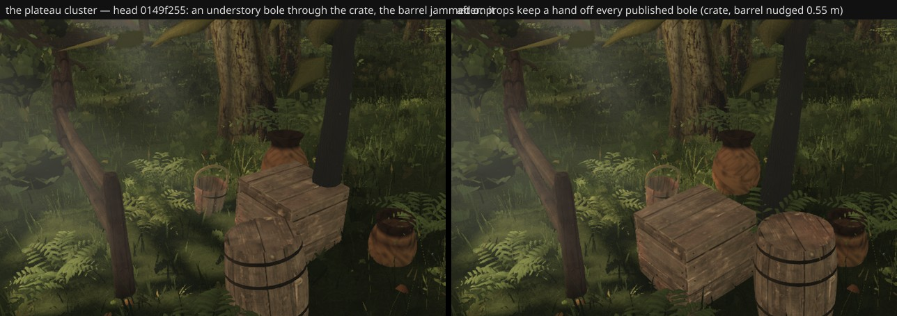

# Props keep a hand off the trees' boles (fable-3, lane 9, 2026-09-23)

fable-4's understory (round 53, merged 09:57) scatters 44 small trees by seed along the verges and the
plaza's lawn edges. Trees build before props and the placer does not know the props; props placed after
them did not know the trees either. On the head (0149f255) one bole stands in the plateau cluster: the
trunk grows through `upper-crate` and `upper-barrel` is jammed against it — what the owner meets on the
plateau after the steps.

## What changed

- `props/index.ts` `placementAllowed()`: a prop's footprint keeps 5 cm off every bole the trees publish as
  `ctx.shared.slimTrunks` (white-barks and understory, radius × 1.4 as published) — a prop on a bole is
  nudged by the existing search (0.55 / 1.05 m rings) instead of standing in the trunk, however the trees
  re-roll. `PlacementCtx` gains the optional `shared`.
- `geometry.test.mjs`: a bole dropped on the door pot's authored spot nudges the pot clear (≥ r + footprint);
  nothing else moves; without boles nothing moves (fails on the head, passes on the branch).
- Live audit of the head + guard (one low-quality page load): nudged `upper-crate` 0.55 m, `upper-barrel`
  0.55 m; everything else on its authored spot (`west-door-pot`'s 0.09 m is its deck placement).

Pose: (16.3, 7.35, −7.2) → (19.3, 5.9, −9.8), vfov 50, high quality, 1280×720.

## Six views

F (and possibly A) see the plateau cluster at 20 m+; the crate and barrel move 0.55 m there — a few pixels.
Not captured (the squad shares this VM); fable-cursor measures at merge.

## For lane 2 / fable-4

The nudge keeps the props out of the wood; the cluster's authored arrangement would survive if the
understory placer also kept ≈ 1.2 m off `PROP_LAYOUT`'s spots (`props/layout.ts` exports it; trees build
first). Their call.
