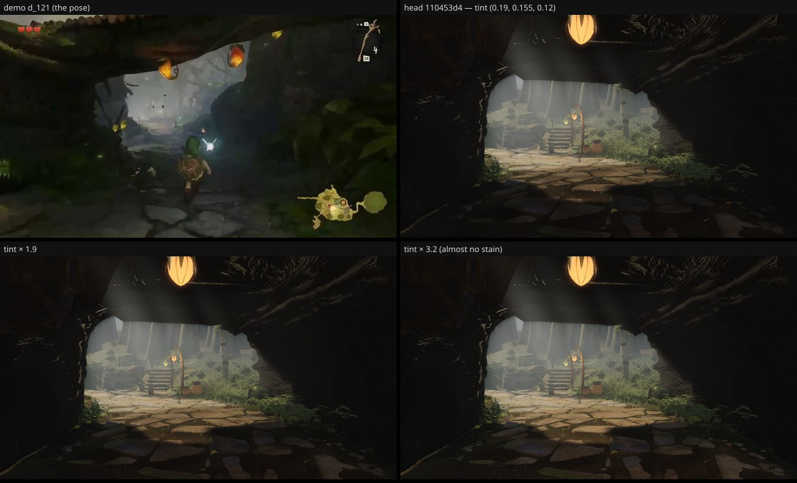

# The tunnel floor under the log — the tint is not the lever (fable-3, 2026-09-21)

Round-50 #12's open half (fable-5): at `x-arch-tunnel-n` (the `d_121` pose) "the floor under the log
reads l 0.105 against the frame's 0.161". Both the terrain's packed-earth stain and the slabs' multiply
decal read one knob, `structures/materials.ts` `TUNNEL_FLOOR_TINT` (0.19, 0.155, 0.12), so it looked like
a one-constant tuning. Measured before changing anything that stays:

Pose: camera (6.3, ground + 1.45, −54.5) → (5.5, ground + 1.3, −62), vfov 46, 1280×720, high quality.
Boxes (fractions of the frame): near floor = the paving deep under the log, x 0.25–0.75 × y 0.82–0.98;
mid floor = toward the north mouth, y 0.66–0.80. Greyscale mean / median on 0–1.

| build | near floor (deep) | mid floor (toward the mouth) |
| --- | --- | --- |
| demo `d_121` | 0.159 / 0.149 | 0.124 / 0.110 |
| head 110453d4, tint (0.19, 0.155, 0.12) | 0.073 / 0.067 | 0.244 / 0.220 |
| tint × 1.9 | 0.089 / 0.078 | 0.281 / 0.267 |
| tint × 3.2 (almost no stain) | 0.112 / 0.098 | 0.324 / 0.318 |

## What this says

- The deep floor is **light-limited, not multiply-limited**: removing nearly all of the stain lifts it
  only 0.067 → 0.098, still under the demo's 0.11–0.15. Nothing but the pods' point lights and the
  ambient reach it; the demo's floor is evenly lit at ≈ 0.12 the whole way — a fill inside the tunnel.
- The mouth-side floor is the opposite problem: **too bright already** (0.22 vs the demo's 0.11) and
  every step of the tint makes it worse; the stain is feathered out there, so the tint cannot hold it.
- So the lever is the **light in the passage** (a fill under the belly / the pods' reach, and the
  sky-lit mouth floor held down), the atmosphere / lighting lane — not `TUNNEL_FLOOR_TINT`, which
  stays at round 49's value. The constant is reverted; no code moves on this branch.
