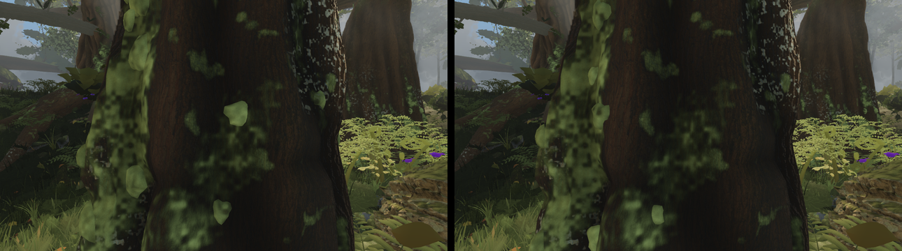
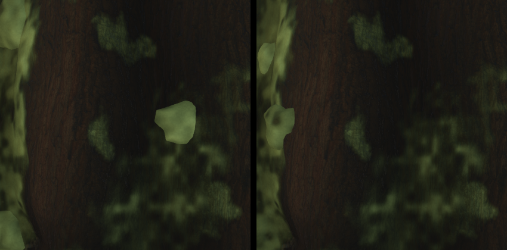

# Round 51 — the emergent bole's "bright cushion geometry" (fable-4, the owner's in-game review)

The owner, a foot from the emergent column's bole at (−3.1, −7.9): bright cushion geometry that
"reads as leaves stuck on". fable-cursor asked fable-4 / the trees lane to find which mesh it is.

## Which mesh

The near base's **3-D moss cushions** — `bole.ts` `mossCushion` domes (16 sides × 3 rings + apex),
seeded by `reliefBoleSteps` where the vertex moss cover is dense, with the relief column's params in
`column.ts` (the emergent is the only relief column): density 0.05 of the eligible vertices, 4–10 cm,
up to 220. Their colour is NOT the bole.ts vertex tint: the tree material overrides every moss
vertex (`vBarkMoss > 0`) with its own `mossCushion` palette — `materials.ts` ≈ line 688,
`mix(vec3(0.09, 0.16, 0.04), vec3(0.24, 0.36, 0.10), mossFine)`, then `× (0.8 + 0.45 · mossFine + …)`
under `BARK_NEAR_DETAIL`, blended at 0.92. A dome protrudes from the bole, so on the bole's lit edge
its crown takes the sun that the bark face does not — the lit end of that palette × the near-detail
lift, under the sun, is the pale flat blob. Measured: darkening the bole.ts tints (×0.55, then ×0.4)
and the packed occlusion on the cushion rings (0.62/0.78/0.9 → 0.5/0.62/0.74) changed nothing
visible at 1.6 m — reverted, not shipped.

## What shipped (column.ts, one entry)

The emergent's cushions: density 0.05 → 0.03, size 4–10 → 3.5–8 cm, cap 220 → 120 — fewer, smaller
lumps in the furrows, not a stuck-on leaf every hand's width. Pose `f4-emergent-1m6-e`: camera
(−1.5, 1.4, −7.5) → (−3.1, 1.5, −7.9), fov 60. 4.1 % of the frame changes; the blob at the bole's
centre is gone; the left-edge domes stay pale (the material's lever, above).

| before (head 54196e0b) | after |
|---|---|
|  | |
|  1:1 crop, left before / right after | |

## The lever that is Astra's (materials.ts)

`mossCushion`'s lit end 0.24 / 0.36 / 0.10 and the near-detail lift `0.8 + 0.45 · mossFine`: under
direct sun on a protruding crown they clip to a pale yellow-green two stops over the bole's own
cover. A darker lit end (≈ 0.16 / 0.24 / 0.08) or a lift that does not exceed 1.0 would seat the
domes at the cover's value; the vertex tints in bole.ts are irrelevant to the read.

## Six views (large tier, vs the head 54196e0b / f728813e)

All six pixel-identical (no camera stands inside the emergent's near band: C 5.4 m, D 5.9 m vs the
in-radius 5 m; the giants' cushion params unchanged). A 440 draws / 8.61 M · B 420 / 7.79 M ·
C 338 / 7.01 M · D 390 / 8.08 M · E 420 / 7.79 M · F 405 / 8.00 M.
