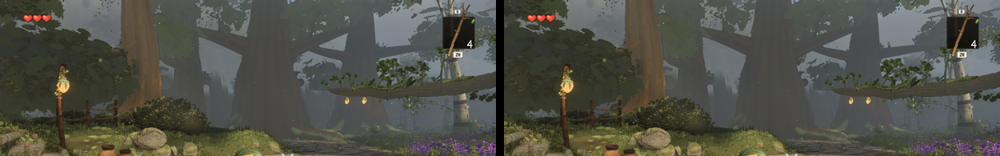

# Round 51 — white-bark distance LODs one in 8 / 16 (fable-4; a W38 give-back)

fable-cursor (tick 213): A at 8.80 M with the plateau roof, 200 K under W38's 9.0 M — nothing more on
A's side of the canopy without a matching cut. The white-barks' distance meshes kept one lamina in
6 / 12 at 2.19 / 3.18 × (round 49); now one in 8 / 16 at 2.53 / 3.67 × — the same covered area
(scale² / every ≈ 0.8), 5–13 px laminae at 20–44 m. The low boughs keep their 2 / 4 (the part of the
tree in frame C). Retention is by leaf ordinal (writer.ts addLeaf): the stream is untouched.

- Fingerprints (ten variants, `variants.mjs`): the HIGH mesh byte-identical on all ten (leaf hash,
  height, radius, triangles) — no placement re-roll, the hero stems at C untouched; medium leaf
  triangles 80 052 → 62 608 (−22 %), low 20 020 → 15 656 (−22 %), wood unchanged.
- Six views vs the head 110453d4 (same build path, same settle): A 0.0000, B 0.0000, **C −0.0004**
  (0.91 % of pixels — the hazed grove crowns at 20–44 m), D 0.0000, E 0.0000, F −0.0001.
  Triangles A 8.76 → 8.74 M, B/E 7.90 → 7.88, C 7.00 → 6.93, D 8.09 → 8.06, F 8.03 → 7.99;
  draws unchanged (A 450).

 C's top band, left head / right the thinned LODs — the grove reads the same.
