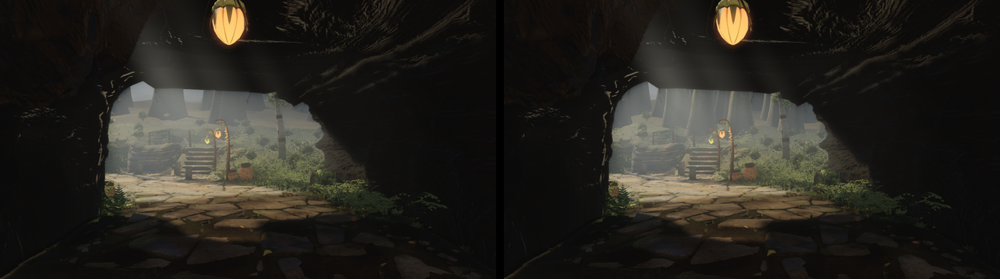
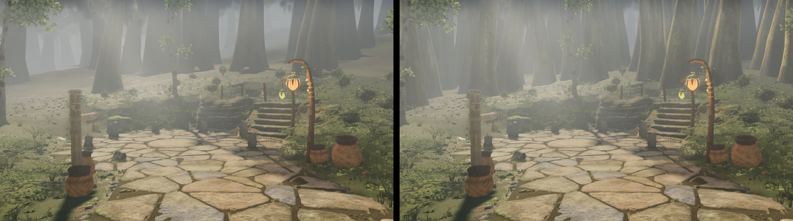
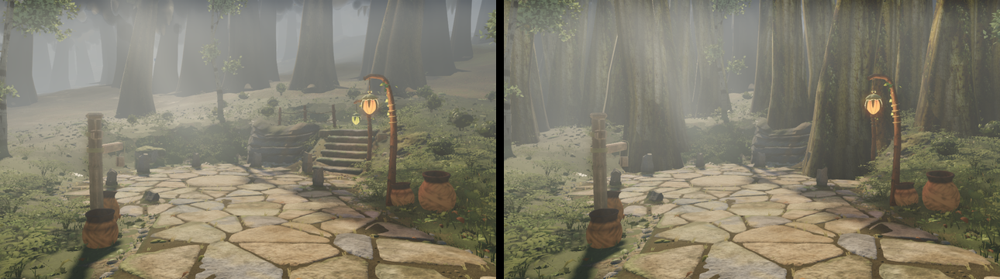

# Round 51 — the stand beyond the arch (fable-4; V2 / opus #01, the trees half)

The frame's view through the log arch (ANALYSIS_VIDEO2 §6.6, `d_121`) is a dense stand of tall
trunks with no ground plane. Ours, on the head f6890f4a (see `../round51-v2-status/`): two rows at
5 / 7 m spacing with the north plain showing between them. This adds three authored depth bands of
the 26 m band-only pole (`distant.ts`): flanks at |x| 12–34, z −82…−64 (spacing 3.4), and a back
stand behind the ledge terrace at |x| ≤ 12, z −90…−81 (spacing 3.0) — 15 m+ from the walk line, off
the four authored white-barks, off the path spine and the structures by the shared clearance.

## Poses (opus-walk manifest, eye 1.45 m above the terrain; head f6890f4a vs the branch)

| pose | changed pixels (Δ > 6) | read |
|---|---|---|
| `x-arch-tunnel-n` (6.3, −54.5) → (5.5, −62) | 2.6 % | more poles in the haze fill the window's upper part; window L* 0.374 → 0.364 (ref 0.39) |
| `x-northpath-n` (5.2, −61.5) → (0.5, −68.5) | 19.5 % | a denser stand of hazed trunks behind the clearing, the plain mostly gone; the ledge flight and its lantern clear |
| `x-arch-approach` (6.6, −48) → (6, −58) | 0.6 % | — |

A first cut (one band x ±32 / z −66…−80 / 2.6 m) was a palisade 5 m from the walk line, with the
distant LOD's trunks in the foreground — withdrawn:

## The radial layer stays byte-identical (`after` rows)

A row placed before the radial pool seeds the spacing grid, and a radial candidate the grid rejects
is skipped before its draws and before it counts toward the target — so a new row inside the
60–215 m annulus re-rolled every radial tree after its first collision: camera C, which looks
south, changed 6 % of its pixels (SSIM +0.0011) for a stand 130 m behind it. `DepthBand.after`
places a row after the pool; its candidates yield to the radial trees. With it C and F are
pixel-identical.

## Six views (large tier, vs the head f6890f4a captured the same way)

| view | SSIM Δ | pixels > 2 levels | draws / tris |
|---|---|---|---|
| A | +0.0001 | 0.009 % | 442 / 8.68 M (head 8.63 M) |
| B | +0.0001 | 0.034 % | 423 / 7.85 M |
| C | 0 | 0 | 340 / 6.96 M |
| D | −0.0002 | 0.195 % | 390 / 8.13 M |
| E | +0.0001 | 0.034 % | 423 / 7.85 M |
| F | 0 | 0 | 407 / 8.02 M |

tsc green; `lodPool.test.mjs` 10/10. Still open against the frame: the stand is brown-grey, not
grey-green (the distant material's tint — Astra's), and there are no hanging vines or light points
beyond the arch.
