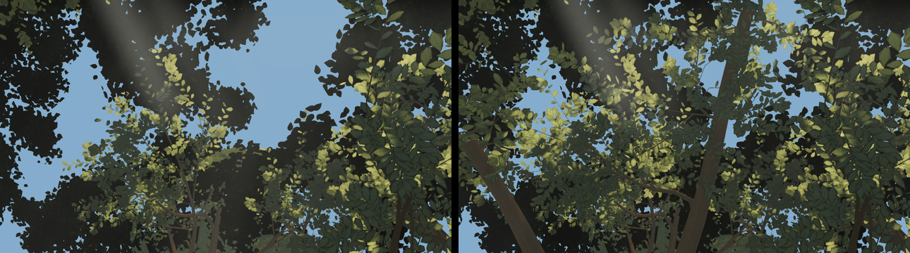

# Round 51 — the plateau's roof (fable-4; opus #05 / fable-5 walk #4 / round-50 #7: "look up and the sky is open blue")

`w27-plateau-u` — the look-up from the plateau at (19.4, 6.56, −3.6) — had 20–23 % saturated blue
sky with crowns only at the frame's edges; the reference has none. Nothing stood over the zenith:
the plateau oak's crown is 17 m north, the east giant's 11 m south-east.

Two new east-giant canopy boughs (`trees/index.ts` CANOPY_BOUGHS): one leaving the bole at 16.5 m
and running 14 m west over the plateau to (16.4, 15.8, −4.6) with three ordinary lobes (hR 3.2–3.5),
one leaving at 15.4 m and running 11 m north to (25.6, 15.6, −6.2) with one lobe. The lobe
positions were placed by un-projecting the look-up's blue pixels to 17 m (the blue west of the
zenith at ≈ (16, 17, −4.5), east at ≈ (25.5, 17, −6.5)), and checked by projecting them into A, B, D
and F: every lobe centre and both boughs sit above those frames' top edges. The lobes are
non-casting (the authored writer), so no ground shade moves in any frame; the boughs' wood shadow
(ground = point + (1.0, 0.79) × height at this sun) lands at x 36–44, z 6–10, east of the giant.

| variant | blue sky at `w27-plateau-u` (b > r + 20 and b > g + 10) |
|---|---|
| head f6890f4a | 23.1 % |
| v1: one bough, two lobes over the zenith | 15.7 % |
| v2: + a lobe north-east of the zenith (missed the blue) | 16.1 % |
| **v3 (shipped): the bough extended west + the north bough** | **10.8 %** |

 left the head, right v3: two boughs cross the look-up with layered lit lobes

`w28-plateau-d` (the plateau look-down): 0.0 % changed.

## Six views (large tier, vs the head f6890f4a captured the same way)

A, B, C, D, E pixel-identical; F 161 pixels (0.017 %) > 2 levels. SSIM Δ 0.0000 on all six. Draws
A 442 / B 424 (+1) / C 340 / D 390 / E 424 (+1) / F 407; A 8.63 → 8.64 M triangles. tsc green.
The lobes are ordinary, so the near-canopy LOD gives them their layered near parts when the walker
is on the plateau.
